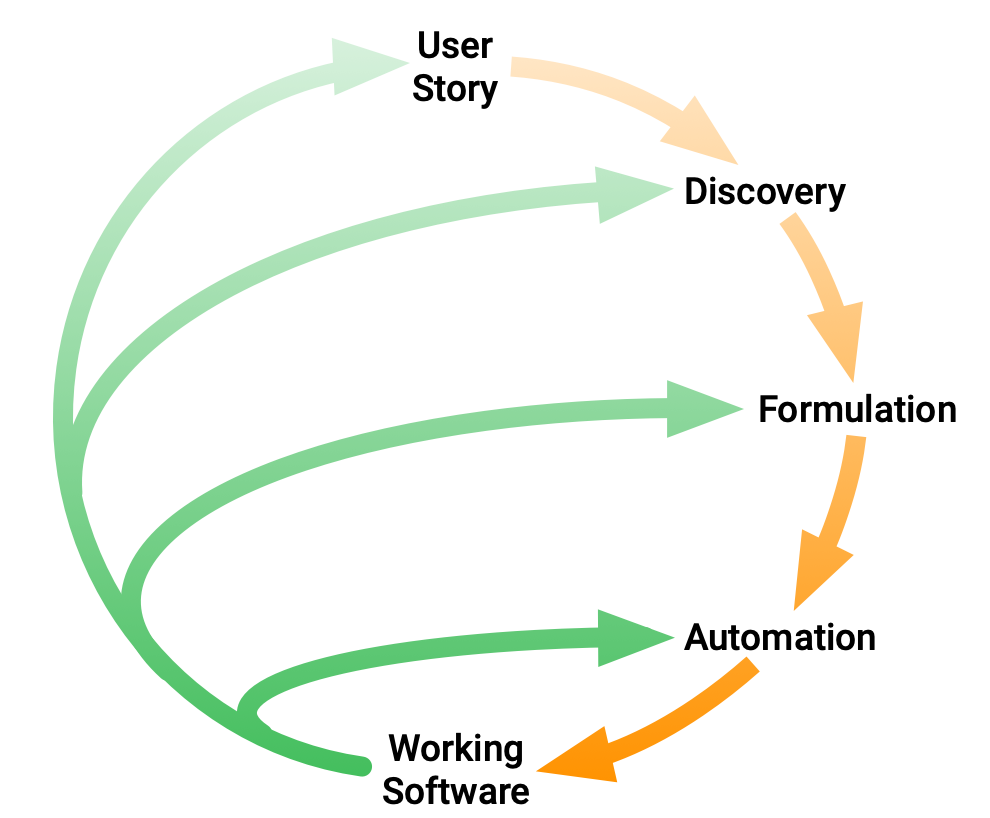

Il **behavior-driven development** (abbreviato in BDD e traducibile in Sviluppo guidato dal comportamento) è una metodologia di sviluppo del software basata sul test-driven development (TDD). Il BDD combina le tecniche generali e i principi del TDD, con idee prese dal domain-driven design e dal design orientato agli oggetti, per fornire agli sviluppatori software e ai business analysts degli strumenti e un processo condivisi per collaborare nello [[Sviluppo software|sviluppo software]].

Per quanto BDD sia principalmente un'idea di come lo sviluppo del software dovrebbe essere gestito sia da interessi di business e analisi tecniche, la pratica della BDD assume l'utilizzo di strumenti software specializzati per supportare il processo di sviluppo. Sebbene questi strumenti siano spesso sviluppati in particolare per essere utilizzati in progetti BDD, possono essere visti anche come delle forme specializzate degli strumenti che supportano la TDD. Gli strumenti servono per aggiungere automazione all'*ubiquitous language* che è il tema centrale della BDD.

Abbiamo diverse fasi come mostrato nella figura di seguito:



### *Discovery phase*
Il rilevamento del comportamento è il punto di ingresso del flusso di lavoro BDD. Il comportamento dei sistemi dovrebbe emergere naturalmente dalle conversazioni, piuttosto che essere "spinto" dagli uomini d'affari ai tecnici. Questo aiuta entrambi i mondi a comprendere la portata del sistema in costruzione e cosa dovrebbe fare/cosa è fattibile e cosa non lo è.

Esistono varie tecniche/giochi/modi per scoprire i comportamenti, ma tutte le tecniche servono a identificare un insieme di comportamenti dalle conversazioni tra **tutte** le persone del team.

È essenziale che sia gli uomini d'affari che i tecnici partecipino alle sessioni di scoperta, indipendentemente da come sono organizzate. In questo modo, **i comportamenti scoperti non saranno sbilanciati verso un aspetto particolare del sistema da implementare.**

In BDD possono esserci più fasi di discovery e nessun vincolo sul "quando" possono aver luogo: tuttavia se applichi SCRUM la "scelta naturale" è quella di allinearsi con le cerimonie standard dello [[Sprint|sprint]], in particolare la pianificazione dello [[Sprint|sprint]] o subito dopo la fase di stima per ogni elemento del backlog.

### *Formulation phase*
Una volta che abbiamo una serie di comportamenti, dobbiamo formularli come documentazione strutturata e fornire una specifica eseguibile per loro. Anche questo passaggio deve essere svolto in collaborazione da tecnici e uomini d'affari.

Dato che quando i test sono una specifica eseguibile - tuttavia il suo limite principale è che, sebbene "abbastanza leggibile", è ancora codice - **questo è un ostacolo per le persone non tecniche a contribuire efficacemente**, quindi non sono la migliore forma di documentazione strutturata.

Per questo motivo sono preferite le descrizioni testuali, anche se in modo più “strutturato” rispetto al linguaggio naturale libero. Un esempio di “linguaggio” che permette di raggiungere questo obiettivo è *Gherkin*.

Una volta che la documentazione strutturata è disponibile, dovrebbe essere trasformata in una serie di test, tradizionalmente scritti nel formato *given-when-then*.

### *Automation phase*
Una volta che la documentazione strutturata è disponibile, dovrebbe essere trasformata in una serie di test, tradizionalmente scritti nel formato del dato quando allora.

Se utilizziamo SCRUM, potremmo anche arrivare a dire che le specifiche eseguibili di una determinata funzionalità fanno parte dei suoi criteri di accettazione.

**Questo dovrebbe essere familiare: è molto simile sia allo sviluppo basato su test che al ciclo esterno che abbiamo praticato prima.**

## Gherkin
**Gherkin** è una grammatica che permette di definire una documentazione strutturata (e, come vedremo, produrre facilmente specifiche eseguibili) che si legge quasi come un linguaggio naturale. È uno strumento prezioso perché consente a persone senza background di programmazione di contribuire alla definizione dei comportamenti (quindi contribuire al test del software).

Le specifiche complete di Gherkin sono disponibili con *Cucumber*. **Tieni presente che questa è una specifica: ogni "strumento" che si occupa di Gherkin potrebbe supportarne un superset o un sottoinsieme di esso.** Per questo motivo, ci interessano solo le caratteristiche più basilari per cogliere i concetti.

Gli elementi basici di Gherkin sono:
- **Feature:** descrizione di alto livello di una funzionalità software, organizzata come un insieme di *scenari*;
- **Scenario:** "sottosezioni" di una funzione, organizzate in *step*;
- **Steps:** uno di *Given*, *When*, *Then*. Uno scenario può ammettere più passaggi dello stesso tipo;
- **Given:** contesto iniziale del sistema;
- **When:** descrivi le azioni e le interazioni che hanno luogo nello *scenario*;
- **Then:** un'affermazione sullo stato finale del sistema, dopo che tutti i passaggi precedenti sono stati osservati;
- **And, But:** se in uno scenario sono presenti più istruzioni *Given*, *When*, *Then*, puoi concatenarle insieme a *And* e *But* in modo che scorrano in modo più naturale.

Un esempio può essere:
```gherkin
Feature: Withdraws from a bank account
    Scenario: I withdraw some money from my bank account
        Given A bank account with a balance of 50 euro
        When I withdraw 40 euro
        Then the account's balance should now be 10 euro
```
È facile mappare le caratteristiche di Gherkin a determinati, quando, quindi casi di test. Esistono anche strumenti che convertono (automaticamente) i file di funzionalità Gherkin in codice di scaffolding per specifiche eseguibili, fondamentalmente "suite di test", per vari linguaggi di programmazione e framework di test.

Il vantaggio principale dell'utilizzo di *pytest-bdd* (alternative: lattuga, ravanello, comportamento) è che produce codice pytest "standard": tutto ciò che sai su *pytest* è valido e non è necessario imparare altre cose specifiche della libreria. Sfortunatamente, *pytest-bdd* non è così ben documentato.

Possiamo usare il comando *pytest-bdd generate [file di funzionalità]* per generare un modulo di test compatibile con *pytest* con del codice di scaffolding per lo scenario o gli scenari indicati nel file di funzionalità.

Il file generato associa ciascuna istruzione nel file di funzionalità alle funzioni *@given*, *@when*, *@then* nel modulo di test. Il modulo di test generato sarà eseguibile con *pytest-bdd*.
