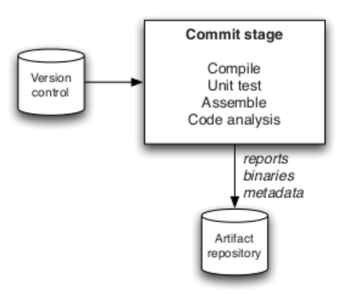
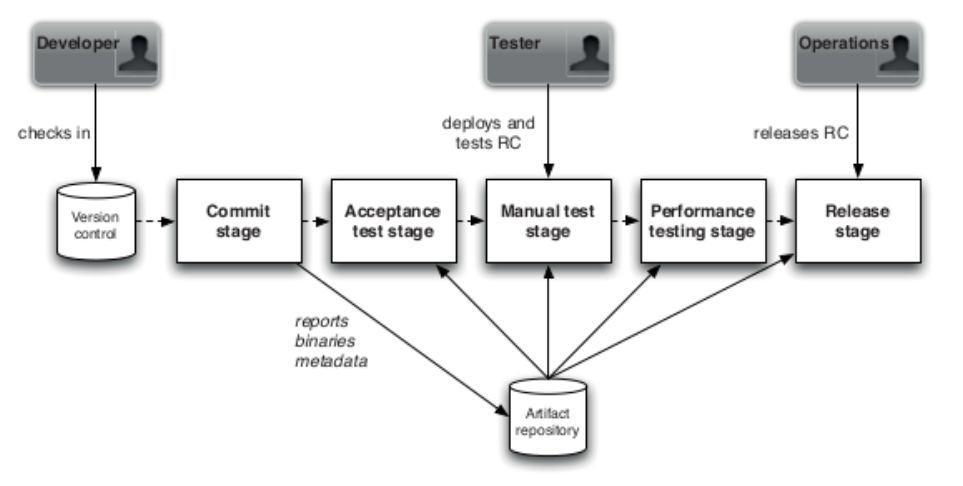
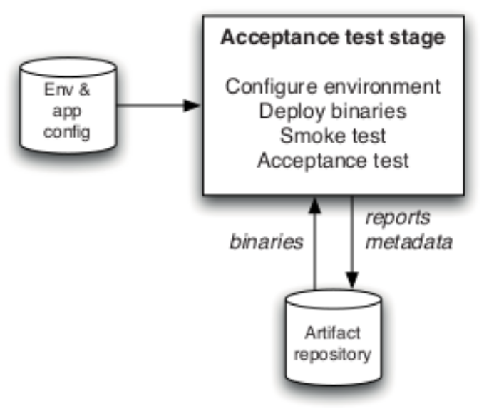
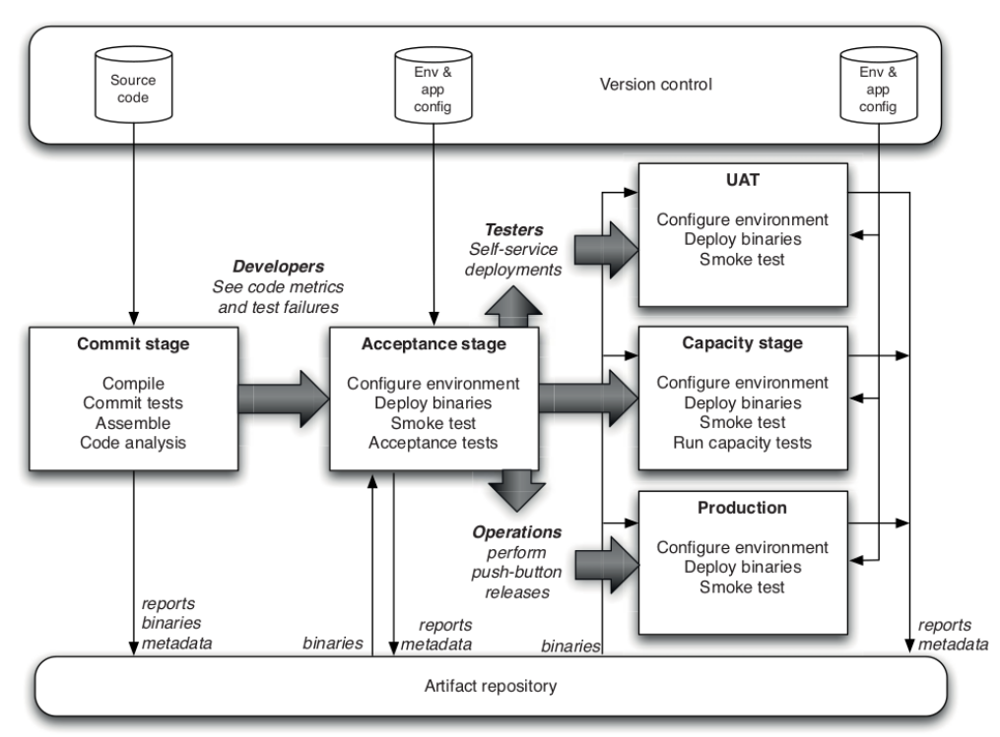

Nell'ingegneria del software tradizionale:
- l'integrazione dei sottosistemi software viene ritardata verso la fine del ciclo di sviluppo;
- **il sistema non garantisce il funzionamento delle versioni "intermedie"** (con versione intendiamo la distribuzione di un'unità distribuibile di software);
- le versioni sono il punto in cui "la gomma incontra la strada" e sorgono problemi: gli utenti iniziano a utilizzare il sistema, scoprono bug, comportamenti non previsti, funzionalità mancanti;

Con *il primo ed il terzo proncipio dell'Agile Software* si va a definire il concetto di **Continuous Delivery (CD)**: è una pratica di sviluppo in cui i sistemi software vengono costruiti in modo incrementale.

I principali vantaggi della CD sono:
- favorire integrazioni piccole e frequenti piuttosto che passaggi di integrazione grandi e bruschi;
- favorire lo sviluppo incrementale delle funzionalità;
- **una volta che il sistema diventa rilasciabile, dovrebbe sempre rimanere rilasciabile fino all'ultima funzionalità da sviluppare.**

Il CD non è un insieme di strumenti e richiede lavoro di squadra, collaborazione, disciplina e competenze tecniche: si adatta ai valori fondamentali di Agile perché supporta e promuove lo sviluppo iterativo e cicli di feedback rapidi.

## Pipeline di distribuzione

La **pipeline di distribuzione**, o semplicemente pipeline, è la controparte infrastrutturale della pratica di Continuous Delivery. Contiene *tutti* i passaggi necessari per fornire il software, dovrebbe essere eseguito il più rapidamente possibile per garantire un feedback rapido e dovrebbe fallire velocemente.

Tutto il codice che “sopravvive” alla pipeline è da considerarsi rilasciabile: deve essere corretto, si adatta alle esigenze dell'utente ed è veloce, sicuro e tutto ciò che la nostra definizione di completato include.

Pertanto, il ruolo della pipeline è quello di eliminare le versioni software che non sono adatte alle nostre esigenze e alle esigenze del cliente.

## Fasi di base della pipeline del CD

Le fasi principali di una pipeline di distribuzione sono:
- **Commit Stage:** fornisce un rapido feedback agli sviluppatori sul loro lavoro, produce le versioni candidate;
- **Artifact Repository:** memorizza l'output della fase di commit, le versioni dei candidati;
- **Acceptance Stage:** elimina i rilasci candidati non idonei e li promuove a rilasci;
- **Deployment:** distribuisce una versione in un ambiente di produzione o simile.

Tutte le fasi, tranne eventualmente l'ultima, dovrebbero essere automatizzate, per garantire riproducibilità e coerenza durante lo sviluppo. Quando un team sta automatizzando anche la fase di distribuzione, si parla di **Continuous Deployment**: si noti che la *Continuous Delivery* è un prerequisito per la *Continuous Deployment*.

### Commit Stage
Il primo passo per implementare la nostra pipeline è creare una fase di commit, eseguendo unit test su ogni commit eseguito dal nostro team di sviluppo.

### Artifact Repository
Il secondo passaggio consiste nell'implementare un repository di artefatti. D'ora in poi, tutti gli altri passaggi della pipeline che richiedono l'accesso alle versioni candidate devono passare attraverso l'interfaccia di *Artifact Repository*.

### Acceptance Stage
Il terzo passaggio consiste nel creare una suite di test di accettazione per lo scheletro ambulante e automatizzarli per implementare la fase di accettazione.

### Deployment
L'ultimo passaggio consiste nel fornire gli script di distribuzione per lo scheletro ambulante. Da questo momento in poi, il commit di ogni sviluppatore passerà attraverso l'intera pipeline.

Anche se sembra facile, implementare tutti questi elementi ed essere sicuri che interagiscano correttamente potrebbe richiedere giorni o settimane a seconda anche dello scheletro ambulante utilizzato per far crescere la pipeline.

Considera anche che queste fasi sono un esempio minimo e potrebbero essere aggiunti altri tipi di "gate" per le versioni candidate: test manuale, test di sicurezza, test delle prestazioni e altri test non funzionali.

## Implementazione di una pipeline di distribuzione

Una pipeline di distribuzione è un oggetto complesso che è meglio creare in modo incrementale, fase per fase.
Una buona pratica è quella di "far crescere" la pipeline sopra uno *scheletro che cammina*. Uno scheletro ambulante è un piccolo sistema che svolge una funzione end-to-end e può essere implementato, forse una singola caratteristica dell'intero sistema da sviluppare. Una volta che lo scheletro ambulante è disponibile, dobbiamo rispondere alle seguenti domande:
- come eseguire unit test per esso?
- come eseguire i test di accettazione per esso?
- come distribuirlo in un ambiente simile alla produzione?

Una volta che siamo in grado di rispondere a queste domande, siamo pronti per implementare ogni fase.

## Trunk-based development
**La ramificazione è perfetta; è solo che i branch di lunga durata non funzionano se abbinati alla consegna continua.**

La soluzione, abbastanza radicale, a questo problema è:
- *evita diramazioni:* esegui il commit direttamente al ramo principale (chiamato anche trunk);
- *continua a ramificare* ma mantieni i rami estremamente di breve durata, idealmente unisci di nuovo al tronco almeno una volta al giorno; ciò limita la divergenza tra codice remoto e codice locale.

Queste due alternative sono denominate, rispettivamente, **trunk-based development** e scaled trunk-based development. È un modello ramificato che è stato sviluppato all'inizio degli anni 2000 e in modo indipendente da molte aziende. È una delle migliori pratiche per consentire la *continuous integration*.

Dato che **la nostra priorità è quella di evitare di introdurre cattivi commit** (commit che interrompono la pipeline) nel trunk, per evitare così possiamo applicare varie precauzioni: **norme di protezione dei branch**, **revisione e controlli del codice**, **disciplina dello sviluppatore**.

### Protezione dei branch
**Branch Protection** è una funzionalità offerta da *GitHub* che vieta i commit diretti su alcuni rami. Ad esempio, possiamo fare in modo che sia impossibile eseguire direttamente il push su master, ma è invece necessario aprire una *pull request* e quindi unirla al ramo principale.

### Revisione e controlli del codice
Per rendere più efficace la protezione del branch, possiamo imporre alcune condizioni sull'unione delle *pull request* su un ramo protetto. 

Possiamo utilizzare un flusso di lavoro di *GitHub Actions* per verificare che il ramo che vogliamo unire non rompa gli unit test. L'approvazione manuale è molto efficace, ma potrebbe anche "rallentare" lo sviluppo se diventasse un collo di bottiglia. **Se decidi di utilizzare le revisioni del codice come una squadra, assicurati di informarti a vicenda quando un commit è in attesa di approvazione per troppo tempo.**

### Disciplina dello sviluppatore
Lo strumento più efficace per lavorare in un ambiente CD è la disciplina nel seguire un flusso di lavoro. Bisogna eseguire le seguenti azioni in modo coerente in modo da ridurre notevolmente i problemi futuri:

- fare *pull* sempre prima di iniziare il lavoro e di fare *push*;
- eseguire sempre unit test sulla macchina locale prima di fare *push*;
- dare sempre la priorità al mantenimento del trunk green;
- lavora sempre con piccoli incrementi, anche se "sai" che sei l'unico a lavorare su un file;
- mantieni sempre i tuoi branch di breve durata, fai merge ogni giorno;
- in caso di dubbio, coordinati sempre con i tuoi compagni di squadra;

## Development patterns
La politica del trunk-based development è il passo più importante per lavorare in modo efficace negli ambienti CD, tuttavia non risolve tutti i problemi.

Ricorda che in CD dobbiamo essere sempre in uno stato rilasciabile, ma dobbiamo anche impegnarci molto spesso, con rami di funzionalità brevi (se presenti rami di funzionalità).

*Come possiamo fare qualcosa, se ogni commit deve essere rilasciabile, piccolo e unito quotidianamente?* **Feature flags** (consiste nell'esecuzione condizionale del “nuovo codice” o del “vecchio codice” sulla base di qualche condizione esterna) e **branch by abstraction**
