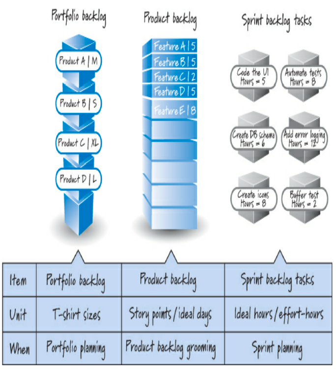

Per velocità si intende la quantità di lavoro che tipicamente viene svolto durante ogni sprint. Per misurarla bisogna sommare la dimensione dei PBI che sono stati completati ad ogni sprint e farne la media. Generalmente è più utile esprimerla in range **(es. il team sviluppa con un andamento di 25-30 punti a sprint)** e *NON È UN INDICE DI PERFORMACE*, bensì è uno strumento di diagnostica del team, attraverso cui si può autovalutare e migliorarsi. Possiamo fare una stima a diversi livelli di granularità: 
- portfolio backlog;
- product backlog;
- spring backlog.

La fase di stima dei PBI fa parte del **grooming**, in cui si cerca di associare ad ognuno di essi degli **Story Points (cerca di misurare la grandezza del PBI, pertanto riflette lo sforzo associata alla storia dal punto di vista del team di sviluppo)** oppure dei **Giorni ideali (numero di persone al giorno necessarie a completare una storia, non è da confondere con il tempo trascorso)**. Facendo parte della fase di grooming, questa è un'attività da svolgere in team in cui lo *ScrumMaster* ha il compito di facilitare la stima delle attività e il *product owner* quello di descrivere e rispondere ai quesiti del team di sviluppo. Bisogna inoltre cercare di realizzare stime accurate piuttosto che precise *(accuracy vs precision)* infatti è inutile avere un alto livello di dettaglio/precisione durante questa fase.

## Planning Pocker
È una tecnica per la stima della dimensione dei PBI. Si cerca, metaforicamente, di andare a posizionare gli item all'interno di alcuni "scatoloni" e per fare ciò il team si riunisce e gioca a una sottospecie di poker in cui le carte assumono questi significati:
- **0:** incluso in alcuni mazzi per indicare che l'oggetto è già completato o è così piccolo che non ha senso nemmeno dargli un numero di taglia;
- **1/2:** usato per dimensionare piccolissimi oggetti;
- **1, 2, 3:** usato per dimensionare piccoli oggetti;
- **5, 8, 13:** usato per il dimensionamento di articoli medi. Per molte squadre, un oggetto di taglia 13 sarebbe il più grande che pianificherebbero in uno sprint. Spezzerebbero qualsiasi oggetto più grande di 13 in un insieme di oggetti più piccoli;
- **20, 40:** utilizzato per ridimensionare oggetti di grandi dimensioni (ad esempio, storie a livello di funzionalità o tema);
- **100:** o una caratteristica molto grande o un'epica;
- **$\infty$ (infinito:** usato per indicare che l'oggetto è così grande che non ha nemmeno senso apporre un numero su di esso;
- **? (punto interrogativo):** indica che un membro del team non comprende l'articolo e chiede al proprietario del prodotto di fornire ulteriori chiarimenti. Alcuni membri del team usano anche il punto interrogativo come un modo per rifiutarsi di stimare l'oggetto corrente, in genere perché la persona è così lontana dall'oggetto che non ha idea di come stimarlo. Sebbene sia accettabile non stimare, è inaccettabile non partecipare! Quindi, solo perché qualcuno non si sente a suo agio nell'offrire una stima, ciò non gli consente di disimpegnarsi dalla conversazione o dalla responsabilità di aiutare il team a trovare una stima di consenso;
- **(pi greco):** in questo contesto, pi greco non significa 3,1415926! Invece, la pi card viene utilizzata quando un membro del team vuole dire: "Sono stanco e affamato e voglio prendere una torta!" Alcuni mazzi di Planning Poker usano l'immagine di una tazza di caffè invece di pi. In entrambi i casi, questa carta sottolinea un punto importante. I membri del team possono impegnarsi in un'intensa discussione sulla stima solo per un periodo di tempo limitato (forse un'ora o due). A quel punto, hanno davvero bisogno di una pausa o l'entusiasmo per la discussione si trasformerà in uno sforzo per capire come ottenere rapidamente le stime, indipendentemente dalla loro accuratezza o dall'apprendimento che avviene. Se le persone stanno giocando la carta pi, la squadra ha bisogno di fare una pausa.

Le regole di Planning Poker sono le seguenti:
1. il Product Owner seleziona un PBI da stimare e legge l'articolo al team;
2. i membri del team di sviluppo discutono l'articolo e pongono domande di chiarimento al proprietario del prodotto, che risponde alle domande;
3. ogni estimatore sceglie privatamente una scheda che rappresenta il suo preventivo;
4. una volta che ogni stimatore ha effettuato una selezione privata, tutte le stime private sono esposte simultaneamente a tutti gli estimatori;
5. se tutti scelgono la stessa carta, abbiamo consenso e quel numero di consenso diventa la stima PBI;
6. se le stime non sono le stesse, i membri del team si impegnano in una discussione mirata per esporre ipotesi e incomprensioni. Tipicamente iniziamo chiedendo agli stimatori alti e bassi di spiegare o giustificare le loro stime;
7. dopo la discussione, torniamo al passaggio 3 e ripetiamo fino al raggiungimento del consenso.

In Planning Poker non prendiamo medie né usiamo numeri che non siano sulla scala/carte. L'obiettivo non è scendere a compromessi, ma piuttosto che il team di sviluppo raggiunga un consenso sulla stima della dimensione complessiva (sforzo) della storia dal punto di vista del team. Di solito questo consenso può essere raggiunto entro due o tre turni di votazione, durante i quali la discussione mirata dei membri del team aiuta a ottenere una comprensione condivisa della storia.
