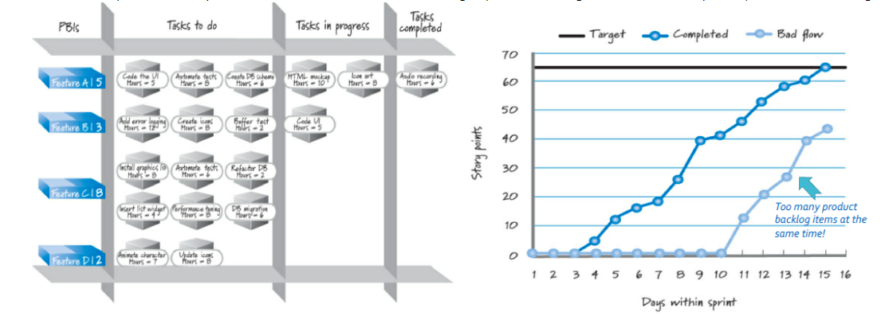
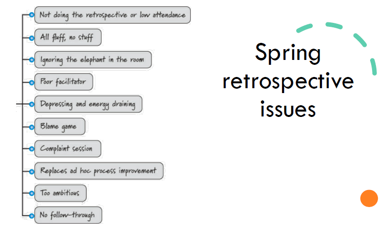

## Execution
È un attività che si preoccupa di vedere il "come" si raggiungerà l'obiettivo e coinvolge anche fasi di: 
- planning;
- managing;
- sviluppo e comunicazione del lavoro;
- testing delle feature.

Lo scopo finale rimane quello di massimizzare il valore di business consegnato a termine della [[Sprint|sprint]] senza andare naturalmente a "bruciare" il team. Pertanto si possono individuare un insieme di **good practice** che permettono di migliorare le performance:
- test-driven development;
- refactoring;
- simple desing;
- pair programming;
- continous Integration;
- collective code ownership;
- coding standard.

Inoltre è buona pratica anche quello di tracciare il lavoro che si deve svolgere, che si sta svolgendo e che si è completato, attraverso l'uso di grafici di **burnup e burndown**:

## Review
Si ispeziona il prodotto realizzato durante la spring e si traggono delle conclusioni, in maniera tale da comprendere gli step successivi da affrontare, migliorando conseguenzialmente la probabilità di riuscita del progetto. Insieme alla fase di **retrospective**, è probabilmente una delle fasi più importanti e delicate della metodologia SCRUM. I principali partecipanti sono:
- **SCRUM team:** il product owner, lo ScrumMaster e il team di sviluppo dovrebbero essere tutti presenti in modo che tutti possano ascoltare lo stesso feedback ed essere in grado di rispondere alle domande relative allo [[Sprint|sprint]] e all'incremento del prodotto;
- **Stakeholder interni:** imprenditori, dirigenti e manager dovrebbero vedere i progressi in prima persona in modo da poter suggerire correzioni di rotta. Per lo sviluppo interno del prodotto, gli utenti interni, gli esperti in materia e il responsabile delle operazioni della funzione aziendale a cui si riferisce il prodotto dovrebbero partecipare;
- **altri team interni:** i team di vendita, marketing, supporto, legale, conformità e altri team di sviluppo SCRUM e non SCRUM potrebbero voler partecipare alle revisioni dello [[Sprint|sprint]] per fornire feedback specifici dell'area o per sincronizzare il lavoro dei propri gruppi con il team SCRUM;
- **Stakeholder esterni:** clienti, utenti e partner esterni possono fornire un prezioso feedback al team SCRUM e agli altri partecipanti.

Prima di iniziare questa fase ci sono un insieme di attività preparatorie:
- si definiscono i partecipanti della review (facendo attenzione a non invitare anche eventuali competitor, una stessa azienda potrebbe collaborare con altre realtà che sono in rivalità. Durante questi meetings potrebbero essere messi alla luce dei punti deboli);
- si schedula l'incontro (molto complesso essendoci numerosi stakeholder). Questo deve essere di **low ceremony** e **high value** (cioè informale ma che ha un elevato valore);
- si conferma che il lavoro è stato svolto correttamente;
- si sviluppano delle presentazioni (sintetiche) che mettono in evidenza ciò che si è realizzato e le potenzialità;
- ci si confronta con tutti (si fa un'indagine multiperspective). È un ambiente **"blame free"**, non si cerca di trovare il capo espiatorio del fallimento del progetto. Si fanno critiche costruttive;
- si adatta meglio il lavoro futuro rispetto alle esigenze degli stakeholder;

Le varie problematiche sono:
- *approvazioni (approvazione):* non devono essere effettuate durante la revisione;
- *presenze sporadiche:* possono verificarsi se non si è abituati a Scrum e possono indicare un problema di priorità;
- *grandi sforzi di sviluppo:* più team, una revisione.

## Retrospective
È un momento in cui l'intero scrum team (Product owner, Team, Scrum master) riflette su come si sta procedendo e in cui si impara dai propri errori.. Anche questa attività si compone di alcune fasi preparatorie:
- si identifica ciò che si ritiene esser stato fatto male;
- si collezionano dati riguardo all'andamento dello sviluppo dei PBI;
- si organizza l'incontro.

Durante questo incontro si cerca di creare un ambiente sano in cui ognuno è libero di esprimere il proprio giudizio **(set the atmosphere)**, si allineano i diversi punti di vista **(Share Context)** utilizzando per esempio la **Event Timeline** (un'attività in cui si descrivono gli [[Eventi|eventi]] tenuti ogni giorno) e si va a definire un **sismografo emotivo** (Si descrive l'andamento dell'umore in forma di sinusoidi sull'event timeline), si identificano i punti deboli e tramite votazione si vede quanti sono d'accordo sul quel punto **(Identify insights)**, si determinano le azioni da intraprendere (*alcune azioni possono diventare dei veri e propri task che dovranno essere svolti durante i prossimi [[Sprint|sprint]], altre invece potrebbero essere dei veri e propri impedimenti o dei consigli e quindi dei doveri che si dovranno rispettare*) **(Determine Actions)** e infine si chiude l'attività andando a definire gli impegni che ciascuno dovrà mantenere. 

