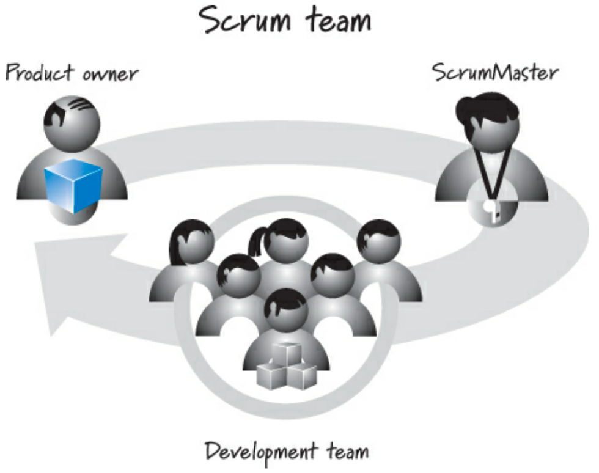
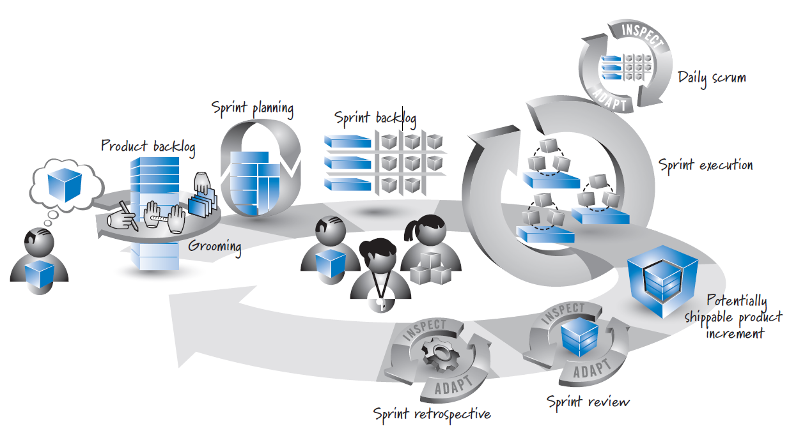
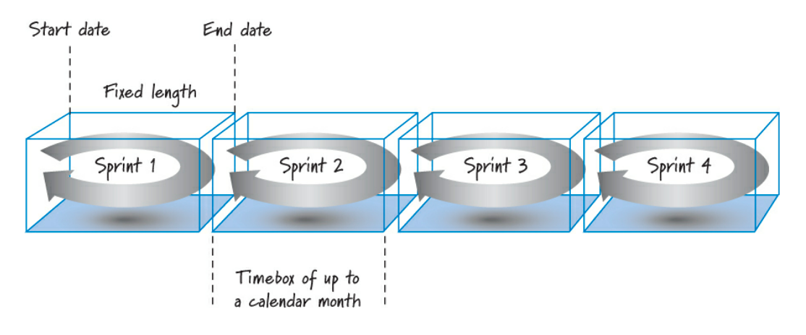
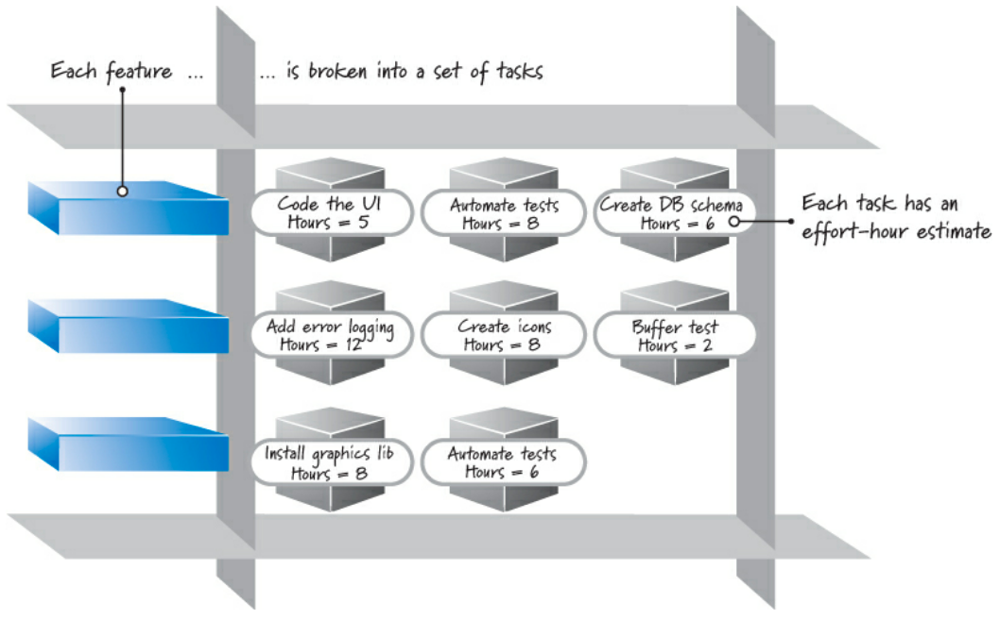

SCRUM non è un processo standardizzato: non c'è nessuna serie di passaggi sequenziali da seguire. **SCRUM è un framework per l'organizzazione e la gestione del lavoro.** Le pratiche di SCRUM sono incarnate in ruoli, attività, artefatti e regole ad essi associati.

## Ruoli
Uno SCRUM team è composto da tre ruoli: 

- ***Product Owner (proprietario):* il punto centrale della leadership di prodotto.** È responsabile di ciò che verrà sviluppato e in quale ordine, stabilisce gli obiettivi e stabilisce quali caratteristiche in quale ordine, responsabile del successo;
- **Scrum Master:** un leader, non un manager. È responsabile di guidare il team nella creazione e nel seguire il proprio SCRUM, applica i valori e i principi di SCRUM, agisce come coach e facilitatore fornendo guida e aiuto al processo, protegge la squadra da interferenze esterne ed assume un ruolo di leadership nella rimozione degli impedimenti;
- **Development Team (team di sviluppo):** è responsabile della determinazione di come fornire ciò che il prodotto. Ai auto-organizza per determinare il modo migliore per raggiungere gli obiettivi, è composto da cinque a nove persone e deve possedere collettivamente tutte le abilità necessarie.

Possono esserci altri ruoli ma i tre elencati sono obbligatori e possono esistere uno o più SCRUM team per progetto.

## Attività

### Sprint Planning
Il risultato della **sprint planning** è:
- una *previsione (forecast)* perché ritengono che, sebbene il team di sviluppo stia facendo la migliore stima possibile in quel momento;
- un *impegno (commitment)* a sostegno della fiducia reciproca tra il proprietario del prodotto e il team di sviluppo, nonché all'interno del team di sviluppo; inoltre, supportare una pianificazione ragionevole a breve termine e il processo decisionale all'interno di un'organizzazione.

Si acquisisce fiducia nel fatto che il team di sviluppo abbia preso un impegno ragionevole. I membri del team creano un secondo *backlog* durante la pianificazione dello sprint, chiamato **sprint backlog**.

### Product Backlog
Il **product backlog** è un elenco prioritario (o ordinato) del lavoro da svolgere: un artefatto in continua evoluzione.

Il proprietario è responsabile della sua creazione e gestione: input arriva dal resto del team Scrum e dagli stakeholder. Svolge sempre prima il lavoro più prezioso ed importante: gestisce quindi le priorità.

### Grooming
Il **grooming** consiste nella creazione e nel perfezionamento degli elementi del backlog di prodotto, nella stima e nella definizione delle priorità. 

In sintesi, serve per calcolare la grandezza della funzione facendo una stima del tempo che ci vuole per implementarla.

### Spints
Con gli **sprint** il lavoro viene eseguito in iterazioni o cicli fino a un mese di calendario chiamati. Il lavoro completato in ogni sprint dovrebbe creare qualcosa di valore tangibile per il cliente o l'utente.

Gli sprint sono *timebox*, quindi hanno sempre una data di inizio e fine fissa e generalmente dovrebbero avere tutti la stessa durata, solitamente di 2 mesi.

### Sprint Planning
Un product backlog può rappresentare molte settimane o mesi di lavoro, che è molto più di quanto possa essere completato in un singolo, breve sprint.

Durante lo **sprint planning**, si determina il sottoinsieme più importante di elementi del product backlog da costruire nello sprint successivo.

Il proprietario e il team di sviluppo concordano uno **sprint goal**: determina gli elementi ad alta priorità che il team può realizzare realisticamente *lavorando a un ritmo sostenibile*.

### Sprint Backlog
I team di sviluppo suddividono ogni caratteristica mirata in una serie di attività. La raccolta di queste attività e del PBI associato costituisce lo **sprint backlog**.

Il team di sviluppo fornisce quindi una stima (in genere in ore) dello sforzo richiesto per il completamento. Lo sforzo è composto da: 
- suddividere gli elementi del product backlog in attività;
- completare la pianificazione dello sprint in circa quattro-otto ore;
- sprint di una settimana non dovrebbe richiedere più di un paio d'ore pianificare (o anche meno).

### Sprint Execution
Dopo la pianificazione dello sprint, il team di sviluppo, guidato dall'aiuto dello Scrum Master, esegue tutto il lavoro a livello di attività necessario per **completare** le funzionalità.

*Completato* significa che c'è un alto grado di sicurezza, che tutto il lavoro necessario per produrre caratteristiche di buona qualità sia stato completato.
Nessuno dice al team di sviluppo in quale ordine o come eseguire il lavoro a livello di attività nello sprint backlog.

Invece, i membri del team definiscono il proprio lavoro a livello di attività e quindi si auto-organizzano in qualsiasi modo ritengano sia migliore per raggiungere l'obiettivo dello sprint.

### Daily Scrum
Ogni giorno dello sprint, idealmente alla stessa ora, i membri del team di sviluppo tengono una riunione giornaliera (15 minuti o meno) dove si pongono le seguenti domande:
1. cosa ho ottenuto dall'ultima riunione?
2. su cosa intendo lavorare entro la prossima riunione?
3. quali sono gli ostacoli o gli impedimenti che mi impediscono di fare progressi?

Questa riunione ispeziona e adatta l'attività nota anche come *stand-up quotidiana*: tutti si alzano in piedi durante la riunione per contribuire a promuovere la brevità.

### Stato "Completato"
Lo sprint risulta come un incremento di **prodotto potenzialmente consegnabile**: il team SCRUM definisce una definizione di *completato*.

Potenzialmente consegnabile è uno stato di fiducia che verifica ciò che è stato costruito nello sprint è effettivamente fatto, il che significa che non c'è un lavoro non svolto di importanza materiale e possiamo fornire i risultati desiderati dal business.

Ad esempio, durante lo sviluppo di software, una definizione minima di completato dovrebbe produrre una parte completa della funzionalità del prodotto progettata, costruita, integrata, testata e documentata.

### Sprint Review
L'obiettivo di questa attività è quello di ispezionare e adattare il prodotto che si sta costruendo.

Fondamentale per questa attività è la conversazione che ha luogo tra i suoi partecipanti che includono il team SCRUM, gli stakeholder, gli sponsor, i clienti e i membri interessati di altri team.

La conversazione è incentrata sulla revisione delle funzionalità appena completate nel contesto dello sforzo di sviluppo complessivo.

Tutti i partecipanti a questa attività ottengono una chiara visibilità su ciò che sta accadendo e hanno l'opportunità di aiutare a guidare il prossimo sviluppo.

**Una revisione riuscita si traduce in un flusso di informazioni bidirezionale.**

### Sprint Retrospective
La *sprint review* è un momento per ispezionare e adattare il prodotto. La **sprint retrospective** è un'opportunità per ispezionare e adattare il processo: il team di sviluppo, ScrumMaster e il proprietario si riuniscono per discutere cosa sta e non sta lavorando con SCRUM e le pratiche tecniche associate.
In sintesi, in questa fase si verifica se stiamo implementando lo SCRUM nella maniera adatta.

**In questo modo, un buon team Scrum diventa grande.**
