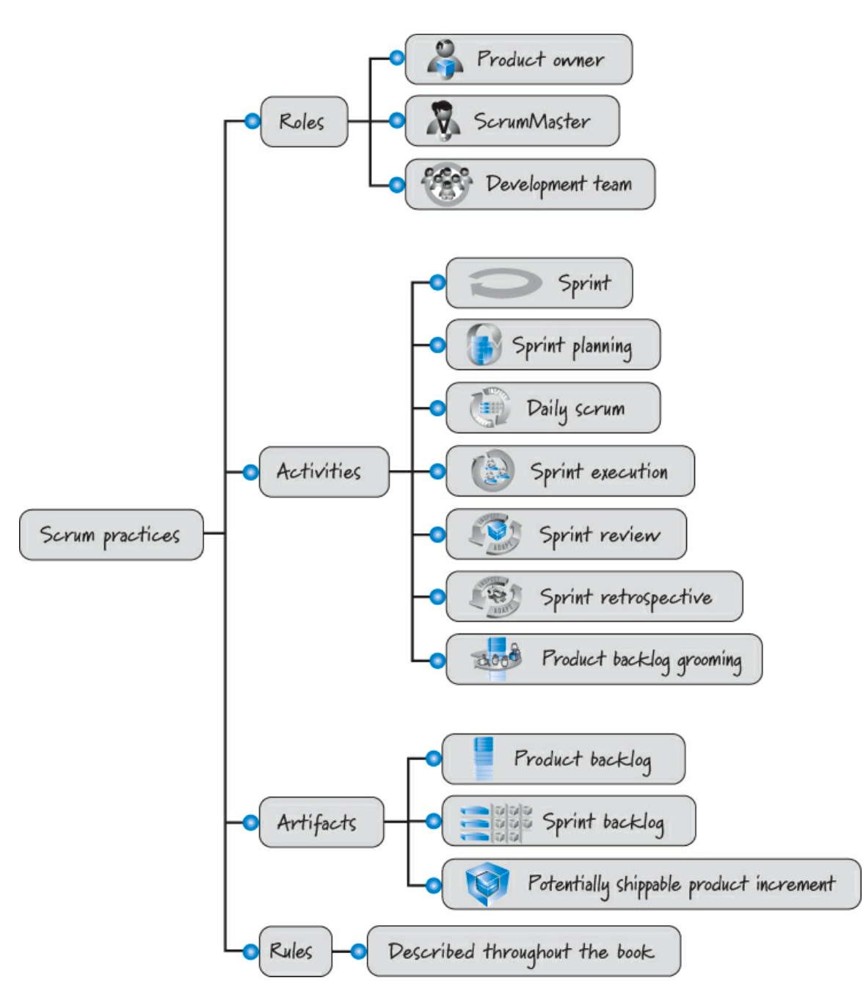

SCRUM non è un acronimo ed è un termine utilizzato nel rugby quando si rompe (collassa) la mischia e la prima idea è stata citata in un articolo del 1986 chiamato *“The New New Product Development Game”* che illustra come Honda, Canon e Fuji-Xerox hanno prodotto risultati di livello mondiale, utilizzando un approccio scalabile e basato sul team per lo sviluppo di prodotti "all-at-once".

***SCRUM è un approccio agile per sviluppare prodotti e servizi innovativi.*** Abbiamo due approcci:
- **Approccio "a staffetta"** allo sviluppo del prodotto può essere in conflitto con gli obiettivi di massima velocità e flessibilità;
- **Approccio olistico o "rugbistico"** in cui una squadra cerca di percorrere la distanza come un'unità, passando la palla avanti e indietro, può essere più adatto alle esigenze competitive di oggi.

Dal 1995, SCRUM è più comunemente utilizzato per sviluppare prodotti software e i principi fondamentali possono e sono utilizzati per sviluppare diversi tipi di prodotti.

## SCRUM in sintesi
SCRUM *inizia con la creazione di un backlog di prodotto*, stipulando un elenco prioritario delle caratteristiche necessarie per sviluppare un prodotto di successo, lavorando prima sugli elementi più importanti o con la priorità più alta e il lavoro che non è stato completato avrà una priorità inferiore rispetto a quello completato.

Successivamente, *il lavoro viene svolto in iterazioni brevi e circoscritte nel tempo* che vanno da una settimana a un mese di calendario ed un team auto-organizzato e interfunzionale svolge tutto il lavoro.

Alla fine dell'iterazione, *il team rivede le caratteristiche completate con gli stakeholder per ottenere il loro feedback*: in base a quest’ultimi, può modificare sia i progetti successivi che il modo in cui il team intende svolgere il lavoro, cercando di ottenere un prodotto (o un incremento del prodotto) potenzialmente spedibile. L'intero processo ricomincia con la pianificazione dell'iterazione successiva.

***In generale, perchè si utilizza SCRUM?*** Diminuisce l’efficienza ma aumenta la velocità rispetto al metodo a cascata e garantisce la soddisfazione del cliente.

## Contesti ideali per SCRUM
***SCRUM si concentra sulla realizzazione di funzionalità funzionanti, integrate, testate e di valore per l'azienda.***
SCRUM è anche **adatto ad aiutare le organizzazioni ad avere successo in un mondo complesso** in cui devono adattarsi rapidamente in base alle azioni interconnesse di concorrenti, clienti, utenti, enti normativi e altre parti interessate.
*SCRUM non è la soluzione giusta in tutte le circostanze.*

**SCRUM è particolarmente adatto per operare in un ambito complesso:** in queste situazioni la nostra capacità di sondare (esplorare), percepire (ispezionare) e rispondere (adattarsi) è fondamentale.

**SCRUM può non essere lo strumento più efficiente per i problemi semplici:** l'utilizzo di un processo con una serie di fasi ben definite e ripetibili che sono note per risolvere il problema sarebbe più adatto.

**SCRUM non è adatto a domini caotici:** i problemi caotici richiedono una risposta rapida. Siamo in una crisi e dobbiamo agire immediatamente per prevenire ulteriori danni e ristabilire almeno un po' di ordine.

**SCRUM non è adatto a un lavoro che richiede molte interruzioni:** in ambienti caratterizzati da interruzioni sarebbe meglio considerare un approccio agile alternativo chiamato *Kanban* (ideale per la manutenzione e il supporto del software).

## [[Framework SCRUM]]
*Il [[Framework SCRUM|framework SCRUM]] è semplice ma non è facile e indolore da applicare.* SCRUM dà potere ai team rendendo visibili le disfunzioni, rendendo visibili gli sprechi e non è una soluzione da libro di cucina per tutte i malesseri organizzativi. I benefici del [[Framework SCRUM|framework SCRUM]] sono:
- clienti soddisfatti;
- miglioramento del ritorno sugli investimenti;
- riduzione dei costi;
- risultati rapidi;
- fiducia nel successo in un mondo complesso;
- più gioia per il cliente.

Quindi, in generale, ***SCRUM non è un processo standardizzato*** (nessuna serie di passaggi sequenziali da seguire per produrre, nei tempi e nel budget previsti, un prodotto di alta qualità che delizi i clienti), *è un framework per organizzare e gestire il nostro lavoro* e ***il risultato sarà una versione di SCRUM che sarà unicamente vostra***.

