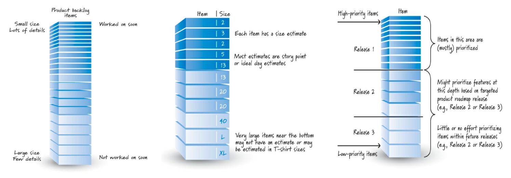
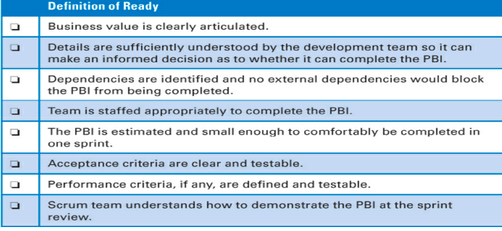

Costituisce una lista prioritaria di prodotti e funzionalità. Un elemento di questa lista prende il nome di **Product Backlog item**. Sono oggetti che portano un valore tangibile all'utilizzatore o al customer, come detto precedentemente, sono scritti sotto forma di user-stories e possiamo individuare diverse categorie degli stessi: **features**, *change*, *defect*, *technical improvement* e *knowledge acquisition*.

È necessaria un'analisi approfondita (**DEEP**) dei backlog items e per effettuare ciò si effettua la fase di **grooming** che a sua volta si compone di tre attività principali: 
- creare e aggiungere dettagli;
- stimarne la grandezza;
- determinare la priorità 

Questa è una fase che deve essere effettuata in collaborazione con tutto il team e generalmente è diretta dal product owner (il grooming costituisce il 10% di ogni sprint). La cadenza di questa attività è irrilevante, basta che sia ben integrata nelle fasi di sviluppo. 

Durante il **grooming si cerca di suddividere il product backlog in tre aree principali**:
- *Must have:* insieme di item conformi al concetto di "ready".
    
- *Nice to have:* item che possono essere oggetto delle prossime release;
- *Won't have:* item che è difficile che vengono inclusi nella release corrente ma anche nelle successive.

Non necessariamente dobbiamo avere un solo product backlog, per esempio potrebbe essere necessario realizzare una lista per ogni prodotto, qualora questi fossero oggetti complessi **(*rule of thumb*, cioè tante liste quanti sono i prodotti di valore)**
