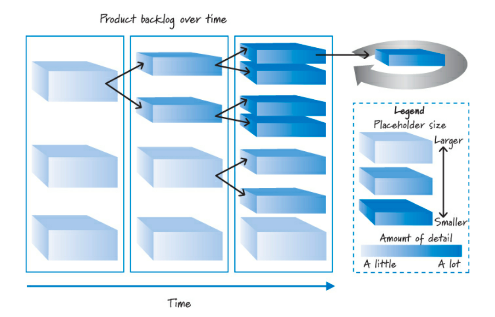
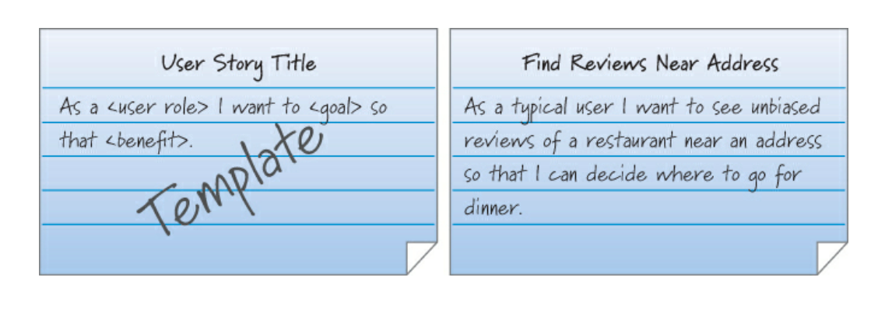
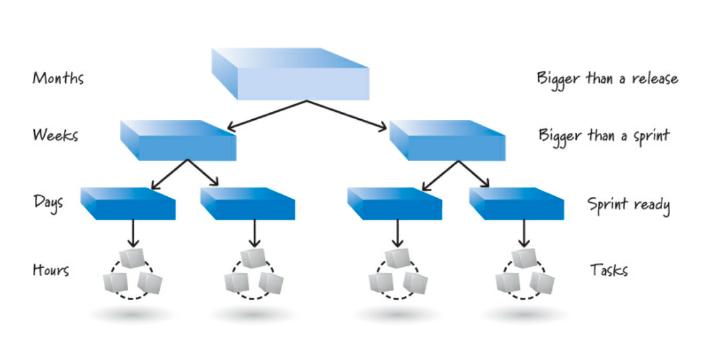
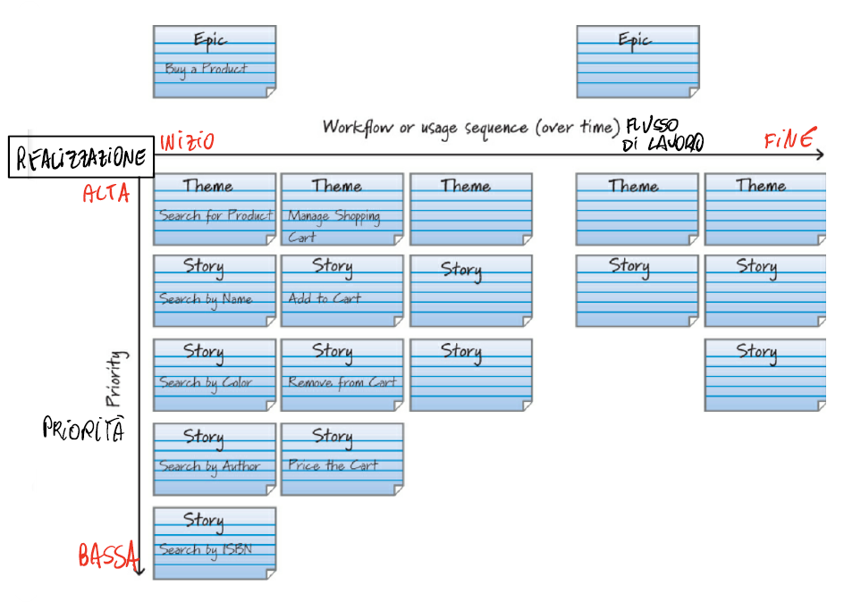

## Requisiti
Nello sviluppo sequenziale del prodotto, i *requisiti non sono negoziabili*, dettagliati in anticipo e pensati per essere autonomi. In SCRUM, *non investire mai molto tempo e denaro per definire in anticipo i dettagli di un requisito*: i dettagli vengono negoziati attraverso conversazioni che avvengono continuamente durante lo sviluppo e sono appena sufficienti per iniziare a creare funzionalità.

La creazione dei segnaposto per i requisiti si chiamano **PBI**: ogni PBI rappresenta il valore aziendale desiderabile, inizialmente i PBI sono di grandi dimensioni (grandi porzioni di valore aziendale), poi, successivamente, vengono affinati e diventano più piccoli e concreti.

## Conversazione e perfezionamento progressivo
L'obiettivo del backlog è ottenere **conversazioni** chiare e brevi. Nel dettaglio, la comunicazione è un veicolo di comunicazione, facilita una comprensione condivisa di ciò che deve essere costruito; comprendere cosa dovrebbe essere creato per realizzare i desideri dello stakeholder. In sintesi, la comunicazione è uno strumento chiave per garantire che i requisiti siano adeguatamente discussi e comunicati ma non sostituisce tutti i documenti.

Con **raffinatezza progressiva** intendiamo che non tutti i requisiti devono essere contemporaneamente allo stesso livello di dettaglio: se ci lavoreremo prima, requisito più piccolo e più dettagliato; non lavoreremo per un po' di tempo, requisito più grande e confusionario.
Quando disaggreghiamo just-in-time, i requisiti saranno grandi e leggermente dettagliati in un insieme di elementi più piccoli e dettagliati.

## *User Story*
SCRUM non ha un formato standard per PBI, spesso sostituito come ***user story* che è un formato conveniente per esprimere l'attività desiderata in PBI, in particolare le funzionalità.**

Comprensibile sia per il team SCRUM che per gli stakeholder, è strutturalmente semplice, un ottimo segnaposto per una conversazione: è scritto a vari livelli di granularità e facilmente aggiustabili progressivamente.

Non è l'unico modo per rappresentare gli elementi del product backlog: *Ron Jeffries le descrive come le tre C: **card**, **conversation** e **confirmation**.*

## *Card*, *conversation* e *confirmation*
Il *modello tre C* è un formato modello comune composto da:
- *una classe di utenti (**il ruolo utente**)*;
- *cosa vuole raggiungere quella classe di utenti (**l'obiettivo**)*;
- *perché gli utenti vogliono raggiungere l'obiettivo (**il vantaggio**)*.

*Non dovrebbe catturare tutti i dettagli*: poche frasi che catturano l'essenza. Contiene informazioni di conferma (condizioni di soddisfazione, ATDD): controlla se la storia è implementata correttamente, criteri di accettazione che chiariscano il comportamento desiderato (non essere gli unici test) e cattura e comunica dal punto di vista del proprietario.

## Più livelli di dettaglio
Le *user story* catturano le esigenze dei clienti e degli utenti a vari livelli di astrazione. Se c'è solo una (piccola) dimensione della storia, saremo obbligati a definire tutti i requisiti a un livello di dettaglio molto fine prima del dovuto. Avere solo piccole storie preclude il vantaggio di perfezionare progressivamente i requisiti in base a quanto basta.

Abbiamo le etichette di convenienza:
- **epic:** di dimensioni da pochi a molti mesi e potrebbe comprendere un'intera versione o più versioni;
- **features:** nell'ordine delle settimane e quindi troppo grande per un solo sprint;
- **sprintable stories:** nell'ordine dei giorni in termini di dimensioni e quindi abbastanza piccolo da adattarsi a uno sprint ed essere implementato;
- **theme:** una raccolta di storie correlate;
- **tasks:** cosa costruire (in termine di ore).

## Investi nelle "buone" storie
Per la definizione di buone user stories si utilizzano alcuni criteri (*invest criteria*): 
- **indipendenti:** le storie è preferibile che non si intreccino;
- **negoziabili:** quindi è possibile discuterne con gli stakeholder;
- **di valore:** devono rappresentare un beneficio;
- **stimabili:** è possibile andare a stimarne la grandezza; 
- **piccoli:** cioè è possibile realizzarli durante una sprint;
- **testabili**.

## Knowledge-Acquisition Stories e Story Mapping
Esiste un particolare sotto insieme di user stories che prende il nome di **Knowledge-Acquisition Stories**. Sono storie con il solo scopo di acquisire conoscenza sui backlog items, pertanto vengono realizzati prototipi, esperimenti, studi approfonditi per capire al meglio le esigenze del nostro user.  

Pertanto, per realizzare ciò, si organizzano dei Workshop (**user-story-writing workshop**) in cui tutti i membri del team e degli stakeholder fanno un brainstorm dei requisiti che portano un valore di business e vi si cerca di effettuare un **mapping** degli stessi in maniera tale da definire il livello di priorità e quindi le tempistiche in cui questi dovrebbero essere espletati.

