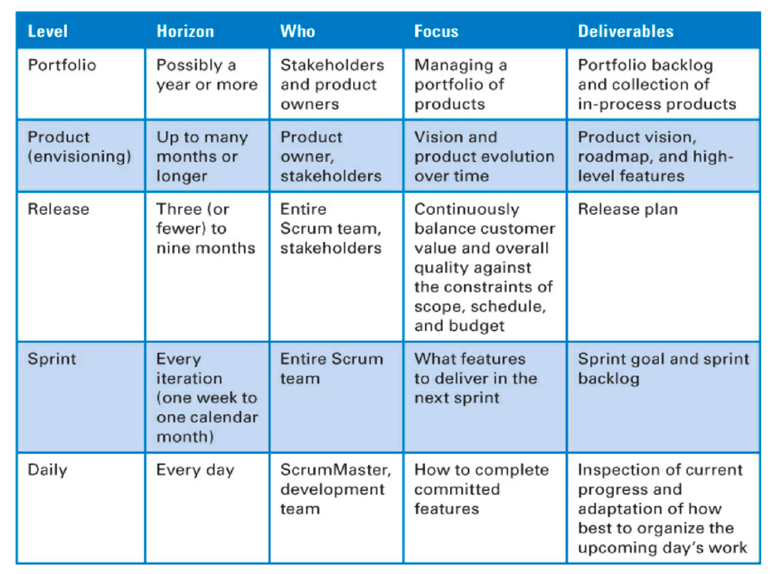
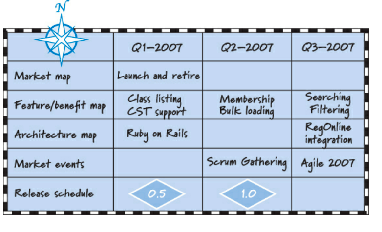
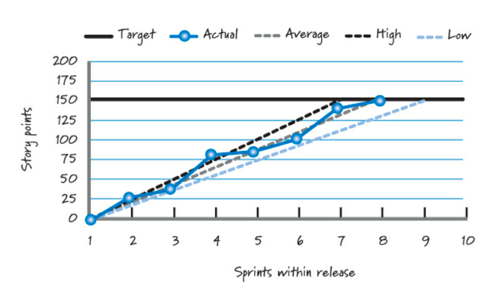
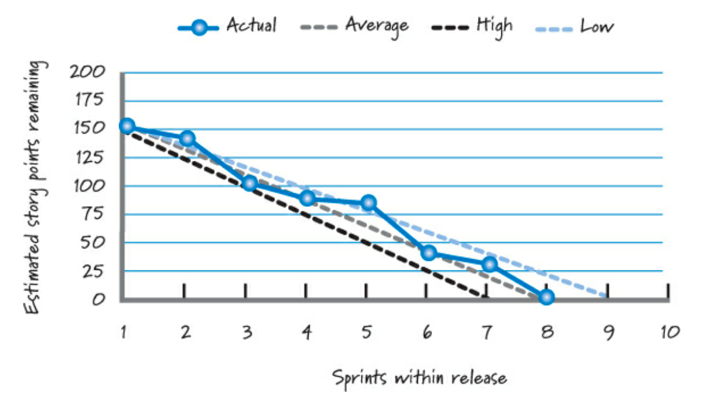
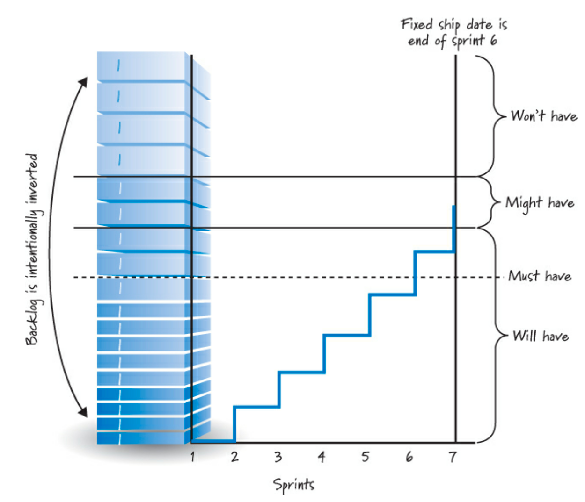
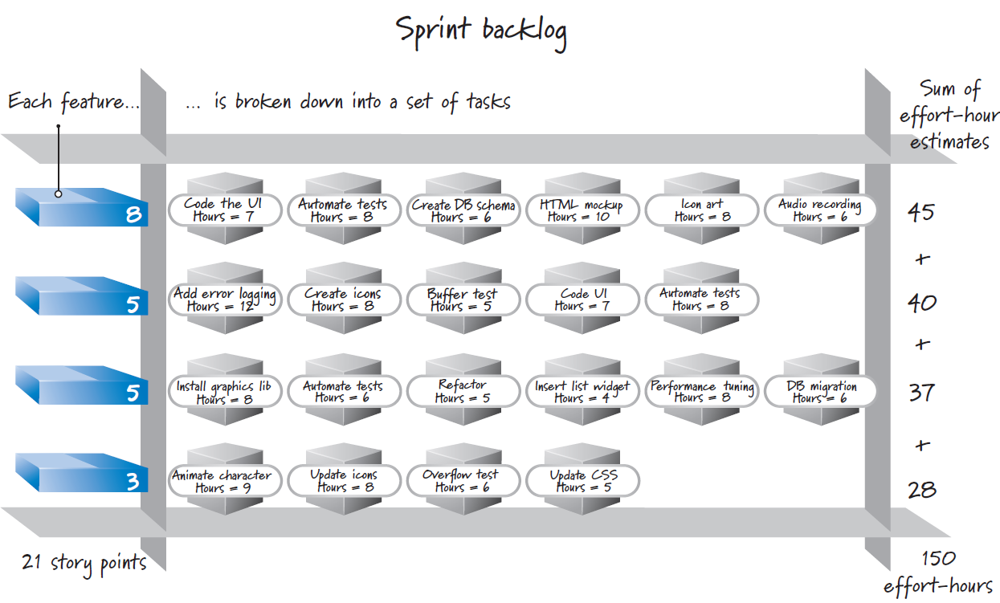

Nella metodologia SCRUM il planning dovrebbe seguire la **metafora dello sciatore** e cioè: *"Non bisogna prevedere troppo in avanti quello che si dovrà effettuare ma ci dobbiamo concentrare su quello che è immediato"*. Pertanto, piuttosto che conformarsi ad un piano rigido, dovremmo accogliere il cambiamento e quindi ripianificare il nostro lavoro. 

Sono da preferire piccole e frequenti release, si dimostra infatti che c'è un ritorno di investimento **(ROI)** maggiore.

Possiamo identificare **diversi livelli di pianificazione**: 
- **Portfolio Planning:** si identificano i backlog-items che si devono realizzare nel corso di questo sprint. Non necessariamente devono essere nuovi prodotti, potrebbero essere anche delle revisioni dei processi in corso;
- **Product Planning:** si va a definire la visione del prodotto e cioè si definisce l'area di interesse degli stakeholder. Si va quindi a definire una *roadmap* dei prodotti che dovranno essere realizzati nelle successive release.
    
    
    Inoltre, una roadmap permette di definire secondo quale criterio devono essere sviluppati le release:
    - **fixed scope releases:** si prioritizza l'obiettivo a discapito delle scadenze;
    - **fixed date releases:** si cerca di vincolare la quantità di lavoro in funzione del tempo a disposizione.
- **Release Planning:** ha come obiettivo quello di determinare il prossimo passo logico per il raggiungimento dell'obiettivo. È una fase soggetta a variazioni in corso d'opera. Si preoccupa di definire il contesto, la data e il budget per ogni consegna incrementale ed in funzione del livello di conoscenza/visibilità del prodotto questi parametri vengono modificati. Generalmente cercare di pianificare più di due sprint avanti risulta essere inutile;
- **Sprint Planning:** ci si mette d'accordo sugli specifi backlog items che saranno svolti durante lo Sprint. Questo genera lo sprint backlog (Una descrizione dei task da svolgere);
- **Daily Planning:** il livello più dettagliato per la pianificazione. L'intero team collabora per definire l'ordine del giorno cercando di evitare deadlock (work blockages).

## Comunicare lo stato del progetto
È un attività che si realizza tramite la trasposizione su grafici: 

- **fixed scope burnup chart:** un grafico di burnup per una versione con ambito fisso mostra la quantità totale di lavoro in una versione come obiettivo o linea di destinazione e i nostri progressi;
    
    
    
- **fixed scope burnout chart:** il nostro obiettivo è comunicare la gamma di funzionalità che prevediamo di completare e il nostro progresso sprint per sprint. Mostra la quantità totale di lavoro incompiuto che rimane in ogni sprint;
    
    

- **fixed date burnup chart:** i tradizionali grafici burndown e burnup non sono strumenti efficaci per la pianificazione a data fissa. Questo grafico calcola e comunica nel tempo la gamma ristretta di portata che può essere fornita entro una data fissa.
    
    

## Pianificare ogni sprint
Si decidono gli obiettivi dello sprint, pertanto si individua un insieme di PBI (determinato in funzione del goal oppure preso dalla testa della lista) da realizzare, si frammentano in diversi **task**, e quindi si definisce un piano realistico in cui si cercano di allineare gli obiettivi con i PBI. L'output di questo processo è il cosiddetto **Sprint Backlog (artefatto contenente il piano e i PBI)**. 

Tutti i membri del team collaborano e svolgono funzioni specifiche: 
- *proprietario:* condivide l'obiettivo e presenta il PBI più significativo. Rimane disponibile a chiarire dubbi;
- *team di sviluppo:* determina cosa si può consegnare e realizza un commitment realistico;
- *Scrum Master:* osserva l'attività di planning, facilità la riuscita dello stesso e conferma che gli impegni presi dal team di sviluppo siano realistici.

Per realizzare questo piano vengono presi in considerazione diversi input:
- **Product backlog:** prima della pianificazione dello sprint, gli elementi del product backlog più in alto sono stati portati in uno stato pronto;
- **Velocità del team:** la velocità storica del team è un indicatore di quanto lavoro è pratico per il team completare in uno sprint;
- **Vincoli:** vengono identificati i vincoli aziendali o tecnici che potrebbero influenzare materialmente ciò che il team può fornire;
- **Capacità del team:** le capacità tengono conto delle persone che fanno parte del team, delle capacità di ciascun membro del team e della disponibilità di ciascuna persona nel prossimo sprint;
- **Obiettivo dello sprint iniziale:** questo è l'obiettivo aziendale che il product owner vorrebbe vedere raggiunto durante lo sprint.

Ci sono due approcci allo sprint planning:
- *Two part planning:* si determina la capacità massima realizzabile, si definisce l'insieme di PBI da realizzare, si acquisisce confidenza si valuta se è realizzabile, in caso contrario si ridefinisce il planning;
- *One part planning:* si determina la capacità massima realizzabile, si individua un PBI, si acquisisce conoscenza sullo stesso, se la capacità non è stata ancora raggiunta si integrano altri PBI. 

## Determinare la capacità
Quando si vuole determinare la capacità devono essere prese in considerazione numerose variabili: il tempo personale del team, il lavoro al di fuori dello sprint e il lavoro di altri progetti.

Pertanto, conviene sempre lasciare un certo margine di errore (**"buffer"**). Viene misurato in *story points* e *effort hours*.

