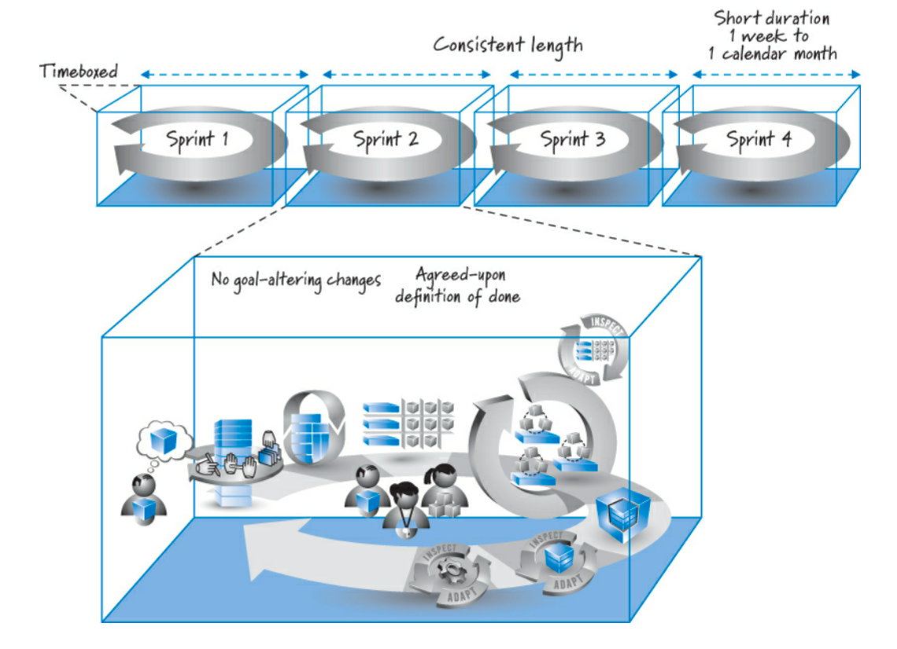
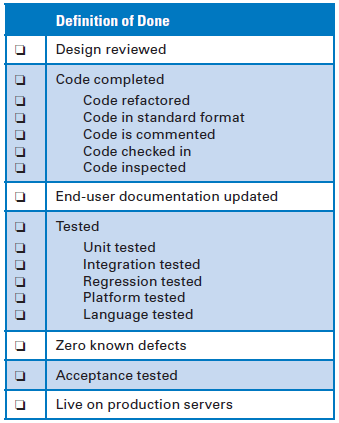

Gli Sprint sono lo scheletro del [[Framework SCRUM|framework SCRUM]]. 

Tutti gli sprint sono in *timebox*, il che significa che hanno date di inizio e fine fisse. Anche gli sprint devono essere brevi, da qualche parte tra una settimana e un mese di calendario. Gli sprint dovrebbero essere di lunghezza costante, sebbene in determinate circostanze siano consentite eccezioni.

Di norma, durante uno sprint non sono consentite modifiche all'obiettivo o al personale. Infine, durante ogni sprint, viene completato un incremento di prodotto potenzialmente spedibile in conformità con la definizione concordata di fatto dallo SCRUM team.

Sebbene ogni organizzazione avrà la propria implementazione unica di SCRUM, queste caratteristiche dello sprint, con alcune eccezioni, sono pensate per applicarsi a ogni sprint e a ogni team.

In sintesi, dipende dalla grandezza del progetto, dalle richieste degli stakeholder ed altri parametri.

## Timeboxed

Gli sprint sono radicati nel concetto di *timeboxing*, una tecnica di gestione del tempo che aiuta a organizzare l'esecuzione del lavoro e a gestire l'ambito. Ogni sprint si svolge in un intervallo di tempo con date di inizio e fine specifiche, chiamato *timebox*.

All'interno di questo *timebox*, il team dovrebbe lavorare a un ritmo sostenibile per completare una serie di lavoro scelta che si allinea con un obiettivo di sprint.

Utilizziamo il timeboxing per vari motivi:
- il team pianificherà di lavorare solo su quegli elementi che ritiene di poter iniziare e finire all'interno dello sprint;
- impegna a stabilire le priorità ed eseguire la piccola quantità di lavoro che conta di più: ottenere rapidamente valore aggiunto;
- dimostrare progressi rilevanti e aiutare le parti interessate e il team ad apprendere;
- termina il lavoro potenzialmente illimitato stabilendo una data di fine fissa;
- è più probabile che le cose vengano fatte quando le squadre hanno una data di fine nota;
- è ragionevole prevedere il lavoro che possiamo completare nel prossimo breve sprint.

**Il *timeboxing* è importante per diversi motivi.**

## Durata breve
Gli sprint di breve durata offrono molti vantaggi:
- è più facile pianificare poche settimane di lavoro rispetto a sei mesi;
- durante ogni sprint creiamo software funzionante e possiamo ispezionare e adattarci;
- quanto possiamo sbagliare in uno sprint di due settimane?
- generare entrate prima, migliorando il ritorno sull'investimento complessivo;
- la natura umana per l'interesse e l'eccitazione diminuisce quanto più dobbiamo aspettare;
- alla fine di ogni sprint eseguiamo la revisione dello sprint dimostrando e discutendo i risultati, quindi maggiori opportunità di ispezione e adattamento.

## Durata costante
Di norma, in base a un determinato sforzo di sviluppo, *un team dovrebbe scegliere una durata coerente per i suoi sprint* e non cambiarla a meno che non ci sia una ragione convincente. I motivi convincenti potrebbero includere quanto segue:
- stai pensando di passare da sprint di quattro settimane a sprint di due settimane per ottenere feedback più frequenti, ma vuoi provare un paio di sprint di due settimane prima di prendere una decisione finale;
- le ferie annuali o la fine dell'anno fiscale rendono più pratico eseguire uno sprint di tre settimane rispetto al solito sprint di due settimane;
- il rilascio del prodotto avviene in una settimana, quindi uno sprint di due settimane sarebbe uno spreco.

Il fatto che il team non possa portare a termine tutto il lavoro entro la durata dello sprint corrente non è un motivo convincente per estendere la durata dello sprint. Né è consentito arrivare all'ultimo giorno dello sprint, rendersi conto che non avrai finito e fare pressioni per un giorno o una settimana in più. Questi sono sintomi di disfunzione e opportunità di miglioramento però non sono buoni motivi per cambiare la lunghezza dello sprint.

Di norma, quindi, se una squadra accetta di eseguire sprint di due settimane, tutti gli sprint dovrebbero avere una durata di due settimane. In pratica, la maggior parte (ma non tutte) le squadre definiranno due settimane come dieci giorni feriali di calendario. Se c'è una vacanza di un giorno o un evento di allenamento durante lo sprint, riduce la capacità della squadra per quello sprint ma non richiede una modifica della lunghezza dello sprint.

*L'utilizzo della stessa lunghezza dello sprint sfrutta anche i vantaggi della cadenza e semplifica la pianificazione.*

## Cadenza e vantaggi di pianificazione
Sprint della stessa durata ci forniscono **cadenza** cioè un ritmo o frequenza regolare e prevedibile per uno sforzo di sviluppo di SCRUM. Un frequenza costante e sano consente al team SCRUM e all'organizzazione di acquisire un'importante familiarità ritmica quando le cose devono accadere.

*L'utilizzo di una durata coerente semplifica anche le attività di pianificazione.* Quando tutti gli sprint hanno la stessa durata (anche quando potrebbero avere un giorno o meno capacità per sprint a causa di una vacanza), il team si sente a proprio agio con la quantità di lavoro che può svolgere in uno sprint tipico (denominato velocità). La velocità è generalmente normalizzata a uno sprint. Se la durata dello sprint può variare, in realtà non abbiamo un'unità di sprint normalizzata.

## Alterazione degli obiettivi

Un'importante regola di SCRUM afferma che, una volta che l'obiettivo dello sprint è stato stabilito e l'esecuzione dello sprint è iniziata, non è consentita alcuna modifica che possa influenzare materialmente l'**obiettivo dello sprint**.

Ogni sprint può essere riassunto da un obiettivo dello sprint che descrive lo scopo aziendale e il valore dello sprint.: in genere l'obiettivo dello sprint ha un obiettivo chiaro e unico. Ci sono momenti in cui un obiettivo di sprint potrebbe essere multiforme, ad esempio "fai funzionare la stampa di base e supporta la ricerca per data".

## Impegno reciproco

**L'obiettivo dello sprint è alla base di un impegno reciproco fatto dal team e dal proprietario. Il team si impegna a raggiungere l'obiettivo entro la fine dello sprint e il proprietario si impegna a non alterare l'obiettivo durante lo sprint.**

Questo impegno reciproco dimostra l'importanza degli sprint nel bilanciare le esigenze dell'azienda di adattarsi al cambiamento, consentendo al team di concentrarsi e applicare in modo efficiente il proprio talento per creare valore durante un periodo breve e fisso. *Definendo e aderendo a un obiettivo di sprint, il team SCRUM riesce a rimanere concentrato (in zona) su un target ben definito e prezioso.*

## Cambiamento contro chiarimento

Sebbene l'obiettivo dello sprint non debba essere modificato in modo sostanziale, è consentito chiarire l'obiettivo. Facciamo una distinzione tra *cambiamento* e *chiarimento*:
- **Che cosa costituisce un cambiamento?** Un cambiamento è qualsiasi alterazione del lavoro o delle risorse che ha il potenziale di generare sprechi economicamente significativi, interrompere dannosamente il flusso di lavoro o aumentare sostanzialmente la portata del lavoro all'interno di uno sprint;
- **Che cosa costituisce un chiarimento?** I chiarimenti sono dettagli aggiuntivi forniti durante lo sprint che aiutano il team a raggiungere il suo obiettivo di sprint.

## Conseguenza del cambiamento
Può sembrare che la regola del non modificare gli obiettivi sia in diretto conflitto con il principio fondamentale di SCRUM secondo cui dovremmo abbracciare il cambiamento. **Accettiamo il cambiamento, ma vogliamo abbracciarlo in modo equilibrato ed economicamente ragionevole.** Le conseguenze economiche di un cambiamento aumentano all'aumentare del nostro livello di investimento nel lavoro modificato.

## Terminazione anormale
*Se l'obiettivo dello sprint diventa completamente non valido, il team SCRUM può decidere che continuare con lo sprint attuale non ha senso e consigliare al proprietario di interrompere lo sprint in modo anomalo.* Quando uno sprint viene interrotto in modo anomalo, lo sprint in corso si interrompe bruscamente e il team SCRUM si riunisce per eseguire una retrospettiva dello sprint. Il team si incontra quindi con il proprietario per pianificare lo sprint successivo, con un obiettivo diverso e un diverso insieme di elementi del [[Product Backlog|product backlog]].

**La *sprint termination* viene utilizzata quando si è verificato un evento economicamente significativo**, come le azioni di un concorrente che invalidano completamente lo sprint o il finanziamento del prodotto viene sostanzialmente modificato.

## Definizione di completamento
La consegna è una decisione aziendale che spesso avviene con una cadenza diversa; in alcune organizzazioni potrebbe non avere senso consegnare alla fine di ogni sprint.

Concettualmente, **la *definizione di completato* è una lista di controllo dei tipi di lavoro che il team dovrebbe completare con successo prima di poter dichiarare il proprio lavoro come potenzialmente consegnabile.** La lista di controllo è la seguente:

*Ovviamente le voci specifiche della lista dipenderanno da una serie di variabili:* la natura del prodotto in costruzione, le tecnologie utilizzate per costruirlo, l'organizzazione che lo sta costruendo oppure gli attuali impedimenti che condizionano ciò che è possibile.

Nella maggior parte dei casi, *una definizione minima di fatto dovrebbe fornire una fetta completa di funzionalità del prodotto, progettata, costruita, integrata, testata e documentata e fornirebbe un valore di convalidazione per il cliente*.

Molti team, iniziano con una definizione di fatto che non termina in uno stato in cui tutte le funzionalità sono completate nella misura in cui potrebbero essere pubblicate o consegnate. Per alcuni, gli impedimenti reali potrebbero impedire loro di raggiungere questo stato all'inizio dello sviluppo, anche se è l'obiettivo finale. Di conseguenza, potrebbero (necessariamente) iniziare con uno stato finale minore e lasciare che la loro definizione di fatto si evolva nel tempo man mano che gli impedimenti organizzativi vengono rimossi. In sintesi, **la definizione di completamento può evolvere nel tempo**.

## Criteri di accettazione
La definizione di completamento si applica all'incremento di prodotto sviluppato durante lo sprint. L'**incremento del prodotto** è composto da un insieme di elementi del backlog del prodotto, quindi ogni elemento del backlog deve essere completato in conformità con il lavoro specificato dalla lista di definizione del completamento.

Ogni elemento del *[[Product Backlog|product backlog]]* introdotto nello sprint dovrebbe avere una serie di **condizioni di soddisfazione** (criteri di accettazione specifici dell'elemento), specificate dal proprietario. Questi **criteri di accettazione** alla fine verranno verificati in test di accettazione che il proprietario del prodotto confermerà per determinare se l'elemento del backlog funziona come desiderato.

**Un articolo del *[[Product Backlog|product backlog]]* può essere considerato terminato solo quando sia i criteri di accettazione specifici dell'articolo sia la definizione di completamento a livello di sprint sono stati soddisfatti.**
