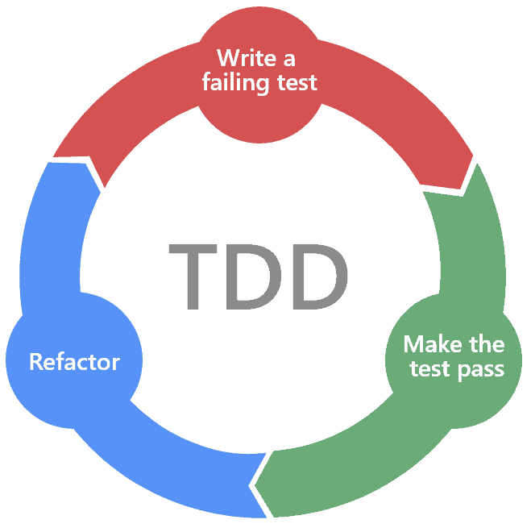

Questi laboratori servono per introdurre tecniche che si adattano bene ai paradigmi di sviluppo iterativo delle metodologie agili. I laboratori sono divisi in due parti:
- ***parte 1,* esercitati con tecniche di test-driven development**: base di TDD, test doppi e sviluppo guidato dal comportamento;
- ***parte 2,* pipeline CI/CD:** cos'è una pipeline CI/CD, come progettare una pipeline per il tuo progetto e come lavorare in team in un ambiente CI/CD.

## Software testing
Il **software testing** è, in modo molto informale, ogni processo che eseguiamo per acquisire fiducia che il software che stiamo sviluppando funziona come previsto e in base ai requisiti.

Diversi tipi di software richiedono (norme, etica, ...) diverse *profondità di test*: non vale sempre la pena testare tutto il più approfonditamente possibile e talvolta è assolutamente necessario.

**Intere figure professionali si sono dedicate a questo:** ci concentriamo sul test del software run-of-the-mill, "dal punto di vista dello sviluppatore", che ha il maggior impatto per noi ed è strettamente correlato alle metodologie agili.

Abbiamo vari tipi di test:
- **white-box** (verifica gli interni e le implementazioni dei sistemi) e **black-box** (verifica il comportamento dei sistemi);
- **test funzionali** (requisiti espliciti) e **test non funzionali** (requisiti impliciti);
- **test manuali** ed **automatici**.

## Test-driven development (TDD)
Il flusso di lavoro *test-driven development (TDD)* è una pratica di sviluppo che intercala lo sviluppo delle funzionalità ("codice di produzione") e lo sviluppo dei test. Si basa sulle due seguenti regole: **scrivere nuovo codice solo se un test automatizzato ha fallito** ed **eliminare duplicazioni**.

Per soddisfare le regole del TDD, lo sviluppatore è “costretto” verso il seguente flusso di lavoro:

Se mettiamo in pratica il flusso di lavoro TDD:
- è impossibile non scrivere dei test per le funzionalità che implementiamo;
- di solito terminiamo con un'elevata copertura del codice (principalmente unit test, test di integrazione), che aiuta nel refactoring (test di regressione);
- siamo costretti a pensare alle API che stiamo progettando;
- i nostri test saranno generalmente molto descrittivi ("documentazione vivente").

Sebbene il TDD sia *semplice*, non è facile in quanto richiede molta pratica e disciplina. Ciò è dovuto a una moltitudine di fattori: sembra essere "dispendioso in termini di tempo" e quando “sappiamo come fare qualcosa” sentiamo il bisogno di correre, il TDD ci rallenta.

Praticare il TDD su piccoli incarichi, sebbene noioso, è necessario per raccogliere i frutti del TDD su progetti reali.

Nel corso degli anni, la comunità dei professionisti del TDD ha acquisito molte conoscenze su come applicare con successo il TDD ai progetti.

**In sintesi, la progettazione si basa sulla scrittura dei test: prima si scrivono i test, poi si implementa la soluzione finale.**

## *pytest*
***pytest*** è un framework di test per Python, con sintassi leggera, meccanismi di rilevamento intuitivi per casi di test e facile da installare.

- i file/funzioni che iniziano con *test_* vengono automaticamente identificati come test case;
- le classi che iniziano con *Test* vengono automaticamente identificate come “suite” di test, i suoi metodi sono casi di test;
- utilizza l'asserzione integrata di Python e nient'altro;
- **consente di concentrarsi sulla metodologia piuttosto che su strane stranezze di configurazione.**

Semplici affermazioni saranno sufficienti per oggi, ma sei incoraggiato a sfogliare i documenti per "funzionalità avanzate" se decidi di utilizzarlo per il tuo lavoro di progetto. Altre funzionalità importanti sono:
- *pytest.fixture* permette di usare l'iniezione di dipendenza per impostare il contesto per l'esecuzione dei test;
- il suo argomento *scope='module'|'function'|'class'* è simile alle annotazioni *@BeforeClass*, *@AfterClas*s di JUnit;
- installa con *pip install pytest* (consigliato per utilizzare un ambiente virtuale);
- viene eseguito con *pytest* (consigliato *pytest -v*) nella cartella principale del progetto. Puoi anche specificare una sottodirectory o un modulo, l'impostazione predefinita è "esecuzione di tutti i test rilevati".
