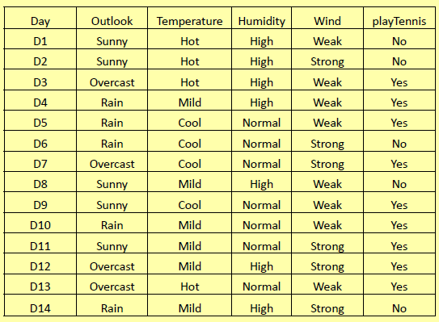
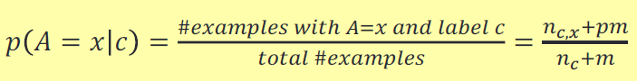
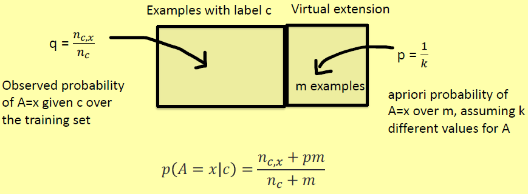

## Classificatori probabilistici

Nell'approccio probabilistico, un modello è una distribuzione di probabilità. Data un'istanza X e un insieme di classi {c_1, ..., c_n}, un **classificatore probabilistico**:
- determina una funzione di distribuzione di probabilità p(c_1|X), ..., p(c_i|X), ..., p(c_n|X) dove p(c_i|X) è la probabilità condizionata che X appartenga a c_i;
- emette la classe c_j con la probabilità più alta

## Classificazione via teorema di Bayes
La **classificazione via teorema di Bayes** è un algoritmo che permette di classificare le istanze in base alla probabilità che hanno queste di appartenere ad una classe.
Data un'istanza X, stimiamo la probabilità p(c_j|X), per ogni classe c_j, come:

> p(c_j|X) = rac{p(X|c_j)p(c_j)}{p(X)}

e quindi selezionare l'etichetta di classe c per la quale questa probabilità è massima:

> c = argmax_{c_j \in C}p(c_j|X) = argmax_{c_j \in C}rac{p(X|c_j)p(c_j)}{p(X)}

Poiché il denominatore è uguale per tutte le classi:

> c = argmax_{c_j \in C}p(X|c_j)p(c_j)

Le probabilità possono essere stimate sul *training set* come frequenze relative:
- p(c_j) è la frazione di esempi nel *training set* con etichetta di classe c_j;
- p(X|c_j) è la frazione degli esempi Y con etichetta c_j tali che Y=X.

## Ipotesi di indipendenza condizionale (CIA)
Il numero N di esempi di training è tipicamente molto più piccolo del numero M di combinazioni di attributi (esponenziale nel numero di attributi, cioè, N << M).

Quindi, nel *training set* sono generalmente disponibili troppo poche occorrenze (forse zero) di ciascuna combinazione di attributi (**problema di dati sparsi**).

Quindi, stimare p(X|c) usando frazioni semplici può portare a stime molto scarse (spesso p(X|c)=0, questo non significa che X non può essere associato alla classe c).

Per ovviare a questo inconveniente si fa l'ipotesi semplificativa dell'indipendenza condizionale degli attributi. Quindi, sotto la CIA, possiamo stimare la probabilità a priori p(X|c_j), dove X=<x_1,...,x_n>, come prodotto di probabilità:

> p(X|c_j) =p(<x_1, ..., x_n>|c_j) = p(x_1|c_j) ... p(x_n|c_j)

I vantaggi sono che è un algoritmo semplice e intuitivo.
Gli svantaggi però, essendo un algoritmo Naive, sono che NON tiene conto della correlazione tra le istanze (i.e. tra altezza e peso) e spesso richiede il calcolo di informazioni che non sono conosciute a priori, come la probabilità semplice e la probabilità condizionata.

## Classificatore ingenuo di Bayes
Sotto la CIA, il problema della classificazione può essere riformulato come segue:

> c = argmax_{c_j \in C}p(X_1|c_j)p(X_2|c_j)...p(X_n|c_j)p(c_j)

dove la probabilità a priori p(x_i|c_j) è stimata sull'insieme di addestramento come la frazione di istanze con etichetta c_j dove appare x_i. La valutazione delle probabilità a priori p(x_i|c_j) è tutto ciò che un classificatore NB deve fare durante la fase di addestramento. A differenza della stima di p(X|c) (senza CIA), una **stima affidabile** di p(x_i|c_j) non richiede enormi *training set*.

Di seguito un esempio di funzionamento di NB:

- p(Yes) = 9/14=0.64
- p(No) = 5/14 = 0.36
- p(Outlook=sunny | Yes) = 2/9
- p(Outlook=rain| Yes) = 3/9
- ...
- p(Wind=strong | Yes) = 3/9
- ...
- p(Outlook=sunny | No) = 3/5
- ...
- p(Wind=strong | No) = 3/5

Vogliamo classificare la seguente istanza:

> X = <Outlook=sunny, Temp=cool, Hum=high, Wind= strong>

Stimiamo le probabilità a posteriori:
- p(yes|X) = p(yes) p(sunny|yes) p(cool|yes) p(high|yes) p(strong|yes)= 0.0053;
- p(no|X) = p(no) p(sunny|no) p(cool|no) p(high|no) p(strong|no) = 0.026.

Quindi assegniamo X a "No" perchè p(no|X) > p(yes|X).

## Stima affidabile delle probabilità
Le probabilità condizionali p(x_i|c_j) sono stimate come frequenze relative. Ciò può fornire stime scadenti quando la dimensione del training set è piccola (legge dei grandi numeri).

Il caso estremo è p(x_i|c_j) = 0, poiché nessun esempio con A_i=x_i ed etichetta c_j si verifica nei dati di addestramento. La probabilità a posteriori p(X|cj) = 0, cioè X non può essere classificata sotto c_j.

Se nessun esempio con A_i=x_i si verifica nell'intero set di dati, ovvero p(x_i|c_j) =0 vale per ogni etichetta di classe c_j, NB non sarà affatto in grado di classificare l'istanza: tutte le probabilità a posteriori sono pari a zero.

Supponiamo che nessun esempio con Hum=high sia presente nel set di dati di **PlayTennis**. Allora:

> p(Hum=high|Yes) = 0 e p(Hum=high|No) = 0

Così, l'istanza:

> X = <Outlook=sunny, Temp=cool, Hum=high, Wind= strong>

non può essere classificato da NB come:

> p(Yes|X) = 0  e p(No|X) = 0

## m-stime delle probabilità condizionate
Per una stima più affidabile di p(A=x|c), estendiamo il *training set* S di m esempi virtuali e assumiamo che p sia la probabilità di A=x su tali istanze virtuali:

dove:
- n_c è il numero di esempi con etichetta c in S;
- n_{c,x} è il numero di esempi con A=x ed etichetta c in S;
- m è una costante chiamata **dimensione campionaria equivalente** indicando il numero di esempi virtuali (con etichetta c) che estendono il *training set* S;
- p è la probabilità di A=x su m (**probabilità a priori**).

Se m=0:

> p(A=x|c)=q=rac{n_{c,x}}{n_c} \ 
> (probabilità osservata)

Se m \rightarrow \infty$, allora:

> p(A=x|c) \rightarrow p \ 
> (probabilità a priori)

Il valore di m determina il compromesso tra la probabilità a priori p=\frac{1}{k} e la probabilità osservata q=\frac{n_{c,x}}{n_c}. Maggiore è il valore di m, maggiore è l'importanza attribuita alla probabilità a priori p rispetto alla probabilità osservata q stimata dai dati del campione.

Riprendendo l'esempio precedente:

Avremo la probabilità osservata che sarà: 

> q = p(Hum = high|Yes) = rac{n_{Yes.high}}{n_yes} = 0

Stimiamo 

> p(Hum = high|Yes) = rac{n_{yes,high}+mp}{n_{yes} + m}

dove:
- n_{yes,high} = 0 che indica numero di esempi con hum=high ed etichetta Yes;
- p=\frac{1}{2}, poiché Hum assume k=2 possibili valori (probabilità a priori);
- n_{yes} = 9 che indica numero di esempi Yes nel *training set*.

Impostando m=k= 2:

> p(Hum=high|YES) = rac{1}{11}

## Conclusione
La funzione di classificazione di un'istanza X=<x_1, ..., x_n> è: 

> c = argmax_{c_j \in C}p(X_1|c_j)p(X_2|c_j)...p(X_n|c_j)p(c_j)

Un'istanza X è classificata nella classe c che massimizza la funzione sopra. Nella fase di apprendimento le varie probabilità sono stimate in base alle frequenze nei dati di addestramento. Gli attributi correlati possono ridurre le prestazioni a causa della CIA. NB è molto efficiente.
