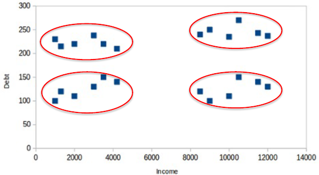
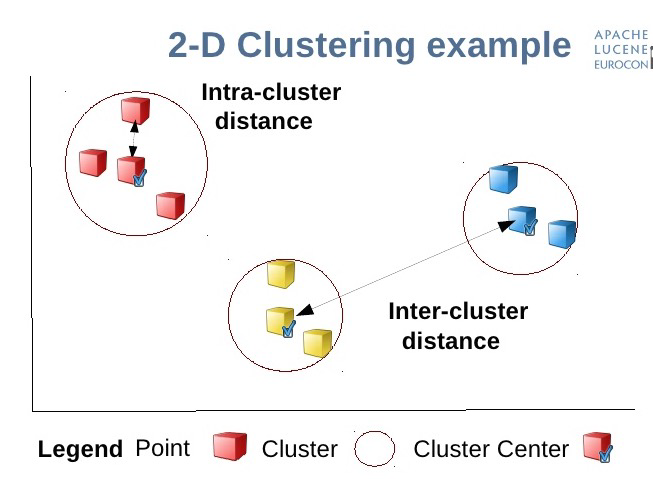
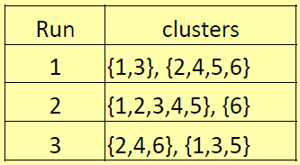
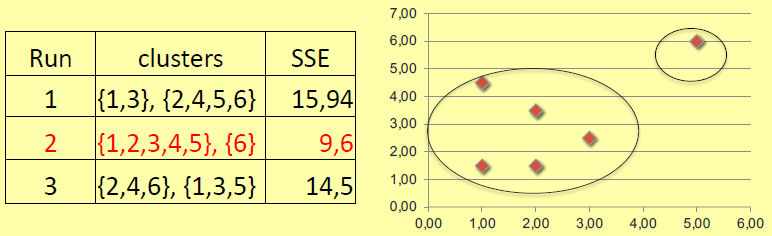
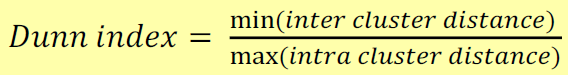

## Clustering
L'**analisi dei cluster** o **clustering** è il compito di suddividere un insieme di oggetti in gruppi (chiamati *cluster*) in modo che gli oggetti nello stesso cluster siano più simili (secondo alcune metriche) tra loro rispetto a quelli in altri cluster.

Il clustering è un'attività di data mining *descrittivo* che consente di ottenere informazioni sulla distribuzione dei dati.

Con la **tecnica non supervisionata** non abbiamo una funzione target da apprendere su un set di addestramento, abbiamo solo variabili indipendenti.

Un *esempio* motivante è quello della banca: una banca desidera segmentare i propri clienti in base a due attributi: reddito e debito. Lo scopo è quello di supportare il direttore di banca nella decisione se concedere o meno un finanziamento.

Ecco come il clustering può aiutare a segmentare i clienti. La banca può utilizzare questi cluster anche per fare pubblicità mirata, attuare strategie di marketing, ecc. Un buon metodo di clustering produrrà cluster di alta qualità con:
- elevata somiglianza intra-cluster;
- bassa somiglianza tra i cluster.

dove la somiglianza è espressa in termini di funzione di distanza.

*I cluster devono essere omogenei e ben separati.*

## Clustering per *K-means*
Con *K-mean* intendiamo una tecnica basata sui centroidi per l'hard clustering. L'insieme di dati e il numero $k$ di classi sono forniti come input. L'algoritmo presuppone che gli attributi del dominio siano numerici.

Dato $K$ (numero di clusters), l’algoritmo *K-means* è implementato in 4 step:
1. sceglie arbitrariamente $K$ istanze come **centroidi** dei clusters (seed point);
2. assegna ogni oggetto al cluster con il seed point più vicino (cioè la distanza euclidea);
3. (ri)calcola i $k$ centroidi come i $k$ baricentri dei cluster della partizione corrente (**punto medio**): questo **si può calcolare SOLO su dati NUMERICI**;
4. torna al step 2, *STOP:* quando non abbiamo nuovi assegnamenti (i nuovi baricentri combaciano con quelli precedenti).

### Pro e contro

I *punti di forza* sono: 
- l'algoritmo converge, in generale, molto rapidamente;
- molto efficace nella maggior parte dei casi pratici.

I *punti deboli* sono:
- è limitato ai dati per i quali esiste la nozione di baricentro (quando la media è definita);
- il problema di inizializzazione con cui l'output dipende dalla scelta iniziale dei centroidi;
- $K$ deve essere specificato in anticipo.

### Scelta della soluzione migliore
Rieseguendo l'algoritmo (con diverse scelte dei centroidi iniziali), otteniamo soluzioni diverse.

**Qual'è la soluzione migliore?** Abbiamo due formule matematiche che ci aiutano in ciò: 
- **errore quadratico** per il cluster $C_i$ è: 
    > $SE(C_i) = \sum_{X_j \in C_i} distance(x_j, q_i)^2$
    
    dove $q_i$ è il baricentro di $C_i$;
- **somma degli errori quadratici:** 
    > $SSE = \sum_{i=1,k} SE(C_i)$
    
    dove $k$ è il numero di cluster.

Da notare che ogni singola esecuzione di *K-mean* trova una soluzione che minimizza l'SSE, per i centroidi correnti.

Per scegliere la soluzione migliore, **selezioniamo la partizione che minimizza la funzione obiettivo SSE**:

**Un piccolo SSE è indicativo di una buona omogeneità del cluster (coesione)** cioè elevata somiglianza all'interno del cluster.

SSE non tiene conto della distanza tra i cluster. L'**indice di Dunn** è definito, per ogni soluzione, come il rapporto tra la distanza minima tra due cluster qualsiasi e la distanza massima intracluster. Mamaticamente:

dove la distanza tra i cluster (*inter cluster distance*) di due cluster è uguale alla distanza dei rispettivi centroidi. **Seleziona la soluzione che massimizza l'indice Dunn.**

### Scelta di un $k$ appropriato
Possiamo effettuare questa scelta tramite il **metodo del gomito (elbow method)**: *utilizziamo il grafico di SSE (o qualsiasi metrica di valutazione) rispetto al numero $K$ di cluster* e *selezioniamo il valore di $K$ in cui SSE diventa quasi costante*.

## Conclusione
Il vantaggio di *K-means* è che è semplice e molto veloce, infatti può essere lanciato molte volte variando i centroidi iniziali. Lo svantaggio è che è possibile usare il *K-means* solo su dati di cui è possibile calcolare la media, $K$ deve essere specificato in anticipo e gli outliners possono abbassare la qualità dei clusters generati.

Esempi di *applicazioni di clustering* sono: 
- **ricerche di mercato:** i ricercatori di mercato utilizzano l'analisi dei cluster per suddividere la popolazione generale dei consumatori in segmenti utili per la pubblicità mirata;
- **clustering di documenti:** rileva insiemi di documenti omogenei.
