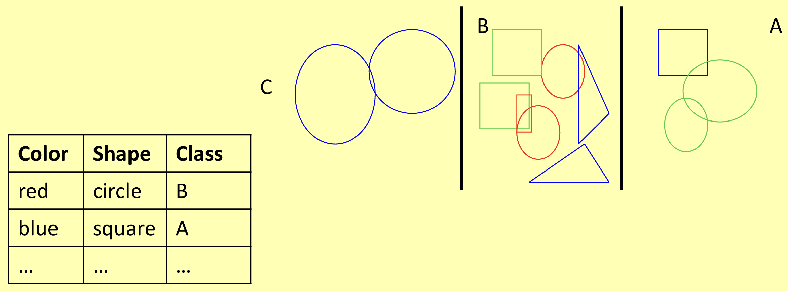
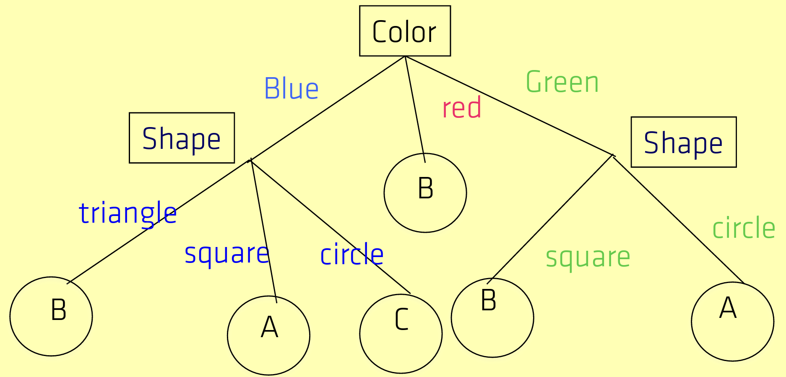
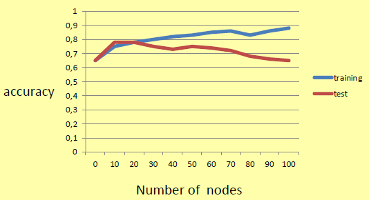
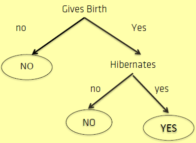
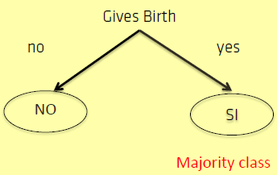
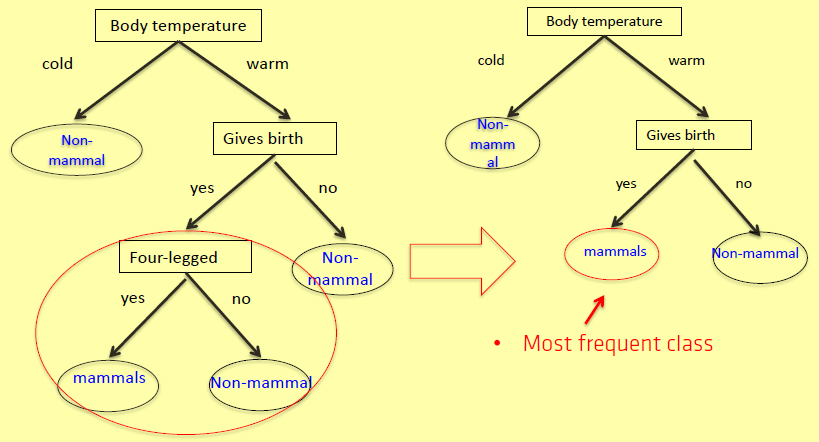
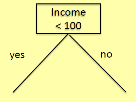
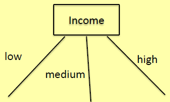
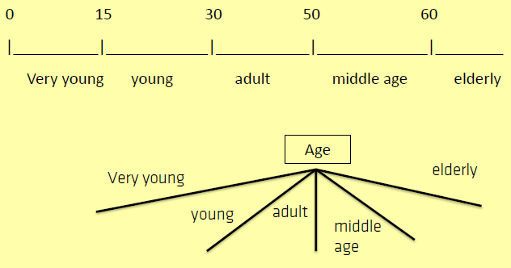

Facciamo un esempio: abbiamo due **attributi**, *color* e *shape*, e tre **classi**, *A*, *B* e *C*. Ci viene chiesto di esprimere la correlazione tra i valori degli attributi, da un lato, e le etichette delle classi, dall'altro, in termini di un albero decisionale.

Avremo quindi questo risultato:

Da qui potremmo andarci a ricavare l'albero decisionale:

Con **albero decisionale (DT)** intendiamo che:
- i nodi interni sono etichettati dai nomi degli attributi;
- gli archi che lasciano un nodo interno A sono etichettati dai valori di *A*;
- i nodi foglia sono etichettati dai nomi delle classi.

Un albero decisionale è equivalente a un insieme di classificatori binari DNF (uno per ogni etichetta di classe).

**Lo spazio degli alberi decisionali è completo** (in effetti, i DT sono DNF): a meno che il *training set* non sia coerente, esiste sempre un albero decisionale compatibile con il *training data*.

Vogliamo imparare i DT che sono una buona approssimazione del set di dati e sono resistenti all'overfitting. Più un DT è complicato, meglio può (sovra)adattare i dati, quindi preferiamo DT piccoli (*rasoio di Occam*).

## Algoritmo Basic DT

È un algoritmo utilizzato per la classificazione, viene applicato ricorsivamente. Ad ogni step viene scelto il **best-attribute**, per effettuare lo split. Il *best-attribute* sarà quello con la maggiore differenza di [[Entropia|entropia]] prima e dopo lo split, perchè il nostro obiettivo è quello di formare alberi decisionali bilanciati e semplici, generando sotto-alberi (sottoinsiemi) puri.

I sottoinsiemi puri sono quelli in cui compare per tutti gli esempi la stessa *class label*.

La purezza (concetto legato all'[[Entropia|entropia]]) si misura con l'**Information Gain** o il **Gini Index**.

L'algoritmo viene ripetuto ricorsivamente per generare i sotto-alberi fino a che non avviene una delle 3 condizioni di stop:
1. siamo arrivati alla nostra condizione ideale, abbiamo generato un sotto-albero puro;
2. non è possibile effettuare più alcuno splitting, perchè tutti gli esempi hanno sono identici nei loro attributi (*attribute value*) tranne che per la *class label* ovviamente. Costruiamo la foglia prendendo in considerazione la *class label* di maggioranza;
3. non c'è nessun esempio che soddisfa la condizione sull'arco. Generiamo la foglia prendendo in considerazione la *class label* di maggioranza della radice del sotto-albero.

## Information Gain
L'**Information Gain *IG(S,A)*** è la prevista riduzione di [[Entropia|entropia]] causata dal partizionamento degli esempi del training set *S* secondo l'attributo *A*.

> $IG(S,A) = E(S) - \sum_{v \in values(A)} \frac{\left | S_v \right |}{\left | S \right |} E(S_v)$

dove:
- $E(S)$ è l'[[Entropia|entropia]] di *S* (prima della divisione);
- $E(S_v)$ è l'[[Entropia|entropia]] del sottoinsieme $S_v$ di *S* dove $A=v$ (dopo la divisione)

*IG(S,A)* è massimo quando $E(S_v)= 0$, per ogni *v*, cioè quando tutti gli esempi in ogni partizione sono associati alla stessa etichetta di classe *c* (cioè, $p(c|Sv)=1$). La metrica *IG* fornisce supporto per la divisione bilanciata.

Riassumendo:
- *IG(S,A)* è la prevista riduzione di [[Entropia|entropia]] causata dal partizionamento degli esempi di *S* secondo l'attributo *A*;
- *IG(S,A)* è massimo quando gli esempi all'interno di ciascun sottoinsieme del training set in cui *S* è suddiviso per *A* sono tutti assegnati con la stessa etichetta di classe;
- *IG(S,A)* è minimo (zero) quando ogni sottoinsieme dell'insieme di addestramento in cui *S* è diviso da *A* ha la stessa distribuzione dell'etichetta di classe di *A*;
- maggiore è *IG*, più discriminante è *A*;
- sono supportati i DT bilanciati.

## Gini Index
Il **Gini Index** (detto anche **Gini Impurity**) calcola la probabilità che un'istanza selezionata casualmente, con uno specifico attributo, venga classificato in modo errato. Nel DT ovviamente la preferiamo bassa, se uguale a zero l'insieme è chiamato puro.

Può essere utilizzata come alternativa all’[[Entropia|entropia]].

## Osservazioni su BuildDT
**BuildDT** si basa su una strategia di partizionamento avida e ricorsiva. L'algoritmo non guarda mai indietro per riconsiderare le scelte precedenti (nessun backtracking). L'output non è necessariamente coerente con i dati di addestramento. Con **bias induttivo** intendiamo che gli alberi più corti sono preferiti a quelli più grandi.

Lo spazio di ricerca in generale contiene un insieme di modelli, per un dato training set. Il *bias induttivo* di un algoritmo di apprendimento dice quale tipo di modello è preferito rispetto agli altri.

La struttura dei DT appresi da BuildDT è:
- piccola ed equilibrata perché la funzione di divisione (come *IG* o simili), ad ogni passo, sceglie l'attributo che “meglio” separa gli esempi correnti;
- attributi con l'*IG* più alto più vicino alla radice.

BuildDT è l'algoritmo di base per l'apprendimento dei DT. Per renderlo di uso pratico, è necessario affrontare alcune altre questioni, come:
- **applicazione di tecniche per ridurre l'*overfitting*;**
- **gestione degli attributi numerici (non solo categorici);**

### Problema dell'overfitting
Quando l'algoritmo di apprendimento continua a sviluppare un DT per ridurre l'errore del training set, generalmente si verifica un errore del test set aumentato.

Più profondo è un ramo di un DT, più specificamente si adatta ai dati, maggiore è la quantità di informazioni ingannevoli che possono essere incorporate nel DT come *informazioni contingenti* o *informazioni errate*.

Riprendiamo l'esempio del training data dei *mammiferi* che ha come *name*, *body temp*, *gives birth*, *4-legged*, *hibernates* e *mammal*.
Immaginiamo che la balena è erroneamente classificata come non mammifero. Allora:

Questo è un modello che incorpora l'esempio classificato erroneamente.

Questa è un'ipotesi che NON incorpora l'esempio classificato erroneamente.

Aumentando il DT, diventa effettivamente probabile che l'algoritmo rilevi regolarità contingenti che non trovano corrispondenza nel mondo reale: in questo modo, non ha la flessibilità per funzionare bene quando è richiesta la previsione su nuovi dati.

Il bias induttivo dell'algoritmo BuildDT tende a mitigare il problema dell'overfitting, ma generalmente non è sufficiente.

Esistono fondamentalmente due approcci per prevenire l'overfitting nella costruzione di alberi decisionali:
- **pre-prouning** che interrompe la crescita dell'albero prima che si verifichi una condizione di arresto. In particolare, l'algoritmo di crescita dell'albero viene interrotto prima di generare l'albero completo. A tal fine vengono utilizzate nuove condizioni di arresto, ad esempio, arrestare se l'IG di un nodo è inferiore a una data soglia;
- **post-prouning** che consente all'albero di crescere fino a quando non si verifica una condizione di arresto, quindi post potatura dell'albero. In particolare: 
    - suddividere il training set in *training-training set (TTS)* e *validation set (VS)*;
    - usa il TTS per far crescere l'intero DT;
    - utilizzare il VS per stimare le prestazioni del DT;
    - sostituire un sottoalbero con un singolo nodo se l'errore sul VS non peggiora in modo significativo;
    - il processo continua fino a quando non è più conveniente potare

La riduzione dell'accuratezza rispetto al *validation set* è trascurabile. Ad esempio:

### Gestione degli attributi numerici
Quando si tratta di attributi numerici si possono seguire due approcci:
- *divisione binaria*; 
    
- *divisione a più vie.* 
    

Con la *divisione a più vie*, definisci nuovi attributi con valori discreti che suddividono l'intervallo in più intervalli, ciascuno trattato come un attributo categoriale. Ad esempio, immaginiamo di rappresentare l'età con:

> *Age: [0,100] = \{very young , young, adult, middle age, elderly\}*

e la divisione può avvenire come di seguito:

Con la *divisione a più vie*, trova una soglia *t* per la creazione di nodi binari della forma $X < t$ o $X \geq t$.

## Implementazioni dell'albero decisionale
- *ID3* è essenzialmente un'implementazione di BuildDT, che utilizza la funzione IG per la selezione degli attributi;
- *C4.5*, la successiva iterazione di Quinlan: 
    - accetta caratteristiche sia continue che discrete;
    - utilizza il *Gain Ratio* per il processo di divisione
    - tratta dati incompleti;
    - risolve il problema dell'overfitting con una tecnica post-potatura (molto intelligente).
- *C5.0* è l'ultima versione di C4.5 (più veloce C4.5, DT più piccoli, ecc);
- CART *(alberi di classificazione e [[Regressione|regressione]])* costruisce alberi in cui la variabile target può assumere valori continui (tipicamente numeri reali). L'albero ottenuto viene potato mediante potatura costo-complessità. CART può gestire variabili sia numeriche che categoriche e si basa sull'indice di Gini.

## Conclusione
Un albero decisionale è uno degli strumenti di apprendimento automatico più popolari perchè *facile da capire*, *facile da implementare*, *facile da usare* e *computazionalmente economico*.
