**Backpropagation** è un algoritmo per l'addestramento di [[Reti|reti]] neurali feedforward. È una procedura iterativa che utilizza la regola della catena per le derivate per modificare i pesi dall'output allo strato di input, al fine di ridurre l'errore.

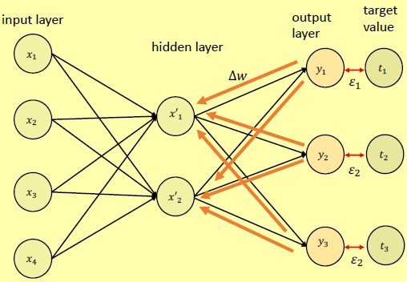

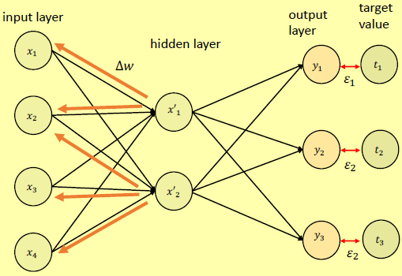

In base all'errore, i pesi vengono modificati uno strato alla volta, a ritroso dall'ultimo.

## Funzione obiettivo
Detta anche **funzione di errore** (chiamata anche *funzione obiettivo* o *funzione di costo o perdita*) e la scriviamo come:  

> $\varepsilon (W) = \frac{1}{2} \sum^{p}_{i=1} (y_i - t_i)^2$

dove: 
- $\varepsilon(W)$ è l'errore associato a un dato input, per dati valori dei pesi e delle distorsioni della rete $W = \{w_1, ..., w_n\}$;
- $p$ è il numero di nodi di output, $y_i$ è il valore dell'i-esimo nodo di output e $t_i$ il rispettivo valore target.

## Regole di aggiornamento del peso

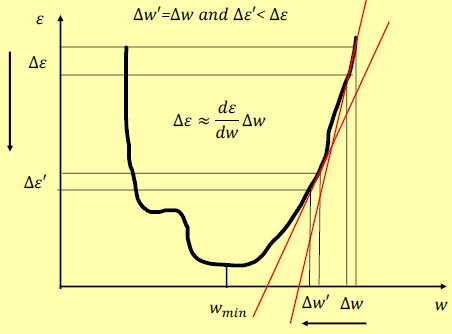

L'obiettivo è quello di trovare un insieme $W$ di parametri che minimizzi la funzione di errore $\varepsilon(W)$. Il calcolo ci dice che l'errore cambia come segue: 

> $\Delta \varepsilon \approx \frac{\partial \varepsilon }{\partial w_1} + ... + \frac{\partial \varepsilon }{\partial w_n} \Delta w_n$

L'obiettivo è quello di definire un'euristica per scegliere, ad ogni passo di un processo iterativo, $\Delta w_1 ... \Delta w_n$ in modo da rendere $\varepsilon$ sempre più piccola, fino a raggiungere un minimo della funzione di errore.

*Come scegliamo $\Delta w_1 ... \Delta w_n$?* Scegli $\Delta w_j$ in proporzione al valore assoluto della derivata: 

> $\Delta w_j = -\eta \frac{\partial \varepsilon}{\partial w_j}$

dove $\eta$ è una costante, chiamata **velocità di apprendimento**.

In generale, più ci si allontana dal minimo, cioè maggiore è l'errore, maggiore è il valore assoluto del gradiente $\frac{d \varepsilon}{dw}$.

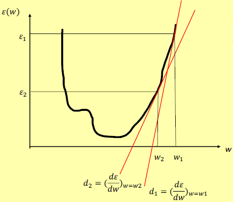

Quindi, utilizzando questa formula, eseguiamo un passo $\Delta w$ verso il minimo che è proporzionale all'errore. La velocità di apprendimento diminuisce avvicinandosi al punto minimo.

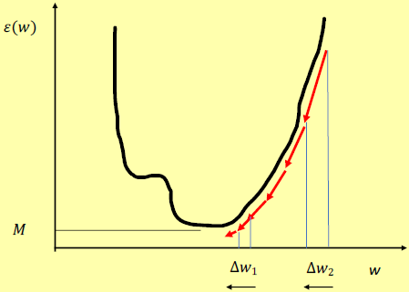

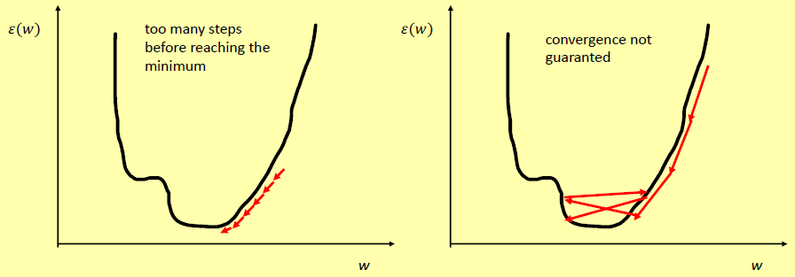

Il segno negativo viene utilizzato per garantire che la funzione di errore diminuisca sempre. Formalmente, da: 

> $\Delta \varepsilon \approx \frac{\partial \varepsilon }{\partial w_1} + ... + \frac{\partial \varepsilon }{\partial w_n} \Delta w_n$

e: 

> $\Delta w_j = -\eta \frac{\partial \varepsilon}{\partial w_j}$

avremo: 

> $\Delta \varepsilon \approx - \eta (\frac{\partial \varepsilon }{\partial w_1}^2 + ... + \frac{\partial \varepsilon }{\partial w_n}^2) < 0$

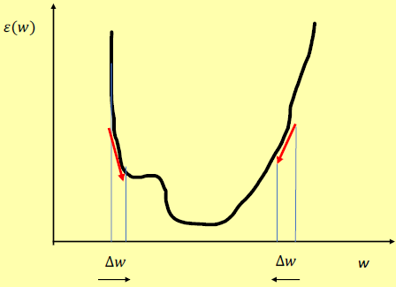

**Attenzione!** Non vi è alcuna garanzia che venga raggiunto il minimo assoluto. In generale viene trovato un minimo locale, a seconda dell'input casuale da cui partiamo. *Dobbiamo accontentarci di soluzioni ottimali (non le migliori).*

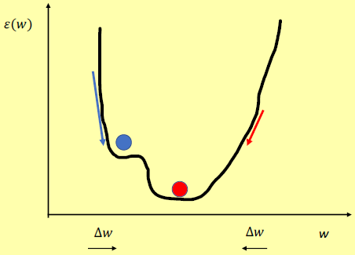

### Modifica dei pesi per i nodi di output
Vogliamo stimare, per ogni nodo di output $j$ $(1 \leq j \leq r)$, le variazioni dei pesi di input: 

> $\Delta w_{ji} = -\eta \frac{\partial \varepsilon}{\partial w_{ji}}, \forall i = 1, q$

A tal fine, dobbiamo calcolare la derivata: 

> $\frac{\partial \varepsilon}{\partial w_{ji}}$

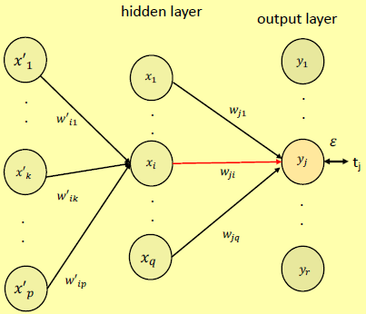

In generale: 

> $\frac{\partial \varepsilon}{\partial w_{ji}} = - (t_j-y_j)*y_j(1-y_j)*x_i$

Impostando $\delta_j = (t_j-y_j)*y_j(1-y_j)$, abbiamo: 

> $\frac{\partial \varepsilon}{\partial w_{ji}} = -\delta_j * x_i$

Quindi: 

> $\Delta w_{ji} = -\eta \frac{\partial \varepsilon}{\partial w_{ji}} = \eta * \delta_j * x_i$

### Modifica dei pesi per i nodi nascosti
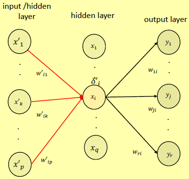

Non possiamo utilizzare le stesse regole per i nodi di output, poiché non è disponibile alcun valore target per stimare il termine di errore di un nodo nascosto.

### Regola per modificare i pesi dei nodi nascosti di primo livello
In generale, per ogni nodo nascosto $i$ $(1 \leq i \leq q)$ avremo: 

> $\Delta w'_{ik} = \eta *\delta'_i*x'_k, \forall k=1,p$

dove: 

> $\delta'_i = x_i(1-x_i) \sum_{j \in output} w_{ji}\delta_j$

dove $\delta_j$ è il termine di errore del $j$-esimo nodo di output.

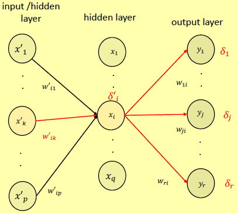

Possiamo generalizzare la regola precedente, specifica per gli ultimi nodi di layer nascosti, a nodi nascosti generici semplicemente ridefinendo la definizione del termine di errore $\delta'_i$ come segue: 

> $\delta'_i = x_i (1-x_i) \sum_{j \in nextLevel} w_{ji} \delta_j$

dove $nextLevel$ è l'insieme dei nodi del livello nascosto successivo.

### Regole per cambiare peso
Modifica ogni peso $w_{ji}$ della rete come segue: 

> $w_{ji} = w_{ji} + \Delta w_{ji}$

dove: 

> $\Delta w_{ji} = \eta * \delta_j * x_i$

dove: 
- $\delta_j = (t_j - y_j)* y_j(1-y_j)$ se $j \in Output$;
- $\delta_j = x_j (1-x_j) * \sum_{k \in nextLayer} w_{kj} *\delta_k$ se $j$ è un nodo nascosto;

## Pseudo-codice dell'algoritmo di retropropagazione (backpropagation)
Il seguente pseudo-codice è la versione di discesa del gradiente stocastico per un NN a 2 strati: 

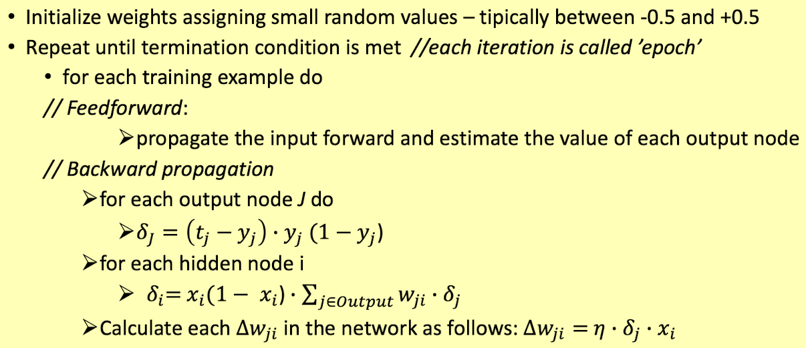

Dopo ogni passaggio in avanti attraverso una rete, la backpropagation esegue un passaggio all'indietro, regolando i parametri del modello per ridurre l'errore.

**Gradient Descent** è un algoritmo iterativo per trovare un minimo locale la funzione di errore (perdita). La condizione di terminazione viene sviluppata tramite *overfitting*.

## Overfitting
L'overfitting di un NN dipende da
- il numero di nodi nascosti rispetto alla dimensione del *training set*;
- il numero di iterazioni dell'algoritmo all'indietro.

### #hidden nodes vs size of the training set
Gli NN sono approssimatori universali: approssimazioni sempre migliori della funzione target (sull'insieme di addestramento) si ottengono aumentando la dimensione della rete. Pertanto, NN di grandi dimensioni (con molti nodi nascosti) tendono a sovraccaricare i *training set*.

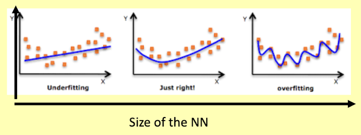

Per un dato *training set*, c'è una dimensione ottimale del NN, intorno alla quale abbiamo un giusto adattamento dei dati di training.

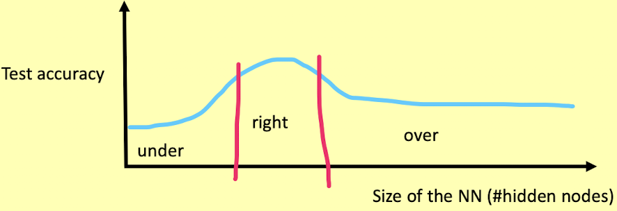

Tuttavia, la "grandezza" di un NN è un concetto relativo alla dimensione del *training set*.
Ciò che realmente conta è il rapporto tra la dimensione della NN e la dimensione del *training set*.
Più grande è l'NN, più piccolo è il *training set*, più l'NN si adatta ai dati.

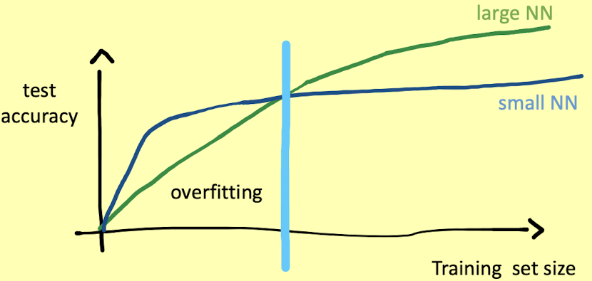

### #epochs
Se spingiamo troppo oltre il processo di apprendimento, molto probabilmente il modello risultante si adatterà eccessivamente ai dati di addestramento. Per limitare il problema dell'overfitting, una tecnica efficace è quella di utilizzare un set di validazione durante la fase di training.

## Funzione di costo dell'[[Entropia|entropia]] incrociata
La derivata della funzione di costo quadratica, scritta matematicamente come: 

> $\varepsilon (W) = \frac{1}{2} \sum^p_{i=1} (y_i - t_i)^2$

è pari a: 

> $\frac{\partial \varepsilon}{\partial w} = -(t-y)*y*(1-y)*x_i = -\sigma' (Z)*(t-y)*x_i$

che è proporzionale alla derivata $\sigma'(Z)$ della funzione sigmoidea.

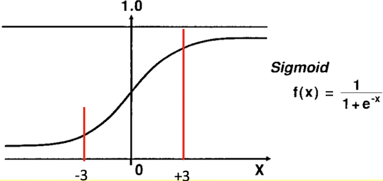

I valori della derivata sono significativi per l'intervallo -3 e 3 ma diventano molto più vicini allo zero al di là di questo intervallo. L'effetto potrebbe essere un rallentamento dell'apprendimento.

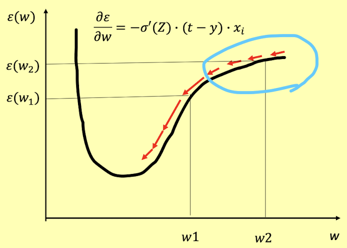

Anche se $\varepsilon(w_2) > \varepsilon(w_1)$, la derivata di $\varepsilon$ in $w_2$ è minore di quella di $w_1$ (questo è l'effetto di $\sigma'(Z)$).
Pertanto, il tasso del processo di apprendimento non diminuisce monoticamente mentre ci si avvicina a un punto minimo.
*Nella regione evidenziata si verifica un rallentamento.*

Il punto è che, con la funzione di costo quadratica, non è garantito che la velocità di ricerca sia proporzionale alla distanza dal minimo. Una funzione di costo $C$ il cui gradiente non è influenzato da $\sigma'(Z)$, ed è solo proporzionale all'errore, è quindi altamente desiderata.

Tale funzione è l'**[[Entropia|entropia]] incrociata**: 

> $C = -t* \ln y + (1-t) * \ln (1-y)$

la cui derivata è esattamente ciò che ci aspettavamo, cioè: 

> $\frac{\partial C}{\partial w} = -(t-y)*x_i$

Le *proprietà della funzione di [[Entropia|entropia]]* incrociata: 
- ha un minimo quando $t=y$, cioè, l'uscita è uguale al valore target;
- la derivata è proporzionale al solo errore $(t-y)$, per un dato $x$.

Pertanto, la velocità con cui il peso $w$ viene modificato, ovvero la velocità di apprendimento, è proporzionale all'errore.

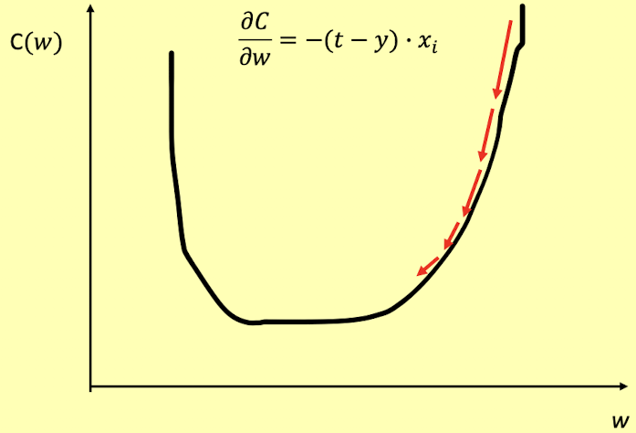

## Conclusione
Gli NN sono approssimatori universali. Maggiore è il numero di parametri (pesi e distorsioni) migliore è l'approssimazione della funzione obiettivo che possiamo ottenere. Maggiore è il numero di parametri, minore è il training set, maggiore è il rischio di overfitting dei dati di training.

*Sono accettabili lunghi tempi di addestramento.* È richiesta una rapida valutazione della funzione appresa: si pensi all'applicazione di un NN per la guida autonoma. L'interpretazione del modello non è richiesta: un modello è semplicemente un insieme di valori reali (i pesi dell'NN), quindi non è comprensibile come, diciamo, un albero decisionale.
