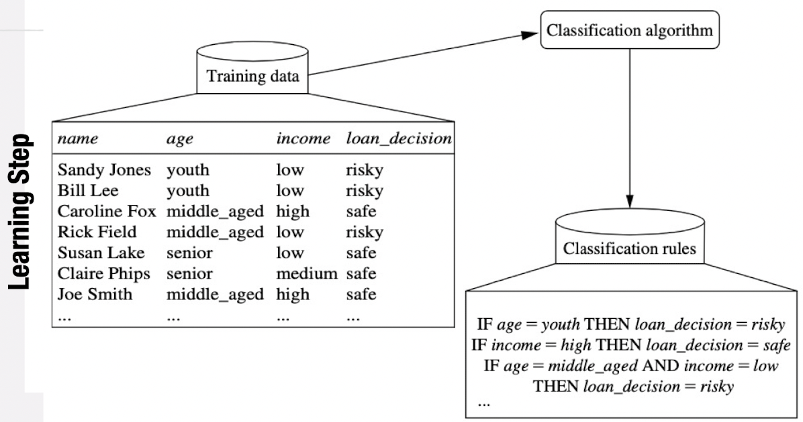
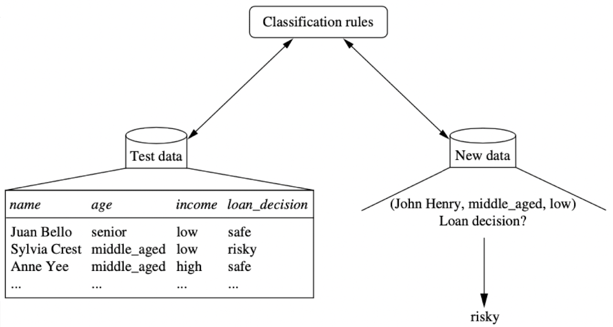
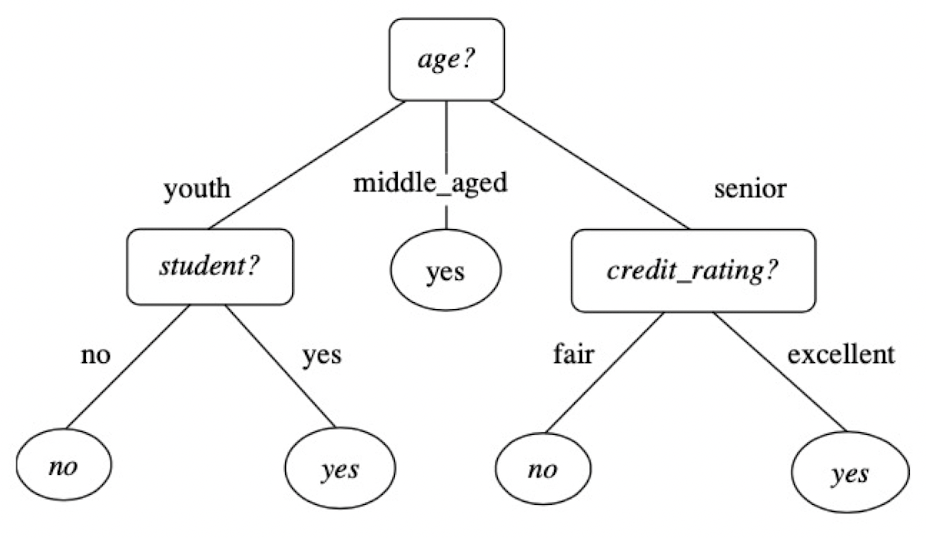
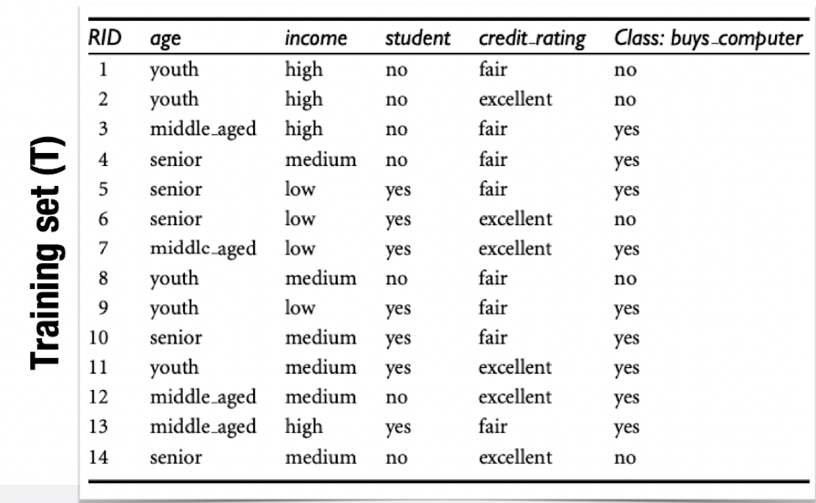
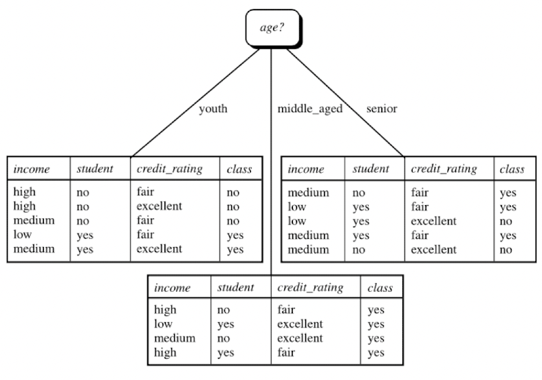
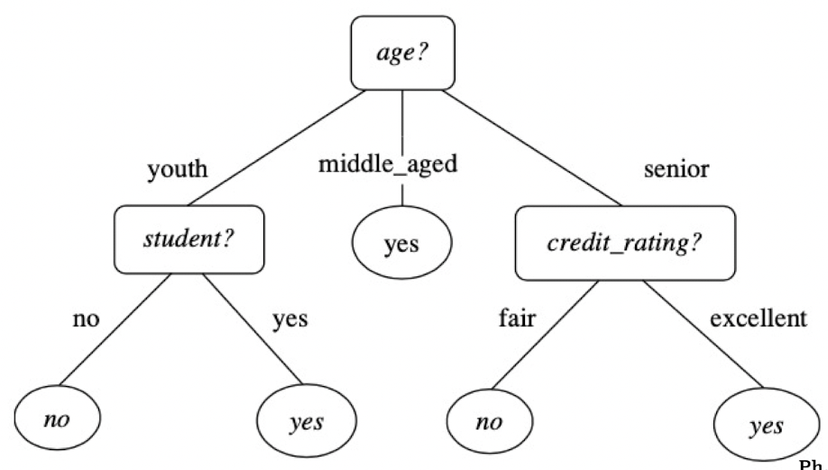

Dato un insieme di record in cui ogni record è costituito da un insieme di attributi, uno degli attributi è la classe.
**L'obiettivo dell'a*ttività di classificazione* è trovare un modello per l'attributo di classe in funzione dei valori di altri attributi.**
Ad esempio, analizzare i dati sul cancro al seno per prevedere quale dei tre trattamenti specifici dovrebbe ricevere una paziente (le etichette di classe sono "trattamento A", "trattamento B" o "trattamento C").

Ci sono due fasi:
- *fase di apprendimento* in cui viene costruito un modello di classificazione;
- *fase di classificazione* in cui il modello viene utilizzato per prevedere le etichette delle classi per determinati dati.

## Induzione dell'albero decisionale
È l'apprendimento degli [[Alberi decisionali|alberi decisionali]] dai record di formazione etichettati in classe. Un albero decisionale è una struttura ad albero in cui:
- ogni nodo interno denota un test su un attributo;
- ogni ramo rappresenta un risultato del test;
- ogni nodo foglia contiene un'etichetta di classe.

Di seguito, un esempio di albero decisionale:

## Metodo di selezione degli attributi
Il **metodo di selezione degli attributi** è una procedura per selezionare l'attributo che "meglio" discrimina le tuple date in base alla classe. Utilizza una misura di selezione degli attributi. 

Le misure popolari sono *Information Gain*, *Gain Ratio* e *Gini Index*.

La misura di selezione degli attributi fornisce un punteggio per ciascun attributo: l'attributo con il punteggio migliore per la misura viene scelto come attributo di suddivisione per le tuple date.

### Information Gain
Sia $T$ un training set e $A$ un attributo su cui vogliamo partizionare le tuple in $T$. **Information Gain** misura la qualità di una suddivisione ed è definita come la differenza tra le informazioni attese necessarie per classificare una tupla in $T$ e le informazioni attese richieste per classificare una tupla da $T$ in base al partizionamento per $A$. Possiamo scrivere questa definizione come:

> $Gain(A) = E(T) - E_A (T)$

dove $E(T)$ è l'[[Entropia|entropia]] di $T$ prima della divisione ed $E_A(T)$ è l'[[Entropia|entropia]] di $T$ dopo la divisione su $A$. L'attributo $A$ con il maggior guadagno di informazioni (*Gain(A)*) viene scelto come attributo di suddivisione.

Facciamo un esempio partendo dal seguente training set:

> *Gain(age) = 0.247;\
> Gain(income) = 0.029;\
> Gain(student) = 0.152;\
> Gain(credit_rating) = 0.048;*

Poiché *age* ha il maggiore guadagno di informazioni tra gli attributi, viene selezionato come attributo di suddivisione. Quindi:

### Gini Index
**Gini Index** misura l'impurità di T e la possiamo definire come:

> $Gini(T) = 1 - 
sum^m_{i=1} p_i^2$

*Gini Impurity* misura la bontà di una scissione, definita come:

> $\Delta Gini(A) = Gini(T) - Gini_A(T)$

L'attributo che massimizza la *Gini Impurity* è selezionato come attributo di scissione.