I classificatori basati sull'istanza, a differenza degli altri classificatori, non utilizzano una serie di esempi pre-classificati per apprendere un modello.

Al contrario, lo usano, al momento della classificazione, per prevedere "al volo" l'etichetta di classe di istanze invisibili, basata sulla somiglianza.

Sono chiamati **classificatori pigri**, poiché non passano attraverso la fase di addestramento, al contrario dei **classificatori entusiasti** (come alberi decisionali, regole di classificazione, classificatori probabilistici, ecc.).

## Classificatori *K-Nearest Neighbor* (*k-NN*)
L'esmepio di partenza è che *se cammina come un'anatra, cigola come un'anatra, allora probabilmente è un'anatra*.

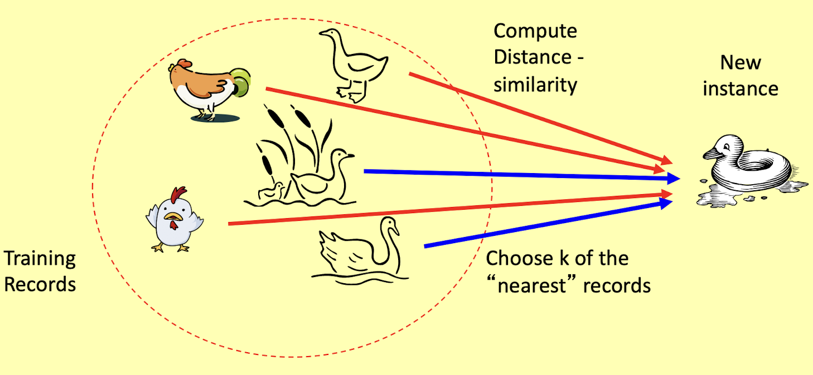

Abbiamo:
- un insieme di istanze preclassificate;
- una metrica di distanza/somiglianza;
- il valore di $k$, il numero di vicini più prossimi da recuperare.

Per classificare un'istanza invisibile $X$:
1. calcola la distanza/somiglianza di $X$ con tutti gli esempi;
2. identifica $k$ vicini più vicini (distanza minima, somiglianza massima);
3. usa le etichette di classe di $k$ vicini più vicini per determinare l'etichetta di classe dell'istanza invisibile (ad esempio, prendendo il voto di maggioranza).

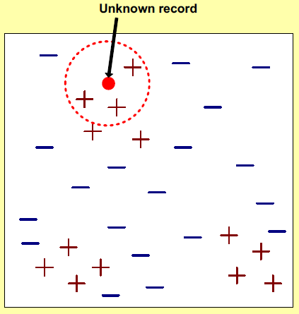

### Distanza euclidea (punto 1)
Calcola la distanza tra due punti tramite la formula:

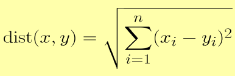

dove: 
- $x=<x_1,...,x_n>$ e $y=<y_1,...,y_n>$ sono due esempi;
- $n$ è il numero dei loro attributi;
- $x_i$ e $y_i$ i valori degli $i$-esimi attributi di $x$ e $y$.

Le distanze euclidee si applicano solo agli attributi numerici e l'inconveniente è che l'elemento con la scala più grande domina gli altri.

Supponiamo di voler classificare le persone in base alla loro *altezza* e al loro *peso*. Nel dettaglio: 
- l'*altezza* ha una bassa variabilità (da 1,5 a 2,0 metri);
- il *peso* ha una maggiore variabilità (da 50 a 150 kg);
- la misura di prossimità è dominata dal peso, a meno che non si tenga conto della scala degli attributi.

Avremo così:

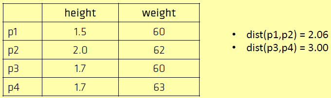

### Coefficiente di corrispondenza semplice ($SMC$) (punto 1)
Siano $X$ e $Y$ due oggetti binari (istanze):

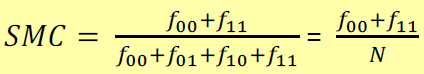

dove: 
- $f_{ij}$ è il numero di attributi dove $X = i$ e $Y = j$, con $i,j \in \{0,1\}$;
- $N$ è il numero di attributi sia di $X$ che di $Y$.

$SMC$ deve essere compreso tra $0$ e $1$. Ad esempio:

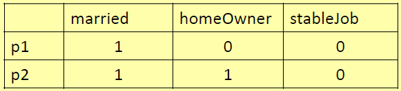

Avremo $f_{00} = 1$, $f_{01}=1$, $f_{10}= 0$ e $f_{11}=1$ ottenendo $SMC = 0,66$. Da notare che le corrispondenze 0-0 forniscono lo stesso contributo delle corrispondenze 1-1. Avremo anche **attributi simmetrici** dove entrambi i valori sono ugualmente importanti.

### Coefficiente di Jaccard (punto 1)

Ci sono casi in cui la somiglianza è determinata solo da corrispondenze 1-1 e parleremo di **attributi asimmetrici** dove i valori non sono ugualmente importanti.
La somiglianza di due documenti dipende dalla presenza delle stesse parole (1-1), non dalla loro assenza (0-0). Ad esempio:

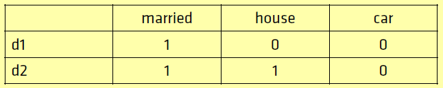

L'assenza di una parola come *car* in entrambi i documenti non è motivo di somiglianza. Al contrario, la contemporanea presenza di *married* è un indizio di somiglianza.

Il **coefficiente di Jaccard** è utilizzato per stimare la somiglianza di oggetti dati con dati binari, ad esempio documenti. Matematicamente:

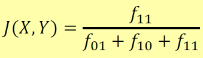

Informalmente, $J$ è l'$SMC$ applicato agli oggetti con attributi asimmetrici. $J$ deve essere compreso tra $0$ e $1$: se $J=1$ se i due oggetti sono identici. Nell'esempio precedente, $J = 0.5$ invece di $0.66$ se consideriamo le caratteristiche del documento come attributi simmetrici.

### Somiglianza del coseno (punto 1)
Utilizzato per stimare la somiglianza dei documenti (con rappresentazione sia binaria che basata sulla frequenza). Dati due vettori $d_1$ e $d_2$ di attributi (che rappresentano documenti), la **somiglianza del coseno** $cos(\Theta )$ è rappresentata utilizzando un prodotto scalare e una grandezza (lunghezza) come:

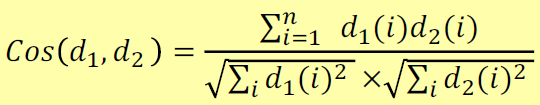

Poiché le frequenze dei termini sono positive, $cos(\Theta )$ va da $0$ a $1$, dove $1$ indica esattamente gli stessi documenti.

Si noti che, come *Jaccard*, la somiglianza del coseno è determinata dalle corrispondenze 1-1 (le corrispondenze 0-0 vengono ignorate).

Di seguito un esempio di applicazione:
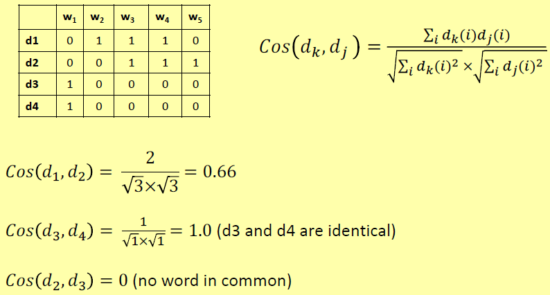

### Combinazione di somiglianze per attributi eterogenei (punto 1)
La tabella riassume le funzioni di similarità/dissomiglianza per coppie di attributi dello stesso tipo.

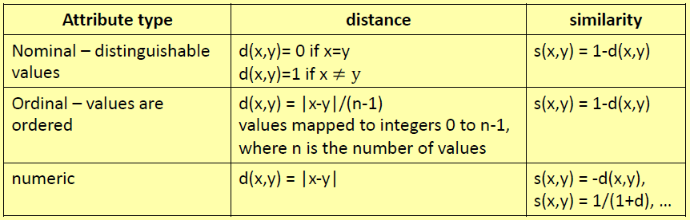

Di seguito un esempio di applicazione:

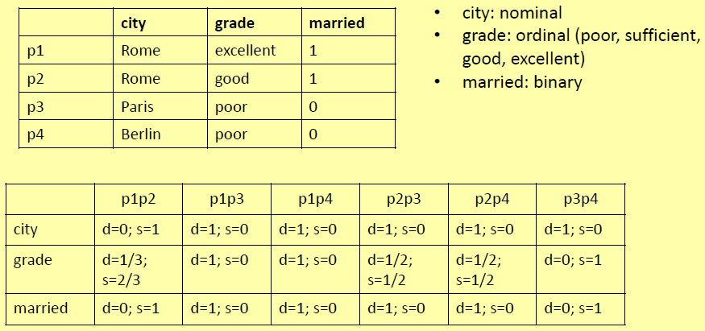

Dati due oggetti $X$ e $Y$ costituiti da $n$ valori di attributo:

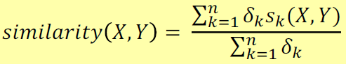

dove: 
- $n$ è il numero di attributi;
- $\delta_k = 0$ se $X_k$ e $Y_k$ sono attributi binari asimmetrici e $X_k=Y_k= 0$;
- $\delta_k = 1$ in tutti gli altri casi;
- $s_k$ è somiglianza tra $X_k$ e $Y_k$.

Ad esempio:

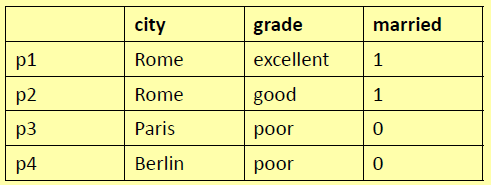

*married* è un attributo simmetrico binario, quindi $\delta_3 = 1$. *city* e *grade* non sono binari, quindi $\delta_1 = \delta_2= 1$. Sulla base dei valori di similarità riportati nella tabella precedente avremo $s(p1,p2) = 0,89$ e $s(p3,p4)= 0,66$.

### Problemi con le misure di distanza/somiglianza (punto 1)
Supponiamo che ogni esempio sia descritto in termini di 10 attributi, ma solo i primi 2 siano rilevanti per la classificazione; gli esempi con valori identici per i 2 attributi possono tuttavia essere distanti (la prossimità è dominata da attributi non rilevanti). Ad esempio:

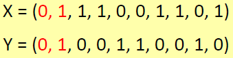

$X$ e $Y$ sono oggetti identici. Tuttavia, ad esempio, la somiglianza di Jaccard è solo $0,2$. Il **rimedio** sarebbe assegnare pesi agli attributi.

### Scelta di $k$ (punto 2)

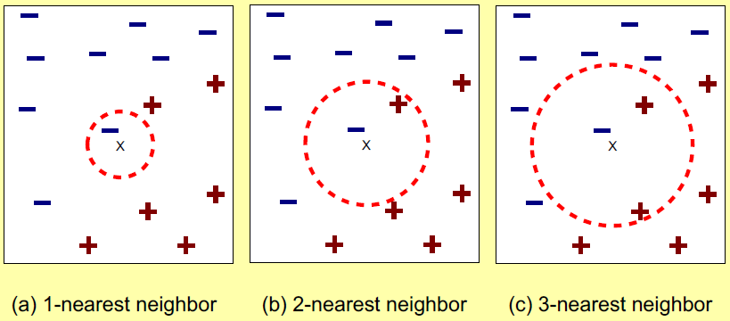

I vicini $K$ più vicini di un'istanza $X$ sono i punti dati (istanze) che hanno le $k$ distanze più piccole da $x$. Scegliendo il valore di $k$: 
- se $k$ è troppo piccolo, sensibile ai punti di rumore;
- se $k$ è troppo grande, l'intorno può includere punti di altre classi.

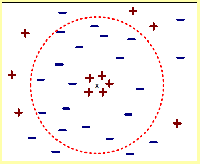

### Determinazione della classe di una nuova istanza (punto 3)
I vicini $K$ più vicini di un'istanza $X$ sono punti (istanze nel training set) che hanno le $k$ distanze più piccole da $X$ (le $k$ istanze più simili). **Cosa succede se i vicini $K$ più vicini hanno etichette di classe diverse?** Possiamo determinare la classe di una nuova istanza $X$ dai $k$ vicini più vicini *prendendo la classe maggioritaria dei vicini più prossimi* o *prendendo la classe di maggioranza ponderata dei vicini più prossimi*.

Con la **classe di maggioranza ponderata** avremo che:
- ad ogni vicino $Y$ è associato un peso $w(Y) = 1/d^2$, dove $d$ è la distanza di $Y$ da $X$;
- gli esempi lontani avranno scarso effetto sulla classe di $X$;
- prendiamo l'etichetta della classe per la quale la somma dei pesi è massima.

Ad esempio, avremo $k=3$ con 1 esempio positivo con distanza (da X) $d_1=2$, e 2 negativi, rispettivamente con distanza $d_2=3$ e $d_3=5$. Allora: 
- $w+ = 1/4= 0.25$;
- $w- = 1/9+1/25= 0.15$;
- $Vote = 0.25-0.15 >0$.

La nuova istanza $X$ è classificata positiva.

## Conclusione
I classificatori *K-Nearest Neighbor* (*k-NN*) sono **learners pigri** che:
- non costruisce modelli in modo esplicito (a differenza degli studenti desiderosi come l'induzione dell'albero decisionale e i sistemi basati su regole);
- utilizza un insieme di istanze pre-classificate insieme a metriche di similarità per classificare i dati non visti (la qualità della classificazione dipende fortemente dalla bontà delle metriche di prossimità);
- la classificazione di un'istanza di test $X$ può essere costosa in quanto deve essere calcolata la somiglianza di $X$ con tutti gli esempi di addestramento: quasi tutti i calcoli vengono eseguiti al timer di classificazione.
