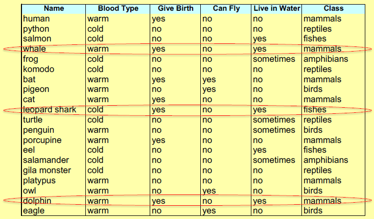
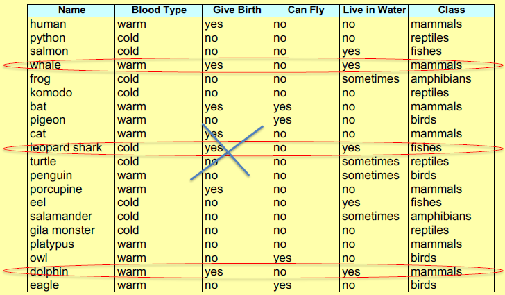
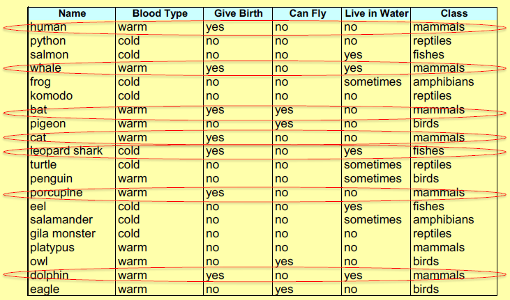
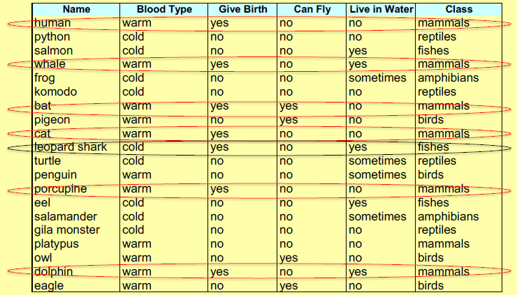
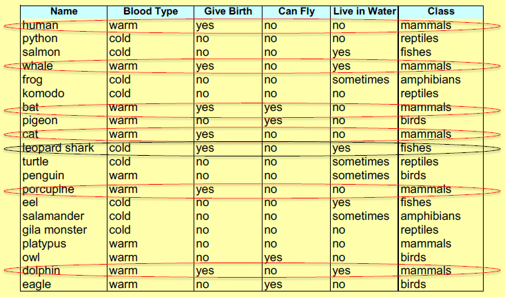

## Regole di classificazione
Un classificatore basato su regole è un insieme di regole proposizionali "if... then" della forma:

> $(condition) \rightarrow y$

come:

> *Body Temperature = warm* $\rightarrow$ **Mammal** \ 
> *Body Temperature = cool AND Gives Birth = yes* $\rightarrow$ **Mammal**

Una regola ha un **antecedente** (detto anche *condizione* o *corpo*) e un **conseguente** (detto anche *capo*). L'*antecedente* è una congiunzione di vincoli di attributo e il *conseguente* è un nome di classe.

Le regole di cui sopra sono equivalenti alla formula DNF:

> *Body Temperature = warm OR Body Temperature = cool AND Gives Birth = yes* allora **Mammal**

Mettendo le *regole di classificazione* in relazione con gli *[[Alberi decisionali|alberi decisionali]]* avremo una regola per ogni nodo foglia. 

È possibile generare regole:
- direttamente dal training set detti anche **direct learning**;
- indirettamente da un albero decisionale detti anche **indirect learning**;

## Learn-One-Rule
L'**obiettivo** di questa fase è apprendere la regola "migliore" che copre l'attuale serie di esempi. Il metodo sarebbe aumentare le regole in modo goloso basato su un approccio *general-to-specific*:
- si parte con la regola più generale, cioè quella con l’antecedente vuoto (che copre tutti gli esempi presenti nel training set ma con performance molto bassa):
    > ${} \rightarrow default class$
- aggiungi alla regola l’attributo che più migliora la performance della regola corrente (Accuracy, Information Gain);
- il processo si ripete aggiungendo un secondo attributo, e così via;
- il processo termina quando viene raggiunto un livello di performance accettabile o comunque il criterio di stop.

La *regola più generale*, ad esempio, per la classe dei mammiferi è porre la regola con antecedente vuoto come di seguito: 

> ${\} \rightarrow Mammal$

dove questa regola indica *qualunque cosa è un mammifero*: in questo modo, copre tutti gli esempi del training set ma con una regola di qualità molto scarsa.

Con questa fase, si seleziona il vincolo di attributo che aumenta maggiormente le prestazioni della regola corrente (accuratezza o altre misure, ad esempio, rango di Laplace, guadagno di informazioni di FOIL).

### Valutazione delle prestazioni
*Come misuriamo le prestazioni di una regola?* Una regola *r* **copre** un esempio *x* se l'antecedente di *r* corrisponde ai valori degli attributi di *x*. *r* è **coerente** con l'esempio *x* se copre *x* e la testa di *r* coincide con l'etichetta di classe di *x*. Ad esempio:



$Gives Birth = yes$ e $Live in water = yes \rightarrow Mammals$ copre tutti gli esempi sopra indicati.



$Gives Birth = yes$ e $Live in water = yes \rightarrow Mammals$ è coerente con gli esempi sopra indicati.

### Copertura
La proporzione di un set di dati per cui un classificatore effettua una previsione. 

> $Coverage(r) = \frac{Cov(r)}{\left | S \right |}$

dove:
- $\left | S \right |$ è il numero di esempi di addestramento;
- $Cov(r)$ è il numero di esempi coperti da *r*;
- $Coverage(r)$ è la frazione di esempi coperti da *r*, cioè la percentuale di istanze a cui si applica la condizione di una regola. Chiamata anche **Support**;

Se un classificatore non classifica tutte le istanze, può essere importante conoscere le sue prestazioni sull'insieme dei casi per i quali è abbastanza "fiducioso" da fare una previsione. Ad esempio:


$Gives Birth = yes \rightarrow Mammals$ copre tutti gli esempi sopra indicati. Quindi, $Coverage(r) = 7/20$.

### Accuratezza
Numero delle istanze correttamente classificate sul numero totale delle istanze:

> $Accuracy(r)= \frac{Cons(r)}{Cov(r)}$

dove:
- $Cons(r)$ è il numero di esempi con cui *r* è coerente, cioè corrisponde sia all'antecedente che al conseguente di *r*;
- $Accuracy(r)$ è la frazione di esempi coperti da *r* con cui *r* è consistente, cioè è una misura di quanto sia accurata la regola nel predire la classe corretta per le istanze a cui si applica la condizione della regola. Chiamata anche **Confidence**.

Ad esempio:


Quindi, $Accuracy(r) = 6/7$. L'accuratezza della regola potrebbe non essere un criterio significativo. Ad esempio:

> $r_1:$ copre 50 esempi positivi e 5 negativi quindi $Acc(r_1) = 50/55 = 90.9\%$;\ 
> $r_2:$ copre 2 esempi positivi e nessuno negativo quindi $Acc(r_2) = 2/2 = 100\%$;

Tuttavia, $r_1$ è intuitivamente "più affidabile" di $r_2$ in quanto ha una copertura maggiore.

### FOIL’s IG

> $FOIL's IG = p_1 (\log_{2}{\frac{p_1}{p_1+n_1}}-\log _{2}{\frac{p_0}{p_0+n_0}})$ 

**Information Gain di FOIL** tiene conto della copertura di una regola:
- $p_0$ (oppure $p_1$) è il numero di esempi positivi coperti dalla regola prima (oppure dopo) che venga aggiunta una nuova congiunzione;
- $n_0$ (oppure $n_1$) è il numero di esempi negativi coperti dalla regola prima (oppure dopo) che venga aggiunto un nuovo congiunto. 

Ad esempio:


Nel dettaglio, la regola iniziale $Gives Birth = yes \rightarrow Mammals$ porterà a $p_0= 6; n_0 = 1$.

Nel caso 1, la congiunzione $Body Temp = warm$ è aggiunta e quindi la regola sarà $Gives Birth = yes$ e $Body Temp = warm \rightarrow Mammals$ che porterà a $p_1= 6; n_1 = 0$ e $FOIL's IG = 1,32$.

Nel caso 2, la congiunzione $Can Fly= no$ è aggiunta e quindi la regola sarà $Gives Birth = yes$ e $Can Fly= no \rightarrow Mammals$ che porterà a $p_1= 5; n_1 = 1$ e $FOIL's IG = -0,2$.

**In conclusione, la condizione $Body Temp = warm$ è più efficace di $Can Fly= no$.**

## Regole auto-escludendi
Due regole di un classificatore si **escludono a vicenda** se nessuna istanza può attivarle entrambe. 

Se un classificatore è costituito da regole che si escludono a vicenda, un'istanza invisibile viene classificata al massimo da una regola.

Un problema di ambiguità sorge quando esistono regole che non si escludono a vicenda, in quanto un'istanza invisibile può essere assegnata a classi diverse.

## Set di regole ordinate
Per risolvere eventuali ambiguità, i classificatori (o le singole regole) vengono **ordinati** in base alla loro affidabilità. *Meno errori fa un classificatore sui dati di addestramento, più è affidabile.*

I classificatori sono ordinati in ordine decrescente di affidabilità. Quando viene presentata una nuova istanza, viene classificata dal classificatore con il punteggio più alto attivato dall'istanza.

## Classificatori esaustivi
Un classificatore è **esaustivo** se qualsiasi istanza invisibile è classificata da almeno una regola. A tal fine, un classificatore deve contenere una regola per ogni combinazione di valori di attributo.

Se un classificatore non è esaustivo, ci sono casi non visti che il classificatore non è in grado di classificare. Quindi, viene aggiunta una *regola predefinita* per coprire tutti gli esempi scoperti, come di seguito: 

> ${\} \rightarrow$ classe predefinita

Questa è una regola con l'affidabilità minima (la regola con il punteggio minimo), quindi viene attivata quando non si applica nessun'altra regola. 

La *classe predefinita* è, in generale, la classe maggioritaria di esempi di formazione non coperta da alcuna regola.

## Esclusività ed esaustività
L'ordinamento delle regole insieme alla regola predefinita garantisce sia l'esclusività che l'esaustività. Insieme, queste proprietà assicurano che ogni istanza sia classificata *esattamente da una regola*. Due regole si definiscono **regole mutualmente esclusive** se nessuna istanza può triggerarle entrambe. Se un classificatore è formato solo da queste, una nuova regola sarà classificata al massimo da una regola.

## Copertura sequenziale (*Sequential Covering*)

La **copertura sequenziale (*Sequential Covering*)** è un approccio avido che riduce il problema dell'apprendimento di un insieme di regole a una sequenza di problemi più semplici, ognuno dei quali richiede l'*apprendimento di una singola regola*.

Una volta appresa una regola *r*, tutti gli esempi coperti (sia positivi che negativi) vengono rimossi dal training set, in modo che la successiva regola generata sia diversa da *r*.

Apprende le regole fino a quando non viene soddisfatta la condizione di arresto: non può più apprendere una regola le cui prestazioni sono superiori alla soglia data.

Di seguito la sintassi in pseudocodice dell'algoritmo di *Sequential Covering*:
```
Sequential_covering (Target_attribute, Attributes, Examples, Threshold):
    Learned_rules = {}
    Rule = Learn-One-Rule(Target_attribute, Attributes, Examples)
    
    while Performance(Rule, Examples) > Threshold :
        Learned_rules = Learned_rules + Rule
        Examples = Examples - {examples correctly classified by Rule}
        Rule = Learn-One-Rule(Target_attribute, Attributes, Examples)

    Learned_rules = sort Learned_rules according to performance over Examples
return Learned_rules
```

Una delle fasi interne alla *Sequential Covering* per ottenere la regola è ***Learn-One-Rule***

## RIPPER
**RIPPER** è un acronimo che indica *Repeated Incremental Pruning to Produce Error Reduction*. L'**algoritmo RIPPER** è un algoritmo di classificazione basato su regole e deriva un insieme di regole dal training set. *È un algoritmo di induzione di regole ampiamente utilizzato.*

Funziona bene su set di dati con distribuzioni di classi sbilanciate.  In un set di dati, se disponiamo di più record di cui la maggior parte dei record appartiene a una particolare classe e i record rimanenti appartengono a classi diverse, si dice che il set di dati ha una distribuzione squilibrata della classe. 

Funziona bene con set di dati rumorosi in quanto utilizza un set di convalida per impedire l'overfitting del modello.

## Conclusione
In sintesi, quando una nuova istanza viene presentata al classificatore:
- viene assegnato all'etichetta di classe della regola con il punteggio più alto che ha attivato;
- se nessuna delle regole viene attivata, viene assegnata alla classe predefinita.

I vantaggi dei classificatori basati su regole sono:
- altamente espressivi come gli [[Alberi decisionali|alberi decisionali]];
- facile da interpretare;
- può classificare rapidamente nuove istanze;
- prestazioni paragonabili agli [[Alberi decisionali|alberi decisionali]].
