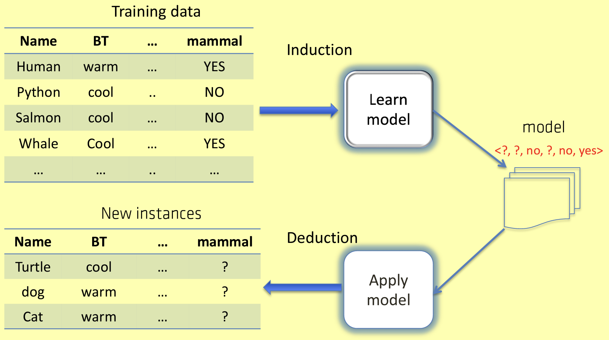
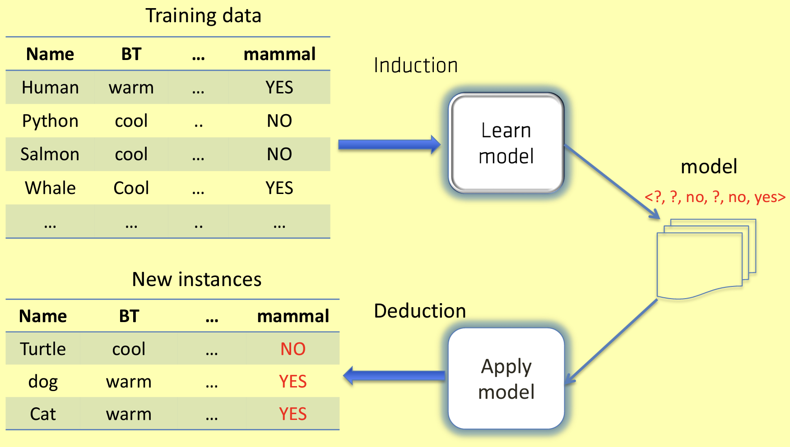
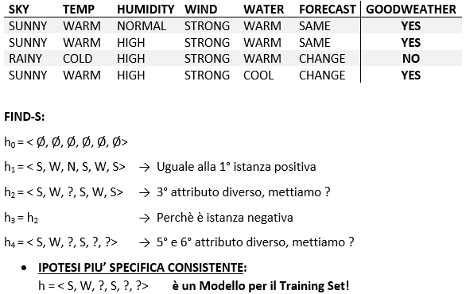
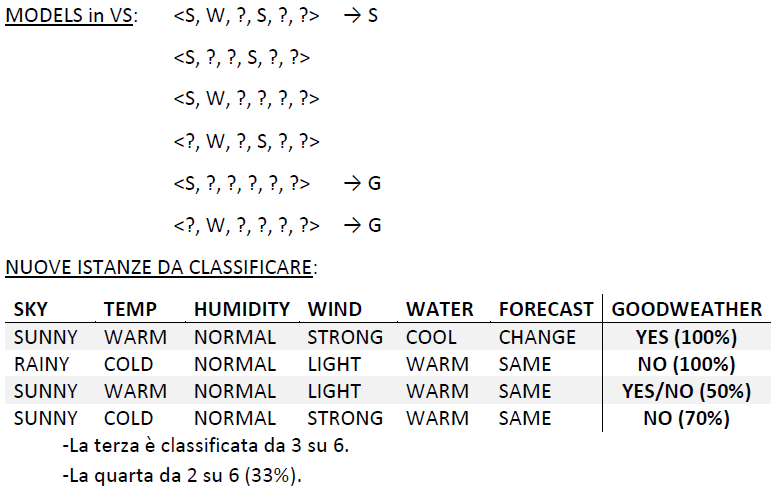

Concept Learning è il compito di indurre automaticamente la definizione generale (*modello*) di un concetto da un insieme di esempi.

Un *modello* può anche essere considerato come una correlazione tra i valori dell'attributo, da un lato, e il valore dell'attributo obiettivo, dall'altro classificazione.

Il modello appreso (o modello) può essere utilizzato sia per scopi *descrittivi* che *predittivi* (ad esempio, classificazione).

## Classificazione
Una volta appreso un concetto, possiamo utilizzare il modello per **classificare** nuove istanze.

La **classificazione (classification))** è il compito di assegnare un'etichetta di classe a una nuova istanza in base ai suoi valori di attributo, ad esempio:
- assegnare un'etichetta “mammifero” o “non-mammifero” a un'istanza che rappresenta un essere vivente;
- assegnare un'etichetta “affidabile” o “non affidabile” a un'istanza che rappresenta un cliente di una banca;
- assegnare un articolo di giornale a un argomento (sport, politica, scienza, ..).

La classificazione è un'attività predittiva, in quanto consente di prevedere l'etichetta di una **nuova** istanza in base alle istanze **passate**.

## Spazio delle ipotesi
L'**ipotesi** è una possibile rappresentazione della funzione obiettivo.

Il **linguaggio delle ipotesi** è la rappresentazione matematica delle ipotesi – ad esempio, espressioni proposizionali sui valori degli attributi (congiunzioni, disgiunzioni, ecc.).

Lo **spazio delle ipotesi** e l'insieme di tutte le possibili ipotesi (ad esempio, l'insieme di  tutte le formule proposizionali esprimibili nella lingua data).

## Definizione del problema e approccio Naive
Dato il training set $S = \{<e, f(e)>\}$, e lo spazio delle ipotesi *H*, impara da *S* un'ipotesi in $h \in H$ che è un modello per *S*, cioè *h* è consistente con gli esempi in *S*.

Immaginiamo un *approccio Naive*:
- **Input:** training set $S = \{<e, f(e)>\}$, spazio delle ipotesi *H*;
- **Begin:** ricerca Naive: 
    - per ogni esempio di addestramento $\{<e, f(e)>\}$ in *S*, rimuovi da *H* ogni ipotesi *h* per la quale $h(e) != f(e) – h$ non è effettivamente coerente con *S*;
    - **Output:** *H* come set di modelli (possibilmente vuoto);
- **End**

L'output sarà costituito da tutte le ipotesi che non sono state rimosse e, quindi, sono coerenti con il training set.

L'approccio Naive è in generale **inefficiente** perché richiede di enumerare in modo esaustivo tutte le ipotesi in *H* per ogni esempio di addestramento. *Il rimedio è sfruttare l'ordine parziale tra le ipotesi.*

## Ordinare lo spazio delle ipotesi
Date due ipotesi *h* e *g*, $h \geq g$ (si legge come **“*h* è più generale di *g*“** o “*g* è più specifico di *h*”), se:

> $g(x)=yes \rightarrow h(x)=yes$, per ogni istanza *x*

cioè, se *x* soddisfa *g*, allora anche *x* soddisfa *h*, cioè se *x* è classificato come positivo da *g* allora è classificato come positivo da *h*. Intuitivamente, *h* **copre** più istanze di *g*.

In generale, avremo:
- $h \geq g$, con $h=<a_{1},...,a_{n}>, g=<b_{1},...,b_{n}>$, se $a_{i}=?$ oppure $a_{i}=b_{i}$ per ogni $i=1,n$;
- dato $h_{1}=<a,b,?,?,?,?>, h_{2}=<a,b,c,?,?,?>, h_{3}=<x,y,z,w,?,e>$, avremo che $h_{1} \geq h_{2}$ e $h_{3}$ è incomparabile sia con $h_{1}$ che con $h_{2}$;
- possiamo generalizzare un'ipotesi semplicemente sostituendo alcuni valori di attributo con "?", per esempio:
    > $<a,b,c,d,?,?>\rightarrow <a,?,?,d,?,?>$
- $g=<?, ?, ?, ?, ?, ?>$ è l'ipotesi più generale, non importano i valori, quindi *h* è **soddisfatta** da qualsiasi esempio (classifica come positive tutte le istanze);
- $s=<\phi , \phi , \phi , \phi , \phi , \phi >$ è l'ipotesi più specifica, *h* non è **soddisfatta** da nessun esempio;
- $(H,\geq )$ è un **ordine parziale** (proprietà riflessive, antisimmetriche e transitive);
- date due ipotesi *h* e *h'*, possiamo trovare una nuova ipotesi *g* che le generalizza entrambe;
- per esempio, $g = <?,?,c,?,?,?>$ è più generale di $h=<a,b,c,d,?,?>$ e $h' = <x,y,c,d ,?,z>$;
- un'ipotesi *g* è una **generalizzazione minima** sia di *h* che di *h'* se non esiste ipotesi più generale di entrambe *h* e *h'* e più specifica di *g*.

## Algoritmo Find-S
L'algoritmo *Find-S*, dove *S* sta per specifico, è il seguente:
- **Input:** il training set *S*; lo spazio $(H,\geq )$ di tutte le possibili congiunzioni sugli esempi in *S*;
- **Begin:** 
    - $h=<\phi , \phi , \phi , \phi , \phi , \phi >$;
    - per ogni esempio positivo *e* in *S*, se e non soddisfa *h*, allora esegui una generalizzazione minima di *h* che è soddisfatta da *e*;
    - se c'è qualche esempio negativo che soddisfa *h*, allora l'**Output** sarà "nessun modello congiuntivo esiste";
    - altrimenti, l'**Output** sarà che *h* è un modello;
- **End**

Facendo un riepilogo, **partendo dall'ipotesi più specifica, prende in esame tutti gli esempi positivi, uno alla volta**.

Ad ogni passaggio, trova la successiva ipotesi più generale coerente con l'esempio positivo attuale (e con quelli precedenti).

Dopo aver esaminato tutti gli esempi positivi, emette l'ipotesi **più specifica** *h* che è coerente con tutti gli esempi positivi (possibilmente $<?,...,?>$). 

**Se h non copre alcun esempio negativo, allora *h* è un modello: altrimenti non esiste alcun modello congiuntivo.**

Un esempio di utilizzo dell'algoritmo è il seguente:

## Version Space

Dato uno spazio delle ipotesi *H* e un insieme di addestramento *S*, la **version space** $VS_{H,S}$ è l'insieme di tutte le ipotesi in *H* coerenti con *S*:

> $VS_{H,S} = \{h \in  H | consistent(h,S)\}$

*Candidate Elimination* è una generalizzazione di *Find-S* in grado di calcolare il *Version Space*: esplora sia gli esempi positivi che negativi, se non esiste un modello congiunto, viene restituito un $VS$ vuoto e se esiste un unico modello, allora i boundaries $S$ e $G$ convergono ad una singola ipotesi.

### Classificazione
Le regole per la classificazione di nuovi esempi usando il $VS$ sono: 
- se la nuova istanza soddisfa l’ipotesi più specifica nel VS, allora soddisfa tutte le ipotesi in $VS$, possiamo classificarla come $confidence = 100Sw$;
- se una nuova istanza NON soddisfa nessuna delle ipotesi generali nel $VS$, possiamo classificarla come *negativa* con $confidence = 100Sw$;
- se l’istanza è classificata positiva (o negativa) da alcune ipotesi nel $VS$ , possiamo classificarla come *positiva* (o *negativa*) ma con una $confidence < 100Sw$.

Un esempio di utilizzo della classificazione è il seguente:

## Disjunctive Normal Form (DNF)

Un'ipotesi **Disjunctive Normal Form (DNF)** è una disgiunzione di congiunzioni di vincoli di attributo. Le formule DNF consentono di sfruttare tutta la potenza espressiva del calcolo proposizionale, ovvero sono in grado di rappresentare ogni concetto insegnabile. Lo spazio delle ipotesi DNF è **completo**: per ogni training set esiste un modello DNF, possibilmente banale. Un banale DNF è una descrizione “precisa” del training set senza capacità di generalizzazione.
