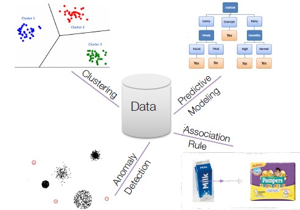
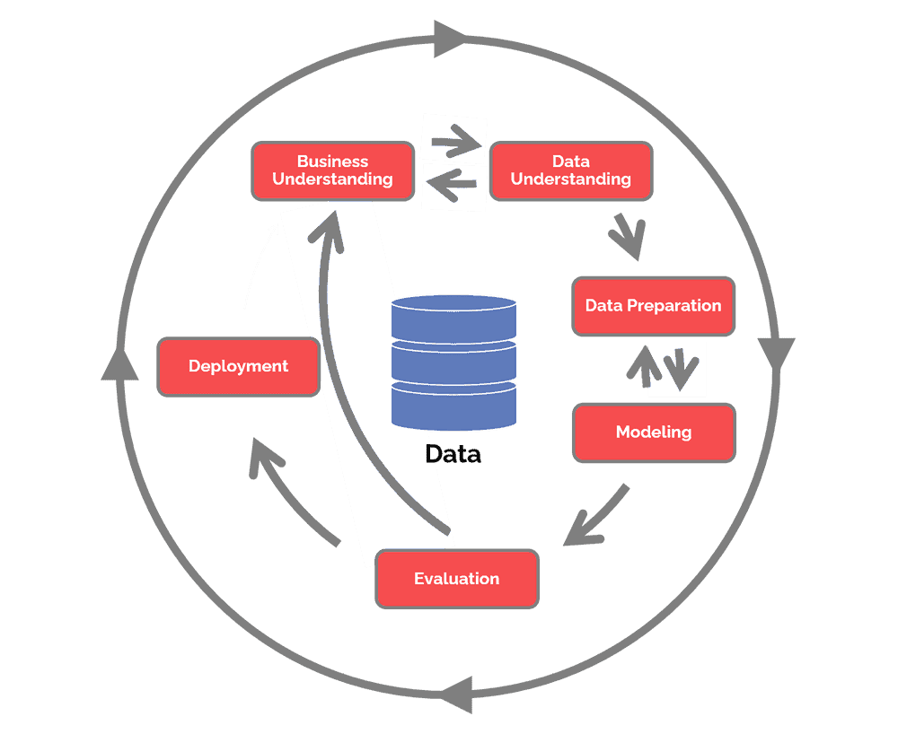
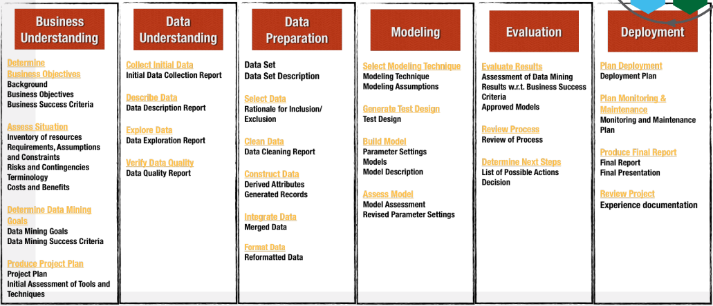

## Concetti base su Data Mining (DM)

Ci sono enormi quantità di dati disponibili grazie ai rapidi progressi nella raccolta dei dati e nella tecnologia di archiviazione. Questi dati non hanno valore finché non estraiamo informazioni utili. Sono assolutamente necessari strumenti potenti e versatili per scoprire automaticamente informazioni preziose dall'enorme quantità di dati e per trasformare tali dati in conoscenza. Questa necessità ha portato alla nascita del **Data Mining**.

Il processo di scoperta automatica di informazioni utili, ad esempio:
- **conoscenze** è la comprensione dei fenomeni che producono i dati osservati;
- **modelli** sono insiemi matematici e logici di funzioni;
- **pattern** sono regolarità riconoscibili all'interno dei dati, i cui elementi si ripetono in modo prevedibile.

In generale, le attività di DM sono suddivise in due categorie principali:
- **predittivo:** sfrutta alcune variabili per prevedere i valori sconosciuti di una particolare variabile;
- **descrittivo:** deriva modelli che riassumono le relazioni sottostanti nei dati.

La *modellazione predittiva* si riferisce al compito di costruire un modello per la variabile target in funzione della variabile indipendente. Esistono due tipi di attività di *modellazione predittiva*: **classificazione** e **regressione**.

L'obiettivo della *classificazione* è trovare un modello per l'attributo di classe in funzione dei valori di altri attributi. L'*attività di regressione* mira a prevedere un valore di una data variabile continua in base ai valori di altre variabili.

L'*analisi di associazione* mira a scoprire modelli che descrivono caratteristiche fortemente associate nei dati. I pattern scoperti sono tipicamente rappresentati sotto forma di regole di implicazione.

L'obiettivo dell'*analisi dei cluster* è trovare gruppi di osservazioni strettamente correlate in modo che le osservazioni che insieme allo stesso cluster siano più simili tra loro rispetto alle osservazioni che appartengono ad altri cluster.

Il *rilevamento delle anomalie* è il compito di identificare le osservazioni le cui caratteristiche sono significativamente diverse dal resto dei dati.

**In sintesi, il *Data Mining (DM)* estrae conoscenza dai dati per aiutare le persone a prendere decisioni.** *Come eseguire il DM?* Tramite la **metodologia CRISP-DM**.

## Concetti base su metodologia CRISP-DM

L'acronimo CRISP-DM sta per *CRoss Industry Standard Process for Data Mining* e la sua metodologia è divisa in diverse fasi:

- **Business Understanding (comprensione aziendale):** comprensione degli obiettivi e dei requisiti del progetto, definizione del problema di DM e piano preliminare progettato per raggiungere gli obiettivi;
- **Data Understanding (comprensione dei dati):** raccolta dati iniziale e familiarizzazione, identificare problemi di qualità dei dati e risultati iniziali e ovvi;
- **Data Preparation (preparazione dei dati):** coinvolgere tutte le attività per costruire il dataset finale dai dati grezzi iniziali, selezione di record e attributi e pulizia e consolidamento dei dati;
- **Modellazione (modeling):** eseguire le tecniche di DM;
- **Valutazione (evaluation):** determinare se i risultati soddisfano gli obiettivi aziendali ed identificare i problemi aziendali che avrebbero dovuto essere risolti in precedenza;
- **Distribuzione (deployment):** metti in pratica i modelli risultanti e configurali per l'estrazione ripetuta/continua dei dati.

