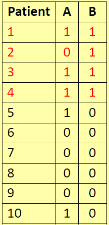
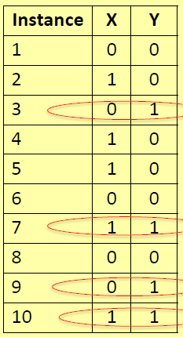
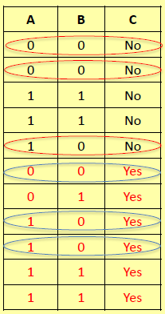
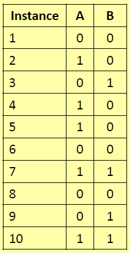

## Probabilità condizionale
La probabilità condizionata $p(A|B)$ è la probabilità dell'evento $A$ dato che l'evento $B$ si è verificato. Ad esempio:
- $A$ rappresenta l'evento “un paziente ha una malattia del fegato”;
- $B$ rappresenta l'evento “un paziente è un alcolista”;
- $p(A|B)$ è la probabilità per una persona di avere una malattia del fegato dato che è un alcolista.

Allora:

> $p(A|B) = \frac{p(A,B)}{p(B)}$

dove:
- $A$: un paziente ha una malattia al fegato;
- $B$: un paziente è un alcolista.

quindi (in riferimento alla seguente tabella):

> $p(A=1 | B=1) = \frac{p(A=1,B=1)}{p(B=1)} = 0,75$

## Indipendenza ed esclusività reciproca
$A$ è **indipendente** da $B$ se $p(A|B) = p(A)$. Se $A$ indipendente da $B$, allora $B$ indipendente da $A$, cioè $p(A|B) = p(A) \rightarrow p(B|A) = p(B)$. $A$ e $B$ si **escludono a vicenda** se $p(A|B) = p(B|A) = 0$ cioè non possono verificarsi contemporaneamente.

Ad esempio:

$X=1$ e $Y=1$ sono eventi indipendenti, in quanto la probabilità di $X=1$ non è influenzata dalla condizione $Y=1$. Allora:
- $p(X=1) = 0.5$;
- $p(X=1|Y=1) = 0.5$.

## Probabilità congiunta
Dalla definizione di probabilità condizionata avremo $p(A,B) = p(A|B)p(B)$. Se $A$ e $B$ sono indipendenti, cioè $p(A|B) = p(A)$, allora $p(A,B) = p(A)p(B)$. Se $A$ e $B$ si escludono a vicenda, cioè $p(A|B) = 0$, allora $p(A|B) = 0$. Ad esempio:

La probabilità congiunta $p(A=1,B=1)$ è stimata come $p(A=1,B=1)*p(B=1) = \frac{3}{10}$.

Nota che  $p(A=1,B=1) \neq p(A=1)*p(B=1) = \frac{1}{5}$.

In effetti, "essere alcolizzati" e "malattie del fegato" NON sono eventi indipendenti.

## Indipendenza condizionale
$X$ e $Y$ sono **condizionatamente indipendenti**, dato $Z$, se $p(X|Y,Z) = p(X|Z)$. Se $X$ e $Y$ sono condizionatamente indipendenti, allora $p(X|Y,Z) = p(X|Z)p(Y|Z)$. In generale, se $X_1, ..., X_n$ sono condizionatamente indipendenti, dato $Z$, allora $p(X_1, ..., X_n|Y,Z) = p(X_1|Z)...p(X_n|Z)$. Ad esempio:

Gli eventi $A=0$ e $B=0$ sono condizionatamente indipendenti quando $C=Yes$, come $p(A=0|B=0,Y) = \frac{1}{3} = p(A=0|Y)$. La probabilità $p(A=0, B=0|Y)=\frac{1}{6}$ può quindi essere stimata come prodotto di probabilità $p(A=0|Y)*p(B=0|Y) = \frac{1}{6}$. $A=0$ e $B=0$ NON sono indipendenti quando $C=No$ come $p(A=0 | B=0, N)=\frac{2}{3}$ e $p(A=0|N) = \frac{2}{5}$.

## Addition Law
La probabilità che si **verifichino** $A$ o $B$ è $p(A + B) = p(A) + p(B) - p(A, B) = p(A) + p(B) - p(A|B) p(B)$. Se $A$ e $B$ si **escludono a vicenda**, cioè $p(A|B) = 0$, allora $p(A + B) = p(A) + p(B)$. Se $A$ e $B$ sono **indipendenti**, cioè $p(A|B) = p(A)$, allora $p(A + B) = p(A) + p(B) - p(A)p(B)$. Ad esempio:

Avremo $p(A=1 + B=1) = p(A=1) + p(B=1) - p(A=1,B=1)$. Poiché $A=1$ e $B=1$ sono eventi indipendenti, allora $p(A=1,B=1) = p(A=1)*p(B=1) = \frac{1}{5}$. Quindi $p(A=1 + B=1) = \frac{7}{10}$.

## Probabilità totale
Sia $B = {B1, ... ,Bn}$ una variabile aleatoria, dove $p(B_1) + ... + p(B_n) = 1$. Per qualsiasi evento $X$, $p(X) = p(X|B_1)p(B_1) + ... + p(X|B_n)p(B_n)$. Se $X$ è **indipendente** da $B_1,...,B_n$ allora $p(X) = p(X)p(B_1) + ... + p(X)p(B_n)$. Se $X$ è **mutualmente esclusivo** con $B1, ..., Bn$ allora $p(X)=0$.

Ad esempio, ci vengono date due ciotole, $B1$ contenente 20 palline rosse e 10 nere, e $B2$ con 8 palline rosse e 8 nere. Maria sceglie una pallina a caso. Qual è la probabilità che la pallina sia rossa, assumendo $p(B1)=0.3$ e $p(B2)=0.7$?

> $p(red) = p(red|B1) p(B1) + p(red|B2) p(B2)$ dove: 
> - $p(red|B1) = 0.66$;
> - $p(red|B2) = 0.5$.
> 
> Quindi $p(red) = 0.55$.

## Teorema di Bayes
Per definizione di probabilità condizionata:

> $p(A|B) = \frac{p(A,B)}{p(B)}$ (1) \
> $p(B|A) = \frac{p(A,B)}{p(A)}$ (2) 

da cui:

> $p(A|B) = \frac{p(B|A)p(A)}{p(B)}$

Da qui la formula di Bayes:

> $p(A|B) = \frac{p(B|A)p(A)}{p(B)}$

Dove
- $p(A)$ è detta probabilità a priori di $A$, in quanto non tiene conto di alcuna informazione riguardante $B$;
- $p(A|B)$ è la probabilità condizionata di $A$ dato $B$; detta anche probabilità a posteriori di $A$, in quanto dipende da $B$;
- $p(B)$ è la probabilità a priori di $B$;
- $p(B|A)$ è la probabilità condizionata di $B$ dato $A$.

Ad esempio, una clinica è interessata a scoprire la probabilità che un paziente abbia una malattia del fegato dato che è un alcolista cioè:

> $p(L|A)$

dove $L$ indica "il paziente ha una malattia al fegato" e $A$ indica "il paziente è un alcolista".

I dati passati ce lo dicono
- il 15% dei pazienti che entrano in clinica ha una malattia epatica, cioè $p(L) = 0,15$;
- il 10% dei pazienti della clinica sono alcolisti, cioè $p(A) = 0,10$;
- tra i pazienti con diagnosi di malattia epatica, il 20% sono alcolisti, cioè $p(A|L) = 0,20$.

Quindi, abbiamo:

> $p(L|A) = 0,2 * 0,15/0,10 = 0,30$

Cioè, essere alcolizzati aumenta notevolmente la probabilità di avere una malattia del fegato.

Un altro esempio è il seguente: ci vengono date due ciotole, B1 contenente 20 palline rosse e 10 nere, e B2 con 8 palline rosse e 8 nere. Maria sceglie una pallina a caso. La palla risulta essere rossa (evento). Qual è la probabilità che sia stato estratto dalla ciotola B1?
- $p(B1|red)$ da stimare;
- assumiamo probabilità a priori $p(B1) = p(B2) = 0.5$;
- dai teoremi di probabilità totale e di Bayes: 
    > $p(B1|red) = \frac{p(red|B1)p(B1)}{p(red|B1)p(B1) + p(red|B2)p(B2)}$
- $P(red|B1) = \frac{20}{30} = \frac{2}{3} = 0.66$;
- $P(red|B2) = \frac{8}{16} = 0.5$;
- quindi otteniamo $p(B1|red) = 0.57$;
- prima di osservare la pallina, la probabilità assegnata a Maria per aver scelto la ciotola $B1$ era la probabilità a priori, che era $0,5$. Dopo aver osservato la pallina rossa, dobbiamo rivedere la nostra convinzione come $p= 0,57$.
