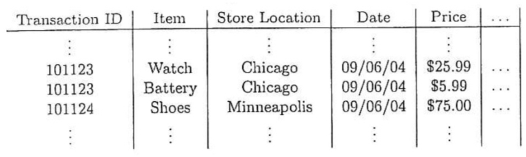
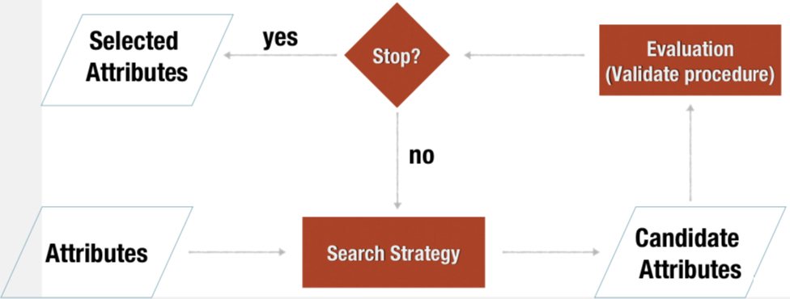

Questa fase della metodologia CRISP-DM è suddivisa in ulteriori fasi:
- **data cleaning:** compila i valori mancanti, identifica e rimuovi il rumore, correggi le incoerenze;
- **data integration:** unire i dati da più fonti;
- **data transformation:** normalizzazione;
- **data reduction:** ottenere una rappresentazione ridotta in volume (che produce risultati statistici simili);
- **data discretization:** a volte richiesto da algoritmi di classificazione o problemi di costo computazionale.

## Qualità dei dati
I dati nel mondo reale sono sporchi in diverso modo:
- **incompleto:** mancano i valori degli attributi, mancano alcuni attributi di interesse o contengono solo dati aggregati;
- **inesatti o rumorosi:** contenenti errori o valori che si discostano da quanto previsto (valori anomali);
- **incoerente:** contenente discrepanze nei codici o nei nomi.

## Pulizia dei dati (data cleaning)
Il rilevamento e la correzione dei problemi di qualità dei dati è spesso chiamato **pulizia dei dati**
 
La pulizia dei dati tenta di *riempire i valori mancanti*, *identificare e rimuovere il rumore* oppure *correggere le incoerenze*.

### Dati con rumore
Il **rumore** è un errore casuale o una varianza in una variabile misurata. Ci sono molte possibili ragioni per dati imprecisi:
- strumenti di raccolta dati difettosi;
- errori umani o informatici verificatisi durante l'inserimento dei dati;
- limitazioni tecnologiche;
- convenzione di denominazione incoerente.

### Dati mancanti
I dati potrebbero non essere sempre disponibili per vari motivi:
- per esempio, molte tuple non hanno valore registrato per diversi attributi, come le informazioni sui clienti per i dati di vendita;
- i dati potrebbero non essere inclusi perché non erano considerati importanti al momento dell'inserimento;
- i dati che erano incoerenti con altri dati registrati potrebbero essere stati cancellati;
- i dati potrebbero non essere registrati a causa di incomprensioni o malfunzionamenti dello strumento;
- i dati incompleti possono essere dovuti alla mancata registrazione della cronologia dei dati o alla modifica dei dati.

*Come gestire i dati mancanti?*
- ignorare i valori mancanti;
- inserire manualmente il valore mancante;
- sa una costante globale per riempire il valore mancante;
- stima i valori mancanti utilizzando l'attributo *mean/mode* per inserire il valore mancante oppure utilizzare il *valore più probabile* per inserire il valore mancante.

## Generalizzazione delle fasi della preparazione dei dati

Nel tempo, si sono evolute le varie fasi della preparazione dei dati:
- aggregazione;
- campionamento;
- riduzione della dimensionalità;
- creazione funzionalità;
- discretizzazione e binarizzazione;
- trasformazione degli attributi.

### Aggregazione
*L'**aggregazione** è l'unione di due o più oggetti in un unico oggetto.*
L'operazione di aggregazione dipende dal tipo di attributo (ad esempio, gli attributi quantitativi sono generalmente aggregati prendendo una somma o una media, gli attributi qualitativi possono essere omessi o riepilogati).

Viene utilizzata per diversi scopi:
- la riduzione dei dati richiede meno memoria e tempi di elaborazione;
- cambio di scala fornendo una vista di alto livello dei dati invece di una vista di basso livello;
- dati più stabili (i dati aggregati hanno una minore variabilità rispetto ai singoli oggetti).

Facciamo un esempio: 

Le transazioni di un singolo negozio possono essere sostituite con una singola transazione a livello di negozio.

### Campionamento
*Il **campionamento** viene comunemente utilizzato per selezionare un sottoinsieme degli oggetti dati da analizzare.*
Spesso utilizzato sia per l'indagine preliminare dei dati che per l'analisi finale dei dati.

Il principio chiave è che l'utilizzo di un campione funzionerà quasi quanto l'utilizzo dell'intero set di dati se il campione è rappresentativo.
Un campione è rappresentativo se ha approssimativamente le stesse **proprietà statistiche** dell'insieme originale.

Abbiamo diversi approcci:
- *campionamento casuale semplice:* esiste un'uguale probabilità di selezionare un elemento particolare;
- *campionamento senza sostituzione:* quando ogni oggetto viene selezionato, viene rimosso dall'insieme di tutti gli oggetti;
- **campionamento con sostituzione:** gli oggetti non vengono rimossi dall'insieme di tutti gli oggetti in quanto vengono selezionati per il campione. Lo stesso oggetto può essere prelevato più di una volta;
- **campionamento stratificato:** inizia con gruppi di oggetti prespecificati e quindi preleva campioni casuali da ciascun gruppo. Dimensione/percentuale fissa per ogni gruppo.

### Campionamento progressivo
La corretta dimensione del campione può essere difficile da determinare, quindi a volte vengono utilizzati schemi di **campionamento progressivi**. Si inizia con un piccolo campione e, quindi, aumenta la dimensione del campione fino a ottenere un campione di dimensioni sufficienti.

Questo approccio elimina la necessità di determinare inizialmente la dimensione corretta del campione, ma richiede che ci sia un modo per valutare il campione per giudicare se è abbastanza grande.

Ad esempio, stimiamo l'aumento dell'accuratezza di un modello predittivo quando si aumenta la dimensione del campione e ci fermiamo quando l'aumento della precisione si stabilizza.

### Riduzione della dimensionalità
Il set di dati può avere un numero elevato di attributi: molti algoritmi di data mining funzionano meglio se la dimensionalità è inferiore.

*La **riduzione della dimensionalità** può eliminare caratteristiche irrilevanti e ridurre il rumore.*

Quindi, con l'aumentare della dimensionalità, i dati diventano scarsi con il rischio di produrre risultati di bassa qualità con dati dimensionali elevati.

In questo modo, si deve ottenere una rappresentazione ridotta del set di dati che è molto più piccolo in volume ma che produce comunque **buoni risultati analitici**.

I vantaggi della riduzuone della dimensionabilità sono:
- evitare la maledizione della dimensionalità;
- ridurre la quantità di tempo e di memoria richiesta dagli algoritmi di data mining;
- elimina le caratteristiche irrilevanti e riduci il rumore;
- produrre modelli più comprensibili;
- consente di visualizzare più facilmente i dati.

Possiamo distinguere due approcci:
- **selezione di sottoinsiemi di funzionalità** dove tilizziamo solo un sottoinsieme delle funzionalità. Spesso ci sono caratteristiche ridondanti e irrilevanti. Alcune funzionalità possono essere rimosse immediatamente utilizzando il buon senso o il dominio della conoscenza ma è necessario un approccio più sistematico per selezionare il miglior sottoinsieme di funzionalità. Abbiamo diversi approcci: 
    - approcci incorporati;
    - approcci filtro;
    - approcci wrapper;
    
- **tecniche di algebra lineare** dove abbiamo: 
    - analisi dei componenti principali;
    - scomposizione di un valore singolo.

### Creazione funzionalità
È costituito da 4 componenti principali:
- una misura di qualità (per valutare i sottoinsiemi di funzionalità);
- una strategia di ricerca (l'approccio da utilizzare);
- un criterio di arresto;
- una procedura di convalida.

I metodi filtro e quelli wrapper differiscono solo nel modo in cui valutano il sottoinsieme.

In questa fase, si va a creare nuovi attributi in grado di acquisire le informazioni importanti in un set di dati in modo molto efficiente rispetto agli attributi originali.

Le metodologie generali sono:
- *FeatureExtraction*;
- mappatura dei dati nel nuovo spazio;
- integrare la conoscenza da altre fonti di dati;
- costruzione delle caratteristiche combinando le caratteristiche.

### Discretizzazione e binarizzazione

Molti algoritmi di classificazione richiedono attributi categoriali e gli algoritmi che trovano pattern spesso richiedono attributi binari.

La soluzione sono la **discretizzazione** e la **binarizzazione**: con la *prima* trasformiamo un attributo continuo in attributo categoriale, con la *seconda* trasformiamo attributi continui o discreti in uno o più attributi binari.

### Trasformazione degli attributi
Questa fase è una semplice trasformazione dei valori di un attributo cioè semplici trasformazioni funzionali. Un caso speciale è la *normalizzazione*.

L'obiettivo della normalizzazione è fare in modo che un intero insieme di valori abbia una proprietà particolare. Ad esempio: 

> $x' = \frac{x-\overline{x}}{S_x}\left\{\begin{matrix}S'_x = 1 ,\\\overline{x'} = 0\end{matrix}\right.$