I **dati** sono una raccolta di oggetti. Gli **oggetti** (ovvero elementi, istanze, record, campioni, righe, ...) sono descritti per mezzo di un insieme di attributi. Un **attributo** (noto anche come caratteristica, campo, variabile, ...) definisce una proprietà, una caratteristica o una misura di un oggetto.

## Tipi di attributo
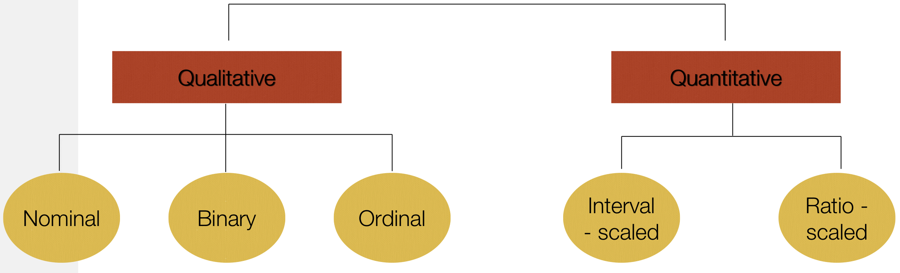

Le due grandi classificazione sono:
- **attributi qualitativi** descrivono una caratteristica di un oggetto senza fornire una quantità. Si dividono ulteriormente in: 
    - *nominali:* utilizzato per simboli, categorie, stati, codici o “nome delle cose”. È possibile rappresentare con numeri ma non ha senso utilizzare operazioni matematiche;
    - *binario:* caso particolare di attributo nominale, solo 2 categorie o stati (0, 1) e possono essere: 
        - *simmetrico:* entrambi i risultati hanno lo stesso valore e hanno lo stesso peso (ad es. genere);
        - *asimmetrico:* i risultati non sono ugualmente importanti;
    - *ordinale:* possibili valori che hanno un ordine significativo o una classificazione tra loro, ma la grandezza tra valori successivi non è nota. Ad esempio, *size = \{small, medium, large\}, \{1, 2, 3\}* oppure *satisfied = \{unsatisfied, neutral, satisfied\}*;
- **attributi quantitativi** sono numerico e sono una quantità misurabile, rappresentata in valori interi o reali. Si dividono ulteriormente in: 
    - *intervallo (ridimensionato):* sono misurati su una scala di unità di uguali dimensioni, i valori hanno un ordine e consentono di confrontare e quantificare la differenza tra i valori. Un esempio di dati sono la temperatura in Celsius oppure gli anni;
    - *rapporto (ridimensionato):* i valori sono multipli di un'unità di misura. Un esempio di dati sono altezza, peso, conteggi, quantità monetarie;
- è possibile distinguere gli **attributi dal numero di valori che possono assumere.** Si dividono ulteriormente in: 
    - **discreto:** ha un insieme di valori finito o numerabile infinito, sono spesso rappresentati utilizzando variabili intere e possono essere categorici o numerici (come i conteggi), ma gli attributi binari sono un caso speciale. Un esempio di dati sono occupazione, codici postali, numeri di identificazione;
    - *continuo:* ha numeri reali come valori di attributo, i valori reali possono solo essere misurati, possono assumere qualsiasi valore (entro un intervallo) e tipicamente rappresentate come variabili a virgola mobile. Un esempio di dati sono altezza, peso, temperatura.

## Tipi di dati
Abbiamo diversi tipi di dati ma i più importanti sono:
- **Graph Data:** utilizzato per rappresentare informazioni dal World Wide Web o con struttura molecolare;
- **Ordered Data:** per esempio, Dati Sequenziali, Dati Sequenziali, Dati Spaziali e Temporali;
- **Record Data:** è il tipo più generico, consiste in una raccolta di record, ogni record è costituito da un insieme fisso di attributi, non esiste alcuna relazione esplicita tra attributi o record e solitamente memorizzato in file *flat* o [[Database|database]] relazionali. Esempi di Record Data sono: 
    - *transaction or market basket data:* ogni record comprende una serie di elementi. Nella maggior parte dei casi, gli attributi sono binari e indicano se un articolo è stato acquistato o meno. Più in generale, gli attributi possono essere discreti o continui, come il numero di articoli acquistati o l'importo speso per tali articoli; 
        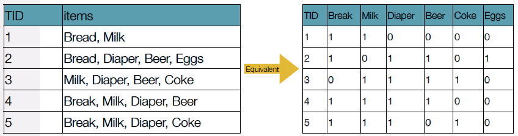
    - *data matrix:* consiste solo di attributi numerici dove ogni record può essere pensato come un vettore nello spazio multidimensionale. Può essere rappresentato da una matrice $m*n$ dove le righe rappresentano gli oggetti e le colonne gli attributi;
    - *sparse data matrix:* è un caso speciale di data matrix. Gli attributi sono dello stesso tipo e sono asimmetrici. Un esempio comune sono i dati del documento: 
        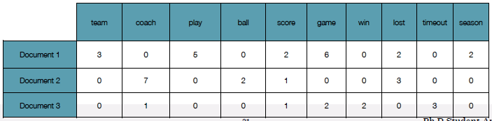

## Exploratory Data Analysis (analisi esplorativa dei dati)
L'**Exploratory Data Analysis** è un approccio per analizzare set di dati, per riassumere le loro caratteristiche principali. Le statistiche di riepilogo e le tecniche di visualizzazione sono i metodi ampiamente utilizzati per l'esplorazione dei dati.

## Misure per attributi categoriali
La frequenza di un valore di attributo è la percentuale di tempo in cui il valore si verifica nel set di dati. La modalità di un attributo categoriale è il valore che ha la frequenza più alta.

## Misure di localizzazione
Considera un insieme di $n$ oggetti e un attributo $x$. Lascia che ${x_1, ..., x_n}$ sia il valore dell'attributo di $x$ per questi $n$ oggetti. La **media (aritmetica)** è definita come:
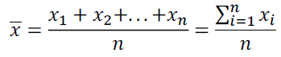

A volte, ogni valore $x_i$ possono essere associati ad un peso $w_i$ rappresentano l'importanza, la frequenza di occorrenza associata al rispettivo valore). In questo caso abbiamo la **media aritmetica ponderata**:
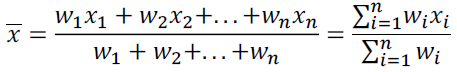

La **mediana** è il numero medio del gruppo quando sono classificati in ordine. In particolare, la mediana è il numero medio se c'è un numero dispari di valori, e la media dei due valori medi se il numero è pari.

La **modalità** per un insieme di dati è il valore che ricorre più frequentemente nell'insieme. Gli insiemi di dati con una, due o tre modalità sono rispettivamente chiamati *unimodali*, *bimodali* e *trimodali*. In generale, un set di dati con due o più modalità è *multimodale*. Se ogni valore di dati ricorre una sola volta, non esiste alcuna modalità.

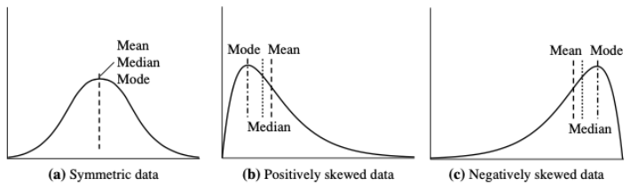

## Misure di dispersione
L'**intervallo** è la differenza tra il massimo e il minimo.
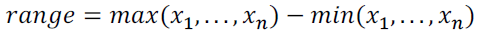

Varianza $\sigma^2$ e la deviazione standard $\sigma $ sono le misure di dispersione più comuni:
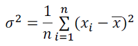

Dato un attributo ordinale o continuo $x$ e un numero $p \in [0,100]$, il **p-esimo percentile** è il valore di $x$ tale che $p\%$ dei valori osservati di $x$ sono minori di $x_p$: ad esempio, il 50esimo percentile è il valore $x_{50\%}$ tale che il $50\%$ di tutti i valori di $x$ sono inferiori a $x_{50\%}$.

I quartili danno un'indicazione del centro, della diffusione e della forma di una distribuzione:
- il primo quartile, indicato con $Q_1$, è il *25esimo* percentile: elimina il 25% più basso dei dati;
- il terzo quartile, indicato con $Q_3$, è il *75esimo* percentile: elimina il 75% più basso (o il 25% più alto) dei dati;
- il secondo quartile è il *50esimo* percentile (mediana): fornisce il centro della distribuzione dei dati.

L'**intervallo interquartile** è la differenza tra il primo e il terzo quartile: $IQR=Q_3-Q_1$. Di solito, un valore anomalo è un valore superiore/inferiore a $1,5*IQR$.

## Visualizzazione
L'*obiettivo* è analizzare/riportare le caratteristiche dei dati e le relazioni tra gli elementi o gli attributi dei dati. Il *requisito* è la conversione dei dati in un formato visivo o tabulare.

Gli esseri umani hanno una capacità ben sviluppata di analizzare grandi quantità di informazioni presentate visivamente:
- può rilevare modelli e tendenze generali;
- può rilevare valori anomali e modelli insoliti.

Abbiamo diverse tecniche di visualizzazione:
- **istogramma:** di solito, un istogramma mostra la distribuzione del valore di una singola variabile. Divide i valori in contenitori e mostra un grafico a barre del numero di oggetti in ciascun contenitore. L'altezza di ciascuna barra indica il numero di oggetti. La forma di un istogramma dipende dal numero di raccoglitori; 
    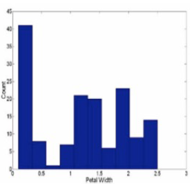
- **box plot:** i dati sono rappresentati con una casella. Le estremità della scatola sono al primo e al terzo quartile, cioè l'altezza della scatola è *IQR*. La mediana è contrassegnata da una linea all'interno del riquadro. Con whiskers avremo due linee fuori dagli schemi estese al minimo e al massimo. Con valori anomali avremo punti oltre una soglia di valori anomali specificati, tracciati individualmente; 
    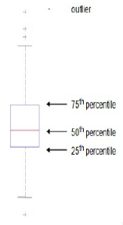
- **scatter plot:** utilizzato per scoprire la correlazione lineare tra gli attributi. I valori degli attributi determinano la posizione. Ulteriori attributi possono essere visualizzati utilizzando la dimensione, la forma e il colore degli indicatori che rappresentano gli oggetti. Gli array di scatter plot possono riassumere in modo compatto le relazioni di diverse coppie di attributi; 
    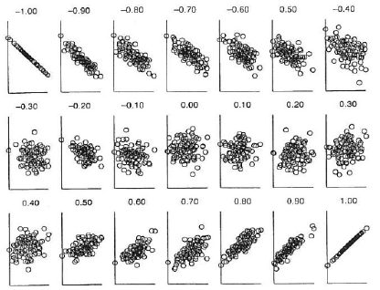
