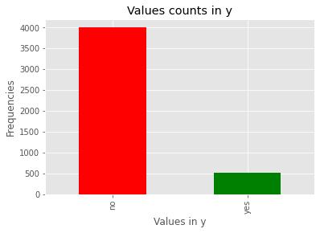
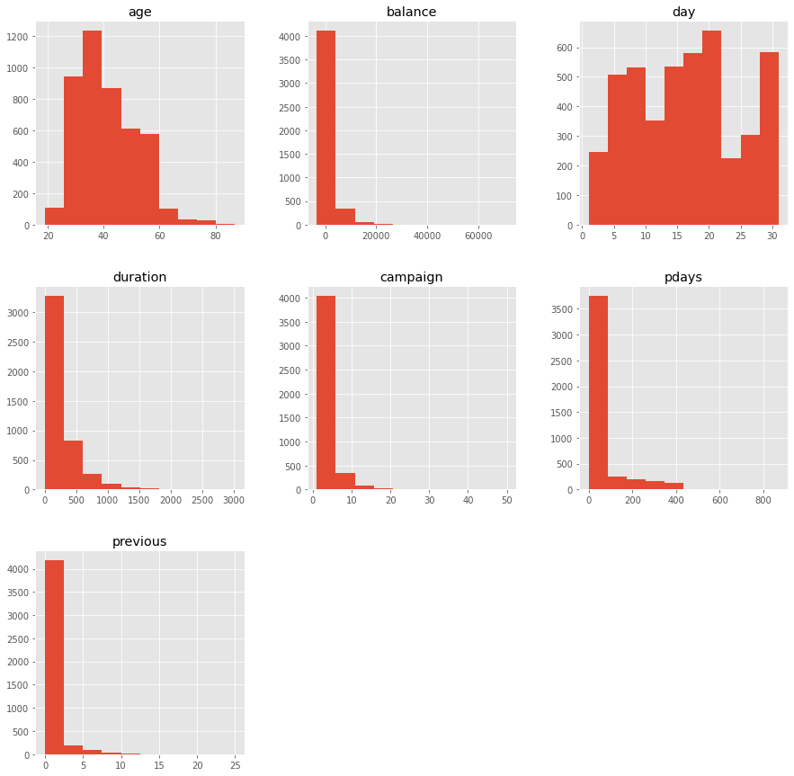
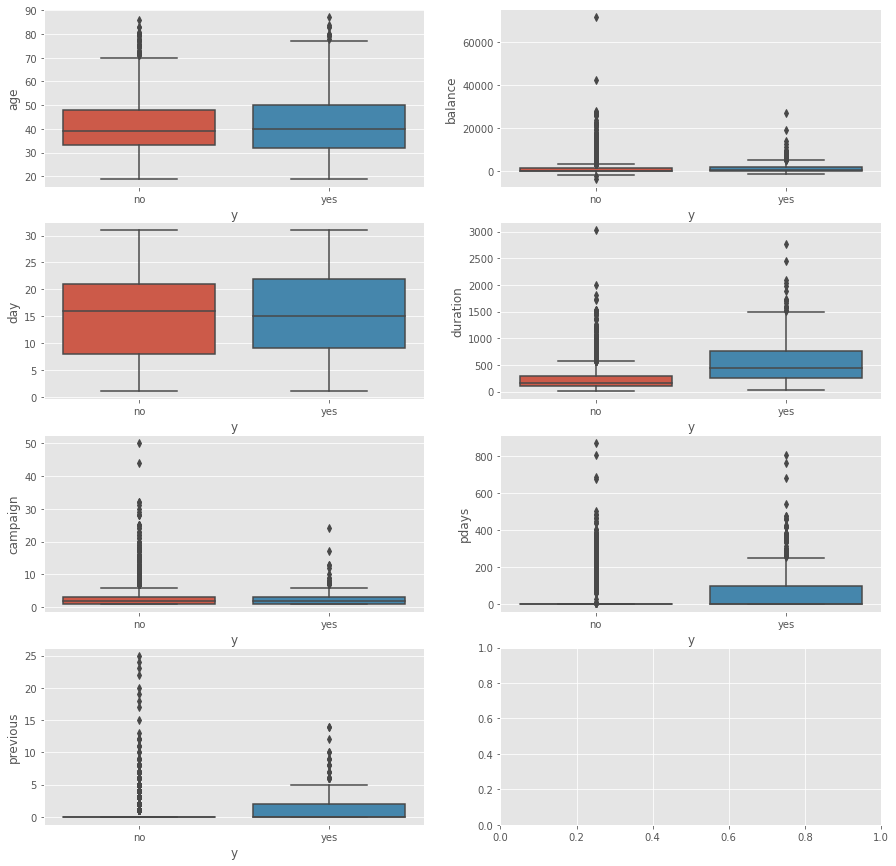
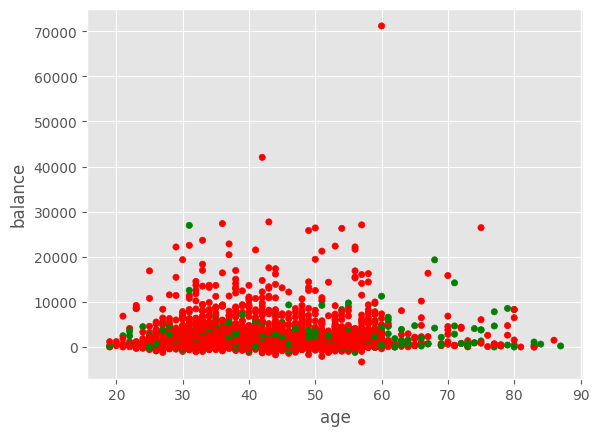

Il nostro dataset della banca è un semplice file con estensione *csv* (*bank.csv*).
Le **istruzioni più importanti (in Python)** sono le seguenti:
- caricare le librerie e il nostro dataset: 
```python
import pandas as pd
import matplotlib.pyplot as plt
plt.style.use('ggplot')
bank = pd.read_csv('bank.csv', sep=';')
```
- visualizzare contenuto dataset: 
```python
bank
```
- visualizzare grandezza dataset (*righe* e *colonne*): 
```python
bank.shape #(4521,17)
```
- visualizzare grandezza dataset ($righe*colonne$): 
```python
bank.size #76857
```
- visualizzare informazioni sulle colonne (*nome*, *conteggio righe non nulle* e *tipo di dato*): 
```python
bank.info()
#<class 'pandas.core.frame.DataFrame'>
#RangeIndex: 4521 entries, 0 to 4520
#Data columns (total 17 columns):
# #   Column     Non-Null Count  Dtype 
#---  ------     --------------  ----- 
# 0   age        4521 non-null   int64 
# 1   job        4521 non-null   object
# 2   marital    4521 non-null   object
# 3   education  4521 non-null   object
# 4   default    4521 non-null   object
# 5   balance    4521 non-null   int64 
# 6   housing    4521 non-null   object
# 7   loan       4521 non-null   object
# 8   contact    4521 non-null   object
# 9   day        4521 non-null   int64 
# 10  month      4521 non-null   object
# 11  duration   4521 non-null   int64 
# 12  campaign   4521 non-null   int64 
# 13  pdays      4521 non-null   int64 
# 14  previous   4521 non-null   int64 
# 15  poutcome   4521 non-null   object
# 16  y          4521 non-null   object
#dtypes: int64(7), object(10)
#memory usage: 600.6+ KB
```
- visualizzare un *istogramma* di una determinata colonna: 
```python
value_counts=bank['y'].value_counts()
value_counts.plot(kind = 'bar', color = ['red','green'],xlabel="Values in y",ylabel="Frequencies",title="Values counts in y")
plt.show()
```
    
- visualizzare un *istogramma* di più colonne: 
```python
n = bank[['age','balance','day','duration','campaign','pdays', 'previous']]
n.hist(figsize=(15,15))
plt.show()
```
    

- visualizzare un *box plot* di più colonne: 
```python
import seaborn as sn

datas = ['age','balance','day','duration','campaign','pdays', 'previous']
i=0
fig, ax = plt.subplots(4, 2, figsize = (15, 15))
for data in datas:
  sn.boxplot(y = data, x = 'y', data = bank, ax = ax[i//2,i%2])
  i += 1

plt.show()
```
    
- visualizzare un *scatter plot* di una determinata colonna: 
```python
color_encoding = bank['y'].replace({"no":"red","yes":"green"})
bank.plot(kind='scatter', x = "age", y="balance", c=color_encoding)
plt.show()    
```
    
