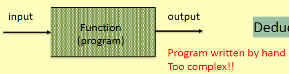
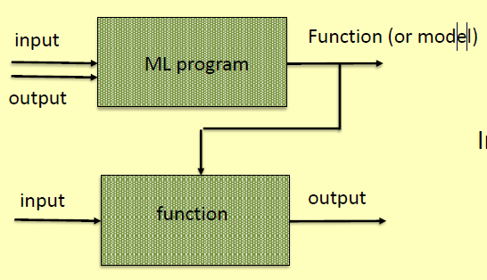
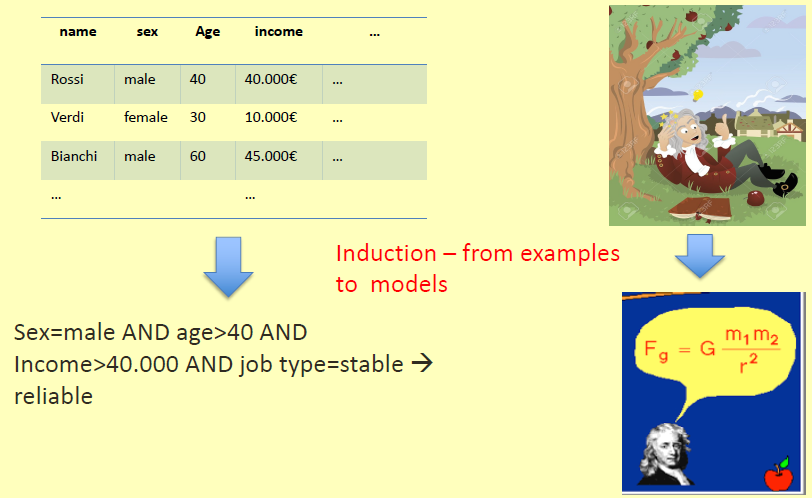
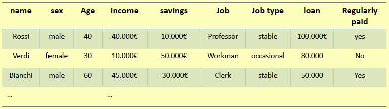
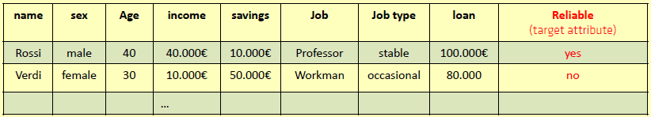
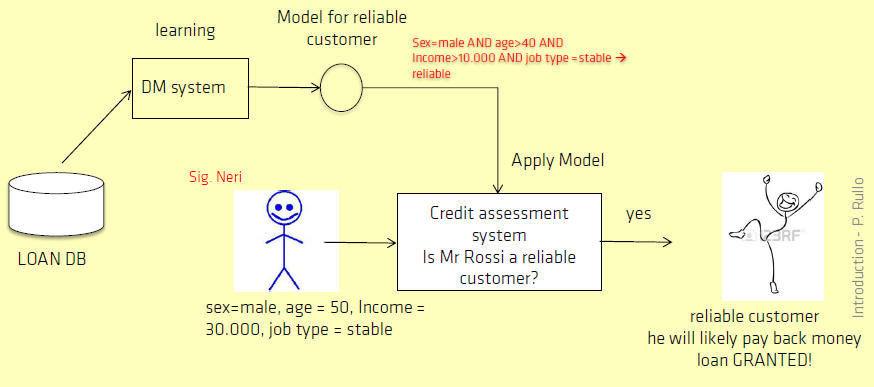
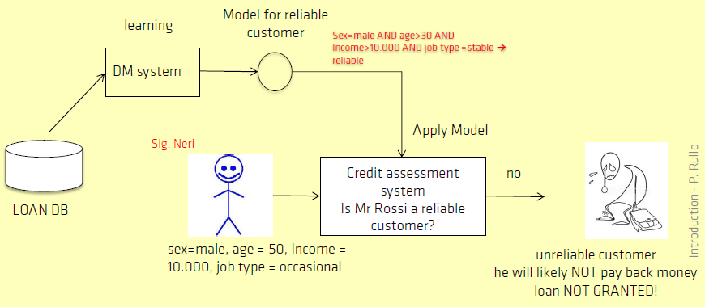
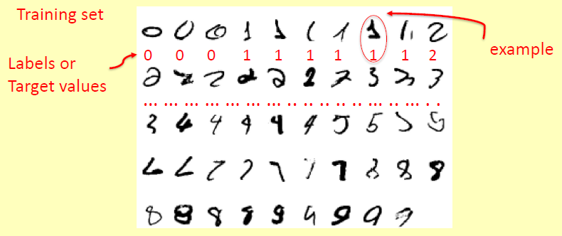

## Cos'è il Machine Learning
È molto difficile scrivere programmi che risolvano problemi come *riconoscere un'immagine*, *guidare una macchina* oppure *calcolare la probabilità che una transazione con carta di credito sia fraudolenta*. Potrebbero non esserci regole semplici e affidabili per risolvere tali problemi.

Invece di scrivere un programma a mano per ogni compito specifico, raccogliamo molti esempi (**training set**) che specificano l'output atteso per un dato input: un **algoritmo di Machine Learning (ML)**, quindi, prende questi esempi e produce un *modello* (**target function**) che rappresenta la relazione input-output: può quindi essere utilizzato per generare i valori di output associati a nuovi valori di input. Se sono disponibili nuovi esempi, *il modello viene aggiornato addestrandolo sui nuovi dati*.

Nella programmazione possiamo utilizzare due principali approcci:
- **approccio deduttivo**;
    
- **approccio induttivo**.
    

In sintesi:
- utilizzando l'approccio ML, forniamo un sistema ML con una serie di esempi (*training set*), ognuno dei quali rappresenta un input e il rispettivo output;
- il sistema ML a sua volta ci fornisce una funzione (*modello*) che può quindi essere utilizzata per trovare nuove soluzioni;
- l'approccio ML viene generalmente utilizzato quando i problemi sono complessi e non è possibile creare manualmente un programma.

## Cos'è il Data Mining?
Il **Data Mining (DM)** è il processo di identificazione e scoperta di informazioni (conoscenze) utili da grandi volumi di dati (*big data*) archiviati in data warehouse e database.

DM ci permette di comprendere i fenomeni dall'analisi dei dati: viene fatto principalmente per il supporto decisionale nelle imprese. DM è anche indicato come *Knowledge Discovery from Databases (KDD)*.

## Perché DM: l'esplosione dei Big Data
Viviamo in un mondo interconnesso: ogni acquisto che effettuiamo viene debitamente registrato, ogni transazione di denaro è accuratamente registrata, ogni clic web finisce in un archivio di clic web, ogni ricerca, chat, ed altro viene archiviata in data warehouse di motori di ricerca, social network, ecc.

I social network generano enormi quantità di dati in forma testuale (blog, discussioni, notizie, ecc.).
L'**Internet of Things (IoT)** consente agli oggetti (dispositivi intelligenti, veicoli, sensori, smartphone, ecc.) di raccogliere e scambiare dati tramite Internet. Il numero di dispositivi connessi è dell'ordine di grandezza di centinaia di miliardi.
Grandi DB e DW sono cresciuti negli anni per diverse finalità operative: banche, grandi organizzazioni, strutture sanitarie, ecc.

Con Big Data (BD) intendiamo un insiemi di dati estremamente grande di diversa natura e formato che contengono grandi quantità di conoscenza nascosta che devono essere estratte.
Alcune delle sue proprietà sono che:
- semplici statistiche con l'intervento manuale non servono a niente;
- deve essere analizzato computazionalmente per rivelare modelli, tendenze e associazioni, in particolare in relazione al comportamento umano e alle interazioni;
- BD e DM insieme ci permettono di imparare dall'esperienza.

## Machine Learning contro Data Mining

- *Machine Learning (ML)* fornisce tecniche per l'apprendimento di modelli (ad es. alberi decisionali, reti neurali, ecc.) dall'esperienza (dati): applicazioni tipiche: robot, giochi, auto a guida autonoma, riconoscimento vocale, ecc;
- *Data Mining (DM)* sfrutta le tecniche ML (ad esempio, alberi decisionali, reti neurali, ecc.) per estrarre modelli da grandi set di dati per scopi aziendali. Le applicazioni tipiche sono la profilazione degli utenti, la previsione delle tendenze di mercato, la classificazione dei testi, l'analisi del sentiment, ecc.

Spesso useremo ML e DM come sinonimi.

## Tecniche di apprendimento
Avremo due categorie principali: apprendimento *supervisionato* e *senza supervisione*.

Nell'*apprendimento supervisionato*, un *training set*, costituito da coppie *(input, output)* (chiamate *esempi*), viene utilizzato per apprendere la relazione input-output, chiamata anche **target function** o **modello**.

Nell'*apprendimento non supervisionato*, agli algoritmi di Machine Learning viene chiesto di scoprire modelli nei dati, ad esempio somiglianze che dividono i dati in categorie.

## Principali compiti di apprendimento
I principali compiti di apprendimento sono i seguenti:
- **apprendimento concettuale:** acquisire conoscenze generali da esempi specifici, ad esempio apprendere il concetto generale di "mammifero" da esempi specifici di mammiferi. Un concetto è una rappresentazione sintetica di alto livello di un set di dati (compito supervisionato);
- **classificazione:** classificare gli oggetti in uno di un insieme discreto di categorie ad esempio, classificare un richiedente di prestito come affidabile o inaffidabile (compito supervisionato);
- **clustering:** l'analisi dei cluster si riferisce alla formazione di gruppi di oggetti che sono molto simili tra loro ma sono molto diversi dagli oggetti in altri cluster (compito non supervisionato);
- **rilevamento di anomalie** finalizzato alla scoperta di oggetti diversi dalla maggior parte degli altri oggetti;
- **analisi di associazione:** una regola di associazione è un'associazione frequente *if-then* che si verifica all'interno di un database (compito non supervisionato).

## Compiti predittivi e descrittivi
Un'attività ML può essere *predittiva* o *descrittiva* (o entrambe):
- **compiti predittivi:** utilizzare alcune variabili per prevedere il valore di altre variabili sconosciute;
- *compiti descrittivi:* trovare una descrizione interpretabile dall'uomo di un insieme di dati.

L'apprendimento dei concetti e la classificazione possono essere utilizzati sia per scopi predittivi che descrittivi. Ad esempio, il *clustering* e l'*analisi di associazione* sono compiti descrittivi.

## Machine Learning come compito induttivo
L'*induzione* è un processo di creazione di teorie generali da dati osservati (osservazioni empiriche). **ML è un compito induttivo**, in quanto estrae teorie generali dai dati osservati (esempi). Ad esempio:

Il *problema principale* di questa metodologia è che il modello indotto da un insieme di esempi può essere errato anche se gli esempi sono veri e il modello è coerente con gli esempi. La conoscenza induttiva è una conoscenza probabilistica ma attualmente è vera. Le nuove informazioni possono solo falsificare (smentire) la teoria corrente, mai confermarla definitivamente (si pensi alle teorie fisiche).

## Induzione e deduzione

Con **induzione** si intende *dal particolare al generale*. Si estrae teorie generali dai dati osservati: osserviamo una serie di esempi, discerniamo uno schema, facciamo una generalizzazione e deduciamo un modello di spiegazione o una teoria. Utilizza questo approccio le scienze sperimentali (fisica, biologia, ecc.). Il modello indotto da una serie di esempi può essere errato anche se gli esempi sono veri: conoscenza probabilistica.

Con **deduzione** si intende *dal generale al particolare*. Si deducono conseguenze dalle teorie generali. Utilizza questo approccio la matematica. Se la teoria (*premesse*) è valida, le conseguenze sono vere: il ragionamento deduttivo è una forma base di ragionamento valido.

## Applicazioni di successo di ML
Esempi di applicazioni di successo di ML sono le seguenti:
- valutazione del rischio di credito;
- riconoscimento numeri scritti a mano;
- riconoscimento facciale.

### Valutazione del rischio di credito

*Ogni banca possiede un database che memorizza tutte le informazioni sulle operazioni di credito passate*, ad esempio, il signor Rossi ha ottenuto un prestito il 2002 di 100.000 €, ha pagato il prestito in 10 anni, il pagamento era regolare ed il signor Rossi guadagna 30.000 €/anno, ha un lavoro stabile, possiede l'appartamento in cui vive, è sposato, ecc.

Possiamo usare SQL per interrogare un tale DB, ad esempio, per sapere se un determinato cliente è affidabile in quanto ha pagato regolarmente le rate di prestito.
Tuttavia, SQL non è utilizzabile allo scopo di fornire una definizione generale di "cliente affidabile" dai dati dati. Ciò sarebbe utile come strumento per la concessione di prestiti a nuovi clienti, non ancora nel database.

I clienti che hanno restituito regolarmente il prestito sono considerati "affidabili". Un algoritmo di apprendimento concettuale induce un modello M da dati storici nel database dei prestiti (*training set*). M esprime una relazione (*target function*) tra le variabili indipendenti (attributi) e la variabile dipendente "affidabile". La funzione target potrebbe essere espressa, ad esempio, in forma proposizionale come:

> *Sex=male AND age >= 40 AND Income >= 40000 AND job type=stable -> Reliable=yes*

Abbiamo due approcci per concedere un prestito a un nuovo cliente:
- il direttore bancario utilizza la sua esperienza personale: soggettività, conoscenza limitata del dominio dell'applicazione, ecc;
- il gestore bancario utilizza un modello: impara dai dati storici (il database del prestito) il concetto di "cliente affidabile", ovvero una descrizione delle proprietà che un cliente dovrebbe detenere per essere considerato affidabile. Quindi applicare il concetto appreso al nuovo cliente.

Di seguito due applicazione di modelli che, **conoscendo il passato, predicono il futuro**:

In conclusione, *un algoritmo di apprendimento è addestrato sui dati di formazione (database di prestiti) per apprendere il concetto di "cliente affidabile"*. Il concetto appreso (o modello, funzione target, ecc.) Viene quindi utilizzato per classificare nuove istanze sconosciute (previsione), ovvero nuovi clienti, consentendo così al direttore bancario di prendere decisioni informate. Il concetto appreso ha anche un valore descrittivo. Il concetto di "cliente affidabile" può essere visto come una rappresentazione intensiva del set di dati di prestito.

### Riconoscimento numeri scritti a mano

In questo esempio, possiamo procedere a step come di seguito:
- *Task:* riconoscere le immagini che rappresentano i numeri scritti a mano;
- *Input:* immagini di numeri scritti a mano 0-9;
- *Output:* il numero giusto associato a una determinata immagine;

L'apprendimento viene eseguito da un sistema di classificazione (supervisionato).

### Riconoscimento facciale

In questo esempio, possiamo procedere a step come di seguito:
- *Task:* riconoscere il viso pose per prevedere se una persona sta guardando a sinistra, a destra, ecc;
- *Input:* immagini della fotocamera di facce di varie persone;
- *Output:* la direzione in cui la persona sta affrontando

L'apprendimento viene eseguito da un sistema di classificazione per un set di formazione realizzato con 260 immagini etichettate. Il sistema apprende l'associazione tra ogni immagine e una classe in *(right, left, upward, straight ahead)*.

Il sistema può essere addestrato per scopi diversi, ad esempio, riconoscendo l'identità delle persone.

