Le **[[Reti|reti]] neurali (NN)** forniscono un metodo per apprendere sia le funzioni a valori reali che quelle a valori discreti dai set di addestramento. Abbiamo un ampia gamma di applicazioni, ad esempio: 
- riconoscimento vocale;
- guida autonoma;
- classificazione delle immagini;
- riconoscimento delle cifre;
- visione computerizzata;
- finanza.

## Perceptron
***Perceptron* è una rete neurale a livello singolo e un perceptron multistrato è chiamato [[Reti|reti]] neurali.**

Perceptron è un classificatore lineare (binario). Inoltre, è utilizzato nell'apprendimento supervisionato ed aiuta a classificare i dati di input forniti.

L'espediente matematico di base è il seguente:
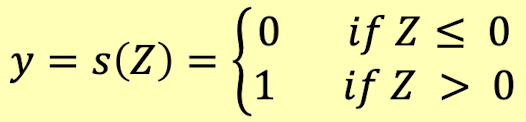

dove:
- $Z = \sum_{i=1,n} w_i x_i + w_0$;
- $x_1 ... x_n$ sono gli input (valori reali o booleani);
- $w_1 ... w_n$ sono i pesi;
- $w_0$ è il bias;
- $s$ è la funzione di attivazione del passo.

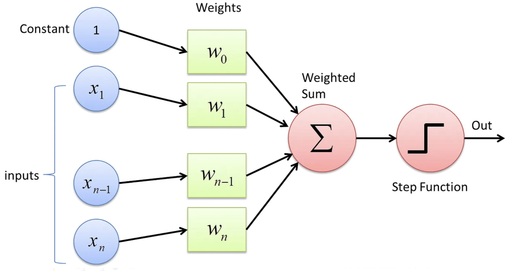

Con *interpretazione* intendiamo che l'output è 1 a seconda che la somma ponderata dei valori di input sia maggiore della soglia $t = -w_0$ e: 

> $\sum_i w_i x_i > t$

Per semplificare la notazione, aggiungiamo un input costante, $x_0 = 1$ con peso $w_0$, così come: 

> $Z = \sum_{i=0,n} w_i x_i$

Nel seguito ometteremo la rappresentazione esplicita del nodo di input $X_0=1$.

## Calcolo delle perceptron

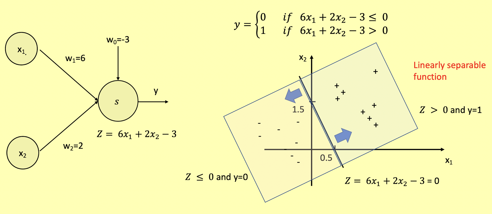

Ogni vettore di input è un punto nello spazio di input. Per un perceptron a 2 input: 

> $Z = \sum_{i=0,2} w_i x_i = w_0 + w_1 x_1 + w_2 x_2$

$Z = 0$ è la **linea (iperpiano)** che divide lo spazio di input in una regione $P$ dove $Z>0$ e un'altra $N$ dove $Z<0$. Per ogni input $(x_1,x_2)$ in $P$, il **perceptron produrrà $y=1$**. Per ogni input $(x_1,x_2)$ in $N$, il **perceptron produrrà $y=0$**.

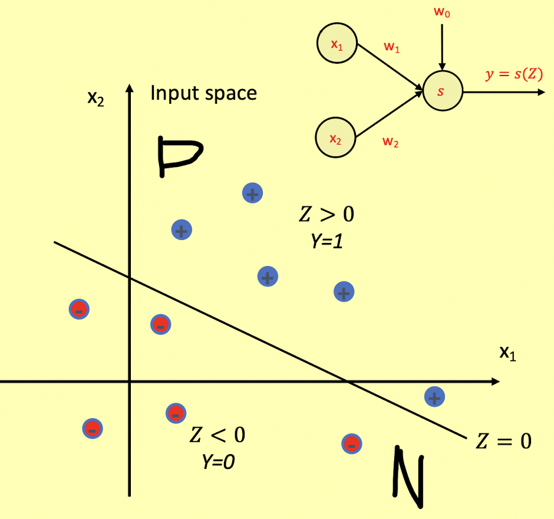

Un perceptron calcola una funzione binaria **linearmente separabile**. Dall'altro lato, possiamo costruire un percettrone da un dato set di dati *linearmente separabile*.

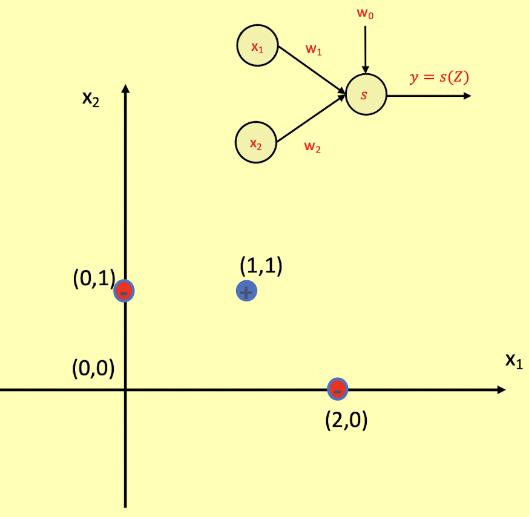

Per esempio, costruiamo a mano un perceptron che classifichi correttamente i seguenti dati e usiamo la tua conoscenza della geometria piana per scegliere valori appropriati per i pesi $w_0$, $w_1$ e $w_2$.

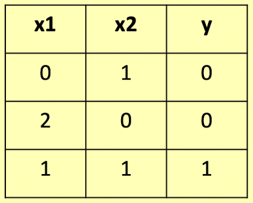

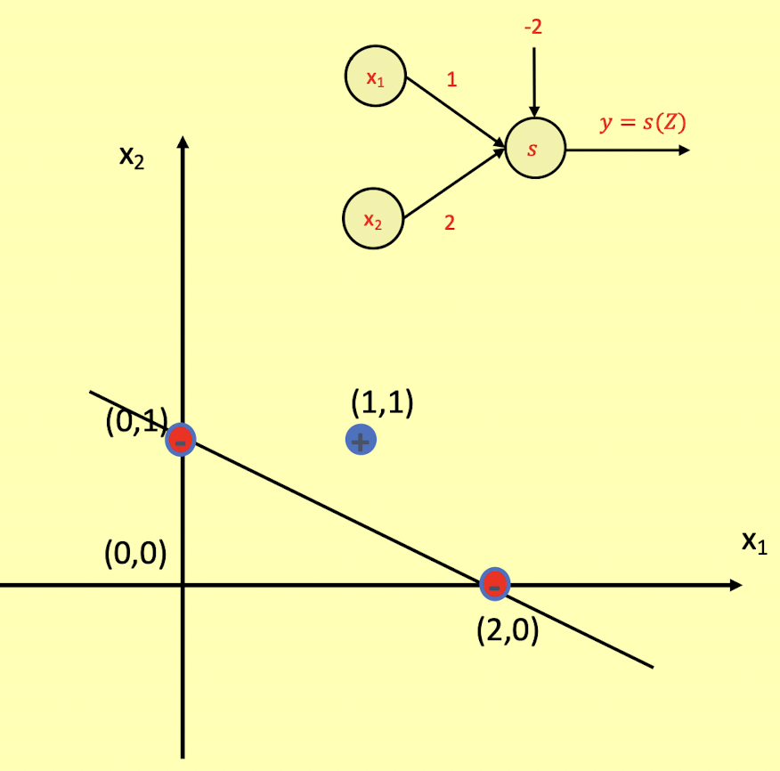

Come soluzione, costruire un perceptron equivale a rilevare una linea (iperpiano): 

> $Z = w_0 + w_1 x_1 + w_2 x_2 = 0$

separando le due classi (0 e 1), dove $w_0$, $w_1$ e $w_2$ sono i pesi del perceptron. Una di queste linee è quella che passa per i punti $(0,1)$ e $(2,0)$: 

> $Z = x_1 + 2x_2 - 2 = 0$

Così, $w_0=-2$, $w_1=1$ e $w_2=2$.

Un perceptron rappresenta una funzione 0-1 **linearmente separabile**. Tutte le funzioni booleane di base sono linearmente separabili (*OR*, *AND*, *NOR*, *NAND*) quindi i perceptron possono essere usati per rappresentarle.

Nel caso dell'OR e nell'AND, il set di dati è *separabile linearmente*, quindi esiste un perceptron che rappresenta questa funzione booleana.

### Problema dell'XOR
Nell'caso dell'XOR, il set di dati **non è separabile linearmente** (due linee di separazione). Non esiste un perceptron per implementare la funzione XOR. Il suggerimento è di combinare due perceptron in un perceptron multistrato (MLP).

I perceptron sono definiti principalmente come *classificatori lineari* e possono essere utilizzati solo per [[Casi d'uso|casi d'uso]] separabili lineari e XOR è una delle operazioni logiche che non sono separabili linearmente in quanto i punti dati si sovrappongono ai punti dati della linea lineare o si verificano classi diverse su un solo lato della linea lineare.

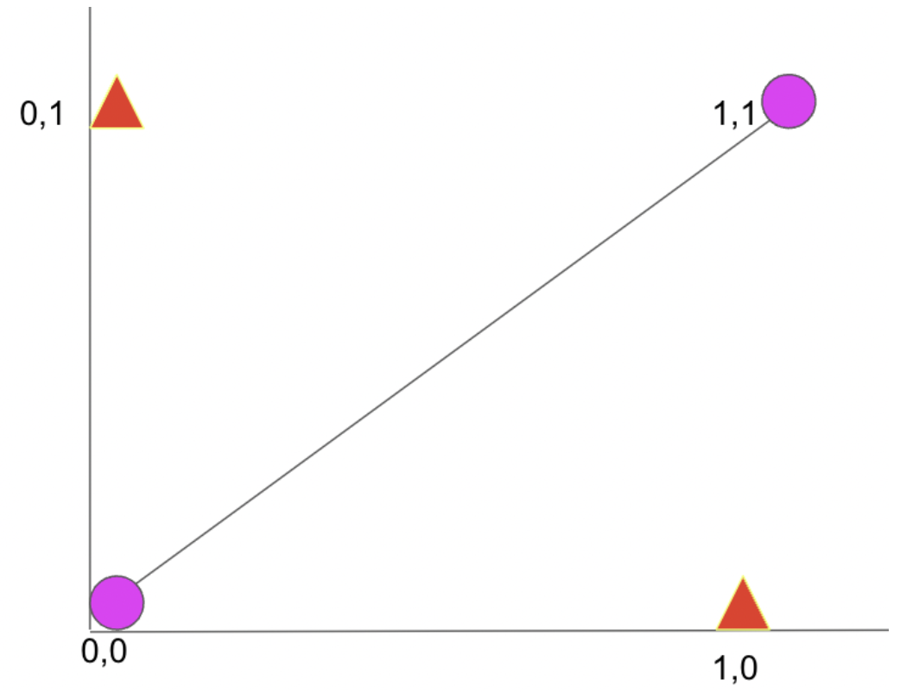

Nella figura, possiamo vedere che sopra la linea separabile lineare il triangolo rosso si sovrappone al punto rosa e la separabilità lineare dei punti dati non è possibile utilizzando la logica XOR. Quindi è qui che più neuroni definiti anche *perceptron multistrato* vengono utilizzati con uno strato nascosto per indurre alcuni pregiudizi durante l'aggiornamento del peso e ottenere la separabilità lineare dei punti dati utilizzando la logica XOR. Quindi ora cerchiamo di capire come risolvere il problema XOR con le [[Reti|reti]] neurali.

Il problema XOR con le [[Reti|reti]] neurali può essere risolto utilizzando *perceptron multistrato* o un'[[Architettura|architettura]] di rete neurale con un livello di input, un livello nascosto e un livello di output. Pertanto, durante la propagazione in avanti attraverso le [[Reti|reti]] neurali, i pesi vengono aggiornati ai livelli corrispondenti e viene eseguita la logica XOR.

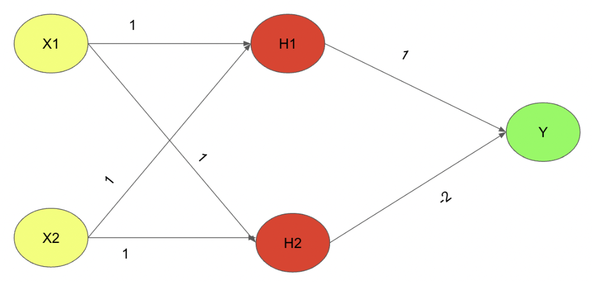

Quindi, con questa [[Architettura|architettura]] complessiva e determinati parametri di peso tra ogni livello, l'output logico XOR può essere prodotto tramite propagazione in avanti. L'[[Architettura|architettura]] complessiva della rete neurale utilizza la funzione di attivazione Relu per garantire che i pesi aggiornati in ciascuno dei processi siano 1 o 0 di conseguenza dove per l'insieme positivo di pesi l'output al neurone particolare sarà 1 e per un aggiornamento del peso negativo al neurone particolare sarà 0 rispettivamente.

Per $X_1=0$ e $X_2=0$ dovremmo ottenere un input di 0. Consideriamo $X_1=0$ e $X_2=0$, allora:

> $H1=RELU(0.1+0.1+0) = 0$ \ 
> $H2=RELU(0.1+0.1+0)=0$

Quindi ora abbiamo ottenuto i pesi che sono stati propagati dal livello di input al livello nascosto. Quindi ora propaghiamo dal livello nascosto al livello di output:

> $Y=RELU(0.1+0.(-2))=0$

Questo è il modo in cui le *[[Reti neurali multistrato|reti neurali multistrato]]* o anche conosciute come *perceptron multistrato (MLP)* vengono utilizzate per risolvere il problema XOR e per tutti gli altri set di input è possibile verificare l'[[Architettura|architettura]] fornita sopra e ottenere il risultato corretto per la logica XOR.

## Calcolo delle perceptron multistrato (MLP)
Il problema XOR dimostra che le MLP possono essere utilizzate per rappresentare funzioni booleane non linearmente separabili. **Le MLP sono *funzioni booleane universali*.**

Uno schema generale per costruire una funzione booleana $B$ è il seguente:
- trasforma $B$ in un DNF (o CNF), diciamo, $C_1 +...+C_n$;
- per ogni congiunzione $C_i$, creare un nodo nascosto $N_i$;
- impostare i pesi di $N_i$ in modo che si attivi se i valori di ingresso rendono vero $C_i$;
- implementare il nodo di output come OR dei nodi nascosti.

Più in generale, per qualsiasi funzione 0-1:
- $f:{{0,1}}^N \rightarrow (0,1)$ (funzione booleana);
- $f:R^N \rightarrow (0,1)$ (funzione di input a valori reali);

c'è un MLP che lo implementa. Di conseguenza, le MLP sono *funzioni 0-1 universali*. In effetti, confini decisionali *arbitrariamente* complessi possono essere composti da un MLP (a uno strato).

Costruire un MLP che dia 1 quando l'input è nell'area chiusa (punti dati blu) • Per modellare confini non lineari complessi dobbiamo combinare i perceptron in un MLP (come abbiamo fatto per il problema XOR)

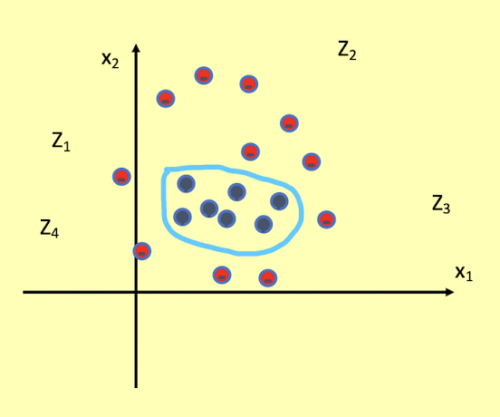

Quindi, avremo un nodo nascosto (perceptron) per ogni lato dell'area chiusa.

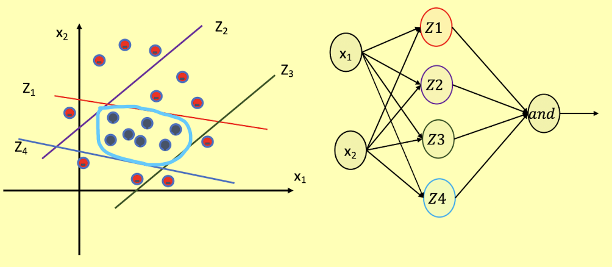

Maggiore è il numero di nodi nascosti, più precisa sarà l'approssimazione di un limite decisionale non lineare.

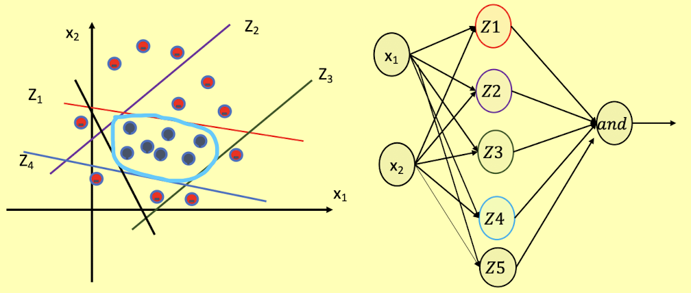

Le MLP sono funzioni 0-1 universali poiché qualsiasi limite decisionale complesso può essere composto da MLP. In realtà, è sufficiente un MLP a un livello: tuttavia, gli MLP a uno strato possono richiedere un numero esponenzialmente elevato di perceptron rispetto a uno profondo. **[[Reti]] più profonde possono richiedere molti meno neuroni.**

## Neuroni sigmoidei
Nei **neuroni sigmoidei**, la funzione di output è molto più fluida della funzione di gradino. Nel neurone sigmoideo, un piccolo cambiamento nell'input provoca solo un piccolo cambiamento nell'output rispetto all'output a gradini. Esistono molte funzioni con la caratteristica di una curva a forma di "S" note come **funzioni sigmoidee**. La funzione più comunemente usata è la funzione logistica.

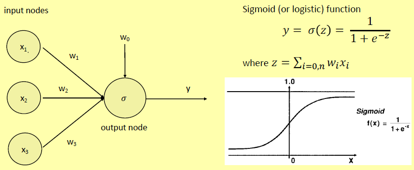

L'output del neurone sigmoideo non è 0 o 1. Invece, è un valore reale compreso tra 0 e 1 che può essere interpretato come una probabilità.

*La funzione sigmoide prende un numero con valore reale e lo ridimensiona tra 0 e 1. I numeri negativi grandi diventano 0 e i numeri positivi grandi diventano 1. Restituisce 0,5 per l'input 0.*

## Altre funzioni di attivazione

### Funzione di Tanh

La **funzione di Tanh** è simile alla funzione sigmoide: prende un numero reale e lo ridimensiona tra -1 e 1. Matematicamente: 

> $t(z) = \frac{e^z - e^{-z}}{e^z + e^{-z}}$

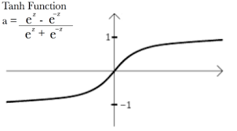

### Funzione ReLU
La **funzione ReLU (Rectified Linear activation fUnction)** emette l'input direttamente se è positivo, altrimenti emetterà zero. Matematicamente: 

> $R(Z)= max(0,Z)$

Il range è $(0,inf)$ che possiamo rappresentare come:

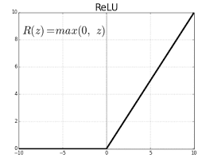

## MLP come funzioni a valori continui
Utilizzando un nodo di output con una funzione di attivazione continua, possiamo calcolare funzioni continue. In questo modo:
- $f:R^N \rightarrow (0,1)$ è una **funzione sigmoide**;
- $f:R^N \rightarrow (-1,1)$ è una **funzione di Tanh**;
- $f:R^N \rightarrow (0, \infty$ è una **funzione ReLU**.

## MLP come approssimatori universali
È stato dimostrato che qualsiasi funzione continua può essere approssimata, con un errore arbitrariamente piccolo, da un MLP (al prezzo di una crescita esponenziale del numero di neuroni).
In conclusione, un MLP può (esattamente) calcolare qualsiasi funzione booleana e può approssimare qualsiasi altra funzione, con un errore arbitrariamente piccolo.
*L'MLP è un **approssimatore universale** per l'intera classe di funzioni che rappresenta.*

## MLP come classificatori
Un perceptron con input a valori reali può essere considerato come un classificatore binario lineare, per il quale il confine decisionale è un iperpiano.

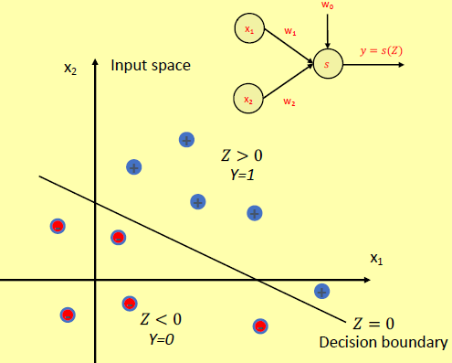

Un MLP con input a valori reali può modellare qualsiasi tipo di confine decisionale. *Un MLP è un **classificatore universale**.*

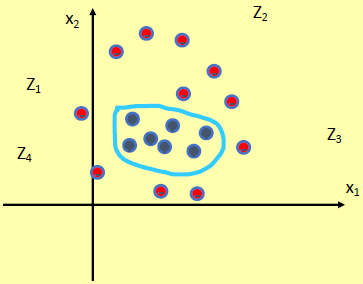
