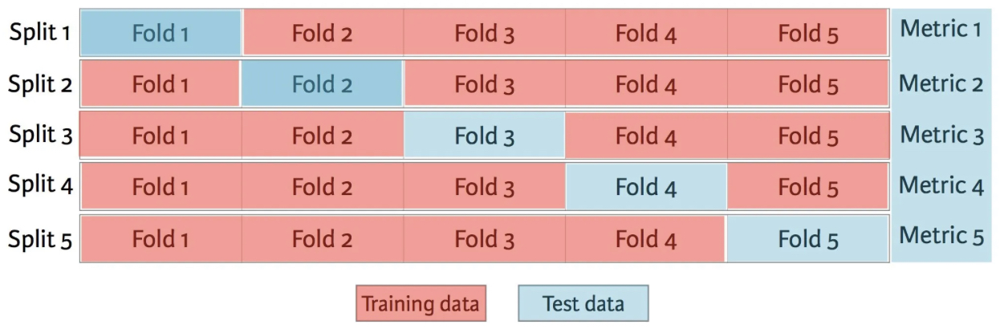
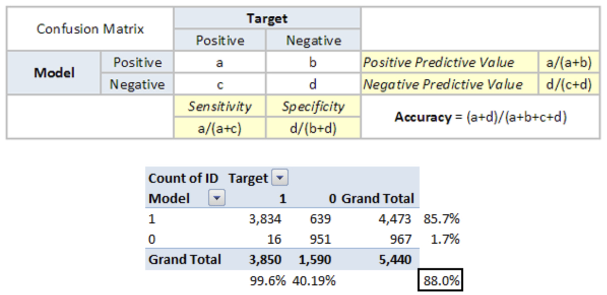

Per valutare un modello possiamo: 
- selezionare un *training set*;
- creare un modello di data mining;
- scegliere una misura di qualità;
- selezionare un *test set*;
- applicare il modello al *test set*;
- calcolare il valore della misura di qualità.

## Metodi per la valutazione del modello

### Hold-out
I dati vengono partizionati in modo casuale in due set indipendenti, un set di addestramento e un *test set*. Il *training set* viene utilizzato per derivare il modello: quindi, il modello viene testato sul *test set* per stimare le prestazioni del modello.

In sintesi, **hold-out** è quando dividi il tuo *dataset* in un set di "treno" e "test".  Il *training set* è ciò su cui viene addestrato il modello e il *test set* viene utilizzato per vedere come si comporta bene quel modello su dati invisibili. Una suddivisione comune quando si utilizza il metodo di sospensione consiste nell'utilizzare l'80% dei dati per il training e il restante 20% dei dati per i test.

### Random subsampling
**Random subsampling** è una variazione del metodo *hold-out*. Il metodo *hold-out* viene ripetuto $k$ volte. La misura della performance complessiva è presa come media delle misure della performance ottenute da ciascuna iterazione.

### *k*-fold cross validation
I dati sono divisi in *k* pieghe (partizioni) di uguali dimensioni. Durante ogni esecuzione, una delle pieghe viene scelta per il test, mentre le altre vengono utilizzate per l'allenamento. La procedura viene ripetuta *k* volte: viene presa la misura complessiva delle prestazioni come media delle misure di performance ottenute da ciascuna iterazione.

In sintesi, **cross validation** o ***k*-fold cross validation** si verifica quando il dataset viene suddiviso casualmente in gruppi *k*. Uno dei gruppi viene utilizzato come *test set* e il resto viene utilizzato come *training set*. Il modello viene addestrato sul *training set* e valutato sul *test set*. Quindi il processo viene ripetuto finché ogni gruppo univoco non è stato utilizzato come *test set*.

Ad esempio, per la *5*-fold cross validation, il *dataset* verrebbe suddiviso in 5 gruppi e il modello verrebbe addestrato e testato 5 volte separate in modo che ogni gruppo abbia la possibilità di essere il *test set*. Questo può essere visto nel grafico qui sotto:

## Metrica di valutazione
Una **metrica di valutazione** quantifica le prestazioni di un modello predittivo.

Ciò comporta in genere l'addestramento di un modello su un set di dati, utilizzando il modello per fare previsioni su un set di dati di controllo non utilizzato durante l'addestramento, quindi confrontando le previsioni con i valori previsti nel set di dati di controllo.

Per i problemi di classificazione, le metriche implicano il confronto dell'etichetta di classe prevista con l'etichetta di classe prevista o l'interpretazione delle probabilità previste per le etichette di classe per il problema.

La selezione di un modello e anche i metodi di preparazione dei dati insieme sono un problema di ricerca guidato dalla metrica di valutazione.  Gli esperimenti vengono eseguiti con diversi modelli e il risultato di ogni esperimento viene quantificato con una metrica.

### Matrice di confusione
Una matrice di confusione è una matrice $N*N$, dove $N$ è il numero di classi previste. Per il problema in questione, abbiamo $N=2$, e quindi otteniamo una matrice $2*2$. È una misurazione delle prestazioni per i problemi di classificazione dell'apprendimento automatico in cui l'output può essere di due o più classi. Si tratta di una tabella con $4$ diverse combinazioni di valori previsti ed effettivi. È estremamente utile per misurare le curve di richiamo di precisione, specificità, accuratezza e, soprattutto, AUC-ROC.

Ecco alcune definizioni che devi ricordare per una matrice di confusione:
- **vero positivo:** hai previsto positivo ed è vero;
- **vero negativo:** hai previsto negativo ed è vero;
- **falso positivo:** (errore di tipo 1): hai previsto positivo ed è falso;
- **falso negativo:** (errore di tipo 2): hai previsto negativo ed è falso;
- **precisione:** la proporzione del numero totale di previsioni corrette che erano corrette;
- **valore predittivo positivo:** la proporzione di casi positivi identificati correttamente;
- **valore predittivo negativo:** la proporzione di casi negativi che sono stati correttamente identificati;
- **sensibilità o richiamo:** la proporzione di casi effettivamente positivi identificati correttamente;
- **specificità:** la proporzione di effettivi casi negativi correttamente identificati;
- **tasso:** è un fattore di misurazione in una matrice di confusione. Ha anche 4 tipi TPR, FPR, TNR e FNR.

L'accuratezza per il problema in questione risulta essere dell'88%.  Come puoi vedere dalle due tabelle precedenti, il valore predittivo positivo è alto, ma il valore predittivo negativo è piuttosto basso.  Lo stesso vale per *sensibilità* e *specificità*. Ciò è dovuto principalmente al valore di soglia che abbiamo scelto. Se riduciamo il nostro valore di soglia, le due coppie di numeri nettamente diversi si avvicineranno.

### Classificazione multiclasse

La classificazione multiclasse o classificazione multinomiale è il problema della classificazione delle istanze in una di tre o più classi (la classificazione delle istanze in una delle due classi è chiamata classificazione binaria).

Sebbene molti algoritmi di classificazione (in particolare la regressione logistica multinomiale) consentano naturalmente l'uso di più di due classi, alcuni sono per natura algoritmi binari; questi possono, tuttavia, essere trasformati in classificatori multinomiali mediante una varietà di strategie.

La classificazione multiclasse non deve essere confusa con la classificazione multietichetta, in cui devono essere previste più etichette per ogni istanza.

Le tecniche di classificazione multiclasse esistenti possono essere classificate in
- **trasformazione in binario:** discute le strategie per ridurre il problema della classificazione multiclasse a più problemi di classificazione binaria. Può essere classificato in *one vs rest* e *one to one*. Le tecniche sviluppate sulla base della riduzione del problema multiclasse in più problemi binari possono anche essere chiamate tecniche di trasformazione del problema;
- **estensione da binario:** discute le strategie per estendere i classificatori binari esistenti per risolvere problemi di classificazione multiclasse. Sono stati sviluppati diversi algoritmi basati su *reti neurali*, *alberi decisionali*, *k-nearest neighbors*, *naive Bayes*, *support vector machine* e *extreme learning machines* per affrontare problemi di classificazione multiclasse. Questi tipi di tecniche possono anche essere chiamati **tecniche di adattamento dell'algoritmo**.
- **classificazione gerarchica:** affronta il problema della classificazione multiclasse dividendo lo spazio di output, ad esempio in un albero. Ogni nodo padre è diviso in più nodi figlio e il processo continua fino a quando ogni nodo figlio rappresenta solo una classe. Sono stati proposti diversi metodi basati sulla classificazione gerarchica.
