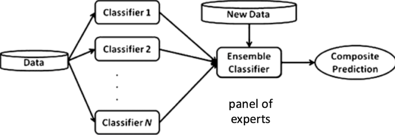
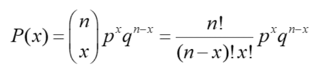
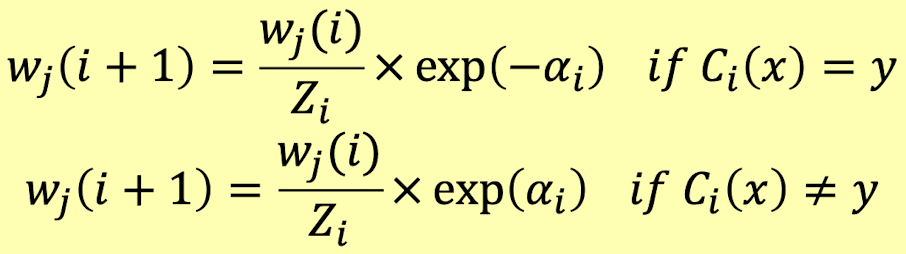
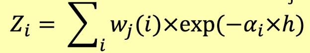

# Metodi d'insieme (AdaBoost e foreste casuali)

## Classificatori d'insieme
Gli insiemi combinano più classificatori di base per formare un classificatore (si spera) migliore. *Un **classificatore d'insieme** è un meta classificatore cioè un classificatore che non implementa un algoritmo di classificazione da solo, ma utilizza altri classificatori di base per svolgere il lavoro vero e proprio.*

L'*idea base* è la seguente:
- costruire un insieme di classificatori di base (esperti) dai dati di addestramento;
- dopo l'addestramento, la previsione di etichette discografiche invisibili si basa su un meccanismo di voto, ovvero aggregando le previsioni fatte dai singoli classificatori

*Perché un gruppo di esperti dovrebbe essere migliore di un singolo esperto?*

## Perché funziona?
Supponiamo che ci siano $n$ classificatori di base (esperti): 
- ogni classificatore di base ha un tasso di errore $\varepsilon$ (probabilità di fare una previsione errata);
- i classificatori sono indipendenti l'uno dall'altro;
- il classificatore d'insieme fa un errore di predizione se più della metà dei classificatori di base fa una predizione errata;
- stimare la probabilità di errore utilizzando la distribuzione di probabilità binomiale.

Possiamo dimostrare il suo funzionamento tramite la **formula di distribuzione binomiale**:

dove:
- $n$ è il numero di prove (o il numero in corso di campionamento);
- $x$ è il numero di successi desiderati;
- $p$ è la probabilità di successo in una prova;
- $q = 1-p$ è la probabilità di ottenere un fallimento in una prova.

## Approcci e tecniche per la costruzione d'insiemi
Avremo principalmente *due approcci di base per la creazione di un insieme di classificatori di base*:
- **generazione di più set di allenamento:** crea diversi set di allenamento ricampionando i dati originali e apprendi un classificatore su ogni set di allenamento;
- **vettori di caratteristiche casuali:** crea diversi classificatori selezionando diversi sottoinsiemi delle caratteristiche originali.

Altri metodi si basano sulla manipolazione di etichette di classe e algoritmi di apprendimento. È possibile utilizzare combinazioni degli approcci di cui sopra.

Avremo tecniche per la costruzione di insiemi tra cui: 
- **AdaBoost (Adaptive Boosting)** è una tecnica basata sulla generazione di più *training set*;
- **foreste decisionali casuali** combinano più generazioni di *training set* (tramite *bagging*) con vettori di caratteristiche casuali.

## AdaBoost
**AdaBoost** si basa sul potenziamento per la generazione di più set di dati. Vengono creati diversi *training set*, a partire da quello iniziale $D$, campionando con sostituzione, quindi un esempio può apparire più volte. Ogni esempio in $D$ viene scelto con una probabilità pari al suo peso.

Inizialmente, a tutti gli esempi vengono assegnati pesi uguali (distribuzione di probabilità uniforme) e viene costruito un primo *training set*. Ad ogni passaggio i pesi vengono modificati, in base ai risultati del passaggio precedente: più difficile è la classificazione di un esempio, maggiore è il suo peso, maggiore è la probabilità di essere selezionati nel set di allenamento successivo (in questo modo il classificatore di base si concentra maggiormente su record precedentemente classificati erroneamente).

Lo pseudo-codice è il seguente:

- impostiamo **$K$ classificatori** e per ognuno di essi generiamo un **training set**, partendo da quello iniziale $D$, per *campionamento con sostituzione* (possiamo ripescare la stessa istanza);
- inizialmente distribuiamo un **$peso = 1$ per ogni istanza** del dataset;
- istruiamo il primo classificatore, in cui **per ogni classificazione errata (*ErrorRate*) si aumenta il peso**, così che il prossimo classificatore possa concentrarsi su di esse: 
    - se l’$ErrorRate > 0.5$, si ricomincia campionando un nuovo training set a seconda dei pesi;
- si valuta l’importanza (**Importance**) del classifier corrente;
- si **aggiornano i pesi** per ogni esempio del dataset.

### Tasso di errore (error rate)
Riferendoci al punto *d* del *for*, sia $D = \{(x_j, y_j)| j = 1, ..., N\}$ il dataset e $W=\{w_j | j = 1,...,N\}$ l'insieme dei pesi degli esempi in $D$.

Il **tasso di errore pesato** di un classificatore $C$ è la somma dei pesi degli esempi erroneamente classificati: 

> $\varepsilon = \sum^n_{j=1} w_i \times h$

dove $h=0$ se $x_i$ è classificato correttamente, $h=1$ altrimenti.

### Valuta importanza (evaluate importance)
Riferendoci al punto *f* del *for*, possiamo parlare della valutazione dell'importanza come: 

> $\alpha_i = \frac{1}{2} \ln{(\frac{1-\varepsilon_i}{\varepsilon_i})}$

### Aggiorna pesi (update weights)
Riferendoci al punto *g* del *for*, sia $w_j(i)$ il peso dell'esempio $e_j=<x, y>$ in $D$ al round $i$, $C_i$ il classificatore appreso al round $i$ e $\alpha_i$ la sua importanza.

Possiamo definire l'**aggiornamento del peso al round $i+1$** come: 

dove $Z_i$ è un fattore di normalizzazione per assicurare che $\sum_j w_j(i+1) = 1$ che possiamo definire come:

dove: 
- $h=1$ se $x$ è classificato correttamente; 
- $h = -1$ se $x$ è classificato in modo errato.

## Foreste casuali (Random Forest)
Una **foresta casuale (RF)** è un **insieme $K$ di [[Alberi decisionali|alberi decisionali]]**. Gli [[Alberi decisionali|alberi decisionali]] sono sensibili a entrambi:
- i dati specifici su cui vengono addestrati (se i dati di addestramento vengono modificati, l'albero decisionale risultante può essere molto diverso);
- la selezione degli attributi di scissione.

L'algoritmo RF combina due approcci per la costruzione d'insiemi: 
- generazione di training set multipli tramite bagging;
- feature bagging, o vettori di attributi casuali, per la selezione degli attributi di suddivisione.

### Insaccamento del training set (training set bagging)
Vengono creati diversi set di addestramento, a partire dal set di dati fornito, mediante **campionamento con sostituzione** (bootstrapping).

Viene utilizzata una distribuzione di probabilità dei dati uniforme, considerata costante nella creazione iterativa dei classificatori di base. Un esempio può apparire più volte in un *training set*.

### Funzionalità dell'insaccamento (feature bagging)
Abbiamo due approcci:

- **primo approccio:** l'attributo di suddivisione di un classificatore di base viene selezionato da un sottoinsieme casuale degli attributi. Sia $K$ le caratteristiche di input nei *training set*: 
    - un numero $n<<K$ di feature viene selezionato a caso tra i $K$ attributi;
    - il miglior attributo (secondo IG, Gini, ChiSquare, ecc.) su queste $k$ caratteristiche viene utilizzato per dividere il nodo;
- **secondo approccio:** l'attributo di suddivisione di un classificatore di base viene selezionato casualmente tra il primo $n$ attributo in base a una metrica (IG, ecc.). $n$ viene mantenuto costante durante la crescita della foresta.

## Conclusione
I modelli sono esperti che si completano a vicenda. Ogni modello è esperto di istanze classificate erroneamente dal precedente nel caso di AdaBoost. Gli insiemi in generale migliorano le prestazioni. Buono per classificatori instabili, cioè classificatori di base sensibili a perturbazioni minori del set di addestramento (ad esempio, d-tree, [[Classificatori basati su regole|classificatori basati su regole]], [[Reti|reti]] neurali).

Il termine **ensemble (insiemi)** è solitamente riservato a metodi che generano più classificatori utilizzando lo stesso studente di base.

Il termine più ampio di **sistemi di classificazione multipli** copre anche l'ibridazione di ipotesi che non sono indotte dallo stesso discente di base.
