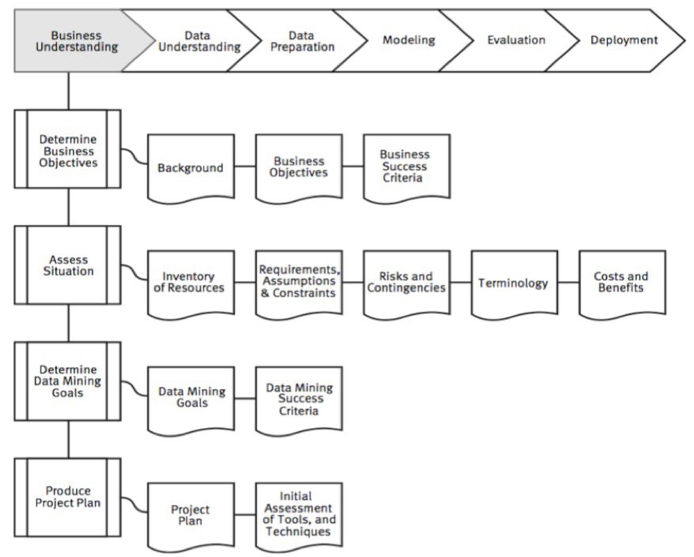
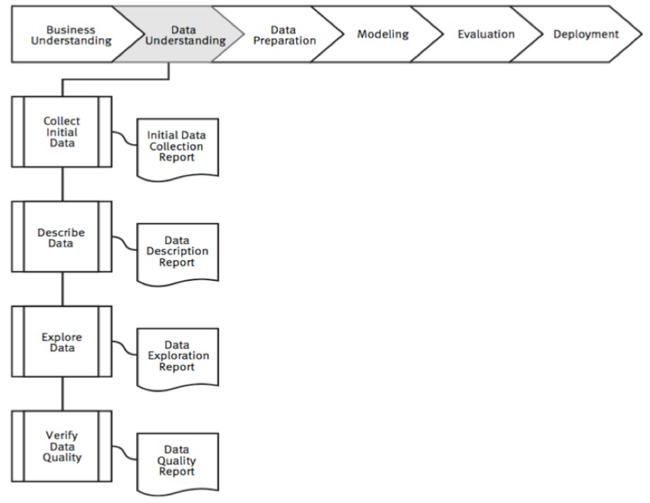
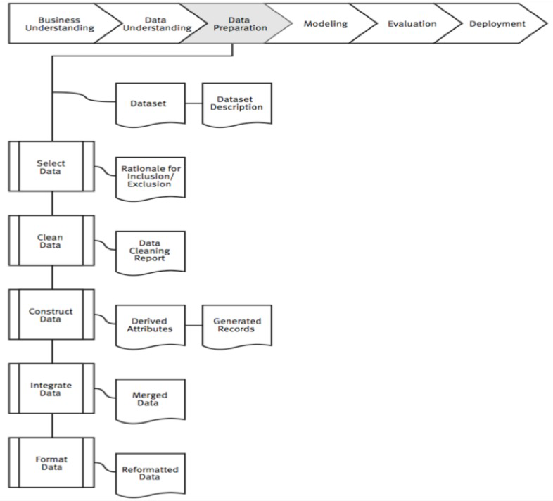
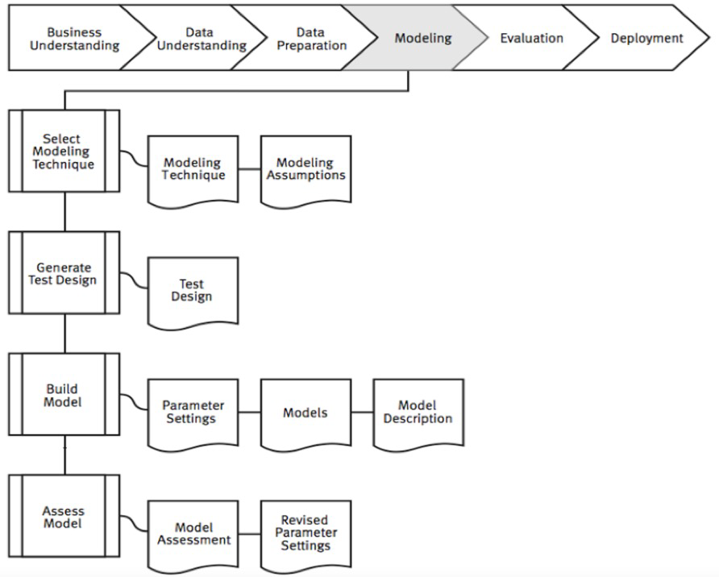
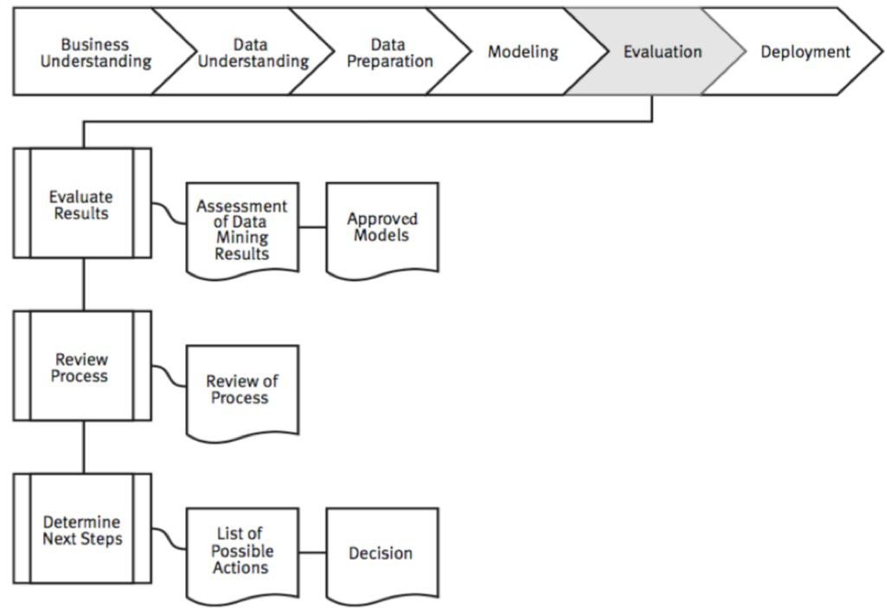
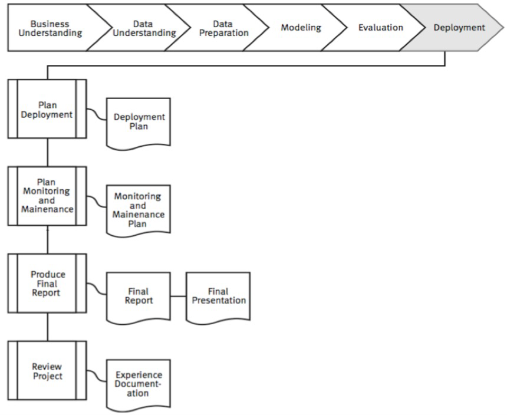

**CRISP-DM** è l'acronimo di **CRoss-Industry Standard Process for Data Mining**, un metodo di comprovata efficacia per l'esecuzione di operazioni di data mining.
- come **metodologia**, comprende descrizioni delle tipiche fasi di un progetto e delle attività incluse in ogni fase e fornisce una spiegazione delle relazioni esistenti tra tali attività;
- come **modello di elaborazione**, CRISP-DM fornisce una panoramica del ciclo di vita del data mining.

La sua metodologia è divisa in diverse fasi:

- **Business Understanding (comprensione aziendale):** comprensione degli obiettivi e dei requisiti del progetto, definizione del problema di DM e piano preliminare progettato per raggiungere gli obiettivi;
- **Data Understanding (comprensione dei dati):** raccolta dati iniziale e familiarizzazione, identificare problemi di qualità dei dati e risultati iniziali e ovvi;
- **Data Preparation (preparazione dei dati):** coinvolgere tutte le attività per costruire il dataset finale dai dati grezzi iniziali, selezione di record e attributi e pulizia e consolidamento dei dati;
- **Modellazione (modeling):** eseguire le tecniche di DM;
- **Valutazione (evaluation):** determinare se i risultati soddisfano gli obiettivi aziendali ed identificare i problemi aziendali che avrebbero dovuto essere risolti in precedenza;
- **Distribuzione (deployment):** metti in pratica i modelli risultanti e configurali per l'estrazione ripetuta/continua dei dati.

## Business Understanding (comprensione aziendale)
In questa fase penseremo alla dichiarazione dell'obiettivo aziendale, alla dichiarazione dell'obiettivo di data mining, alla dichiarazione dei criteri di successo e allo schema del progetto.

### Determine Business Objectives
Questa sotto-fase serve per determinare gli obiettivi aziendali. A sua volta, abbiamo alcune fasi come:
- *background:* registrare le informazioni note sulla situazione aziendale dell'organizzazione;
- *obiettivi aziendali:* descrivere l'obiettivo primario da una prospettiva aziendale;
- *criteri di successo aziendale:* descrivi i criteri che vedrai per determinare se il progetto ha avuto successo.

### Assess Situation
Questa sotto-fase serve per valutare la situazione. A sua volta, abbiamo alcune fasi come:
- *inventario delle risorse:* elenco delle risorse disponibili per il progetto;
- *requisiti, ipotesi e vincoli:* elenco di tutti i requisiti del progetto, delle ipotesi fatte dal progetto ed elenco dei vincoli sul progetto;
- *rischi e imprevisti:* elenco dei rischi o degli eventi che potrebbero ritardare il progetto o causarne il fallimento e elenco delle azioni da intraprendere se si presentano i rischi;
- *terminologia:* glossario della terminologia rilevante per il progetto;
- *costi e benefici:* un'analisi costi-benefici che confronta i costi del progetto con i potenziali benefici.

### Determine Data Mining Goals
Questa sotto-fase serve per determinare gli obiettivi del data mining. A sua volta, abbiamo alcune fasi come:
- *obiettivi di data mining:* descrivere gli output previsti che consentono il raggiungimento degli obiettivi del progetto;
- *criteri di successo del data mining:* definire i criteri per un esito positivo.

### Produce Project Plan
Questa sotto-fase serve per produrre lo schema di progetto. A sua volta, abbiamo alcune fasi come:
- *schema del progetto:* elenco delle fasi da eseguire, insieme alla loro durata, risorse richieste, input, output e dipendenze;
- *valutazione iniziale di strumenti e tecniche:* selezionare uno strumento di data mining che supporti vari metodi per diverse fasi.

## Data Understanding (comprensione dei dati)
In questa fase penseremo all'acquisizione dei dati e all'esplorazione e verifica dei dati.

### Collect Initial Data
Questa sotto-fase serve per definire un *rapporto di raccolta dati iniziale*: si elencano le fonti di dati acquisite, il metodo utilizzato per acquisirli e gli eventuali problemi riscontrati (e le eventuali risoluzioni raggiunte).

### Describe Data
Questa sotto-fase serve per definire un *rapporto di descrizione dei dati*: si descrivono i dati che sono stati acquisiti includendo il loro formato, la loro quantità, ecc.

### Explore Data
Questa sotto-fase serve per definire un *rapporto sull'esplorazione dei dati*: si descrivono i risultati dell'esplorazione dei dati e si includono grafici per indicare le caratteristiche dei dati.

### Verify Data Quality
Questa sotto-fase serve per definire un *rapporto sulla qualità dei dati*: elenca i risultati della verifica della qualità dei dati e, in caso di problemi, suggerisci possibili soluzioni.

## Data Preparation (preparazione dei dati)
In questa fase penseremo alla selezione, alla preparazione dei dati e alla costruizione del dataset finale dai dati grezzi iniziali.

### Select Data
Questa sotto-fase serve per definire una *motivazione dell'inclusione/esclusione*: si elencano i dati da includere/escludere e le ragioni di queste decisioni.

### Clean Data
Questa sotto-fase serve per definire un *rapporto sulla pulizia dei dati*: si descrivono le decisioni e le azioni intraprese per risolvere i problemi di qualità dei dati.

### Construct Data
Questa sotto-fase serve per definire gli *attributi derivati* ed i *record generati*: nuovi attributi costruiti da uno o più attributi esistenti e si descrivono la creazione di qualsiasi record completamente nuovo.

### Integrate Data
Questa sotto-fase serve per definire *dati uniti* per unire insieme due o più tabelle che hanno informazioni diverse sugli stessi oggetti.

### Format Data
Questa sotto-fase serve per definire *dati riformattati* per soddisfare i requisiti dello strumento di modellazione.

## Modellazione (modeling)
In questa fase penseremo alla selezione delle tecniche di modellazione, all'ottimizzazione dei parametri e alla valutazione del modello.

### Select Modeling Technique
Questa sotto-fase serve per definire la *tecnica di modellazione* ed i *resupposti di modellazione*: si documenta la tecnica di modellazione che verrà utilizzata e si registra eventuali presupposti sui dati necessari per le tecniche di modellazione.

### Generate Test Design
Questa sotto-fase serve per definire il *progetto di prova*: si descrive come suddividere il dataset disponibile in dataset di addestramento, test e convalida.

### Build Model
Questa sotto-fase serve per definire:
- *impostazioni dei parametri:* con qualsiasi strumento di modellazione, ci sono spesso un gran numero di parametri che possono essere regolati, elencando i parametri e i loro valori scelti;
- *modelli:* i modelli effettivi prodotti dallo strumento di modellazione;
- *descrizione del modello:* descrivi i modelli risultanti.

### Assess Model
Questa sotto-fase serve per definire:
- **valutazione del modello:** si elencano le qualità dei tuoi modelli generati e classifica la loro qualità in relazione l'una con l'altra;
- **impostazioni dei parametri riviste:** in base alla valutazione del modello, rivedere le impostazioni dei parametri e ottimizzarle per la successiva esecuzione di modellazione e iterare finché non si è fermamente convinti di aver trovato i modelli migliori.

## Valutazione (evaluation)
In questa fase penseremo alla valutazione del modello (come ha funzionato sui dati di test), ai metodi e i criteri dipendono dal tipo di modello (ad es. matrice di coincidenza con modelli di classificazione, tasso di errore medio con modelli di regressione) e all'interpretazione del modello: importante o meno, facile o difficile dipende dall'algoritmo.

### Evaluate Results
Questa sotto-fase serve per definire:
- *valutazione dei risultati del data mining:* riassumere i risultati della valutazione in termini di criteri di successo aziendale;
- *modelli approvati:* dopo aver valutato i modelli rispetto ai criteri di successo aziendale, i modelli generati che soddisfano i criteri selezionati diventano i modelli approvati.

### Review Process
Questa sotto-fase serve per la definizione della *revisione del processo*: riassumi la revisione del processo ed evidenzia le attività che sono state perse e quelle che dovrebbero essere ripetute.

### Determine Next Steps
Questa sotto-fase serve per definire:
- *elenco di azioni possibili:* elenca le potenziali ulteriori azioni;
- *decisione:* descrivere la decisione su come procedere.

## Distribuzione (deployment)
In questa fase penseremo a determinare come devono essere utilizzati i risultati, chi deve utilizzarli, quanto spesso devono essere utilizzati e alla distribuire i risultati del data mining assegnando un punteggio a un database e sfruttando i risultati come regole aziendali.

### Plan Deployment
Questa sotto-fase serve per la definizione del *piano di distribuzione*: riepiloga la tua strategia di distribuzione, compresi i passaggi necessari e come eseguirli.

### Plan Monitoring and Maintenance
Questa sotto-fase serve per il *piano di monitoraggio e manutenzione*: riassumere la strategia di monitoraggio e manutenzione.

### Produce Final Report
Questa sotto-fase serve per definire:
- *rapporto finale;*
- *presentazione finale:* incontro a conclusione del progetto in cui vengono presentati i risultati.

### Review Project
Questa sotto-fase serve per la definizione della *documentazione dell'esperienza*: riassumere l'esperienza importante acquisita durante il progetto.
