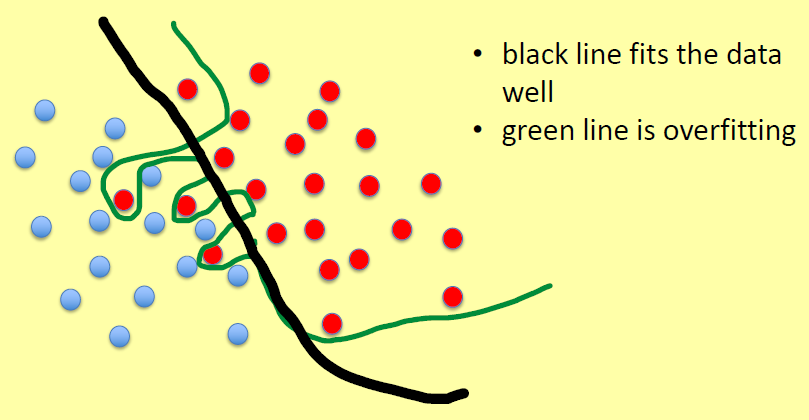

## Modello overfitting
Sfortunatamente, i training set del mondo reale sono generalmente influenzati dalla presenza di errori (rumore) o non sono statisticamente rappresentativi, quindi potrebbero non essere buone rappresentazioni dei dati complessivi.

Un'ipotesi *che si adatta eccessivamente* al training set può quindi funzionare molto bene su di esso, ma avere capacità di generalizzazione molto scarse.

Il **modello overfitting** è quindi un problema pratico nell'apprendimento dei classificatori da set di dati del mondo reale.

Per definizione, si dice che un'ipotesi *h* **si adatta eccessivamente** ai dati di addestramento se esiste un'altra ipotesi *h'* tale che *h* ha un errore minore sugli esempi di addestramento, ma *h'* ha un errore minore sugli esempi non visti, cioè, una migliore capacità di generalizzazione.

Un buon algoritmo di apprendimento è in grado di catturare le proprietà strutturali dei dati piuttosto che quelle contingenti, ovvero non deve adattarsi eccessivamente ai dati.

## Prevenzione dell'overfitting
L'aumento della complessità di un'ipotesi in genere comporta una diminuzione delle sue capacità di generalizzazione: diventa più probabile che si adatti ad alcuni degli esempi rumorosi del training set.

Le ipotesi semplici non si adattano ai dati in modo troppo specifico, quindi sono meno sensibili alle proprietà contingenti dei dati.

**Preferire le ipotesi semplici a quelle complesse.**

## Inductive Learning Assumption (ILA)
Qualsiasi ipotesi trovata che ben approssima la target function su un dataset sufficiente grande sarà in grado di approssimare per bene la target function sui nuovi esempi nel test set.

## Riepilogo
*Imparare da esempi sbagliati comporta modelli sbagliati.* La generalizzazione basata su esempi non rappresentativi di un intero gruppo può portare a conclusioni errate (generalizzazione frettolosa) ad esempio un pinguino è un uccello che non vola oppure tutti gli uccelli non volano.

*Un modello che sovradimensiona i dati di addestramento*, mostrando quindi scarse capacità di generalizzazione, *può essere affetto da uno qualsiasi di questi problemi.*
