## Struttura del 2-layer NN
Le caratteristiche del **2-layer NN** sono:
- l'indice di conteggio inizia dal primo layer nascosto fino al layer di output;
- ogni nodo di un livello è connesso a tutti i nodi del livello successivo (feed-forward, NN completamente connesso);
- in linea di principio, un NN può avere un numero qualsiasi di strati nascosti;
- un NN con 1 o 2 strati nascosti è chiamato *NN poco profondo*, altrimenti *NN profondo*;

    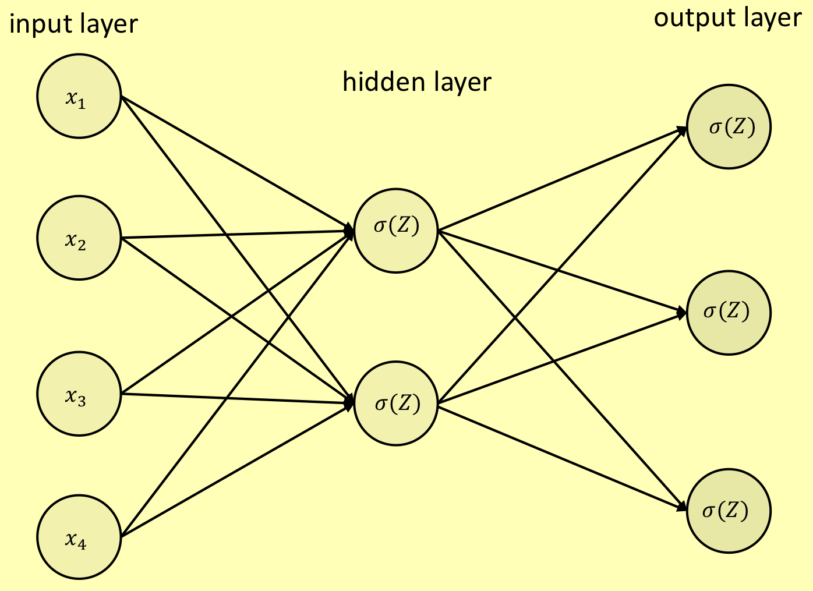

- i nodi sia nello strato nascosto che in quello di output sono neuroni sigmoidei, quindi ogni neurone calcola il valore di attivazione $ \sigma (Z)$. 

### Feed-forward (NN completamente connesso)

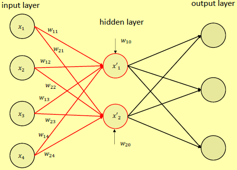

L'input viene propagato ai nodi del (primo) strato nascosto tramite il calcolo: 

> $x'_1 = \sigma (\sum_{i=0,4} w_{1i}x_i)$ \ $x'_2 = \sigma (\sum_{i=0,4} w_{2i}x_i)$

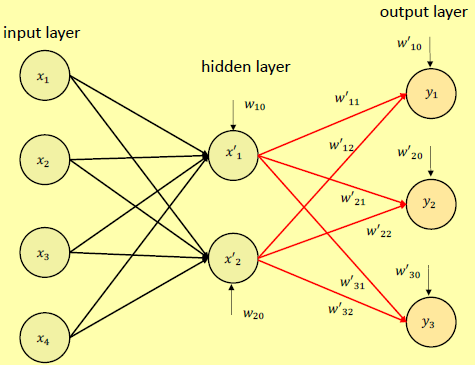

Le attivazioni $x'_i$ vengono poi propagate ai nodi del layer successivo (output) tramite il calcolo: 

> $y_1 = \sigma (\sum_{i=0,2} w'_{1i}x_i)$ \ 
> $y_2 = \sigma (\sum_{i=0,2} w'_{2i}x_i)$ \ 
> $y_3 = \sigma (\sum_{i=0,2} w'_{3i}x_i)$

Ad esempio:

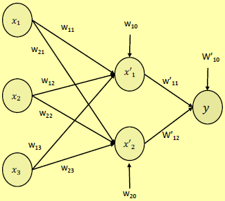

> $x'_1 = \sigma (w_{10} + w_{11}x_1 + w_{12}x_2 + w_{13}x_3)$ \ 
> $x'_2 = \sigma (w_{20} + w_{21}x_1 + w_{22}x_2 + w_{23}x_3)$ \ 
> $y = \sigma (w'_{10} + w_{11}x_1 + w_{12}x_2)$

### Errore

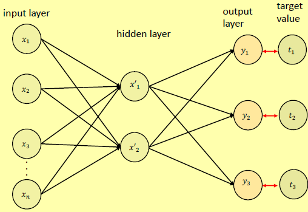

Quando viene fornito un esempio di addestramento $d = <x_1, ..., x_n>$, viene propagato attraverso NN per generare i valori di output. Ogni nodo di output ha un errore $\left | t_i - y_i \right |$ e l'errore associato a $d$ è: 

> $\varepsilon_d (W) = \frac{1}{2} \sum_{i=1,n} (y_i - t_i)^2$

## Addestrare una rete neurale

Addestrare un NN significa assegnare pesi e distorsioni a tutti gli archi e nodi, rispettivamente, in modo tale da calcolare la funzione target, con un certo grado di approssimazione. Ogni assegnazione di pesi e distorsioni rappresenta un'**ipotesi**. Lo spazio delle ipotesi è l'insieme di tutte le possibili ipotesi. Lo spazio delle ipotesi è **continuo**, a differenza dello spazio delle ipotesi degli [[Alberi decisionali|alberi decisionali]], dei [[Classificatori basati su regole|classificatori basati su regole]], ecc.

## Esempio di NN per classificare le cifre scritte a mano

I punti principali di una NN per classificare le cifre scritte a mano sono:
- **Task:** riconoscere immagini che rappresentano numeri scritti a mano;
- **Input:** immagini di numeri scritti a mano 0-9;
- **Output:** il numero corretto associato a una determinata immagine.

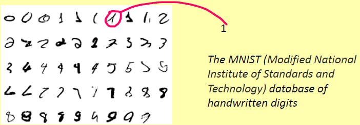

Nello specifico: 
- **input:** una cifra è rappresentata come un'immagine di $28*28=784$ pixel. Ogni pixel di input è in scala di grigi, con un valore di $1,0$ che rappresenta il bianco e un valore di $0,0$ che rappresenta il nero; 
    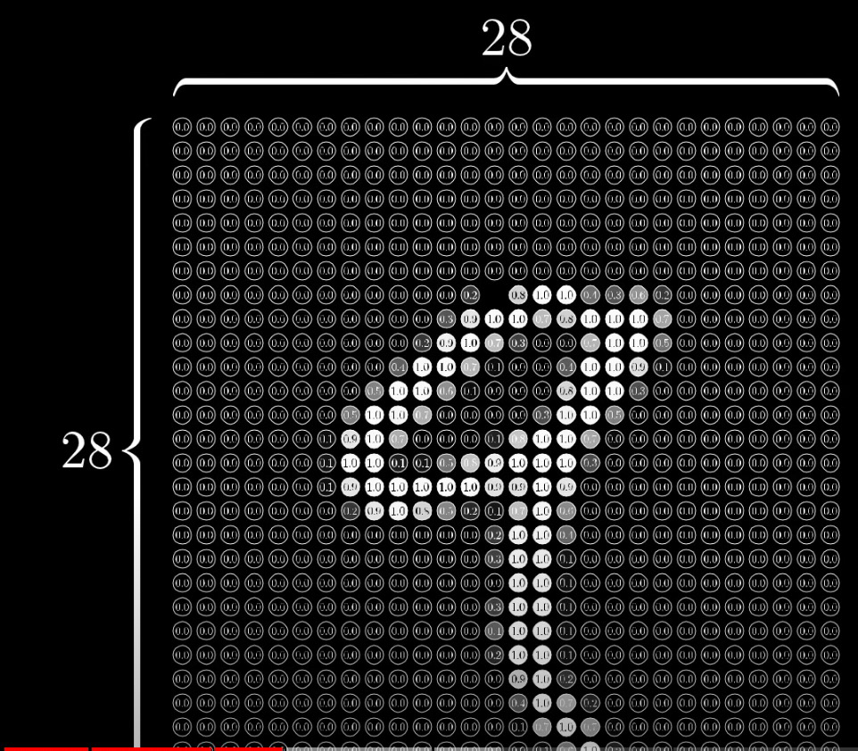
- **livello di input:** 784 nodi di input che codificano i valori (tra 0 e 1) dei pixel;
- **livello di output:** 10 neuroni, ciascuno associato a un valore di output. Ogni neurone ha un valore di attivazione compreso tra 0 e 1. Se, ad esempio, l'ultimo neurone ha il valore più alto, l'output è 9;
- due strati nascosti, ognuno composto da 16 nodi; 
    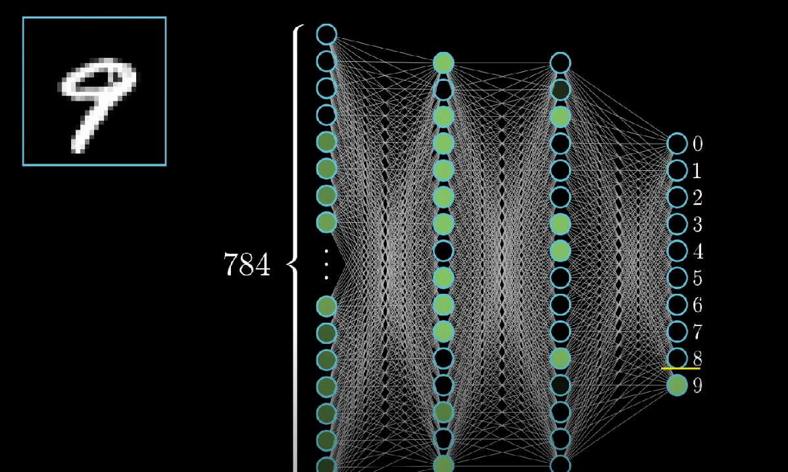
- addestrare questo NN significa assegnare valori a tutti i 13.002 parametri in modo tale da minimizzare l'errore.

### Errore
Supponiamo che l'input sia una rappresentazione della cifra 2. Quindi il numero del nodo di output 2 dovrebbe essere 1, tutti gli altri sono 0. Altrimenti c'è un errore: 
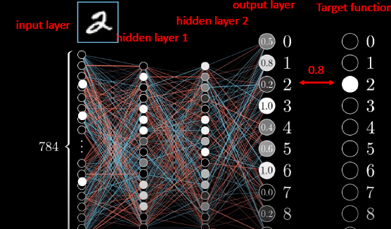

> $\varepsilon_d (W) = \frac{1}{2} \sum_{i=1}^{10} (y_i - t_i)^2$

dove $y_i$ è il valore dell'i-esimo nodo di output e $t_i$ il rispettivo valore target. 
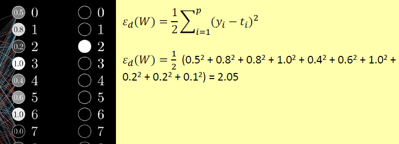

**NOTA:** W è l'insieme dei parametri di rete (pesi e distorsioni) che, nel nostro caso, ha 13.002 elementi. $\varepsilon (W)$ è una funzione davvero complicata!

Per migliorare questo output, dovremmo aumentare il valore del nodo di output 2 (da 0,2 a 1,0) e diminuire i valori di altri nodi, ad esempio i nodi 1, 3 e 6. *Come facciamo questo lavoro?* 
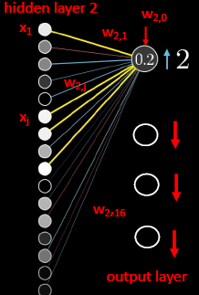

Matematicamente tramite:

> $y_2 = 0,2 = \sigma (w_{2,0} + w_{2,1}x_1 + ... + w_{2,16}x_{16})$

dove $\sigma$ è la funzione sigmoidea e $x_1, ..., x_{16}$ sono i valori di attivazione dei nodi del secondo strato nascosto. Per aumentare $y_2$ potremmo aumentare: 
- i pesi $w_{2,0}, ..., w_{2,16}$;
- i valori di attivazione $x_1, ..., x_{16}$.

**NOTA:** oltre ad aumentare il valore del nodo di output 2, dobbiamo abbassare i valori degli altri nodi di output.

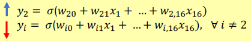

Possiamo lavorare via diverse strategie: 
- **aumenta il peso;**
- **aumentare le attivazioni;**
- **retropropagazione (backpropagation).**

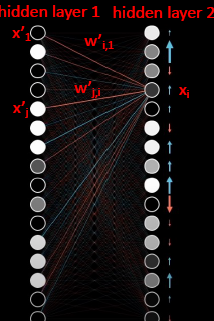

### Aumenta il peso
$w_{2,j} (1 \leq j \leq 16)$ in proporzione a: 
- l'errore $\varepsilon_{y2} = \left | y_2 - t_2 \right |$, dove $t_2$ è il valore target per il nodo 2;
- l'attivazione $x_j$, perché le connessioni con le più alte attivazioni hanno l'effetto maggiore.

Cioè: 

> $\Delta w_{2,j} \approx \varepsilon_{y2}*x_{j}$, per ogni $j$ tale che $1 \leq j \leq 16$

### Aumentare le attivazioni
Richiama questo: 

> $y_i = \sigma (w'_{i,0} + w'_{i,1}x_1 + ... + w'_{i,16}x_{16})$

dove $x'_i$ è l'attivazione dell'i-esimo nodo del precedente strato nascosto, e $w'_{ij}$ è il peso da $x'_j$ al nodo $x_i$ dello strato nascosto 2.
Quindi per cambiare $x_i$ dobbiamo cambiare i pesi e le attivazioni del livello precedente, come abbiamo fatto per i nodi di output.

*Il problema è che i valori di destinazione vengono forniti solo per i nodi di output, in modo che l'errore dei nodi nascosti non sia disponibile.*

### Retropropagazione (backpropagation)
Ed è qui che entra in gioco l'idea della retropropagazione:

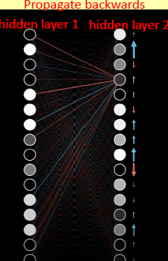

- aggiorna i valori di output aggiornando i rispettivi pesi dal livello nascosto 2. I pesi vengono modificati in proporzione all'errore $\varepsilon$ e alle attivazioni $x_i$ del livello nascosto 2;
- aggiorna ogni xi nel livello nascosto 2 modificando i rispettivi pesi dal livello nascosto 1. I pesi vengono modificati in proporzione all' "errore" e alle attivazioni dei nodi del livello nascosto 1;
- questo viene applicato in modo ricorsivo a tutti i precedenti livelli nascosti della rete (se presenti).
