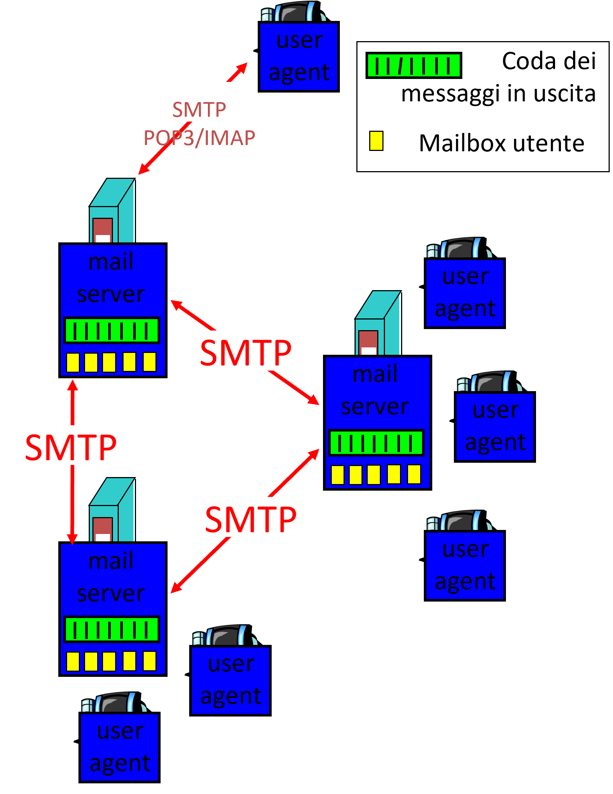
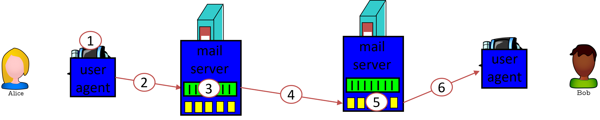
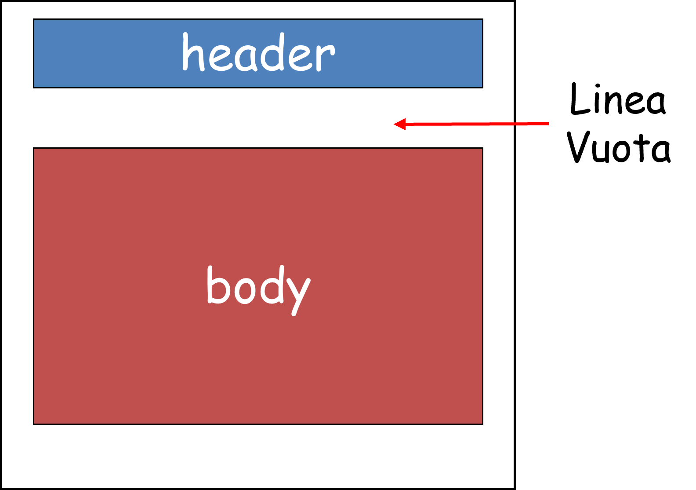
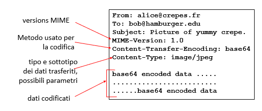
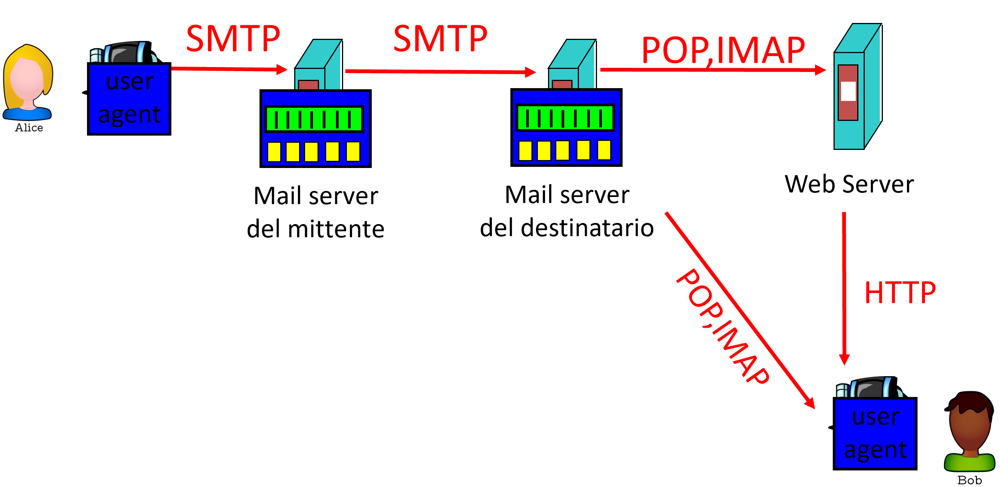
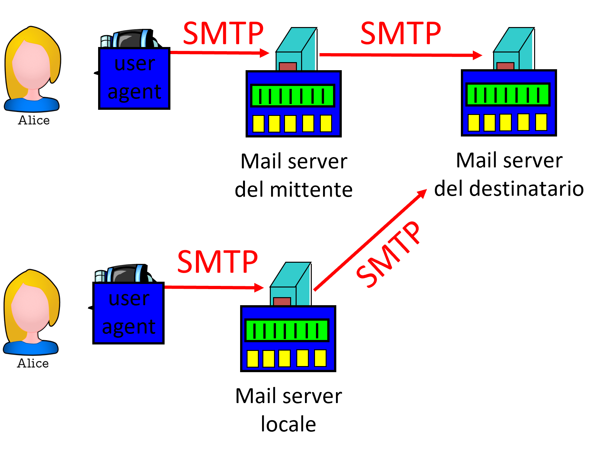
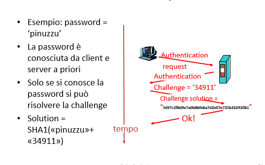

## SMTP (Simple Mail Transfer Protocol)
L'**SMTP (Simple Mail Transfer Protocol)** è un protocollo basato su messaggi testuali, che permette di scambiare un'email tra un client e un server. Viene definito nell'RFC 2821, è basato su TCP e rimane in ascolto ad una delle seguenti porte: *25*, *465*, *587* le cui ultime due hanno un layer di protezione. 

È composta da tre componenti: *client di posta* (ad esempio Outlook, Eudora, ecc.), *server di posta* e il *protocollo SMTP* stesso.

I protocolli per la lettura sono *IMAP* e *POP3* e il meccanismo di comunicazione è il seguente: i messaggi in arrivo risiedono sul server, dove è presente una *mail server*.

Quando si parla di *server* si parla di **mail exchanger (o mail server)** che non è necessariamente uno e ci potrebbero essere dei forwarding ad altri per l'ottimizzazione del carico.
Ogni *mail server* ha un programma di gestione della posta ed ha una coda di messaggi dal elaborare: sta in attesa di un messaggio da elaborare, scambia messaggi con altri mail server e per questo viene definito *mail exchange*.

Il trasferimento avviene in **tre fasi**: *handshaking*, *trasferimento dei messaggi* e *quit*. Ciascuna fase è codificata nel formato:
> $$ Comando \rightarrow Risposta $$

**Cosa succede quando un email viene mandata da un punto A ad un punto B?** Tutti e due i punti hanno bisogno di uno user agent e comunicano nel seguente modo:
1. composizione del messaggio dal punto A inserendo il campo del destinatario (punto B) (la parte dopo la chiocciola definisce l'infrastruttura che gestisce le mail di quell'organizzazione);
2. l'user agent manda il messaggio al mail server dell'organizzazione e il messaggio viene messo in coda;
3. è identificare il mail server del destinatario e, se viene identificato correttamente, apre una connessione con il mail server del destinatario;
4. inviare il messaggio al mail server del destinatario tramite una connessione TCP, finendo nella coda delle mail;
5. salvare il messaggio sulla mail box dal mail server del destinatario;
6. lettura del messaggio, a scelta del destinatario, connettendosi al mail server del destinatario usando un protocollo per la lettura dei messaggi.

### Alcune considerazioni
Il protocollo SMTP usa connessioni TCP, il formato ASCII a 7 bit e CRLF.CRLF per determinare la fine di un messaggio. Rispetto ad HTTP, l'HTTP è di tipo *pull* ed ogni oggetto viaggia di solito con una connessione separata mentre l'SMTP è di tipo *push* e tutti gli allegati viaggiano in sequenza sulla stessa connessione, entrambi funzionano con comandi ASCII facilmente interpretabili.

### Formato dei messaggi
Il formato dei messaggi è definito nello standard RFC 822 ed è composta da un intestazione ed un body. L'*intestazione* troviamo il mittente, il destinatario, l'oggetto e altre informazioni riguardante il body. Il *body* è il messaggio, solo caratteri ASCII a 7 bit validi.

Durante la trasmissione vengono usati anche altri protocolli tra cui si ricorda **MIME (Multimedia mail extension RFC 2045-2056)** che definisce in che modo devono essere codificati gli allegati e la formattazione dell'email.

### Leggere la posta

In questo caso, il protocollo SMTP serve solo per la trasmissione, **non per la consultazione**. Abbiamo vari protocolli per l'accesso all'email:
- **POP: Post Office Protocol [RfC 1939]:** per autorizzazione e download;
- **IMAP: Internet Mail Access Protocol [RfC 1730]:** più sofisticato e si possono manipolare i messaggi sul server;
- **HTTP:** Hotmail , Yahoo! Mail, ecc.

### Inviare la posta

Ogni SMTP server ha la porta SMTP che accetta messaggi in ingresso. Un server SMTP ben configurato accetta SOLO e-mail con:
- indirizzo mittente del proprio dominio da qualsiasi indirizzo IP di provenienza purché con connessione autenticata;
- indirizzo destinatario del proprio dominio, qualsiasi mittente, qualsiasi server trasmittente con certe caratteristiche;
- e-mail di qualsiasi genere purchè proveniente da indirizzo IP della propria sottorete.

Nel POP3 ha due fasi:
- **fase di autorizzazione (no handshaking)** in cui vengono chiesti due parametri (*username* e *password*) in chiaro (POP3S versione sicura) a cui viene risposto con un errore o un OK. Per non passare i parametri in chiaro, viene usata un'autenticazione cosiddetta **CHAP** e cioè a challenge: viene proposta una sfida algebrica risolvibile solamente una volta da quell'utente e soprattutto se conosci la password corretta (Viene creato una sottospecie di digest del messaggio);
    
    
    
- **fase di lettura**, svolta dal client con alcuni comandi: abbiamo un *list* che elenca i numeri di messaggi, *retr* recupera il messaggio in base al numero, *dele* cancella il messaggio e *quit*.

La differenza sostanziale tra POP3 e IMAP è che quest'ultimo è più sofisticato e permette di creare un sistema di directory direttamente sul server e ne permette un'organizzazione più efficiente. 

### Alcune lati negativi
I protocolli di posta purtroppo non nascono per garantire la confidenzialità delle informazioni e dell'autenticità degli autori. Infatti le mail per esigenze pratiche vengono memorizzate all'interno dei server o in chiaro oppure con crittografia reversibile (simmetrica). Inoltre per l'invio di una email, l'autenticazione (SMTP) non è necessaria, pertanto vengono adottati alcuni sistemi che ne permettono la verifica. Ricordiamo in particolare DKIM che è una firma digitale di autenticazione, può essere utile per controllare anche l'integrità della email ma non tutti i server la utilizzano quindi non è affidabile al 100%. 

## DNS (Domain Name System)
Acronimo di **Domain Name System**, serve a tradurre degli alias (per esempio, *www.google.it* è *Fully Qualified Domain Name (FQDN)*) nei corrispondenti indirizzi IP (*query di tipo A* in *alias*). È un protocollo applicativo di supporto (UDP: 53), denominato anche "glue protocol". 

Ogni query DNS ha un proprio ID che permette di identificare univocamente una comunicazione. Non c'è alcuna garanzia sulla confidenzialità e sull'autenticità delle query responses (Dns over HTTPS/TLS) 

Le risposte che provengono da un DNS possono essere di due tipi:
- **autoritative:** se la risposta proviene dal server "custode" del l'indirizzo che si sta cercando;
- **non-autoritative:** la risposta è da intendersi di "seconda mano" cioè proviene da un altro server tramite un forwarding.

### Tipologie di server DNS
- **Server autoritativo di dominio:** risponde direttamente per la propria "zona" e conosce i server autoritativi per i propri sottodomini fuori "zona";
- **Server root:** autoritativo per il top della gerarchia;
- **Server locale:** funge da "resolver".

### TLD e server autoritari
- **Server dei domini di primo livello (TLD):** responsabili dei domini *.com*, *.org*, *.net*, *.edu*, ecc e di tutti i domini nazionali di primo livello *.uk*, *.fr*, *.ca*, *.jp*;
- **Server DNS autorevoli:** server DNS dell'organizzazione, che forniscono una mappatura autorevole tra hostname e IP per i server dell'organizzazione (ad esempio, web e posta). Possono essere gestiti dall'organizzazione o dal fornitore di servizi.

*I root server sono molto "delicati" e chiunque li possegga è "padrone" di internet. Si potrebbe infatti causare volontariamente un **CACHE POISONING** e quindi modificare l'indirizzo a cui inoltrare le request. I DNS aggiungono informazioni alla richiesta del client per ottimizzare la rete e affinché quest'ultimo non debba fare ulteriori richieste al DNS. Questo naturalmente può essere sfruttato per causare ingenti danni.*

La ricerca di un *Domain Name* può essere fatta:
- **iterativamente:** le richieste vengono palleggiate tra resolver e i corrispondenti server autoritativi fino a che non si trova il server corretto. I vantaggi sono: *alta distribuzione di carico* e *probabilità inferiore per attacchi DOS*;
- **ricorsivamente:** la richiesta non viene palleggiata tra il resolver e i server ma viene ricercata direttamente dal root server in modo ricorsivo e gli viene fornito il risultato immediatamente. Lo svantaggio è le *alte probabilità di DOS*.

*Esistono delle infrastrutture chiamate **CDN (Content Distribution Network)** che permettono di distribuire le risorse di un sito su più server e tramite le risposte DNS forniscono all'interlocutore l'indirizzo IP geograficamente più vicino a lui. Si diminuiscono latenze e conseguenzialmente il carico della rete geografica.*
