Il **livello trasporto** lo possiamo definirlo come un livello intermediario che permette di far comunicare due applicativi. A sua volta, il livello quattro si appoggia su un API attraverso la quale inoltra le informazioni al *livello rete* (datagramma: IP sorgente + IP destinatario + dati). Il terzo livello è detto *poco affidabile* (*best-efforts*) poiché non si ha la certezza che le informazioni vengano effettivamente recapitate all'utente finale e soprattutto non è detto che le informazioni rispettano l'ordine di invio.

In particolare vedremo tre protocolli del livello trasporto: **TCP**, **UDP** e **ICMP**.

Ci possiamo interfaccarci con il livello rete tramite 3 diverse funzionalità: **funzioni di invio**, **funzioni di ricezione** e **funzioni di connessione**.

**Com'è connesso TCP, UDP e ICMP allo strato applicazione?** Sullo strato applicazione, ci sono funzioni di libreria per aprire, chiudere, scrivere e leggere da socket mentre, sul livello trasporto, c'è una libreria del SO, detta STACK TCP/IP, che si occupa di "sbucciare" e "smistare" i messaggi in base ai numeri di porta e al protocollo utilizzato.

## UDP
Un **pacchetto UDP** è costituito dai seguenti campi: 

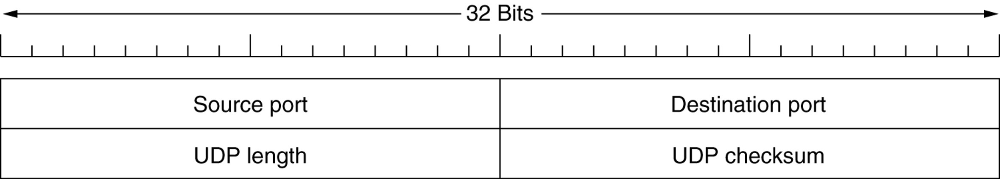

Il protocollo UDP confeziona un datagramma standard più i dati che vogliamo mandare. In generale, questo protocollo risolve solo i problemi di corruzione dei pacchetti e ci dà la possibilità di differenziare il traffico per numero di porta. Ad esempio, il protocollo DNS usa il protocollo UDP.

L'UDP offre due funzioni principali:
- **Demultiplexing/Multiplexing:** 
    - un host H riceve datagrammi IP: in questo pacchetto sono menzionati porta sorgente e destinazione;
    - H usa gli indirizzi IP e i numeri di porta per distribuire i pacchetti L4 nel socket giusto;
    - in UDP ci si mette in listening su una porta e si riceve qualsiasi cosa. Sta poi all'applicativo (Java/Python) specificare come verranno smistati i pacchetti sulla scorta della porta sorgente. 
- **CheckSumming:** 
    - permette di rilevare eventuali corruzioni spontanee dei dati (non c'è assoluta precisione, immagina uno scompenso complementare dei dati, il risultato della somma è sempre lo stesso). Naturalmente non previene manomissioni volontarie (ed è un problema). Viene realizzato un circuito apposito all'interno della scheda di rete per effettuare questo controllo (*CheckSum OffLoad*);
    - per evitare corruzioni malevole vengono usate i *MIC/MAC* (*Message Integrity Codes/Messages Authenitcation Codes*) 

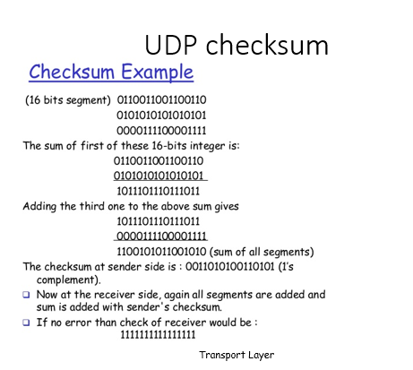

## TCP
Le **comunicazioni TCP** sono full-duplex pertanto entrambi gli interlocutori possono inviare/ricevere dati. Si vede necessario introdurre un metodo di enumerazione dei pacchetti che permette di capire se le informazioni sono arrivate o meno: per garantire l'affidabilità (*RDT, Reliable Data Transfer*), ad ogni fase di invio corrisponde, nel caso di successo, una fase di *acknownedgment (ACK)* in cui viene specificato il prossimo byte che il ricevente desidera sapere.

Si evidenziano altri campi tra cui: 
- ** *Win*:** controllo di flusso che evita che i due interlocutori non si congestionino. Modificando questo parametro si possono creare *Denial of Service*. Si mette il buffer a zero oppure con valore molto alto per occupare/intasare il ricevente;
- ** *Len*:** lunghezza del pacchetto.

Per garantire l'affidabilità, ci sono diverse strategie:
- **Stop&Wait:** ad ogni pacchetto viene specificato un *TTL (Time to Live)* se non si perviene risposta viene rimandato;
- **Go-Back-N**;
- **Selecting-Repeat**; 

***In TCP vengono usate queste ultime 2 strategie simultaneamente cercando di prendere il meglio dei due mondi.***
## Protocollo *Stop&Wait*

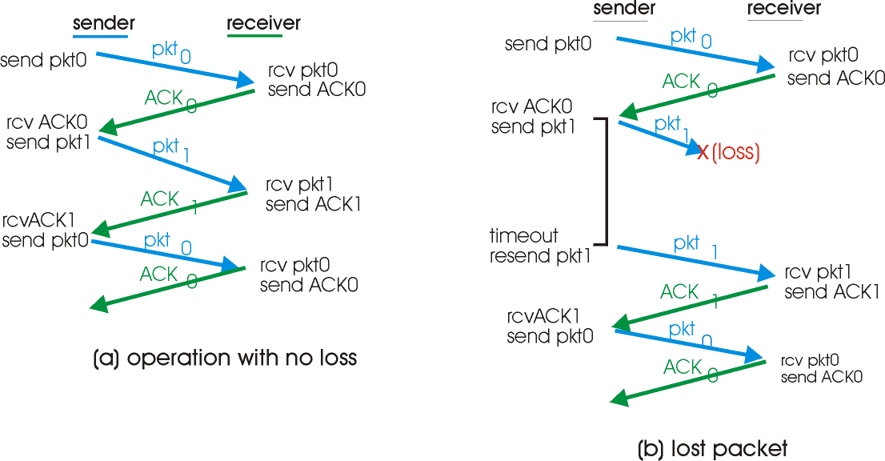

Possono capitare altri scenari: 
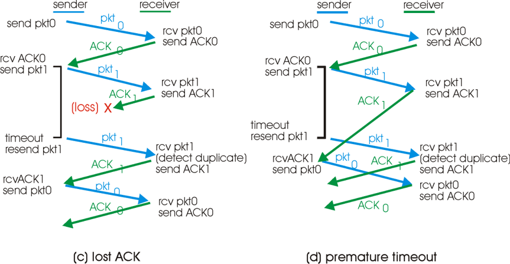
    
Naturalmente, quando un pacchetto viene inviato più volte, causa perdite o un apparente ritardo, il receiver lo scarta per evitare ridondanza e si limita a riutilizzare la stessa ricevuta di ritorno (ACK) mai consegnata. Questa metodologia soffre di diversi problemi, essendo inviato un pacchetto alla volta le latenze sono maggiori oltre che c'è un uso inefficiente la banda.
    
Facciamo un esempio di performance con una banda *1 Gbps*, *30 ms* RTT, pacchetti da *1 KB*: 
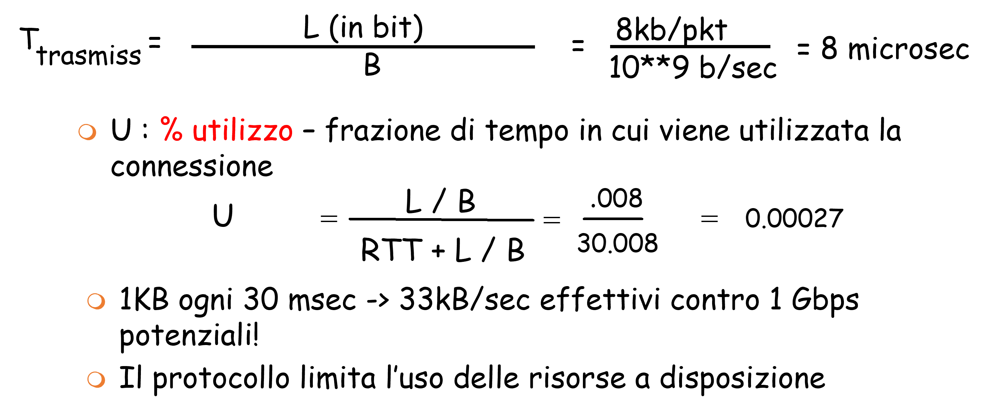
    
*Da dove deriva la formula?* 
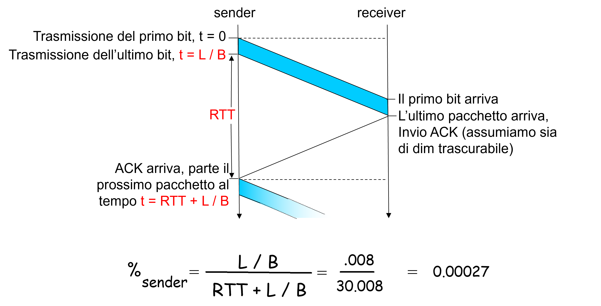

Nel vero TCP si mandano i **pacchetti a raffica (modalità pipeline)**
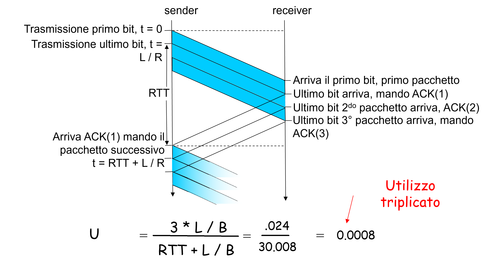

## Protocollo *Go-Back-N*
In questo protocollo (detto a *finestra scorrevole* con cui si indica il numero di pacchetti non confermati possibili) non è necessario che tutte le ricevute di ritorno siano recapitate al mittente. Infatti le ricevute sono ***cumulative***, cioè se arriva un ricevuta con *id=3* è da intendersi che tutte quelle precedenti sono state ricevute e confermate dal destinatario. È il comportamento di default di TCP.

Questa strategia ha come lato positivo la perdita di pacchetti è compensata dall'effetto cumulativo e come lato negativo l'inefficienza perché ci sono numerose ritrasmissioni.

## Protocollo *Selecting-Repeat*
È un protocollo a finestra scorrevole che permette di gestire eventuali buchi nello stream. I pacchetti corretti sono confermati individualmente e sono conservati in attesa che possano essere rilasciati. Il mittente si limita a rimandare i pacchetti non confermati. 

Esiste anche la **sconferma selettiva** (*negative ACK*, abbatte i tempi di time-out) dove in questo caso è il destinatario a comunicare, anche insistentemente, che non gli sono arrivati alcuni dati. In Wireshark, il protocollo **Selecting-Repeat** si riconosce dalle diciture *SLE-SRE*. 

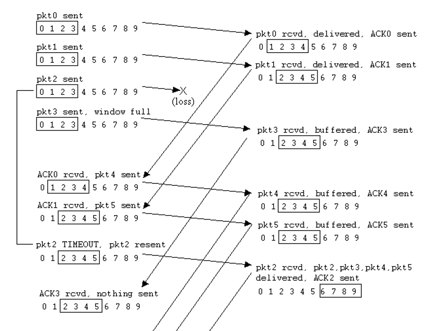

## Apertura di una connessione TCP
TCP necessita di aprire una connessione prima di trasmettere. Bisogna inizializzare le variabili cioè i *numeri di sequenza* e l'*allocazione dei buffer di invio e ricezione*. Poi:
- **client:** colui che apre la connessione
```java
Socket clientSocket = new Socket("hostname", "port number"); 
```
- **server:** colui che è contattato 
```java
Socket connectionSocket = welcomeSocket.accept();    
```

Allora si procede con l'**handshake a tre vie**:
1. **il client manda un TCP SYN al server:** indica il suo *numero di sequenza iniziale* e non richiede nessun dato;
2. **il server riceve la richiesta, replica con un pacchetto SYN/ACK:** specifica il suo *numero di partenza* ed alloca i suoi buffer (per sfortuna);
3. **il client riceve SYN/ACK, risponde con un ACK, che può contenere dati**.

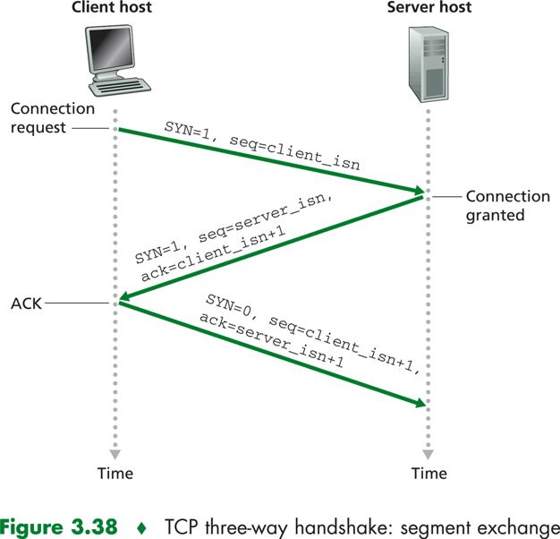

I parametri che si inviano nella fase di handshake sono molto delicati in particolare il sequential number. Questo rappresenta il contatore usato per individuare ogni byte inviato. Generalmente questo numero è preso randomicamente poiché potrebbe essere usato per scopi malevoli. Esiste persino la possibilità che due connessioni innocue generino una sovrapposizione, causando danni notevoli. Pertanto vengono scelti generalmente numeri randomici molto lontani fra di loro.

Per quanto riguarda la chiusura di una connessione, il *client* chiude il socket tramite: 
```java
clientSocket.close(); 
```
Nel dettaglio, il comando svolge le seguenti funzioni:
1. **il client manda TCP FIN per dire che vuole chiudere**;
2. **il server riceve FIN, risponde con ACK. Chiude la connessione, e manda FIN a sua volta**;
    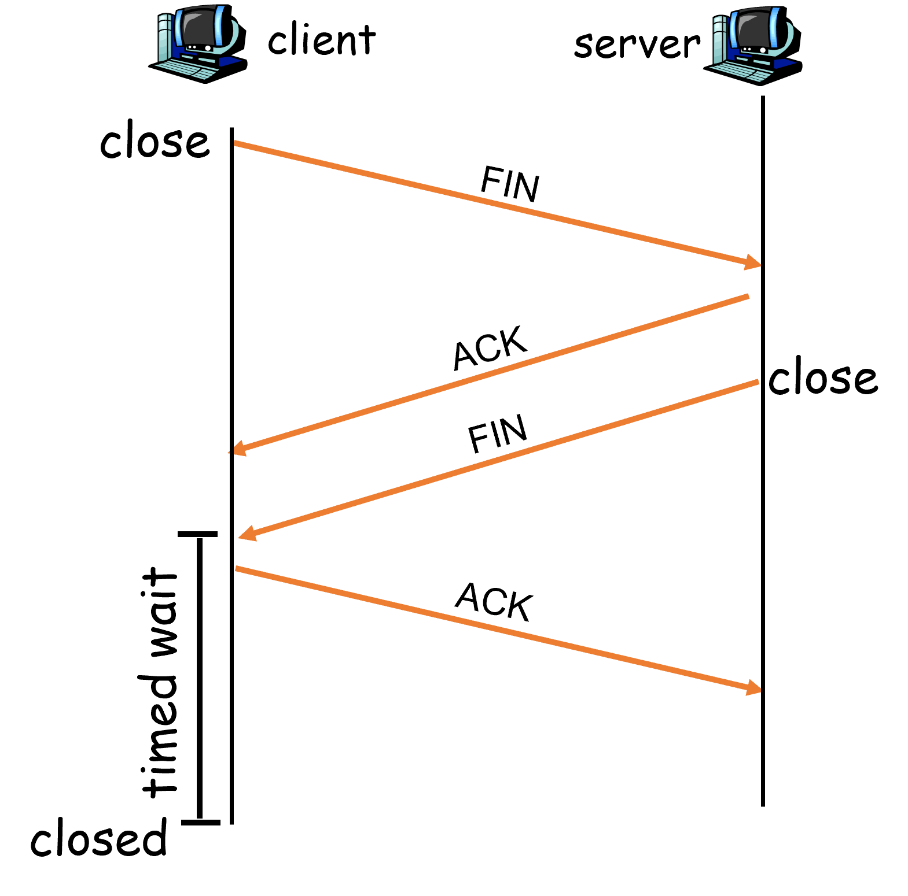
3. **il client riceve FIN, risponde con ACK:** si mette in “timed wait”, periodo in cui risponde con ACK a ogni FIN duplicato in arrivo;
4. **il server riceve ACK:** fine della conversazione.
    **NOTA:** ci sono piccoli accorgimenti per gestire la chiusura contemporanea.
    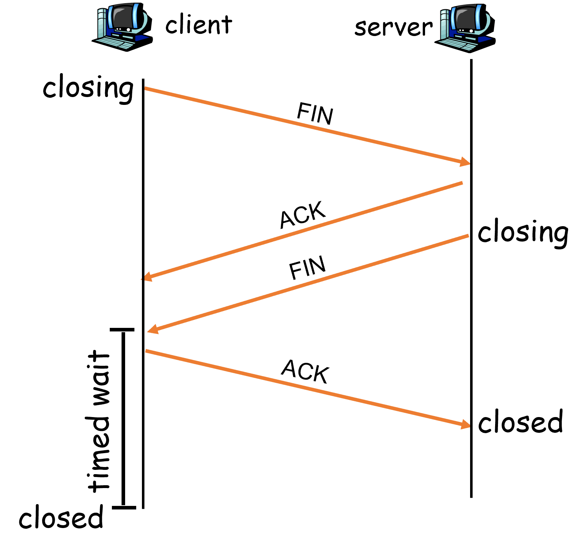

Il diagramma a stati di seguito mostra un server che riceve una richiesta di connessione, usa e infine riceve una richiesta di chiusura di una connessione.

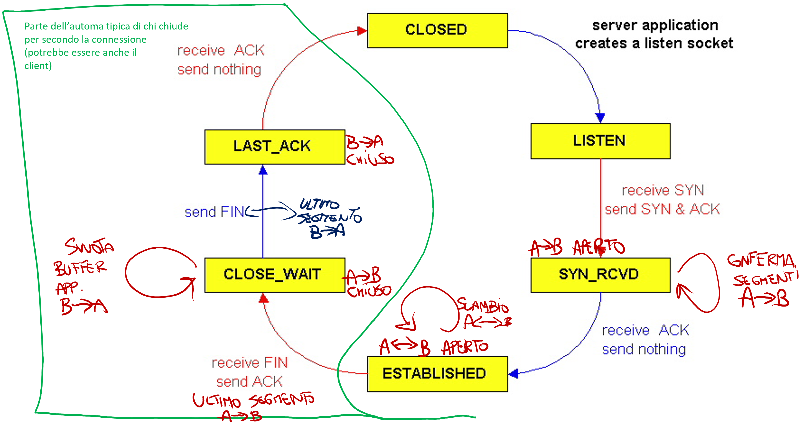

Il time-out di una connessione viene calcolato in funzione dell'RTT e pertanto è dinamico (In caso contrario si potrebbe generare ad esempio il **problema del pacchetto vagabondo**). 

## Controllo del flusso
Per **controllo di flusso** si intende quel processo di regolazione del throughput tra due interlocutori (andare a modificare quindi la finestra comporta l'aumento del throughput). Questo avviene affinché questi ultimi comunichino sulla stessa "frequenza", accordandosi su che velocità i dati devono essere inviati senza che si "affoghino" a vicenda.

## Controllo della congestione
Interviene e impedisce di parlare più di quanto la rete possa supportare. L'idea principale è *aumentare la taglia della finestra progressivamente finchè non scade un timeout*. 

In una prima fase, la finestra viene impostata al livello più basso e successivamente aumentata secondo un cosiddetto **incremento additivo**: aumenta *CongWind 1 MSS (Maximum Segment Size)* ad ogni connessione finché non scade un timeout. Successivamente, al primo pacchetto perso, il mittente intuisce che sta causando problemi quindi inizia a dividere *CongWin* per due (**decremento moltiplicativo**). 

L'andamento della finestra segue un andamento a dente di sega per poi andarsi a regolare ad una velocità ideale.

Abbiamo diversi problemi nel controllo di congestione classico:
- ogni evento di perdita viene interpretato come un problema di congestione;
- pessima performance su link con packet loss da disturbo (ad esempio *Wi-Fi*).

Vengono implementate nuove soluzioni come **TCP BBR (from Google)** dove *BBR* sta ad indicare *Bottleneck Bandwidth and Round-trip propagation time*.
