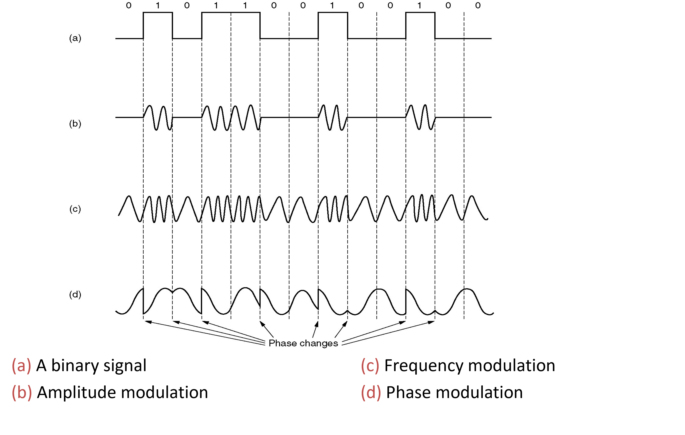
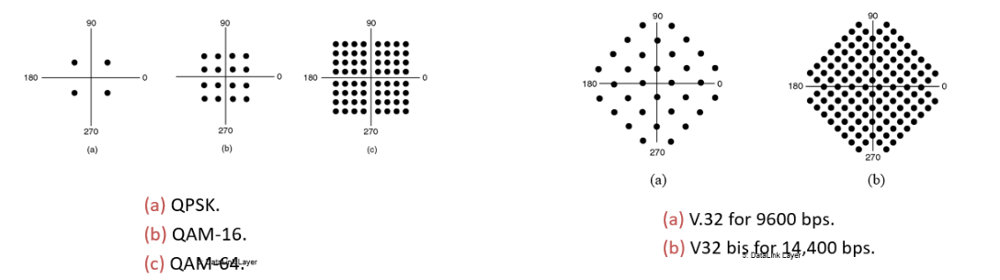
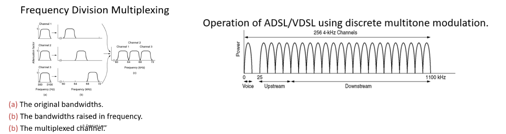
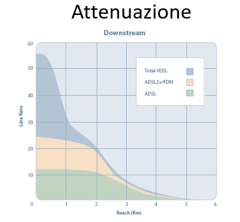
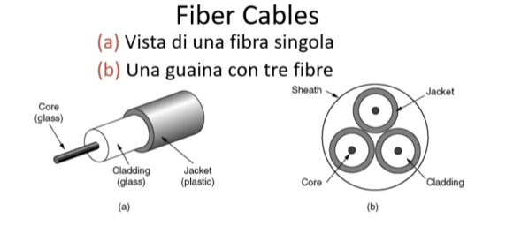

Il livello fisico si preoccupa di trasformare le informazioni in segnali elettrici. Ci sono diversi modi per decodificare i bit in impulsi elettrici: in particolare, **Manchester Encoding** viene usata nella codifica *10BaseT* (cavo ethernet base RJ45) (non supporta la GigaBit), permette di associare una funzione ad ogni simbolo 0,1. Nei modem queste funzioni vengono a loro volta convertite in frequenze.

Tra i metodi più usati sono sicuramente la *modulazione di fase edampiezza* che si basano sul concetto di trigonometria. Pertanto si prende una funzione (ad esempio, *sin*) e la si manipola in termini: 
- di fase: $$ sin(x + k) $$;
- di ampiezza: $$ sin(k x) $$ .

Giocando con questi parametri è possibile associare una funzione ad ogni simbolo ed ha come vantaggio quello di aumentare il throughput del segnale. Oggi i modem funzionano con trasmissione *multi-simbolo*. 

## Costellazione dei simboli

Dove ogni puntino rappresenta una *sinusoide (simbolo)* che ha come ampiezza la distanza dall'origine e come fase l'angolo che forma con l'asse X. 

Ci verrebbe da pensare allora che possiamo aumentare il numeri di simboli all'infinito, ma questo purtroppo non è possibile. Questo fenomeno viene spiegato nel **Teorema di Shannon-Hartley (capacità del canale)**:

> $$ C = B \log 2 (1 + \frac{S}{N}) $$

dove:
- *C:* numero di bit/s;
- *S:* intensità del segnale;
- *N:* intensità del rumore;
- *B:* banda di frequenza.

Esso afferma che aumentando il numero di simboli diminuisce conseguenzialmente anche la distanza fra gli stessi e poiché un segnale non viene mai trasmesso in maniera *pura* (cioè in assenza di rumore) si potrebbero generare ambiguità dei segnali, andando a compromettere la coerenza. 

Un ulteriore teorema molto importante che ci esprime il limite fisico di trasmissione massima è il **Teorema di Nyquist**:

> $$ C = B \log 2 (H) $$

dove:
- *C:* numero di bit/s;
- *H:* numero di simboli;
- *B:* banda di frequenza.

## Frequency Division Multiplexing
Oltre alle Wi-Fi, anche il livello trasporto sfrutta questa strategia per trasmettere il segnale. Questo è stato possibile grazie alla **trasformata di Fourier**, infatti ad ogni segnale (sinusoide) è associabile uno spettro (cioè una gamma di frequenze in cui si concentra un segnale). Pertanto, risulta essere possibile "filtrare" un segnale in funzione della propria gamma di frequenze.  

Un esempio di applicazione di questo concetto è dato dall'ADSL (radio, TV, ecc.):

L'asimmetria tra il download e upload viene adesso spiegata attraverso le formule sopra citate. Vengono banalmente dati più canali/simboli al download così da inviare più byte/s. 

## Tecnologie della fibra ottica
Oggi giorno si parla di **tecnologia full-duplex** (coppie di fibre separate che vengono usate per ricevere e inviare segnali ottici). Nelle case invece si parla di **GPON (half-duplex)**, viene portato dall'ISP un unico cavo di fibra e successivamente viene splittato in tanti sottocavi di fibra tra i differenti host. Questi cavi non soffrono dei comuni problemi di diafonia e di interferenze varie. Essendo *half-division*, il canale deve essere condiviso attraverso il **Time Division Multiplexing**. Inoltre i segnali vengono ripetuti, a mò di hub, a tutti gli host ma grazie alla crittografia i destinatari non legittimi non possono accedervi. 

