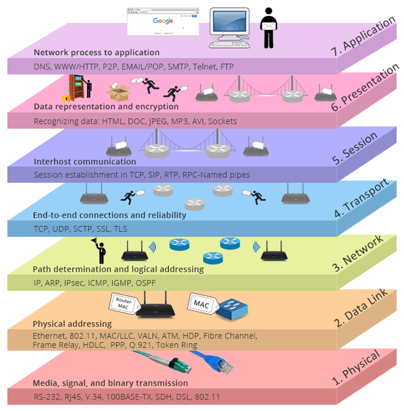
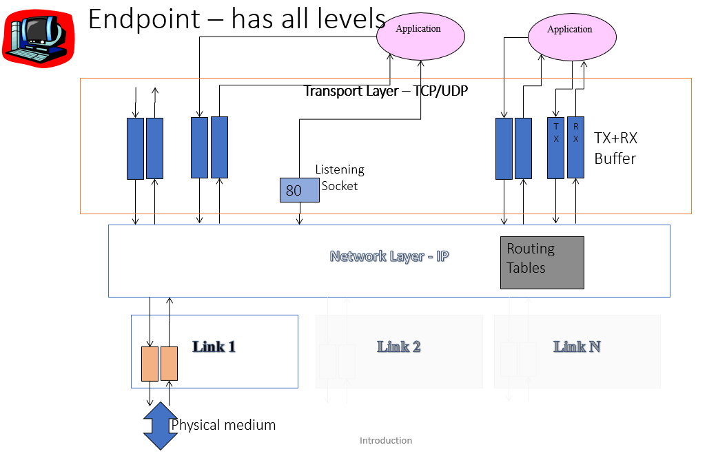
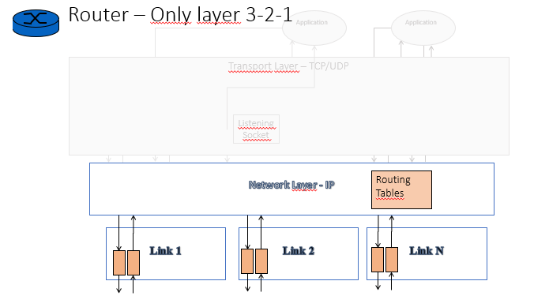
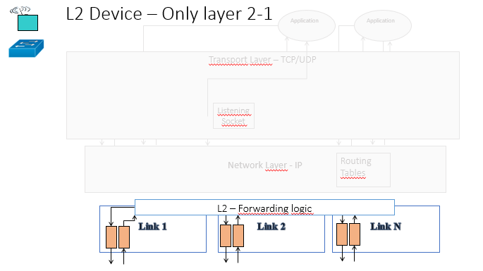
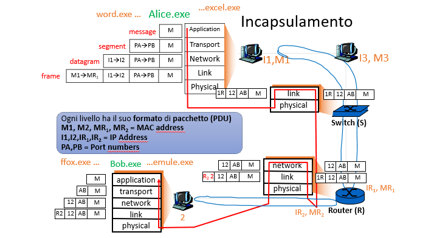
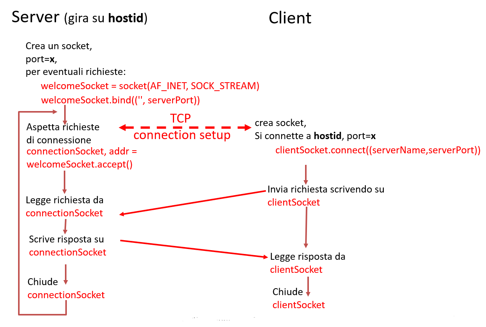

L'organizzazione che caratterizza una rete è di tipo "gerarchico", cioè i sistemi complessi vengono suddivisi in moduli. Questa soluzione offre un **vantaggio** principale e cioè ne facilita la manutenzione oltre che di flessibilità (gli strati infatti sono l'uno indipendente dall'altro come per esempio il *pattern Bridge*). Purtroppo, però questa strategia introduce grande inefficienza e ridondanza dei compiti oltre che dei dati.

L'intera struttura internet è suddivisibile in cinque layer (facendo riferimento al modello TCP/IP sennò sarebbero sette) ed in particolare:
1. **fisico** (cross-cable, straight forward cable).
2. **datalink** (ethernet, wifi, LTE, G5);
3. **rete/network** (IP, routing);
4. **trasporto** (TCP-UDP);
5. **sessione**;
6. **presentazione**;
7. **applicativo/applicazione** (HTTP);

Inoltre, ogni dispositivo della rete è configurato con gli strati sopra citati. 

## ISO-OSI Host
Un host è configurato con tutti i layer come di seguito:

Il livello applicativo (rappresentato dalle applicazioni) generano un "socket". Questo contiene diversi parametri tra cui:
- *MAC-address* destinatario/sorgente;
- *numero porta* di ingresso/uscita: il numero di porta di ingresso permette successivamente di instradare il pacchetto al buffer corrispondente che ha generato la richiesta;
- *indirizzo IP* sorgente e destinazione .

Un socket lavora attraverso l'utilizzo di due buffer TX+RX che corrispondono rispettivamente al buffer di trasmissione e ricezione. Il **layer di network** rappresenta un punto di raccolta di tutto ciò che è in uscita ed in ingresso (Immagina un aeroporto). Il messaggio durante la ricezione verrà *multiplexato* sfruttando il numero di porta di ingresso sopra citato. Infine il **layer di datalink** è costituito da tanti dispositivi link (*NIC: Network Interface Card* che sarebbe una scheda di rete) quanti sono i collegamenti fisici presenti.

## ISO-OSI Router
Contiene solamente i primi tre layer. Si preoccupa di smistare i pacchetti in entrata sulla scorta degli indirizzi IP, pertanto utilizza una **routing tables** in cui memorizza tutti i suoi vicini. Generalmente un router è costituito da due o più NIC. Immaginando un router domestico abbiamo il *NIC privato* e il *NIC pubblico*.

## Stack L2 Device (Switch)
Contiene solamente i primi due layer. Possiamo immaginarlo come un router semplificato in cui lo smistamento dei pacchi viene fatto sulla scorta dei MAC-address dei dispositivi.

## Incapsulamento
Si parla d'**incapsulamento** con l'invio di un msg tra due dispositivi. Ogni livello definisce un PDU (formato di pacchetto):
- *Livello applicativo:* messaggio;
- *Livello trasporto:* segmento. Aggiunge al messaggio la porta sorgente e la porta di destinazione;
- *Livello rete:* datagram/pacchetto. Aggiunge al layer precedente l'indirizzo IP mittente e destinazione;
- *Livello datalink:* frame. Aggiunge l'indirizzo MAC sorgente e destinazione (adiacente, cioè appartenente allo stesso vicino). In particolare quando avviene una comunicazione con un dispositivo esterno alla rete il MAC address sorgente viene modificato con il MAC address (nella figura mr2) pubblico del router.  

## Comunicazione point-to-point
Si possono identificare due attori all'interno di una comunicazione: 
- **Client:** cioè colui il quale chiede di accedere ad un servizio e chiama, metaforicamente, con il telefono;
- **Server:** cioè colui il quale offre il servizio e risponde, metaforicamente, alla cornetta del telefono.

## Indirizzamento
La comunicazione tra due punti avviene a livello di "processo". Questa comunicazione può avvenire, come già detto, se esiste un socket di ascolto identificato da una coppia (IP:porta). Una conversazione/comunicazione attiva costituisce un canale di comunicazione identificata da due coppie: 
> ** *IP:porta1* comunica con *IP:porta2* e viceversa**

Questo permette di avere più conversazioni su una stessa porta (immagina tante pagine di Google Chrome che accedono alla porta 80 simultaneamente).

## Programmazione di un socket TCP
Come anche la comunicazione *point-to-point*, si possono identificare due attori per la programmazione di un socket TCP:
- **Server:** 
    - deve essere già attivo e disponibile su una determinata porta la quale deve essere a conoscenza del client (questo spiega perché si utilizzano sempre le stesse porte *STANDARD*);
    - una volta che viene contattato, crea una connessione per rispondere (il server possiamo immaginarlo come un automa e passa in diversi stati della connessione: ESTABLISHED, CONNECTED, CLOSED, stile pattern State);
    - distingue i client in base IP/porta.
- **Client:** 
    - crea un socket TCP e indica a quale *IP:porta* vuole connetterlo;
    - il *livello trasporto* si occupa di stabilire la connessione.

## Terminologia
Di seguito alcuni termini utili sulla programmazione di un socket TCP:
- uno **stream** è una sequenza di caratteri che entrano o escono da un processo;
- uno **stream di input** è collegato a una qualche sorgente di input, ad esempio tastiera o socket;
- uno **stream di output** è collegato a una sorgente di output, ad esempio schermo o socket.

## Esempio di programmazione di un socket
1. Il *client* legge una linea da *stdin* (lo stream **InFromUser**) e le manda al *server* (tramite lo stream **outToServer**);
2. Il *server* legge una linea dal socket;
3. Il *server* converte la linea in maiuscole e poi la manda al *client* così modificata;
4. Il *client* legge la linea elaborata e la manda in output (tramite lo stream **inFromServer**).

## Alcune eccezioni possibili
- **Unknown Host (*socket.gaierror: [Errno 11001] getaddrinfo failed*):** errore DNS;
- **Connect Error (*ConnectionRefusedError: [WinError 10061]*):** rifiuto esplicito e persistente del computer di destinazione;
- **No Route To Host (*OSError: [WinError 10065]*):** tentativo di operazione su un socket verso un host non raggiungibile;
- **SocketTimeoutException (*TimeoutError: [WinError 10060]*):** impossibile stabilire la connessione e nessuna risposta dall'host collegato;
- **BindException (*OSError: [WinError 10048]*):** porta di ascolto già occupato da altro processo e di norma è consentito un solo utilizzo di ogni indirizzo di socket (protocollo/indirizzo di rete/porta).
