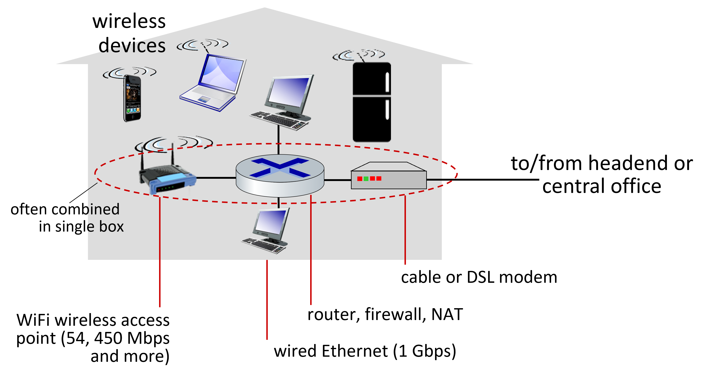
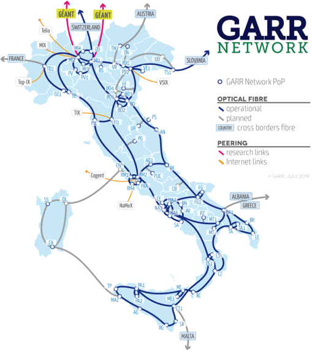
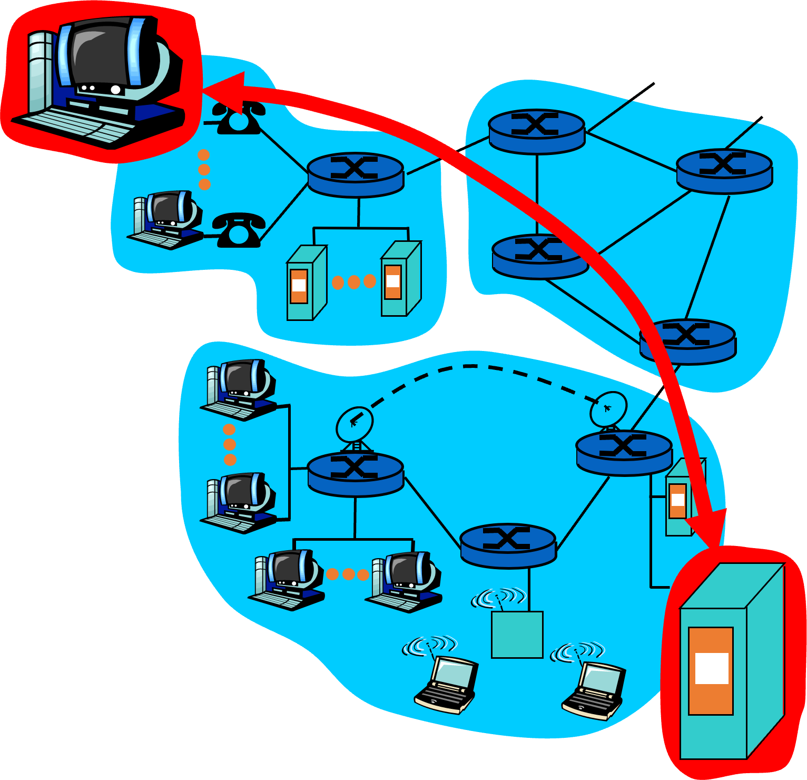

## Reti e sicurezza informatica
La sicurezza informatica e le reti vanno di pari passo ed è illegale entrare in sistemi privati altrui come riportano i seguenti articoli del Codice Penale:
- **art.615 ter del Codice Penale:** *chiunque abusivamente si introduce in un sistema informatico o telematico protetto da misure di sicurezza ovvero vi si mantiene contro la volontà espressa o tacita di chi ha il diritto di escluderlo, è punito con la reclusione sino a tre anni*;
- **art.617:** *chiunque, fraudolentemente, prende cognizione di una comunicazione o di una conversazione, telefoniche o telegrafiche, tra altre persone o comunque a lui non dirette, ovvero le interrompe o le impedisce è punito con la reclusione da sei mesi a quattro anni.* [...] *Qualora i fatti di cui ai commi primo e secondo riguardino sistemi informatici o telematici di interesse militare o relativi all’ordine pubblico o alla sicurezza pubblica o alla sanità o alla protezione civile o comunque di interesse pubblico, la pena è, rispettivamente, della reclusione da uno a cinque anni e da tre a otto anni.*

## Vista di base su Internet
Intorno ad internet girano tante parole chiavi: gli **hosts** sono milioni di sistemi interconessi, questi host sono uniti tramite una ragnatela di collegamenti detti **link** che possono essere di diversi materiali o modi (fibra, rame, radio, satellite) e la loro velocità di trasmissione è detta **banda**. I **router** instradano i pacchetti, cioè blocchi di dati.

I **protocolli** sono documenti che definiscono il modo in cui i nodi comunicano o, meglio, inviano/ricevono pacchetti (ad esempio *TCP*, *IP*, *HTTP*, *FTP*, *PPP*, ecc.). Abbiamo degli standard di Internet di cui gli ultimi 2 sono importanti e utilizzati:

- **RfC:** Request for comments;
- **IETF:** Internet Engineering Task Force;
- **W3C:** WWW Consortium.

Specifichiamo che Internet è una rete a **commutazione di pacchetto**.

## Commutazione di pacchetto VS di circuito
Ci sono due modi per fare le reti di comunicazione:
- **commutazione di pacchetto:** è un metodo per raggruppare i dati trasmessi su una rete digitale in pacchetti. È un metodo di commutazione di rete senza connessione. Non stabilisce mai alcuna connessione fisica prima dell’inizio della trasmissione. Prima che il messaggio venga trasmesso, è suddiviso in alcune parti gestibili note come pacchetti. In questo metodo, ogni pacchetto è diviso in due parti: un’intestazione e un carico utile. L’intestazione contiene le informazioni di indirizzamento del pacchetto. Il payload contiene il messaggio effettivo;
- **commutazione di circuito:** è stata progettata nel 1878 per inviare chiamate telefoniche su un canale dedicato. È un metodo utilizzato quando è necessario stabilire un canale o un circuito dedicato. Un canale utilizzato nella commutazione del circuito viene mantenuto riservato e applicato solo quando i due utenti devono comunicare. In sintesi, bisogna allocare specifiche risorse per quella conversazione, una implementazione simile è quella dei primi telefoni con le centraliniste, ormai obsoleta

Adesso analizziamo alcune principali differenze (aggiunto da me):
- la commutazione di circuito è un metodo utilizzato quando è necessario stabilire un canale o un circuito dedicato. D’altra parte, la commutazione di pacchetto è un metodo per raggruppare i dati trasmessi su una rete digitale in pacchetti;
- nel metodo di commutazione di circuito, il messaggio viene ricevuto nello stesso ordine, che viene inviato dalla sorgente mentre, nel metodo di commutazione di pacchetto, i messaggi vengono ricevuti fuori ordine e vengono assemblati alla destinazione;
- la commutazione di circuito necessita di un percorso dedicato tra la sorgente e la destinazione prima che inizi il trasferimento dei dati, ma la commutazione di pacchetto non necessita di un percorso dedicato dall’origine alla destinazione;
- il metodo di commutazione del circuito è implementato a livello fisico, mentre il cambio di pacchetto è implementato a livello di rete.

## Access networks: esempio di una rete domestica

*Come si accede ad una rete?* Un esempio è la rete domestica, abbiamo un modem (collegato all'esterno alla centrale più vicina), un router (intermediario tra interno ed esterno) e un access point (wireless) a cui si collegano tanti end point (PC, telefoni, televisori, ecc.). Tutti gli end point, collegati alla stessa rete, possono comunicare tra di loro (se possono, ovviamente).

## Access networks: la rete delle reti
Fuori dall'ambiente domestico, abbiamo innumerevoli link, complessi da studiare, ma che permettono di far comunicare host diversi: un esempio di rete italiana viene chiamata **rete GARR**, molto grande e connette diversi enti accademici tra di loro. A Cosenza sono presente due nodi, uno per l'Unical e l'altro per alcune scuole tra cui il Monaco e il Pitagora.

## Cosa offre Internet?
Internet offre due principali servizi di comunicazione: a *"piccione viaggiatore"* (nessuna affidabilità, non avremo la certezza che il pacchetto arrivi al destinatario, si utilizza un protocollo specifico UTP, più veloce) e a *"tubo"* (massima affidabilità).

## Comunicazione punto a punto
Nella comunicazione punto a punto, gli host fanno girare applicazioni come browser oppure client email e sono al "bordo" della rete. Le applicazioni di rete sono suddivisibili in **modello client/server** in cui il server è sempre attivo ("always on") ad esempio *web browser/server* oppure *email client/server*, oppure in **modello peer2peer** in cui c'è un uso minimale dei server.

## Protocollo
Un **protocollo (di comunicazione)** è un insieme di regole che gestiscono l'invio di messaggi speciali e di azioni specifiche che vengono compiute alla ricezione del messaggio: si possono paragonare alle varie lingue del mondo. *Tutta la comunicazione su internet è governata da protocolli.* In sintesi, i protocolli definiscono il formato, l’ordine e il significato dei messaggi, le azioni da compiere all’atto dell’invio e della ricezione, la dimensione degli spinotti, i materiali usati, ecc.
