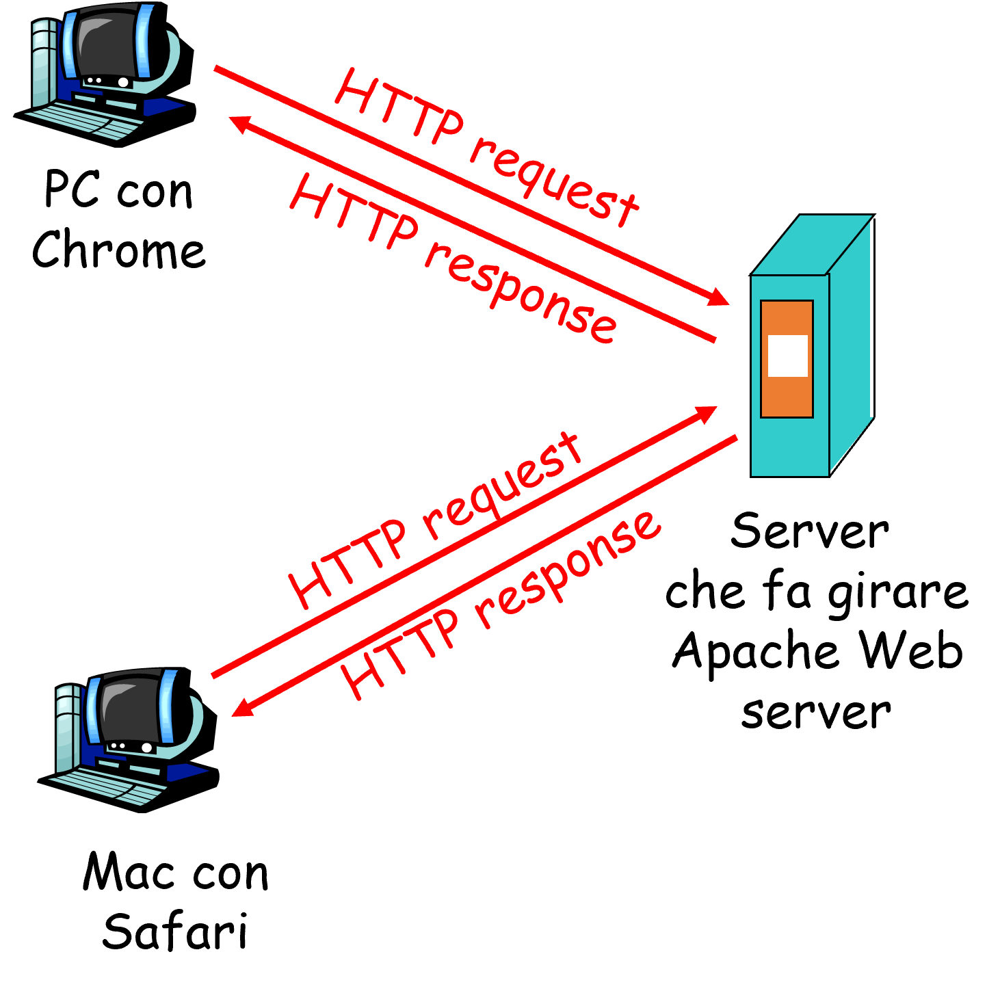
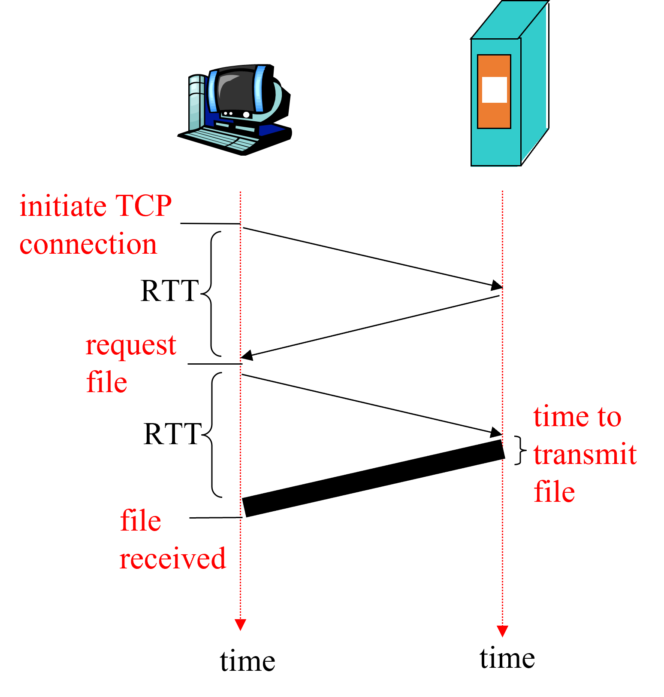
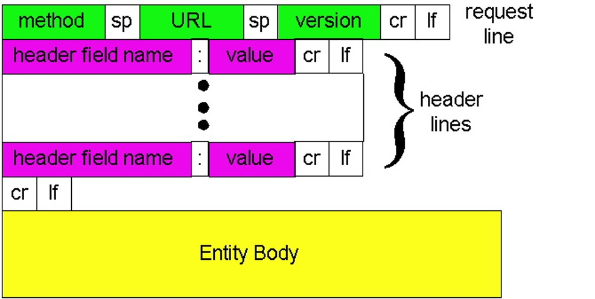
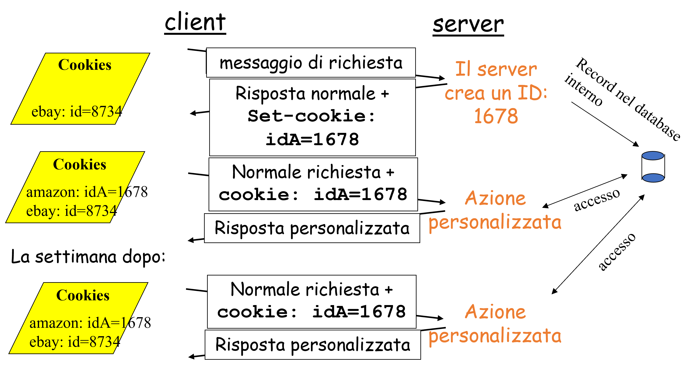
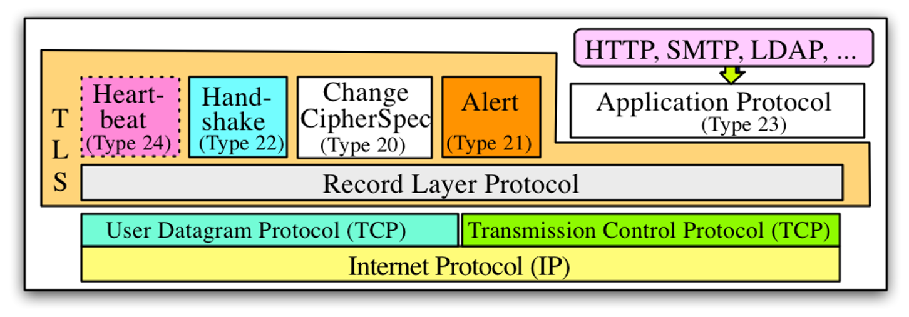
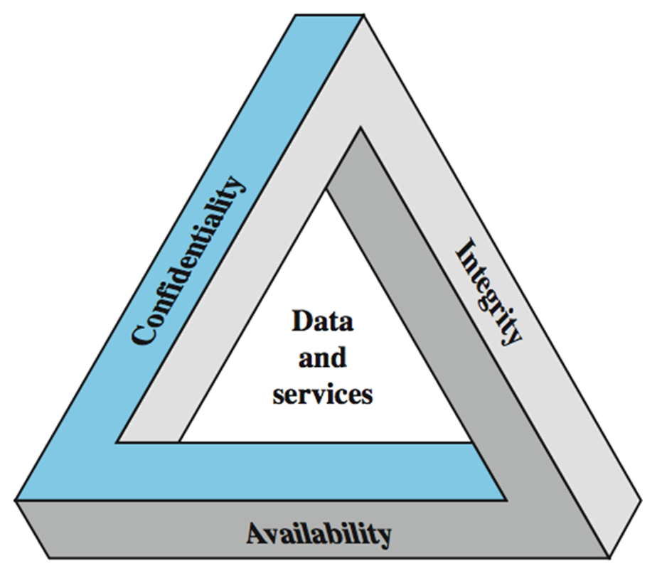
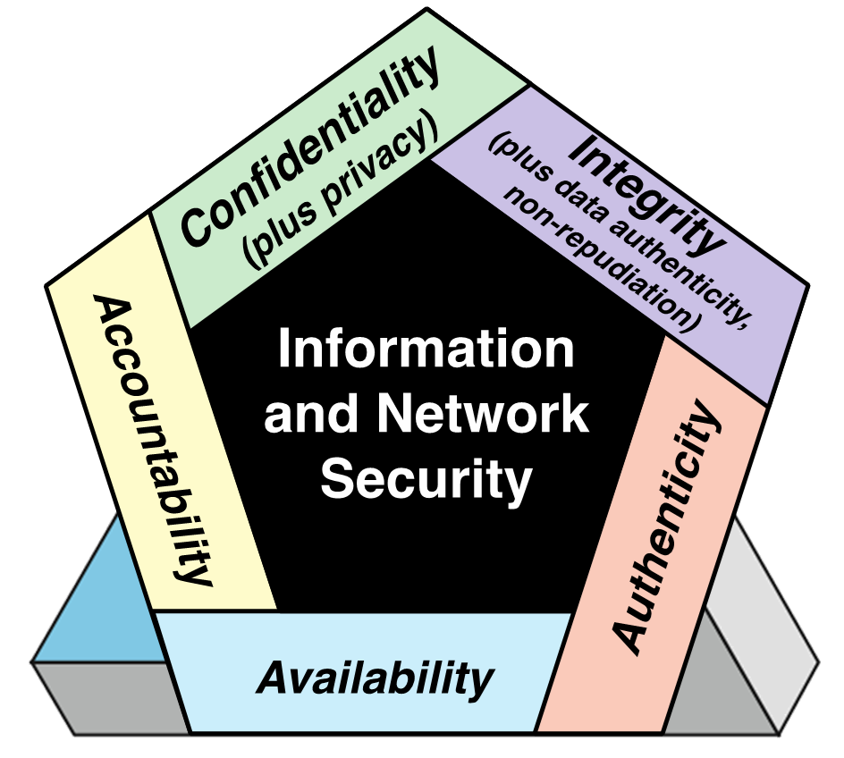

L'**HTTP (Hypertext Transfer Protocol)** nasce per trasferire risorse ipertestuali (HTML). Una pagina HTML non è una pagina a se stanti ed è piena di riferimenti ad altre pagine (oggetti). Ogni oggetto è riferito tramite un URL (con standard RFC 2396, 3986) composto da protocollo, nome dell'host (*FQDN*) ed eventuale nome del percorso.

Il protocollo HTTP funziona su modello **client/server**:
- **client:** un *programma browser* che richiede e riceve oggetti Web;
- **server:** un *Web server* che invia oggetti in risposta a richieste.

Si usa TCP quindi il client crea un socket verso il server (sulla porta 80), il server accetta la connessione, i due interlocutori si scambiano messaggi espressi in HTTP e la connessione TCP viene chiusa.

Il protocollo HTTP è **stateful** cioè non ci sono normalmente informazioni sulle precedenti connessioni. Il concetto di **sessione** (basata sui *cookies*) è stato aggiunto in seguito.

## HTTP non persistente e HTTP persistente

HTTP è in continua evoluzione (siamo ad HTTP 3) e migliorano nell'efficienza e nel risparmio di tempo. La versione *HTTP 1* era **non persistente**: il client inizia una connessione TCP, il server attende richieste e riceve la richiesta del client, il server manda la risposta e chiude la connessione, il client riceve la risposta. Quindi, al più un oggetto è inviato su una connessione.

Nell'**HTTP persistente** (*HTTP 1.1*) è possibile riciclare un unica connessione TCP per inviare più oggetti. Nello specifico, il server non chiude la connessione dopo l'invio del primo oggetto e la connessione viene riusata per inviare altre richieste: questo per diminuire la latenza nell'invio/ricezione dei dati. Quindi, si può usare la stessa connessione per inviare più oggetti in sequenza.

Nell'*HTTP 1.1*, se il client richiede un oggetto grande, questo blocca la consegna degli oggetti successivi. Nell'*HTTP 2*, gli oggetti vendono divisi in "frame" che vengono trasmessi a turno, riducendo l'**HOD (head of deadline) blocking**.

L'*HTTP 3* ha lo scopo di abbattere latenza per richieste multiple e si utilizza per la prima volta l'UDP. Sfrutta un protocollo chiamato QUIC basato su UDP, con un layer di sicurezza TLS, per avere latenze minori.

In sintesi:
- *HTTP 1.0:* viene definito nell'RFC 1945. Nella comunicazione può essere inviato solamente un oggetto e non è "persistente". Pertanto la connessione viene chiusa immediatamente dopo la trasmissione delle informazioni;
- *HTTP 1.1:* viene definito nell'RFC 2068. Nella comunicazione vengono scambiati diversi oggetti in sequenza ed è persistente. Minore latenza e riciclo delle connessioni;
- *HTTP 2:* viene ridotto **HOL blocking (PIPELINE), cioè quel fenomeno in cui un oggetto molto pesante occupa la comunicazione non permettendo ad altre informazioni di partire**. Nell'HTTP 2.0 ogni oggetto viene suddiviso in frame/chunk;
- *HTTP 3:* è multistream cioè la connessione è divisa in stream indipendenti. Sfrutta un protocollo chiamato QUIC basato su UDP, con un layer di sicurezza TLS, per avere latenze minori.  

## Tempi di risposta
Il **tempo di risposta (RTT)** è il tempo che ci mette un pacchetto ad arrivare al server e ritorno.

Mediamente, i tempi di riposta nella comunicazione HTTP sono i seguenti:
- 1 RTT per iniziare la connessione;
- 1 RTT per la HTTP request e l’arrivo dei primi byte di risposta.

Il tempo totale di trasmissione sarà uguale a *2RTT + transmit time*.

## HTTP request e HTTP response

Abbiamo due tipologie di messaggi: **request** e **response**. Tutti e due i tipi di messaggio hanno due formati diversi. Vediamoli:
- nell'**HTTP request** la codifica è in ASCII ed è composta dalla linea di richiesta (dove troveremo i comandi come *GET*, *POST*, *HEAD* e comunicando anche la versione HTTP che si utilizza nella comunicazione, oltrechè anche l'host) e le intestazioni (composte da dettagli riguardante la connesione da voler aprire). In particolare si tengono conto: 
    - *User Agent:* definisce la tipologia di browser e sulla scorta di questo decide se e quali contenuti servire;
    - *Referrer:* Usato dai client per dichiarare l'URL all'interno del quale si è cliccato per ottenere l'URL corrente. I server sfruttano queste informazioni come dato analitico;
    - *Accept-Language:* Insieme all'URL permette di identificare univocamente una risorsa web. Infatti il solo URL può far riferimento a più risorse con linguaggio differente;
    - *Host:* definisce il sito di provenienza.
    
    
    
- l'**HTTP response** è composta da una linea di stato (codice di errorre e frase), da un intestazione e da dati (come per esempio file HTML).

## Codici di errore
Abbiamo diversi codici di errore, ecco alcuni di esempio:
- **200 - *OK*:** la richiesta è OK, l'oggetto è in questo messaggio;
- **301 - *Moved Permanently*:** l'oggetto è stato spostato, questa è la nuova locazione;
- **400 - *Bad Request***;
- **404 - *Not Found*:** la risorsa richiesta non è qui;
- **505 - *HTTP Version Not Supported***;

## Tipologie di comandi
In *HTTP 1.0* abbiamo i seguenti comandi:
- **GET**;
- **POST**;
- **HEAD:** per avere solo informazioni sull’oggetto e non l’oggetto stesso (ad esempio sulla data di ultima modifica). Utile per il caching;

In *HTTP 1.1*, oltre a quelli elencati precedentemente, abbiamo i seguenti comandi:
- **PUT:** upload di un file;
- **DELETE:** cancella un certo file.

## Stato, cookie e session
HTTP è un protocollo stateless e pertanto non mantiene traccia delle connessioni precedenti degli utenti. Si vede necessario quindi offrire un meccanismo che ci permette di memorizzare alcune informazioni degli utenti (ad esempio, carrello di Amazon, login ecc). Quest'ultimo prende il nome di **sessione**. 

### Session
Una **sessione** è un insieme/gruppo di conversazioni HTTP riconducibili a un'unica attività omogenea. Surroga il layer 5 del modello ISO/OSI ed è implementata attraverso l'uso dei **cookies**. 

### Cookies
I **cookies** sono una forma di "stato" e sono oramai irrinunciabili.

Il campo dei cookies è presente sia nei messaggi di risposta sia nei messaggi di richiesta. Il browser salva i cookies nei messaggi di risposta e li reinvia la volta successiva che chiede lo stesso oggetto. Il sito web contiene invece un suo database dei cookie inviati a tutti i client.

*Facciamo un esempio:* Susanna accede a Internet sempre dallo stesso PC, visita un certo sito di e-commerce e, alla prima richiesta HTTP, il web server associa un ID all’IP di Susanna e lo salva nel database. Susanna verrà riconosciuta tramite il cookie di risposta e si potrà inviarle contenuti personalizzati.

Con **Set-Cookie**, il server obbliga il client di impostare una variabile con i dati necessari. Questa permette di realizzare risposte personalizzate ma soprattutto mantenere "viva" una traccia del client. Pertanto questo parametro verrà trasmesso durante la maggior parte delle operazioni.

## LTS (Transport Layer Security)
Il **Transport Layer Security (TLS)** e il suo predecessore **Secure Sockets Layer (SSL)** sono dei protocolli crittografici di presentazione usati nel campo delle telecomunicazioni e dell'informatica che permettono una comunicazione sicura dalla sorgente al destinatario (end-to-end) su reti TCP/IP (come ad esempio Internet) fornendo autenticazione, integrità dei dati e confidenzialità operando al di sopra del livello di trasporto. 

Diverse versioni del protocollo sono ampiamente utilizzate in applicazioni come i browser, l'e-mail, la messaggistica istantanea e il voice over IP. Un esempio di applicazione di SSL/TLS è nel protocollo HTTPS. 

Possiamo immaginarlo come un layer di preprocessing tra il livello applicativo e quello di trasporto TCP-UDP. Questo protocollo serve in particolare:
- garantire l'identità dei due interlocutori;
- garantire la confidenzialità della loro conversazione;
- garantire l'integrità di ogni messaggio scambiato;
- non preserva in alcun modo dal *typosquatting*, cioè la realizzazione di un dominio URL simile ad uno famoso al fine di ingannare l'utente. In particolare si realizza un certificato SSL per il solo scopo di dare una veridicità al sito ma nel concreto viene usato per frodi o malware.

### Key Security

Questi tre concetti formano quella che viene spesso definita la triade della CIA. I tre concetti incarnano gli obiettivi di sicurezza fondamentali sia per i dati che per i servizi informatici e informatici. *FIPS PUB 199* fornisce un'utile caratterizzazione di questi tre obiettivi in termini di requisiti e la definizione di una perdita di sicurezza in ciascuna categoria:
- **Riservatezza (riguarda sia la riservatezza dei dati che la privacy):** preservare le restrizioni autorizzate all'accesso e alla divulgazione delle informazioni, compresi i mezzi per proteggere la privacy personale e le informazioni proprietarie. Una perdita di riservatezza è la divulgazione non autorizzata di informazioni;
- **Integrità (copre sia i dati che l'integrità del sistema):** protezione contro la modifica o la distruzione improprie delle informazioni e include garantire il non ripudio e l'autenticità delle informazioni. Una perdita di integrità è la modifica o distruzione non autorizzata di informazioni;
- **Disponibilità:** garantire un accesso tempestivo e affidabile e l'utilizzo delle informazioni. Una perdita di disponibilità è l'interruzione dell'accesso o dell'uso di informazioni o di un sistema informativo.

Sebbene l'uso della triade della CIA per definire gli obiettivi di sicurezza sia ben consolidato, alcuni nel campo della sicurezza ritengono che siano necessari concetti aggiuntivi per presentare un quadro completo. Due dei più comunemente citati sono:
- **Autenticità:** la proprietà di essere genuini e di poter essere verificati e affidabili; fiducia nella validità di una trasmissione, di un messaggio o di un mittente del messaggio;
- **Responsabilità:** l'obiettivo di sicurezza che genera il requisito per le azioni di un'entità da ricondurre in modo univoco a tale entità.
