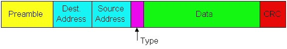
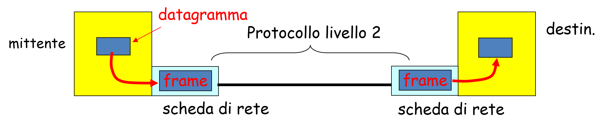
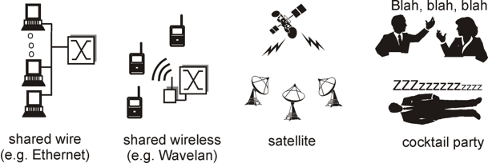
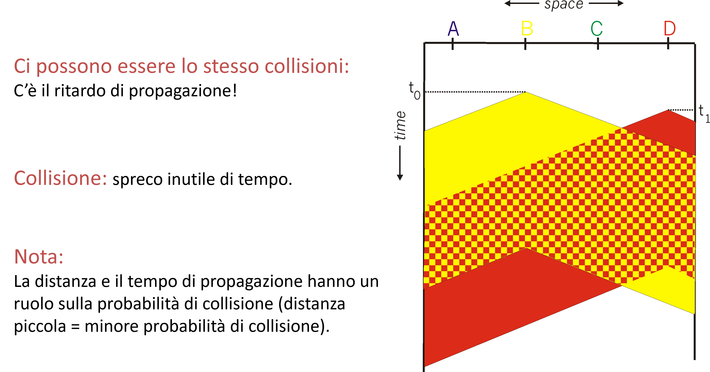
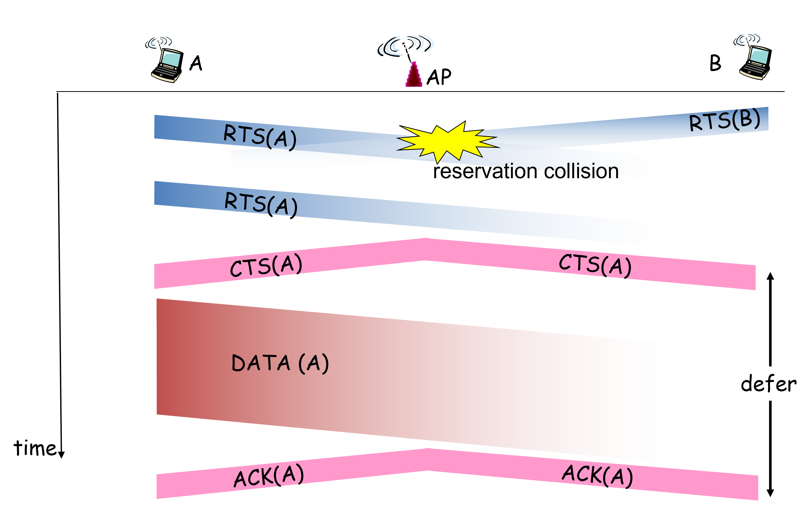
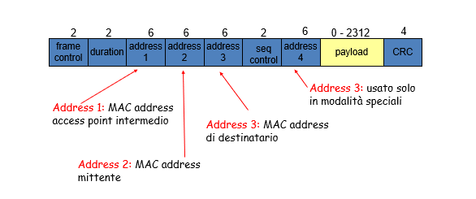
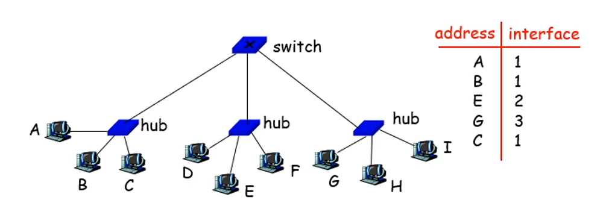

Il livello datalink ha la responsabilità di trasferire i datagrammi da un nodo a uno adiacente lungo un link diretto. In questo layer il PDU è il **frame**.

## Struttura di un frame Ethernet
I datagrammi sono incapsulati in frame Ethernet.

È diviso nella seguente maniera:
- **preambolo:** composto da 7 bytes con pattern 10101010 seguiti da 1 byte con pattern 10101011. Usato per sincronizzare il clock del ricevente e per occupare il canale;
- **indirizzi:** composto da 6 bytes. Se l’adattatore riceve un pacchetto con il proprio *MAC address* come destinazione, o un broadcast il frame viene aperto e i dati vengono consegnati al livello 3 altrimenti, la scheda di rete DOVREBBE scartare il frame;
- **type:** codice del protocollo di livello 3 trasportato (per lo più IP, ma ancora sopravvive qualche rete *IPX*, *Novell*, *AppleTalk*);
- **CRC:** controllato dal ricevente. Se errato, il frame viene semplicemente scartato.

## MAC address
Il *MAC address* viene usato per far arrivare un frame verso un nodo fisicamente adiacente. Non serve sapere il *MAC address* di utenti al di fuori della nostra rete. È composto da 46 bit e può essere soggetto ad *ARP Spoofing*. 

ARP serve all’interno della stessa LAN. Facciamo un esempio:
- supponiamo che A voglia mandare un datagramma a B, ma il MAC address di B non è nella ARP table di A;
- A manda in *broadcast* una richiesta ARP;
- B riceve il pacchetto ARP risponde ad A con il suo MAC address;
- A salva la nuova coppia IP/MAC address nella sua ARP table finchè non scade il TTL.

ARP è **plug-and-play**: i nodi creano queste tabelle dinamicamente. Invece, il DNS richiede configurazione manuale dei server DNS.

## Livello 2
Un link non è altro che un canale di comunicazione tra due nodi adiacenti (link in rame, via satellite ecc.). Il **livello 2** (anche il *livello 1*) è realizzato dall’hardware della scheda di rete (NIC).

- **lato mittente:** i datagrammi sono messi dentro frame e si aggiungono tutte le informazioni addizionali;
- **lato destinatario:** si controllano gli errori, si effettua il controllo di flusso (ricevute di ritorno) e si estrae il datagramma e lo passa al software che implementa il livello 3.

Esistono due tipologie di link:
- **Punto-punto:** *PPP (Point-to-Point Protocol)*, *PPPoA*, *PPPoE*;
- **Broadcast:** ci sono diversi interlocutori che si vedono reciprocamente (ad esempio, *Ethernet*, *802.11 wireless LAN*).

Nei link broadcast, tutti vedono tutti, degli esempi di seguito:

Poiché il canale di trasmissione è unico bisogna condividerlo. Esistono tre protocolli di condivisione:
- **suddivisione del canale (*cellulari GSM*, *GPON Time division multiplexing*):** a slot di tempo di frequenza;
- **ad accesso casuale (*Ethernet*):** Sono consentite le collisioni, la latenza è randomica. Sfrutta un protocollo detto MAC (Medium access control) attraverso cui si rilevano le collisioni e offre meccanismi di "convivenza". Ne esistono diversi come: *CSMA/CD (Ethernet)* e *CSMA/CA (Wi-fi 802.11)*;
- **a turni (*token ring*):** si parla solamente quando si possiede il token.

## CSMA-CD
Banalmente si attende quando il canale è vuoto (**CSMA, Carrier Sense Multiple Access**), quando lo è si trasmette tutto il frame. 

Naturalmente le collisioni continuano ad esistere pertanto scatta il meccanismo di **CD, Collision Detection**. Esso permette di identificare una collisione ed evitarla andando ad aspettare eventualmente un tempo randomico. La probabilità di sorteggiare un tempo è strettamente dipendente da un valore (*K*). Ad ogni tentativo il range di *K* viene aumentato fino a che, al decimo tentativo, il valore di *K* viene sorteggiato in un range di 1023. Nel caso di più tentativi il pacchetto muore.

## CSMA-CA (Wi-Fi)
In questo caso le collisioni vengono evitate (**CA, Collision Avoidance**) questo a causa del **problema della stazione nascosta** (più dispositivi possono vedere un access point AP ma questi non possono vedersi tra di loro) e **dell'attenuazione** (perdita della potenza del segnale).

Abbiamo due standard:
- **802.11 sender:** *se percepisce il canale muto* per **DIFS** tempo allora trasmette il frame **per intero** (senza collision detect), *se canale percepito occupato*, allora avvia timer di backoff random trasmette alla scadenza del timer se nessun ACK, raddoppia il range di backoff random, e ripete;
- **802.11 receiver:** se frame arriva per intero con CRC valido trasmette ACK dopo SIFS tempo (necessario per problemi di stazioni nascoste).

Le reti Wi-Fi soffrono di numerosi tempi idling e soprattutto l'intero sistema di comunicazione è sincronizzato temporalmente, infatti se l'ACK esplicito non arriva nel tempo prestabilito il messaggio si dà per "colliso". 

Le reti Wi-Fi vengono identificate da:
- *SSID/ESSID:* è il nome testuale attraverso cui la rete Wi-Fi, cioè router e tutti gli access point, si identificano agli utenti;
- *BSSID:* rappresenta il MAC address dell'access point.

Le reti Wi-Fi sono un esempio di *FDMA (Frequency Division Multiplexing Access)* e cioè sfruttano un meccanismo di turnificazione del canale di comunicazione in funzione della banda di frequenza. 

Si basa sullo standard 802.11 e in particolare si osservano tre indirizzi MAC:
- MAC dell'access point intermedio;
- MAC del mittente;
- MAC del destinatario: BSSID dell'access point a cui siamo associati.

## RTS-CTS
Prevede una prenotazione del canale **Request To Send (RTS)** per evitare collisioni. Quando il mittente riceve un hack pulito deve mandare nuovamente un **Clear To Send (CTS)**.

## Evitare le collisioni

L'idea è che il mittente "riserva" il canale prima di spedire il frame reale: evito le collisioni di frame lunghi.
- Il mittente trasmette prima delle piccole richieste di invio (RTS) verso l'access point (AP) usando CSMA: gli RTS possono comunque andare in collisione (ma sono corti);
- L'AP diffonde un "puoi trasmettere" (CTS) in risposta all'RTS;
- Il CTS percepito da tutte le stazioni: il mittente trasmette quindi il frame di dati e le altre stazioni rimandano la trasmissione.

La soluzione è che i frame di prenotazione evitano le collisioni di frame di dati.

## Oggetti legati al livello datalink

### Hub
Un **hub** non è altro che un ripetitore che inoltre su tutti i canali di uscita ciò che gli arriva in input. I dati vengono trasmessi tutti alla stessa velocità, non c'è un buffer e non **rileva collisioni**.

### Switch
Uno **switch** bufferizza i frame (*store & forward*), guarda i frame e *decide* su quale porta inoltrare un frame in funzione del MAC address. Azzera quasi del tutto il problema delle collisioni, talvolta è necessario usare il CSMA/CD nel caso ci sia un hub connesso ad una delle sue interfacce. 

Effettua chiamate in broadcast qualora non fosse noto il MAC address del messaggio. 

È un dispositivo *plug-and-play auto-configurante* perché memorizza al suo interno una tabella (**switch table**) che associa le coppie (*interfaccia - MAC address*) in maniera tale da effettuare il processo di **forwarding (le informazioni sono soggette a TTL)**.  

Naturalmente se il dispositivo cambia interfaccia ripetutamente, *impazzisce*.

### VLAN
**VLAN** è l'acronimo di **Virtual Local Area Network**, esso permette di realizzare più domini di collisione virtualmente separati. Hanno un grande a livello aziendale e se ne possono distinguere di due tipi: 
- **Port based VLAN:** lo switch suddivide le porte in diversi gruppi indipendenti l'uno dell'altro (separazione virtuale);
- **Trunk based VLAN:** permette di instradare frame tra VLAN definite su più switch. In particolare una porta dei due dispositivi verrà utilizzata come canale di comunicazione (trunk port). Affinché si possa utilizzare questa strategia i frame vengono impacchettati secondo un altro standard 802.1q. Quest'ultimo dota i frame di due campi aggiuntivi: 
    - *VLAN ID:* ogni vlan viene identificata con un ID univoco. Pertanto viene utilizzato dallo switch per comprendere se il frame è indirizzato alla stessa VLAN;
    - *Tag Protocol ID:* identifica con quale protocollo è stato codificato quel frame.
