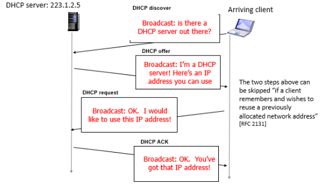
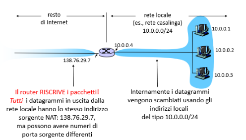
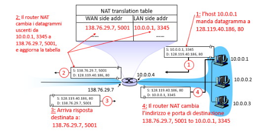
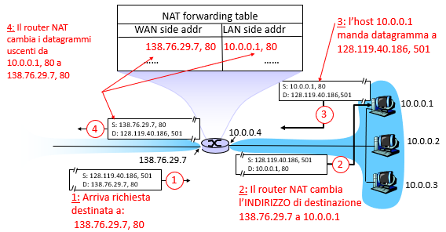

## DHCP (Dynamic Host Configuration Protocol)
Il protocollo **DHCP (Dynamic Host Configuration Protocol)** serve ad aiutare una scheda di rete vergine a trovare i parametri di configurazione adatti a parlare in una determinata rete, tramite un *server DHCP*. La configurazione degli IP delle macchine può avvenire in due modalità: 
- **statico:** quindi è l'utente ad impostare manualmente il proprio indirizzo IP;
- **dinamico:** grazie ad un servizio, detto DHCP, viene configurato l'indirizzo IP di una macchina "vergine".

Generalmente è un "vicino" della rete (lo stesso router domestico può offrire servizi di DHCP). Ogni indirizzo assegnato ha un cosiddetto *lease (tempo di vita)* al termine del quale può essere riconfermato e quindi rinnovato oppure può essere cambiato. Al fine di evitare *bottleneck* esiste un ulteriore parametro detto *Renewal Time Value* che consiste nell'aprire una finestra temporale antecedente al *lease* in cui gli host stessi cercano di rinnovarsi. La configurazione di una macchina avviene secondo diversi messaggi: 
- **DHCP Discover:** l'host manda in broadcast un messaggio di "scoperta" attraverso cui cerca eventuali DHCP;
- **DHCP Offer:** il server risponde con un'offerta in cui viene inviato un set di parametri temporanei utilizzabili dalla macchina. Già qui il DHCP cerca di comunicare ponendo l'indirizzo IP di configurazione come destinazione del pacchetto. Poiché la macchina non è ancora stata configurata la comunicazione avviene grazie il *MAC-Address*;
- **DHCP Request:** l'host richiede formalmente di ricevere una configurazione. Anche questo messaggio è fatto in broadcast;
- **DHCP Ack:** il server conferma definitivamente la configurazione e l'utente si configura 

Gli indirizzi dinamici possono essere molto vantaggiosi in alcuni contesti ma in altri possono essere un problema. Per esempio, quando bisogna accedere a server importanti, è difficile che questi cambino indirizzo IP dinamicamente poiché potrebbero esserci problemi di reperibilità dello stesso. Infatti in questi casi si affianca al DHCP anche il DNS dinamico che aggiorna i FQDN parallelamente alla richiesta DHCP.

## NAT (Network Address Translation)
Poiché esistono indirizzi IP di tipo privato, si vede necessario mettere in comunicazione, talvolta, due host che, pur appartenendo a reti diverse, posseggono lo stesso indirizzo IP. Questo a livello teorico sarebbe impossibile ma attraverso il meccanismo di **NAT (Network Address Translation)** è possibile:
- isolare gli indirizzi interni senza che il mondo esterna ne risenta;
- posso cambiare ISP senza dover cambiare gli IP di tutte le macchine;
- è una prima forma di *firewalling*: I dispositivi non sono direttamente raggiungibili 

I pacchetti vengono "riscritti" andando a cambiare l'indirizzo sorgente con l'indirizzo IP della scheda esterna del nostro router ed eventualmente anche il numero di porta sorgente. Naturalmente questi cambiamenti vengono mappati in una tabella che prende il nome di **NAT Translation Table**.  

Naturalmente il NAT offre sia vantaggi che svantaggi in particolare: 
- tutta la sottorete può usare al più 65534 porte simultaneamente;
- si devono ricalcolare le *checkSum*;
- la tecnologia odierna sfrutta *IPSec (+ firma digitale)* e non più IP e quindi risulta difficile cambiare i parametri;
- alcuni protocolli potrebbero far non funzionare ICMP (non ha la porta) e anche GRE (oltre a *IPSec*);
- risolve temporaneamente il problema dei pochi indirizzi;
- i P2P sono difficili da realizzare. Può esserci un solo server su ogni porta. Quindi avere server all'interno di reti private risulta essere complesso. Si sfrutta quindi il processo di **Port Forwarding **.

## Port Forwarding
Il router contiene un'ulteriore tabella detta **NAT Forwarding Table** che può essere a sua volta configurata *manualmente* o *dinamicamente* (viene compilata in maniera semiautomatica). Questa serve a mappare server all'interno di una rete in modo tale che siano accessibili dall'esterno. **Il server DEVE AVERE IP STATICO.**

Per configurare dinamicamente il NAT dobbiamo usare il protocollo **UPnP (Universal Plug and Play)**. Questo apre su richiesta del client una porta in *listening* e la aggiunge alla tabella suddetta. Il problema è che espone a notevoli rischi di malware. 
