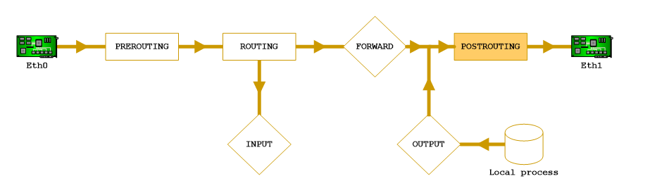

Il firewall è un device di filtraggio del traffico da e per un certo perimetro ed in particolare rende accessibili dall'esterno solo i servizi che vogliamo esporre, impedisce agli utenti della rete di usare determinate applicazioni, protegge dagli attacchi *Dos* e *DDos*, evita che i server interni provochino attacchi a terzi e fornisce un effetto cuscinetto nel caso si perda controllo di un server (evita effetti domino).

Se qualcuna entra all'interno di un dominio di collisione, anche con i firewall, tutti i dati possono essere falsificati, tutto si può sniffare e spoofare e abbiamo problemi di confidenzialità e autenticità: infatti, non vi difendono dai cavalli di troia e non garantiscono l’autenticità e [[Sicurezza|sicurezza]] della trasmissione e non vi difendono da attacchi di ingegneria sociale e attacchi “fisici” alla rete. Antivurus come *Avast* spiano il traffico che gira intorno al firewall. In fondo, anche il firewall spia il traffico a fin di bene.

Esistono diverse categorie di firewall:
- **Personal Firewall:** permette di salvaguardare un solo host;
- **Firewall;** 
- **Web application Firewall;**
- **IDS/IPS (Intrusion Detection System);**
- **Nextgen Firewall:** permette di vedere ciò che è contenuto nei pacchetti di livello 7. 

Inoltre i firewall si distinguono in: 
- **Stateless:** si limitano a filtrare i pacchetti;
- **Stateful:** conservano memoria del traffico precedente e ne fanno uso per decidere il destino di un pacchetto.

## IPTables
Viene utilizzato dal kernel Linux per impostare regole per il *firewalling (stateful)*. In particolare si basa sul concetto di **catene di regole (*chain of rules*)** attraverso cui si manipolano i pacchetti. 



- **Fase di PREROUTING:** si lavora sui pacchetti in entrata ma a questi pacchetti vengono già applicate delle regole ben definite prima di essere instradate nel sistema;
- **Fase di ROUTING:** si guarda il datagramma ed in particolare l'indirizzo IP sorgente/destinazione e si capisce se è destinato ad un host interno o esterno. In quest'ultimo caso viene mandato nella fase di *Forwarding*;
- **Fase di FORWARDING:** permette di filtrare il traffico dati che non è indirizzato ad uno specifico computer ma passa comunque attraverso quest'ultimo;
- **Fase di INPUT:** vengono eseguiti controlli sul traffico in entrata;
- **Fase di OUTPUT:** vengono eserguiti controlli sul traffico in uscita;
- **Fase di POSTROUTING:** si lavora sui pacchetti in uscita dal sistema ma solamente dopo che è stato deciso il loro instradamento.

Uno dei grandi vantaggi del *firewalling* è quello di poter filtrare il traffico in ambo e due le direzioni (in ingresso e in uscita dalla nostra rete). Pertanto è naturale suddividere la nostra rete in più *chain*, due per ogni zona (*DMZ*, *Red Zone*, *Internet*, ecc.).

## Comandi principali per le policy

- Default: 
```bash
iptables -P <catena> <politica>
# <politica> = DROP, REJECT, ACCEPT
```
- Contenuto delle catene: 
```bash
iptables -L
```
- Creare una nuova catena: 
```bash
iptables -N <nome>
```
- Aggiungere una nuova regola: 
```bash
iptables -A <nomecatena> <condizioni> -j <decisione>
# <decisione> = nome di catena, DROP, REJECT, ACCEPT
```
    Le condizioni nelle regole vanno da intendersi in ***AND LOGICO***. *J* rappresenta il comando *jump to*.

### Dalla LAN alla DMZ
Abbiamo dei tipi di condizione:
- *-i* nomescheda;
- *-o* nomescheda;
- *-s* subnet o indirizzo mittente;
- *-d* subnet o indirizzo destinatario;
- *--dport* porta destinazione;
- *--sport* porta sorgente;
- *-p* protocollo;
- *!* nega la condizione;
- altre...

ad esempio:
```bash
iptables -A landmz ! -s 10.1.1.0/24 -j DROP
iptables -A landmz ! -d 10.1.2.0/24 -j DROP
iptables -A landmz -p tcp -d server.web --dport http -j ACCEPT
iptables -A landmz -p tcp -d server.smtp --dport smtp -j ACCEPT
iptables -A landmz -p tcp -d server.pop3 --dport pop3 -j ACCEPT
iptables -A landmz -p tcp -d server.proxy --dport webcache -j ACCEPT
iptables -A landmz -p tcp -d server.dns --dport domain -j ACCEPT
iptables -A landmz -p udp -d server.dns --dport domain -j ACCEPT
```

### Dalla DMZ alla LAN
- **Regole stateful:** 
```bash
--state [ESTABLISHED,RELATED,NEW,INVALID]
```
- **Regole non stateful:** opzioni per controllare i flag, *--syn* se il segmento ha i flag *SYN=1*, *ACK=0*, *RST=0* 
```bash
--tcp-flags FLAG_da_Controllare FLAG_a_1
```
    Ad esempio, *--tcp-flags SYN,ACK ACK* è vero per segmenti con SYN=0,ACK=1 (RST, URG, PSH possono valere qualsiasi cosa).

Un esempio:
```bash
iptables -A dmzlan ! -s 10.1.2.0/24 -j DROP
iptables -A dmzlan ! -d 10.1.1.0/24 -j DROP

iptables -A dmzlan -m state --state ESTABLISHED,RELATED -j ACCEPT
# oppure
iptables -A dmzlan -p tcp ! --syn -j ACCEPT
# oppure
iptables -A dmzlan -p tcp -tcp-flags ! SYN,ACK,RST SYN -j ACCEPT

iptables -A dmzlan -p tcp -j REJECT --reject-with tcp-reset
```
