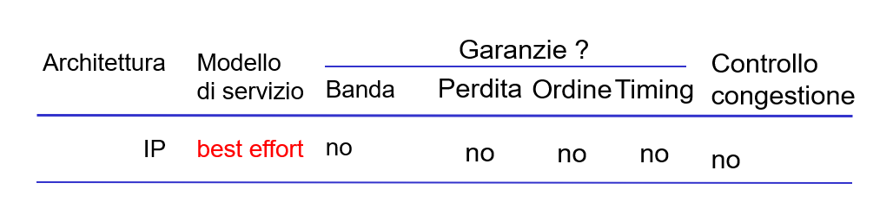
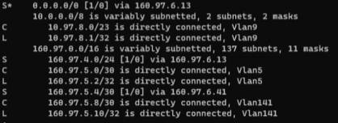
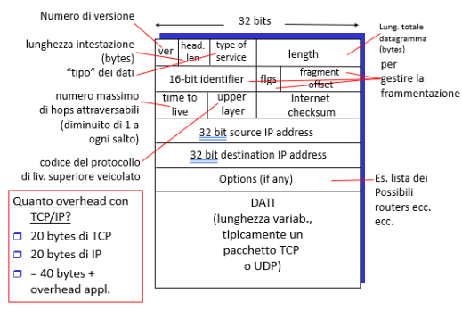

Il compito del livello rete è la trasmissione logica di pacchetti tra due host arbitrari che in generale non sono direttamente connessi (ovvero non hanno un collegamento diretto tra di loro). In sostanza, si occupa dell'indirizzamento e instradamento di datagrammi verso la giusta destinazione attraverso il percorso di rete più appropriato. I segmenti TCP del layer superiori vengono, eventualmente, frammentati in tanti datagrammi IP alla partenza. Il *router* è l'oggetto principale di questo layer. 

Questo layer viene definito **best effort** cioè non garantisce che i dati vengano consegnati però fa di tutto affinché ciò avvenga. Le due operazioni principali sono:
- **Routing:** determinazione del percorso completo tra sorgente e destinazione;
- **Forwarding:** inoltro dei messaggi all'HOP successivo (non necessariamente il destinatario reale).

## Router (1)
Un router contiene più interfacce bidirezionali attraverso cui *dirotta* i pacchetti al prossimo HOP. Affinché ciò avvenga sfrutta delle cosiddette **Routing Table** (o meglio dette **Forwarding Table**). Questa tabella contiene generalmente solo i dispositivi *limitrofi/adiacenti* al router stesso. Le *route* memorizzate al suo interno possono essere di diverso tipo: 
- ** *L*: Local**, è sempre rappresentato da un indirizzo */32*; 
- ** *C*: Connected**, è un'interfaccia/dispositivo direttamente connesso;
- ** *S*: Statica**, impostata manualmente oppure di default.

### *Control Plane*
Nel **Control Plane** del *Routing* si riferisce a tutte le funzioni e i processi che determinano quale percorso utilizzare per inviare il pacchetto o il frame. *Control Plane* è responsabile del popolamento della tabella di routing, del disegno della topologia di rete, dell'inoltro della tabella e quindi dell'abilitazione delle funzioni del piano dati. Significa che qui il router prende la sua decisione. In una sola riga si può dire che è responsabile di ***come devono essere inoltrati i pacchetti***.

### *Data Plane*
Nel **Data Plane** del *Routing* si intendono tutte le funzioni e i processi che inoltrano pacchetti/frame da un'interfaccia all'altra in base alla logica del piano di controllo. La tabella di routing, la tabella di inoltro e la logica di instradamento costituiscono la funzione del piano dati. Il *Data Plane* passa attraverso il router e i frame in entrata e in uscita vengono eseguiti in base alla logica del *Control Plane*. Significa che in riga singola si può dire che è responsabile dello spostamento dei pacchetti dalla sorgente alla destinazione. Viene anche chiamato ***Forwarding plane***.

## Router (2)
**Attenzione!** Anche gli endpoint hanno all'interno delle tabelle di routing. Naturalmente hanno funzioni differenti, visto che questi ultimi non devono preoccuparsi di come verrà instradato il pacchetto, ma il contenuto è molto simile. Si occupano principalmente di definire quale delle interfacce utilizzare (*scheda WiFi*, *ethernet*, ecc.).

Per decidere quale route scegliere, esistono alcune regole di precedenza/priorità:
1. si applica la rotta con subnet di destinazione a maschera più lunga (da 32 a 0) a cui il *destination address* risulta appartenere;
2. a parità di lunghezza di maschera si sceglie la rotta con metrica più bassa;
3. a parità di metrica deciderà il sistema operativo, anche pacchetto per pacchetto
4. se il datagramma è **in transito** (**forwarded**) lo si inoltra in accordo alla rotta scelta
5. se il datagramma è **outbound** (originato sull’host che applica la tabella di routing), allora l'*source address* è scelto in accordo all’interfaccia scelta. La rotta scelta verrà mantenuta per tutta la durata delle conversazione L4 corrispondente.

## Indirizzo IP
Un **indirizzo IP** permette di identificare un host all'interno di una rete. Un IP può essere suddiviso in due parti:
- **Indirizzo Rete (prefisso):** Identifica la rete a cui appartiene l'host;
- **Indirizzo Host:** rappresenta l'identificativo univoco di quell'host all'interno di quella rete.

In passato gli indirizzi IP erano anche classificati in tre macro-categorie in funzione di alcuni range:
- **Classe A:** gli indirizzi che hanno come primo bit pari a 0 (subnet */8*);
- **Classe B:** gli indirizzi che hanno come primi due bit pari a 10 (subnet */16*);
- **Classe C:** gli indirizzi che hanno come primi tre bit pari a 110 (subnet */24*). 

Inoltre gli indirizzi IP si possono ulteriormente suddividere in:
- **privati:** usati per risparmiare indirizzi, vengono generalmente utilizzati per la configurazione di LAN (192.168.0.0/16 - 172.16.0.0/12 - 10.0.0.0/8);
- **pubblici:** usati per identificare univocamente un server/host all'interno della rete.

## Formato di un datagramma

## Frammentazione
Ogni link ha una sua *MTU (max transfer unit)*: tipi di link differenti avranno differenti MTU.

I datagrammi vengono spezzettati da un link a un altro: al mittente, un datagramma viene diviso in più datagrammi e viene riassemblato solo a destinazione. I bit di controllo dell'intestazione ci dicono come riassemblare un datagramma.

Il numero minimo di HOP è 1 qualora arrivasse a 0 il router deve sollevare un'eccezione detta **TTL Excided (ICMP)**. Tramite questo meccanismo si può fare il trace routing perché ad oggi messaggio di "morte" viene mandato l'IP del router che lo ha sollevato. Il TTL venne creato per evitare cicli infiniti involontari.

Il **fragment offest** frammenta il segmento generato dai layer superiori. In *IP_v6* non si usa più la frammentazione ma bensì si utilizza un protocollo di discovery che individua la *MTU (Maximum transport unity)* più piccola e tutta la rete si adatta.

## Sottorete (subnet)
Questa divisione si è andata via via a perdere a causa dell'introduzione delle cosiddette sottoreti. Una **sottorete (subnet)** rappresenta un gruppo di indirizzi appartenenti alla stessa rete. 

Pertanto ad ogni indirizzo IP viene associata una cosiddetta **maschera di rete** attraverso cui è possibile identificare quali bit di un indirizzo appartengono al cosiddetto indirizzo di maschera (indirizzo di rete, in binario è identificato da una serie di 1). 

I seguenti indirizzi sono alcuni indirizzi speciali:
- il *primo indirizzo* rappresenta la rete vera e propria e non viene mai usato/assegnato a nessun host;
- l'*ultimo indirizzo* rappresenta l'indirizzo di broadcast cioè l'indirizzo attraverso cui è possibile inoltrare il messaggio a tutti gli utenti della rete;
- *indirizzi multicast* da 224.0.0.0/4;
- *indirizzo di gateway* permette ad una rete locale di comunicare con l'esterno. Generalmente è rappresentato o dal primo o dall'ultimo indirizzo host disponibile.

## Indirizzamento
*Ma come fa un ISP ad avere degli indirizzi?* Con il protocollo **ICANN (Internet Corporation for Assigned Names and Numbers)** con cui alloca gli indirizzi, gestisce i DNS top level, risolve le dispute, assegna i domini e, tramite il servizio WHOIS, consente di accedere al [[Database|database]] delle subnet assegnate.
