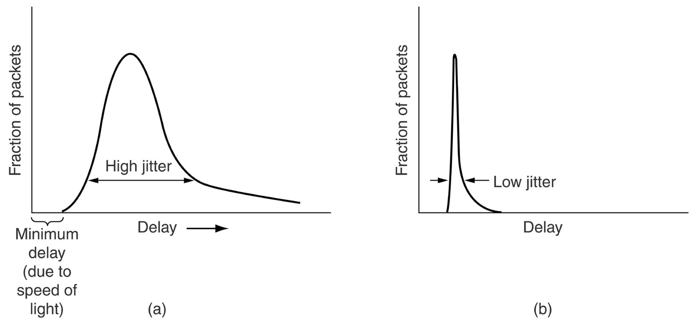

## Esigenze di un protocollo applicativo
Ogni protocollo necessità di alcune peculiarità:
- **Affidabilità:** tolleranza alla perdita di informazioni, misurata in percentuale media di pacchetti persi;
- **Tempo di risposta/Latenza:** ritardo nella risposta, misurata in *ms*;
- **Jitter:** ha impatto sulle altre 3, misurata in *ms*;
- **Banda/throughput:** informazioni inviate in *ms*, misurata in *bit/s*.

Come si evidenzia tutte le misure di qualità vengono influenzate pesantemente dal **tempo**. Inoltre questi dipendono dal momento in cui li si misura e dalla scelta dei due endpoint.

## Throughput e banda
Il **throughput** è un flusso attuale dei dati, espresso in *bit/sec* o multipli (ad esempio, indica quanta acqua passa in questo momento nei “tubi”).

La **banda** è un flusso massimo raggiungibile (ad esempio, indica la portata massima del “tubo”). ***Assolutamente da non confondere con la latenza.***

## PingPlotter
Con *PingPlotter* possiamo vedere il percorso che fa il nostro pacchetto per partire dal nostro client fino ad arrivare al server desiderato. Un salto di latenza lungo significa o che sta passando per un satellite o che sta passando nell'oceano.

## Latenza
Per **latenza** si intende l'intervallo di tempo che intercorre fra il momento in cui viene inviato l'input/segnale (*eco request*) al sistema e il momento in cui è disponibile il suo output (*eco response*). In altre parole, *la latenza non è altro che una misura della velocità di risposta di un sistema*. 

Alla latenza viene affiancata un'altra misura che si chiama *Round Trip Time (RTT)* la quale rappresenta il tempo che intercorre tra l'invio di un segnale più il tempo necessario per la ricezione della conferma di quel segnale.  

Poiché la latenza sarebbe difficile da misurare (necessita di una sincronizzazione tra i due sistemi), allora si usa come sua approssimazione l'RTT: si suppone infatti che la distanza che separa i due punti sia simmetrica e che lo stato di congestione della rete sia uguale. Matematicamente lo possiamo rappresentare come:
> $$ Latenza \cong RTT/2 $$

Le misure vengono inoltre influenzate da diverse tipologie di "ritardi":
- *elaborazione:* ritardo legato all'elaborazione del segnale, processi interni al router, elaborazione del nodo finale (CPU);
- *accodamento:* rappresenta indirettamente la congestione di un determinato endpoint. Possiamo immaginare che ogni nodo della rete abbia una "coda/buffer di ricezione con priorità" che si riempie man mano che arrivano richieste. Pertanto se la rete è congestionata il tempo totale sarà maggiore;
- *trasmissione:* rappresenta i limiti fisici dei cavi;
- *propagazione:* rappresenta i limiti fisici dei cavi (distanze. Matematicamente: $$ \frac{lunghezzadellink}{velocità} $$

In conclusione, quando parliamo di latenza ci riferiamo al tempo che ci mette il pacchetto da un punto A ad un punto B. Ovviamente la latenza tra un cavo di 1 metro e un cavo lungo migliaia di chilometri è differente: per esempio, i cavi sotto l'oceano vanno quasi alla velocità della luce.

## Ritardo "nodale"
Il **ritardo "nodale"** è la somma di diversi ritardi: *ritardo di elaborazione* (caricamento della risorsa sul client), *di accodamento* (dipende in base al traffico del server), *di trasmissione* e *di propagazione*.
La latenza può essere calcolata: 
- **unloaded:** viene misurata quando non c'è traffico di rete, cioè priva di congestione;
- **loaded:** viene misurata durante il download in maniera tale da sollecitare tutti i buffer di ricezione dei nodi coinvolti nell'operazione. Di conseguenza, soffre molto di ritardo di accodamento e di elaborazione.

## Affidabilità
L'**affidabilità** è misurabile in termini di probabilità di consegna di un pacchetto con successo. È complementare al packet loss, influenzato dalla congestione, e quest'ultimo si calcola come:
> *%packet_loss = 100 - %affidabilità*

Possiamo pensare all'esempio del piccione viaggiatore dove non abbiamo la certezza che il messaggio arrivi al destinatario.

Il packet loss influenza nel TCP maggiore latenza, jitter e minor throughput, nell'UDP senza ritrasmissioni influenza la perdita di qualità.

## Esigenze delle applicazioni più comuni
Possiamo classificare le esigenze in base all'applicazione e valutiamo l'*affidabilità*, la *banda* e la *latenza*:
- **file transfer:** nessuna perdità di affidabilità, banda elastica e nessuna latenza;
- e**-mail:** nessuna perdità di affidabilità, banda elastica e nessuna latenza;
- **documenti web:** nessuna perdità di affidabilità, banda elastica e latenza possibile;
- **audio/video in diretta:** tolleranza alla perdità di affidabilità, banda definita, latenza superiore a 100 *msec*;
- **audio/video memorizzato:** tolleranza alla perdità di affidabilità, banda definita, latenza può concedere qualche secondo;
- **giochi interattivi:** tolleranza alla perdità di affidabilità, banda definita (pochi *kbps*), latenza superiore a 100 *msec*;
- **messaggi istantanei:** nessun perdita di affidabilità, banda elastica, non per forza deve essere presente la latenza.

## Servizi a disposizione per le applicazioni

Per quanto riguarda il servizio TCP:
- è necessaria una fase di set up per aprire una connessione;
- **affidabile:** il programmatore può assumere, più o meno, che il canale sia affidabile;
- **controllo di flusso e congestione:** i pacchetti arrivano in ordine e non bisogna pensare al fatto che si producano troppi dati, basta inviare;
- **sequenzialità delle informazioni**;
- **cosa non c’è:** nessuna garanzia su latenza e banda.

Per quanto riguarda il servizio UDP:
- trasferimento non affidabile tra mittente e destinatario;
- non fornisce connessione, affidabilità, controllo di flusso e congestione, garanzie di latenza o banda, sequenza di arrivo.

Tra i due si sceglie sempre il servizio UDP: *perchè questa scelta?*

## Jitter
Il **jitter** rappresenta la variabilità dei tempi di risposta tra l'invio e la ricezione dei pacchetti. Sarebbe la stima di quanto oscilla mediamente la latenza. Può essere misurato come lo scarto quadratico medio delle misure di latenza ed ha impatto sulla probabilità di arrivo di messaggi fuori ordine.

Il jitter influenza: 
- **TCP:** *head of the line blocking*. Il processo di acquisizione dei pacchetti è rallentato perché si deve ricostruire il messaggio: questo implica anche una maggiore latenza;
- **UDP:** *packet loss*. Per applicazioni real time è un problema non indifferente.

## HTTP DASH
**HTTP DASH** prevede una gestione del throughtput: se la rete è congestionata e in quel momento non garantisce un buon throughput si decide di abbassare la risoluzione. Bufferizza tronchi da 10 secondi circa l'uno di video facendo prima una stima se la rete ha throughtput sufficiente per gestire la risoluzione.

Le misure di qualità del servizio dipendono da: 
- **endpoint (i due endpoint dove si prendono le misure)**;
- **tempo (momento in cui si fa la misura)**.
