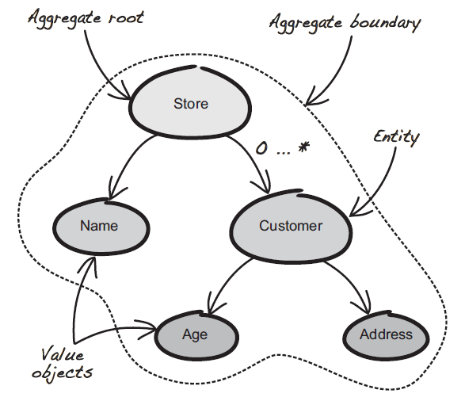
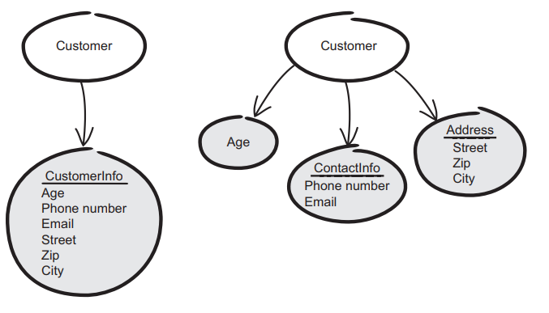
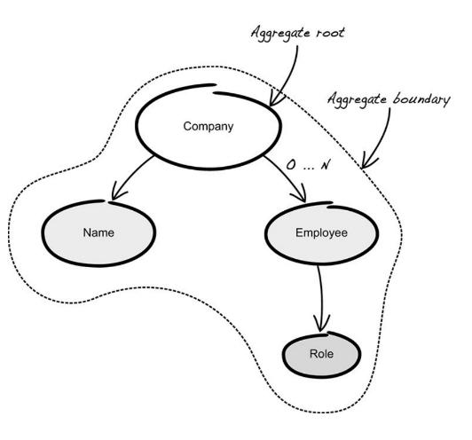

***Domain-Driven Design* è un approccio allo sviluppo di software complessi in cui ci concentriamo sul dominio principale, esploriamo modelli in una collaborazione creativa tra professionisti del dominio (stakeholder) e professionisti del software e parliamo un linguaggio onnipresente all'interno di un contesto delimitato in modo esplicito.**

L'obiettivo di questa metodologia è **comprendere adeguatamente il dominio applicativo**. Per fare questo è necessario individuare un **esperto di dominio**, che coincide molto spesso con il cliente/stakeholder stesso, e stilare una sottospecie di **dizionario di dominio** (*omnipresent* e *obiquitous* language, cioè utilizziamo gli stessi termini ovunque si parli del sistema di interesse). La realtà generalmente risulta essere complessa ed ambigua da rappresentare, pertanto si utilizzano dei **"modelli di dominio"** e cioè delle astrazioni/semplificazioni teoriche della realtà, che ne permettono di dare una versione meno ambigua e rigorosa. 

Naturalmente, si possono definire diversi modelli rappresentati la stessa realtà, la scelta di uno piuttosto che un altro dipende da cosa dobbiamo realizzare.

## Costrutti dei modelli

Possiamo individuare tre elementi principali:
- **Entità:** ha un proprio identificativo che permette di distinguerla tra le diverse entità. Può contenere altri oggetti: entità o attributi. È responsabile del coordinamento delle operazioni dei relativi oggetti. Esistono due tipologie di identificativo: *locale* (numeri progressivi) e *globale* (Universally unique identifiers - UUID);
- **Value object:** viene identificato più dal valore che assume piuttosto che da un identificativo, è immutabile, può far riferimento ad altre entità, definisce importanti vincoli, ha vita breve. Dalla figura seguente, possiamo notare come ci sono modi diversi di rappresentare un venditore e i suoi relativi attributi. Nel primo caso si è realizzato un oggetto *Customer*, nel secondo invece, gli attributi sono stati modellati in concetti ben precisi (è da preferire quest'ultima soluzione);

    

- **Aggregati:** un raggruppamento concettuale che racchiude parti del modello. Viene trattato come se fosse un'unità. Ha un insieme di regole: 
    - ha una radice, cioè contiene una specifica entità. Solo attraverso di essa si può far riferimento dall'esterno all'aggregato;
    - contiene a sua volta un "global identity" e le altre entità al suo interno hanno a loro volta una "local identity";
    - poiché da un aggregato dipendono numerose altre entità, può accadere che si vengano a creare delle "inconsistenze temporanee" durante transizioni (metodi). Queste però vengono risolte a termine di queste ultime. 

    

- **Bounded context:** durante la definizione del modello è normale incontrare termini simili che potrebbero essere confusi, ma nella realtà fanno riferimento ad un "contesto" diverso. In questo caso si parla proprio di *bounded context*.
