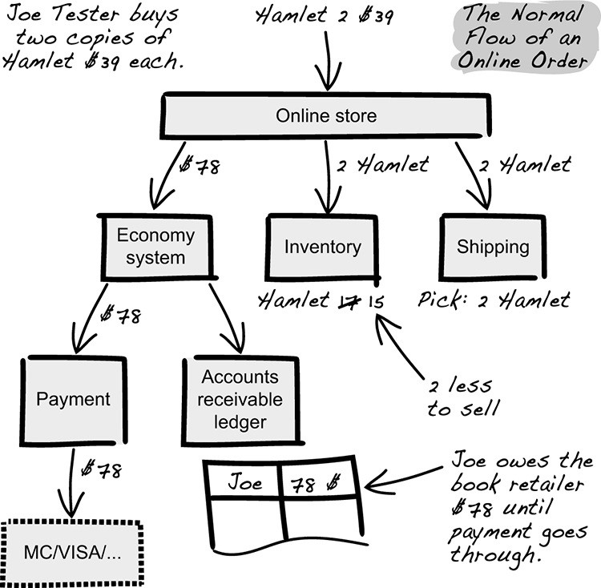
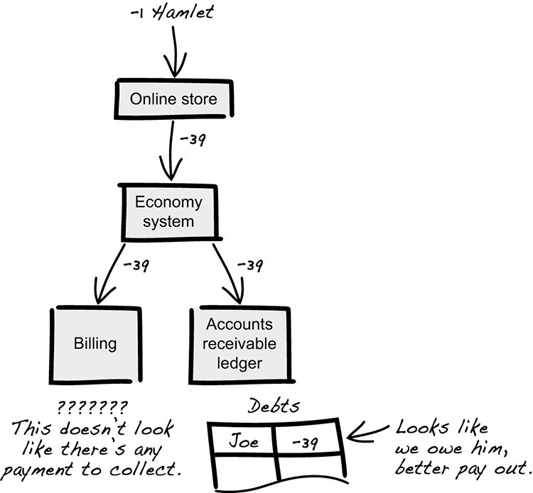
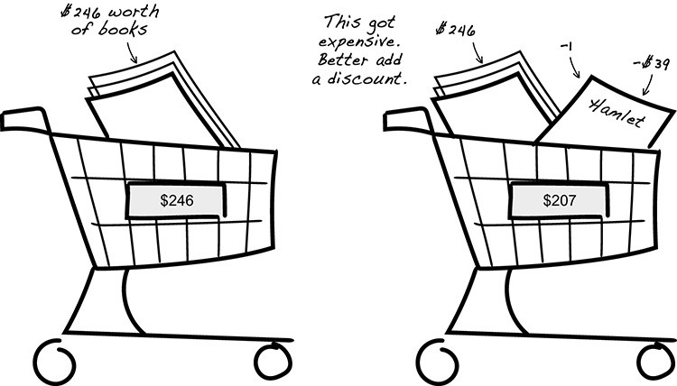

## Problema della libreria online
Immaginiamo di avere un sito di vendita di libri. Nell’immagine possiamo vedere un problema scoperto durante un controllo di sicurezza.



L'infrastruttura sembra solida, mentre la squadra di sicurezza si mette a curiosare: sonda i firewall, scansionano le porte aperte del sistema operativo, lanciano pacchetti dannosi al server web, eppure tutto funziona bene. 
Non è una grande sorpresa: al giorno d'oggi, i problemi di sicurezza problemi di sicurezza sono raramente il risultato di un'infrastruttura non funzionante. Abbiamo imparato che le cose che non dovrebbero essere esposte al pubblico dovrebbero essere tagliate fuori dal pubblico.

La svolta arriva quando uno dei membri del team si incuriosisce del campo *Quantity* del modulo d'ordine ed inserisce come quantità -1 per una copia dell'Amleto al prezzo di 39 dollari: quindi, cerca di acquistare un Amleto negativo, un *anti-Amleto*.
**Rimane sorpreso di non ricevere alcun messaggio di errore.**



Il problema della sicurezza attraversa diversi moduli del sistema. Il modulo di fatturazione stabilisce che è previsto un pagamento. Il modulo di contabilità rileva un addebito da saldare il prima possibile.



In questa maniera, **immaginiamo di acquistare 3 libri per un totale di 246 dollari ed aggiungiamo l'*anti-Amleto*, andremo a pagare meno tutto l'intero ordine perchè quel valore negativo decrementare il totale da 246 dollari a 207 dollari**.
Nel caso di studio era frequente ed ulteriori indagini rivelano che il problema coinvolge altri sistemi dell'azienda.

L'acquisto di -1 libro provoca un incremento dell'inventario: la rappresentazione informatica dell'inventario diventa inconsistente. L'acquisto di -1 libro causa la spedizione di -1 libro: il sistema di spedizione ignora la richiesta, nessuno controlla i log. ***Le incoerenze possono compensare e passare inosservate, causando perdite consistenti per l'azienda.***

### Modellazione a bassa profondità
*Un'azienda che fa trapelare denaro in questo modo ha ovviamente un problema di sicurezza.* Come può accadere accadere? E, soprattutto, come si sarebbe potuto evitare? Questo tipo di situazione è spesso il risultato di una modellazione che si ferma al primo modello che sembra adatto, senza approfondire o mettere in discussione e senza pianificare o considerare o considerazione. Questo stile ad hoc viene definito **modellazione superficiale o a bassa profondità** (in contrasto con la modellazione profonda).

*Riteniamo che molti di questi errori dipendano dal fatto che la modellazione è incompleta o addirittura mancante.* Questi possono emergere dalla discussione tra lo sviluppatore ed il cliente. La discussione potrebbe svolgersi in questo modo:

> "E poi si possono aggiungere libri all'ordine", dice il cliente.
>
> "Allora, come descriviamo un libro?", chiede lo sviluppatore.
>
> "Mostriamo un titolo e un prezzo", risponde il cliente.
>
> "Quale può essere il prezzo? È sempre un numero intero?", chiede lo sviluppatore.
>
> "Beh, no, un libro può avere un prezzo di 19,50 dollari, tasse escluse", chiarisce il cliente.
>
> Lo sviluppatore pensa: "Quindi un libro ha come attributi un titolo e un prezzo. Il titolo è una stringa. Il prezzo non è un int, ma un float".

**ATTENZIONE!** Mai, mai, mai, mai rappresentare il denaro come un *float*!

> E lo sviluppatore chiede: "È tutto qui il significato di un libro?".
>
> "No", risponde il cliente, "è anche importante che abbia un ISBN, in modo da poter tenere separati i libri cartonati e i tascabili". e i tascabili".
>
> "Ok, e poi aggiungiamo i libri all'ordine", dice lo sviluppatore. "Per esempio, *Moby Dick*, *Orgoglio e pregiudizio*, *Amleto*, ancora *Moby Dick*, 1984 e ancora *Moby Dick*?".
>
> "Beh, quasi. Noi diremmo tre libri di *Moby Dick*, perché non ci interessa in che ordine di acquisto".
>
> "Ok", pensa lo sviluppatore. "Non è un float, è un intero".

**ATTENZIONE!** Non lasciare la modellazione come "È un intero"!

```java
class Book {
    String title;
    String isbn;
    double price;
    ...
}

class Order {
    void addOrderLine(Book book, int quantity) {
        ...
    }
}
```
Nella conversazione, nota che lo sviluppatore non fa ulteriori domande su cosa sia un titolo o sull'ISBN, saltando alla conclusione che sono semplicemente testo e li rappresenta usando le stringhe nel codice. Ma, molto probabilmente, un titolo non può essere una stringa e un ISBN certamente no.

Deve non è incompetente quando si tratta di modellare. Fa una domanda interessante sulla natura del prezzo ("È sempre un numero intero?"), ma la lascia lì. Inoltre, gli manca completamente il suggerimento che i prezzi potrebbero essere più complicati quando il cliente risponde: "... tasse escluse". L'unità per lo sviluppatore sembra essere "Posso rappresentarlo in codice?" e non "Capisco come funziona?".

Abbiamo visto che una modellazione a bassa profondità come questa porta ad avere concetti di business interessanti rappresentati come primitivi: *int*, *float/double*, *string*, *boolean* e così via. La nostra esperienza è che questi tipi di rappresentazioni implicite sono comuni. **Spesso vediamo sistemi in cui quasi tutto è rappresentato da stringhe, numeri interi e float. Sfortunatamente, questo ha diversi inconvenienti.**

Il tipo int può rappresentare un valore compreso tra -2 miliardi e 2 miliardi.* È una buona rappresentazione della qualità? Di qualsiasi altra cosa? Ha senso che il titolo sia una stringa qualsiasi? Ha senso che iSBN sia una stringa qualsiasi?* Tutte queste domande hanno una risposta chiara: lo sviluppatore ha perso l'opportunità di un controllo statico del codice perchè *title* e *isbn* hanno lo stesso tipo, *string*:

```java
void addCust(String name, String phone, String fax, int creditStatus, int vipLevel, String contact, String contactPhone, boolean partner)
```

### Modellazione ad alta profondità (deep modeling)
Per comprendere la modellazione ad alta profondità, devi prima riconoscere che *qualsiasi modello che ti viene in mente è una scelta*. In ogni dominio, sono possibili innumerevoli modelli diversi. **Quando progetti, scegli su quale insieme di concetti costruire il tuo design e quale significato carichi in quelle parole.** Fare uno sforzo consapevole durante la modellazione significa cercare attivamente modi per comprendere il dominio. *Il risultato è che svelerai più concetti che devono essere rappresentati in modo esplicito* per acquisire la piena comprensione del tuo modello.

Torniamo alla discussione tra lo sviluppatore e e il cliente per vedere come potrebbe evolversi con una mentalità di *modellazione ad alta profondità*:

> "E poi puoi aggiungere libri all'ordine", dice il cliente.
>
> "Allora, come si descrive un libro?" domande lo sviluppatore.
>
> “Mostriamo un titolo e un prezzo”, risponde il cliente.
>
> “Quale può essere il prezzo? È sempre un numero intero?" chiede lo sviluppatore.
>
> "Beh no, un libro può avere un prezzo di 19,50 dollari, tasse escluse", chiarisce il cliente.
>
> Lo sviluppatore pensa: “Quindi, un libro ha titolo e prezzo come attributi. E il prezzo sembra essere di per sé una questione complicata perché hai menzionato le tasse. Avrò bisogno di approfondire quelli più tardi", e chiede: "È tutto ciò che c'è in un libro?"

Da quel che si evince già da questa prima parte di conversazione, **identifica concetti complessi, prendi nota e approfondisci prima di codificare.**

> "Nah", risponde il cliente, "è anche importante che abbia un ISBN, quindi teniamo separati i libri con copertina rigida e tascabile".
>
> "OK. E poi aggiungiamo i libri all'ordine”, dice lo sviluppatore. "Ad esempio, *Moby Dick*, *Orgoglio e pregiudizio*, *Amleto*, ancora *Moby Dick*, 1984 e ancora *Moby Dick*?"
>
> "Beh, quasi. Diciamo che hai una quantità di tre libri di *Moby Dick*, poiché non ci interessa in quale ordine li acquisti", afferma il cliente.
>
> "Puoi comprare mezzo Moby Dick?" chiede Deve.
>
> "Certo che no, sciocco."

I libri sono in numero intero. Il venditore usa il termine *quantità*. Identificare concetti dal *dominio* e utilizzarli per approfondire l'analisi.

> "Hai usato la parola quantità", dice lo sviluppatore. “Voglio capirlo meglio. Cosa succede se hai una quantità di tre libri Moby Dick e poi vengono rimossi? Avete quindi una quantità di zero libri Moby Dick?"
>
> “Ehhh, non proprio. Voglio dire, una quantità pari a zero non è affatto una quantità. Diciamo nessuna quantità", chiarisce il cliente.
>
> "Questa quantità sembra avere alcune regole attorno ad essa", dice lo sviluppatore. “Allora, quanto può essere grande una quantità? Due miliardi di libri?"
>
> “Ahah. Beh, certamente no. Seriamente, penso che siamo limitati dal flusso logistico attraverso il negozio e non può gestire ordini superiori a una quantità totale di 240".

Abbiamo identificato un limite inferiore della quantità: 1.
Chiediamo il limite superiore. **Se il venditore utilizza nuovi termini, chiediamo delucidazioni.** Potrebbe essere un nuovo concetto di dominio da modellare.

> "Il flusso attraverso il negozio?" chiede lo sviluppatore.
>
> “Sì, è così che lo chiamano. È così che gli ordini dal negozio online vengono gestiti al magazzino; si tratta di dimensioni delle scatole, stazioni di imballaggio e cose del genere. Gli ordini più grandi di quello devono andare al flusso di massa del magazzino. Ma non possiamo usarlo dal negozio online", spiega il cliente.
>
> “Qual è la quantità totale di un ordine? Mi fai un esempio?"
>
> “Sta semplicemente aggiungendo la quantità di tutti i libri. Se hai tre *Amleti*, quattro *Orgoglio e Pregiudizi* e un *Moby Dick*, allora hai una quantità totale di otto”, dice il cliente.

La singola quantità non può superare 240. Simile per la quantità totale.

Dopo questa lunga conversazione possiamo cominciare a scrivere il nostro codice:
```java
class Book {
    BookTitle title;
    
    ISBN isbn;
    Money price;
    ...
}

class Quantity {
    ...
    Quantity(int quantityOfBooks) {
        isTrue(0 < quantityOfBooks, "Quantity must be positive");
        isTrue(quantityOfBooks <= 240, "Quantity must fit in through-store flow, which is limited to 240");
        ...
    }
}

class Order {
    void addOrderLine(Book book, Quantity quantity) {
        ...
    }
    
    Quantity totalQuantity() {
        ...
    }
}
```
**Troppe classi?** *Ogni concetto del dominio dovrebbe essere rappresentato da una classe.* La classe è responsabile della convalida dei dati, codifica la conoscenza associata al concetto, non utilizzare una classe implica ripetere lo stesso codice di validazione in più punti del software e, quindi, questo significa bug ovunque!
