**Django** è un framework maturo per lo sviluppo web (dal 2005) che si è rivelato solido (presenta molti strumenti, librerie, framework REST). Ci concentriamo sulle API REST (back-end).

## Perchè REST API?
I siti web monolitici dovrebbero rimanere nel passato perchè il *back-end* è basato su modelli di [[Database|database]], URL e [[Viste|viste]] e il *front-end* è basato su modelli di [[HTML]], CSS e [[JavaScript]].

I siti web moderni dovrebbero separare *back-end* e *front-end*: utilizziamo Django per *back-end* e solo per operazioni sui dati ed utilizziamo più *front-end* su browser, Android, iOS.

## HTTP
**HTTP** è un protocollo di richiesta-risposta che spesso viene utilizzato per le funzionalità CRUD. Di seguito abbiamo le corrispondenze CRUD-HTTP:

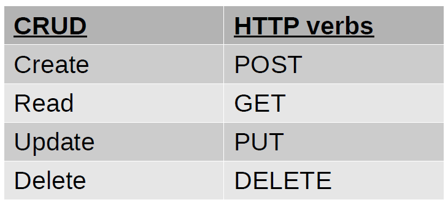

Gli endpoint sono URL che espongono e ricevono dati (in JSON o XML).

## REST
**REST** è un [[Architettura|architettura]] per la creazione di API su HTTP ed è di tipo *stateless* (ogni richiesta dovrebbe essere indipendente dalle richieste precedenti). Si basa sui verbi HTTP (GET, POST, PUT, DELETE, ...). Rappresenta i dati in JSON o XML.

## Anatomia dei progetti Django

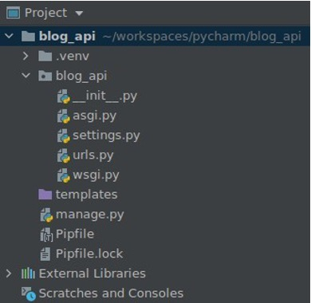

- *settings.py* contiene la configurazione del progetto;
- *urls.py* conterrà tutti i percorsi del progetto;
- i *template* conterranno tutte le pagine [[HTML]] del progetto;
- *manage.py* è uno script per lo sviluppatore per eseguire vari comandi Django. Lo useremo, ma di solito non abbiamo bisogno di modificarlo;
- *WSGI* è uno standard per i server Web Python. ASGI è uno standard per i server asincroni.

### *settings.py*
Essenzialmente un file di dichiarazioni di variabili. Tutti i nomi delle variabili sono in MAIUSCOLO e sono considerati costanti.

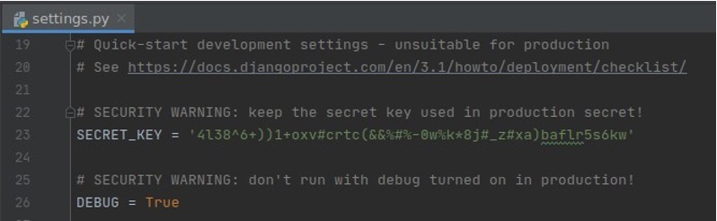

### Cartella *templates*
Django cercherà i modelli qui:

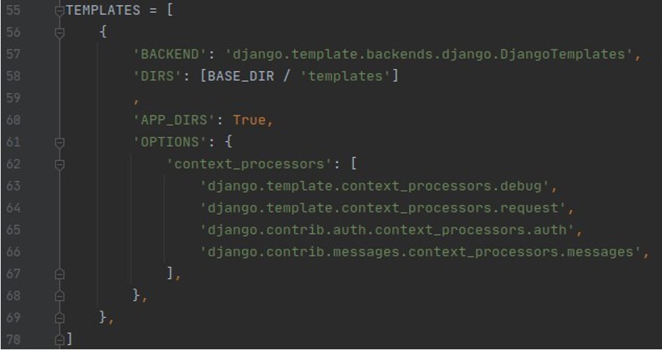

Per le API REST non ne abbiamo davvero bisogno. Possiamo rimuovere i modelli se lo desideriamo e mantieniamo i file statici per il sito di amministrazione.

## Avvio del progetto
Possiamo avviare tramite il pulsante *Run* il nostro progetto ma se siamo al primo avvio bisogna anche migrare prima il [[Database|database]] tramite il comando in console:
```bash
./manage.py migrate
```
Questo comando, nel dettaglio, si occupa di creare o aggiornare il [[Database|database]]. Se invece di avviare tramite il pulsante *Run* vogliamo avviare il progetto tramite comando in console, dobbiamo scrivere:
```bash
./manage.py runserver
```
Per creare un superuser, dobbiamo digitare il seguente comando nella console:
```bash
./manage.py createsuperuser
```
Dopo aver eseguito il comando, bisogna inserire le credenziali come email e password. È consigliabile cambiare anche l'indirizzo della pagina che porta all'area riservata al superuser nel file *urls.py* come di seguito:

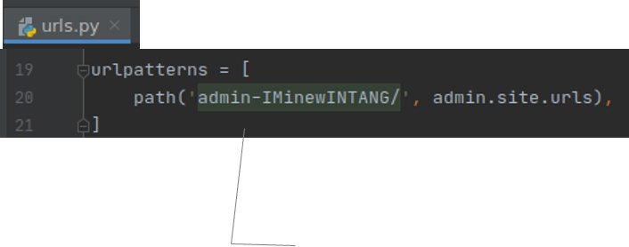

## Creazione della documentazione
Impostiamo anche la documentazione: per prima cosa installiamo *coreapi* e *pyyaml* ed aggiungiamo il codice di seguito al codice di *settings.py*:

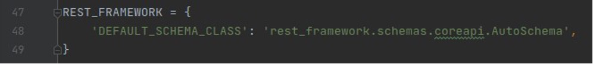

All'interno di questa pagina, andremo ad inserire documentazione leggibile dall'uomo e dalla macchina.

## Creazione di un app
Per creare un app interna al nostro framework, utilizzeremo il seguente comando nella console:
```bash
./manage.py startapp posts
```
In questo modo andremo ad aggiungere un modulo con le seguenti componenti:

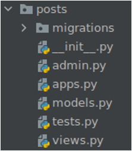

- cartella *migrations*: memorizza i file di migrazione per aggiornare il [[Database|database]];
- *admin.py*: aggiungi contenuto al sito di amministrazione;
- *apps.py*: configurazione specifica dell'app;
- *models.py*: modello di [[Database|database]], test e visualizzazioni.

## Definizione del file *models.py*
Vogliamo una tabella ***Post*** con cinque campi: *autore*, *titolo*, *corpo*, *create_at*, *update_at*. Django fornisce un modello utente (noto anche come tabella): usa *get_user _model()* per evitare problemi.

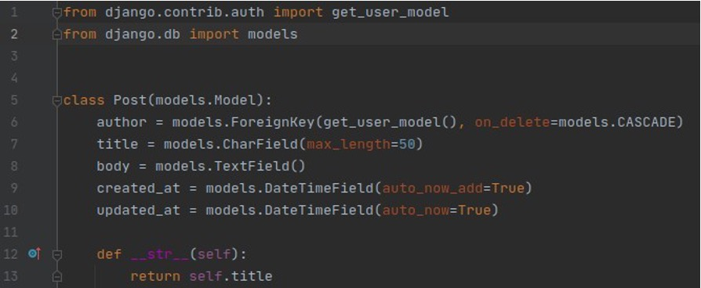

Per farlo funzionare e, quindi, creare più istanze della tabella *Post*, dobbiamo aggiungere la tabella allo script *admin.py*:

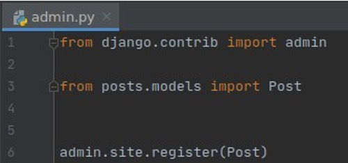

## Definizione delle REST API
Abbiamo tre passaggi principali per definire le REST API:
- aggiungere *serializers.py* per produrre JSON. Aggiungere serializers.py alla directory dell'app: 
    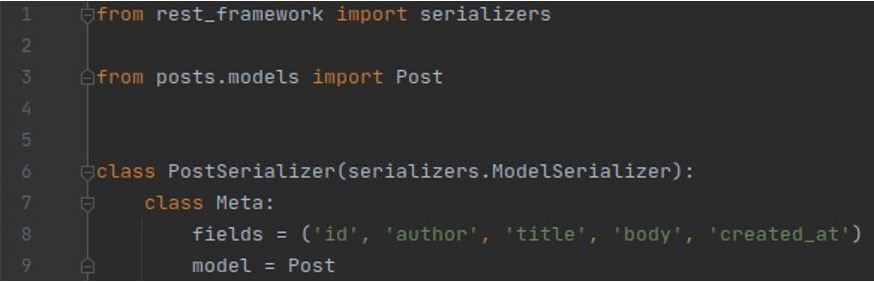

    Con *ModelSerializer* è facile specificare il modello e i campi da esporre;
- utilizzare *views.py* per applicare la logica a ciascun endpoint API. Modifichiamo *views.py*: 
    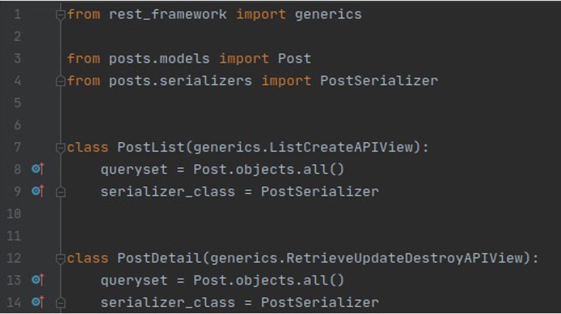

    Elenca tutti i post e tutte le operazioni per un singolo post;
- aggiungere *urls.py* per i percorsi URL. Aggiungere *urls.py* alla directory dell'app: 
    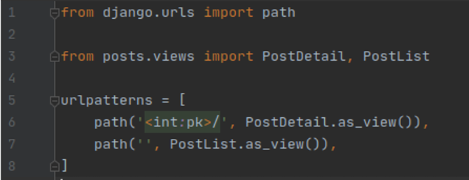

    Percorso vuoto per elencare tutti i post e chiave primaria per operare su un post. 
    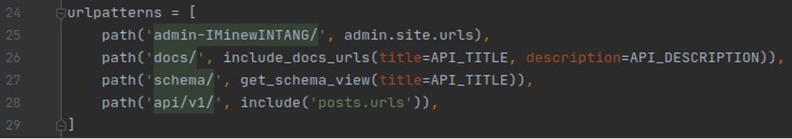

    Includi il nuovo file in *urls.py* principale.  Utilizza il numero di versione per l'URL.

## Browsable API
Seguendo i passaggi precedenti, potremmo visitare la pagina *http://127.0.0.1:8000/api/v1/* e trovare una lista di *Post*, oltre alla possibilità di aggiungere un nuovo *Post*.

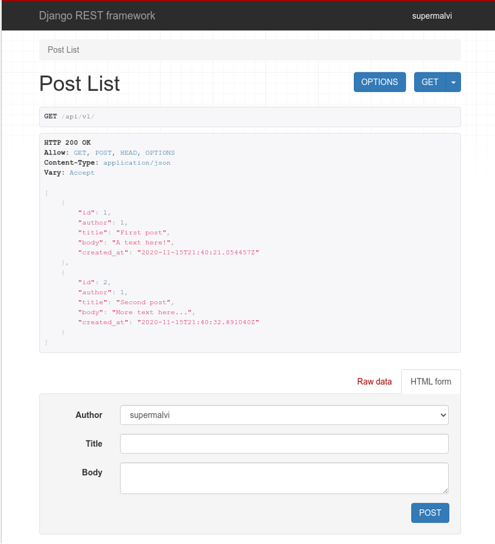

Tramite la pagina *http://127.0.0.1:8000/api/v1/id* dove *id* sarebbe l'identificativo del *Post*, ci permette di visionare il *Post* con quell'identificativo.

## Autenticazione basata sulla sessione
I seguenti passi servono a far funzionare l'autenticazione basata sulla sessione:
- il client invia le credenziali iniziali;
- il server memorizza nell'oggetto sessione che l'utente è autenticato;
- il client memorizza l'ID di sessione (in genere, cookie contrassegnato *HttpOnly*);
- l'ID di sessione viene inviato su tutte le richieste;
- dopo il logout, la sessione viene distrutta su entrambe le parti.

Manteniamo l'autenticazione basata sulla sessione per l'API navigabile e perché è semplice.

Per impostare questo tipo d'autenticazione in Django, andremo ad aggiungerle gli URL nel file Python apposito.

## Autenticazione basata su token
I seguenti passi servono a far funzionare l'autenticazione basata su token:
- il cliente invia le credenziali iniziali;
- il server genera un token univoco;
- il client memorizza il token (ad esempio, una variabile d'ambiente del frontend se utilizzata come chiave API, come quelle delle API di Google Maps);
- il client invia il token con ogni richiesta.

Per impostazione predefinita, Django genera un token per ogni utente e lo memorizza nel [[Database|database]]. Approcci più sofisticati si basano su *JWT* e *OAuth2* e non necessitano di memorizzare nulla.

Per impostare questo tipo d'autenticazione in Django, andremo ad installare, nel file *settings.py*, il plugin *rest_framework. authtoken* per il progetto. Bisogna anche installare *dj-rest-auth* per impostare **login**, **logout** e **reset endpoint** e *django-allauth* per impostare il **registration endpoints**.

Per installare il plugin *rest_framework.authtoken*, anndremo ad inserire la stringa del plugin nella sezione *INSTALLED_APPS* insieme a *django.contrib.sites*. Oltre questo inserimento, bisogna inserire nella sezione *REST_FRAMEWORK*, come di seguito, il supporto all'autenticazione di sessioni e token.

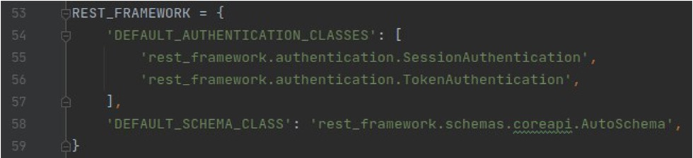

Sempre nello stesso file, disabiliteremo la verifica e-mail per semplicità ed assegniamo l'ID 1 per il nostro sito perchè gestiamo un solo sito.

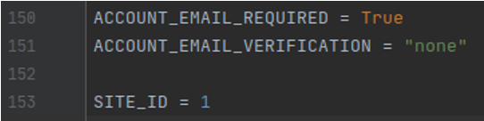

Infine, nel file *urls.py* della directory *blog_api*, andremo ad inserire il collegamento alle pagine dei nostri plugin come di seguito:

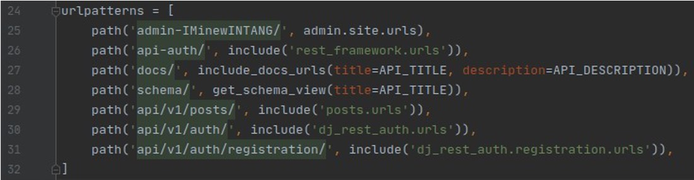

La seconda riga dell'URL è riferita all'autenticazione basata sulla sessione per browsable API (è fuori dalla nostra REST API). La quinta riga dell'URL serve per evitare le ambiguità con l'aggiunta di un prefisso agli URL dei post. La sesta riga dell'URL serve all'autenticazione basata su token come parte della nostra API REST.

**Il browsable API ora supporta le operazioni di login e logout.**

## Autorizzazione
L'*autenticazione* si occupa di **chi sei** mentre l'*autorizzazione* si occupa di **cosa puoi fare**: limita l'autorizzazione predefinita solo all'amministratore, autorizza in base a criteri per visualizzazione o per oggetto e sfrutta i permessi e i gruppi di Django.
Nel file *settings.py*:

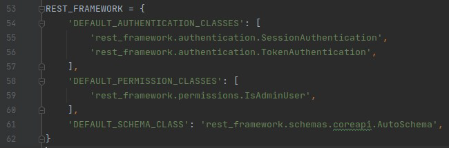

Solo l'amministratore è autorizzato. Il criterio predefinito deve essere restrittivo: evita di abbandonare accidentalmente utilizzi non autorizzati della tua API. Nel file *views.py*:

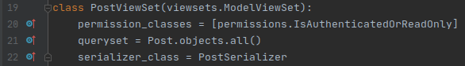

Specifica autorizzazioni diverse per le [[Viste|viste]]: in questo caso tutti possono leggere i post, ma solo gli utenti autenticati possono modificarli. Limitiamo la modifica agli autori:

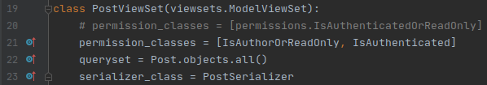

Questo è possibile aggiungendo il file *permissions.py*:

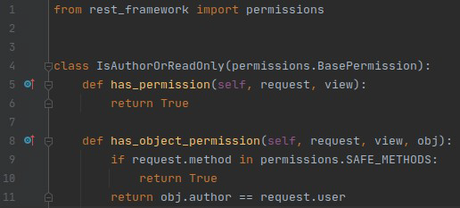

*IsAuthorOrReadOnly* è scritto da noi. Abbiamo il permesso per la vista tramite il permesso *has_permission*.

Possiamo limitare la visualizzazione in modo che gli utenti possano solo leggere i propri post? Sì, la vista deve filtrare gli oggetti nel set di query. Aggiungiamo una nuova vista (o, in un contesto reale, modifichiamo quella esistente). Possiamo filtrare il queryset definendo questo metodo. Se hai optato per una nuova visualizzazione, aggiungi gli URL per essa.

Django fornisce un ricco set di permessi per utenti e gruppi. Aggiungiamo un gruppo **post_editors** con tutte le autorizzazioni sui post.

## Autorizzazione basata sui ruoli
Autorizza le visualizzazioni ai membri di gruppi specifici. Il gruppo rappresenta un ruolo.

## Autorizzazione basata sui permessi
Autorizza le visualizzazioni agli utenti con autorizzazioni specifiche. Tieni presente che gli utenti ereditano le autorizzazioni dei loro gruppi.

## Test
Abbiamo molto codice, ma nessun test: proprio perché stiamo imparando Django, ci siamo concentrati prima sul codice. È ora di risolvere il problema e aggiungere alcuni test: da questo punto, dovremmo preferire un approccio TDD.

### Creazione dell'ambiente
Installa **pytest-django** e **mixer**. Imposta *pytest* come strumento di test e aggiungi una configurazione di esecuzione per *pytest* nei test di percorso.

Crea file di prova per *models.py* e *urls.py*. È possibile testare anche *views.py*, ma più noioso e in qualche modo implicito in *test_urls.py*.

Poiché manteniamo i test nella directory test, possiamo anche rimuovere *test.py* nel modulo dell'app.

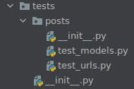

Aggiungi *pytest.ini* nella radice del progetto e punta a *settings.py* (a meno che tu non voglia specificare impostazioni diverse per il test).

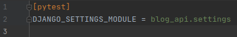

*Se tutto funziona, scriviamo il nostro primo test.*

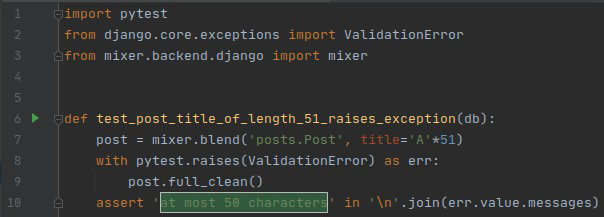

- *db* è una **fixtures**, un oggetto che possiamo utilizzare nei nostri test, in questo caso per accedere al [[Database|database]] temporaneo utilizzato dai test;
- **_mixer_** crea oggetti dai nostri modelli, con valori casuali per i campi non forniti;
- chiama **_full_clean_** su un oggetto del nostro modello per convalidarlo;
- Django fornisce molti validatori comuni con la sintassi *validators=[]* tra le proprietà dell'oggetto. All'interno delle parentesi quadre, possiamo inserire dei metodi che fungono da validatore;
- possiamo anche controllare il messaggio dell'eccezione, ma non incoraggerei questa pratica.

Questo test è passato, doveva essere scritto prima del codice. Testiamo anche gli URL, principalmente per le autorizzazioni:

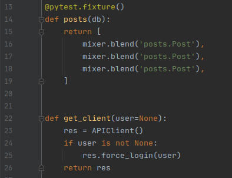

- possiamo definire i nostri *fixtures*, ad esempio per popolare il DB;
- usiamo **APIClient** per simulare un *consumatore di API*.
