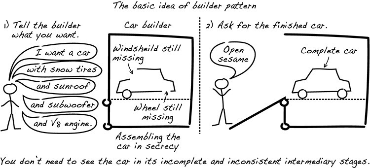

*Lo stato mutevole è un aspetto importante dei sistemi.* In una certa misura, **cambiare stato è lo scopo di molti sistemi**. Il sistema tiene traccia di una varietà di cambiamenti di stato: nell'esempio dell'e-commerce di libri, i libri vengono inseriti nel carrello, l'ordine viene pagato e i libri vengono spediti al cliente. Se non ci sono cambiamenti di stato, non succede niente d'interessante. Lo stato mutevole può essere rappresentato tecnicamente in molti modi diversi. 
Poiché le entità contengono lo stato che rappresenta la tua attività, è importante che *un'entità appena creata segua le regole aziendali*. Le entità che possono essere create in uno stato incoerente possono causare bug e falle di sicurezza difficili da trovare o rilevare: ma *soddisfare tutti i vincoli al momento della creazione può essere difficile*. Quanto sia difficile dipende da quanto sono severi o complicati i vincoli. Esistono un paio di tecniche adatte per gestire la maggior parte degli stati mutevoli, partendo con tecniche semplici per vincoli semplici e finendo con il modello *Builder*, che può gestire anche situazioni piuttosto complicate.

*Una volta che le entità sono state create in modo coerente, devono rimanere coerenti.*

## Gestire lo stato utilizzando le entità

Un tema centrale per la maggior parte dei sistemi è tenere traccia di come cambia lo stato delle cose. Se i sistemi che scrivi non gestiscono correttamente le modifiche, prima o poi avrai problemi di sicurezza, lievi o gravi. La maggior parte delle progettazioni ruotano attorno alla modellazione del cambiamento come entità.

Quando si implementa un sistema, ci sono molti modi per tenere traccia e gestire come cambia lo stato:
- puoi mantenere lo stato in un cookie;
- è possibile apportare modifiche al database direttamente utilizzando SQL o stored procedure;
- è possibile utilizzare un'applicazione che carica lo stato dal server, aggiorna lo stato e lo invia indietro.

Tutti questi approcci sono possibili e hanno vari pregi: sfortunatamente, molti sistemi sono costituiti da un mix incoerente di questi approcci e questo è un rischio.

Nella nostra esperienza, il modo più efficace per garantire che uno stato mutevole sia gestito in modo sicuro e protetto è **modellare gli stati come entità** nello stile di DDD.

## Coerenza nella creazione
**Un'entità che non è coerente con le regole aziendali è un problema di sicurezza.** Ciò è particolarmente vero per un'entità appena creata, quindi è importante che il meccanismo per la creazione di oggetti garantisca che le entità siano coerenti durante la creazione. Potrebbe sembrare ovvio, ma a volte viene trattato come un tecnicismo e le conseguenze potrebbero essere disastrose.

*Un'entità che non è coerente con le regole è un problema di sicurezza* e il modo migliore che abbiamo trovato per contrastare questo rischio è insistere sul fatto che ogni oggetto entità dovrebbe essere coerente immediatamente al momento della creazione.

Poiché le entità rappresentano spesso dati archiviati e modificati per un lungo periodo di tempo, le entità vengono spesso salvate in un database. Se si dispone di un database relazionale insieme a un mappatore relazionale a oggetti (ORM) come JPA o Hibernate, spesso c'è confusione che porta a una progettazione errata e insicura.

Il modo più semplice per creare un'entità è sicuramente usare il costruttore: cosa potrebbe essere più semplice che chiamare un costruttore senza argomenti (ovvero un costruttore *no-arg*)? Il problema è che i costruttori *no-arg* raramente mantengono la promessa di creare un oggetto completamente coerente e pronto per l'uso.

Se ci pensi, un costruttore *no-arg* è una cosa strana da trovare nel codice. Spesso incontriamo entità che sembrano avere una convenzione per la creazione: prima chiami un costruttore *no-arg*, quindi chiami una serie di metodi setter per inizializzare l'oggetto prima che sia pronto per essere utilizzato ma non c'è nulla nel codice che imponga questa convenzione. Purtroppo, la convenzione viene spesso dimenticata o infranta in un modo che porta a entità incoerenti.

**Dove c'è un costruttore *no-arg* per un'entità, c'è probabilmente un'inizializzazione basata sul setter, che molto probabilmente è un problema. Le inizializzazioni basate sul setter rischiano di diventare incomplete; le inizializzazioni incomplete producono oggetti incoerenti.**

## Costruttori ORM e no-arg
Se utilizzi un framework di mappatura relazionale a oggetti potrebbe sembrare che tu sia costretto ad avere un costruttore *no-arg* per le tue entità.

Se utilizzi tali framework, hai due opzioni per evitare falle di sicurezza a questo riguardo: *separare il modello di dominio dal modello di persistenza* o *garantire che il framework di persistenza sia protetto dall'esposizione di oggetti incoerenti*.

La prima alternativa è separarsi concettualmente dal modello di persistenza: se lo fai, il tuo modello di persistenza risiede in un pacchetto separato, insieme ad altro codice dell'infrastruttura. Quando carichi i dati dal database, il framework di persistenza li carica negli oggetti nel pacchetto di persistenza. Successivamente, si costruiscono oggetti di dominio utilizzando tali oggetti prima di consentire agli oggetti di dominio di gestire le chiamate di logica aziendale. In questo modo, sei completamente responsabile di qualsiasi creazione di oggetti di dominio.

## Come gestire molti campi
Evita i costruttori con 20 argomenti: probabilmente, alcuni argomenti possono essere raggruppati in una domain primitive o entità.

Bisogna prestare attenzione anche ai costruttori con argomenti nulli o entità con diverse combinazioni di argomenti.

Prima di introdurre il modello *Builder*, diamo un'occhiata al modello **Fluent Interface**: l'idea è di avere un codice che assomigli a un testo scorrevole in linguaggio naturale, possiamo usarlo per impostare campi opzionali e il trucco è restituire un riferimento all'entità. Utilizzeremo metodi denominati *with** con l'asterisco che indica il nome del dato e restituisce *this*. 

*Attenzione, perdiamo la separazione comando-query:* i comandi dovrebbero cambiare lo stato e non restituire nulla; le query dovrebbero restituire una risposta senza modificare nulla

Un modello **Nonfluent Interface** non restituirlo nel setter: un'interfaccia fluente deve produrre codice che può essere letto in modo scorrevole.
*Con i vincoli avanzati, coinvolgiamo più campi contemporaneamente.*

## Modello *Builder*
L'idea del modello *Builder* è di ottenere un oggetto completo, soddisfacendo tutti i vincoli, prima che altre parti del codice vi abbiano accesso. La complessità della costruzione dell'entità è nascosta da un altro oggetto, il costruttore: chi utilizza il builder non ha bisogno di vedere l'oggetto parzialmente costruito (e non può vederlo). Un esempio del modello *Builder*:



Un esempio di implementazione nella creazione di un conto corrente di una banca:
```java
void openAccount() {
    AccountBuilder accountBuilder = new AccountBuilder(number, accountOwner, interest);
    accountBuilder.withCreditLimit(limit);
    Account account = accountBuilder.build();
    ...
}
```
Il costruttore del modello *Builder* specifica tutti i campi obbligatori. I campi facoltativi vengono aggiunti con altri metodi. Il metodo *build()* restituisce l'oggetto costruito (in questo metodo vengono verificati tutti i vincoli).

**I costruttori sono adatti per l'uso della *Fluent Interface*.**

## Preservare l'integrità delle entità
Ora sappiamo come creare entità valide. Come manteniamo la loro validità? Risulta impossibile se l'entità rilascia un campo mutevole e se l'entità fornisce setter senza controlli. Quindi, dobbiamo controllare i cambiamenti. Facciamo un esempio:
```java
private boolean paid;

public void setPaid(boolean paid) { this.paid = paid; }
public void getPaid() { return paid; }
```
Il campo *paid* è privato, ma il setter lo espone a modifiche arbitrarie.
```java
order.paid = true;
order.setPaid(true);
```
Il compilatore con la prima istruzione si blocca, ma la seconda istruzione è consentito. Facciamo un altro esempio:
```java
private boolean paid;

public void markPaid() { this.paid = true; }
public void isPaid() { return paid; }
```
Con questo esempio, codifichiamo solo regole aziendali: un ordine non pagato può diventare pagato, ma l'altra direzione non è possibile. Il metodo *markPaid()* implementa tale regola aziendale.

## Non condividere oggetti mutabili
Le entità devono condividere i propri dati ed il modo più sicuro per farlo è condividere primitive domains, che sono immutabili. La condivisione di oggetti mutabili apre la possibilità di modifiche fuori dal controllo dell'entità ma, di conseguenza, diciamo addio all'incapsulamento.

## Attenzione alle collezioni
Abbiamo varie possibilità per ottimizzare e rendere sicuro l'accesso ad una collezione (facendo l'esempio dell'ordine degli elementi):
- *public void setOrderItems(List<OrderLine> orderItems)*: l'argomento è mutevole, non mantenere un riferimento nell'entità. Fai una copia della lista (costoso) ed è meglio codificare solo la logica aziendale, ad esempio: 
```java
public void addOrderItem(OrderLine orderItem)
public int numberOfItems()
```
- *public List<OrderLine> orderItems()*: non restituire un riferimento a un campo mutabile. Restituire una copia (costoso ma funzionale e potrebbe confondere il chiamato sulla possibilità di modificare l'elenco dell'entità) e restituisce un proxy di sola lettura.

Quindi una soluzione possibile è la seguente:
```java
class Order {
    private CustomerID custId;
    private List<OrderLine> orderitems;
    public List<OrderLine> orderItems() {
        return new Collections.unmodifiableList(orderitems);
    }
}
    
List<OrderItem> items = order.orderItems();
items.add(new OrderItem(SHIPPING_VOUCHER, 1));
```
Anche se l'elenco è una copia o un proxy di sola lettura, l'entità può essere mutata esternamente: ciò può verificarsi se l'elenco contiene oggetti modificabili. La soluzione consiste nell'utilizzare elenchi di oggetti immutabili (domain primitives): se hai davvero bisogno di restituire una lista mutevole, devi fare una copia approfondita che è molto costosa da realizzare.
