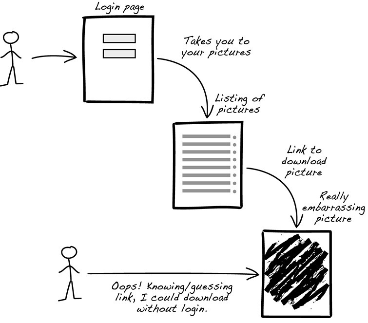

## Esempi reali
**Immaginiamo di dover sviluppare un sistema di prenotazione per un teatro con 1000 posti a sedere raggruppati in 25 file da 40 poltrone ciascuna. Ogni poltrona è identificata da una lettera e da un numero. Per una persona, siamo interessati al codice fiscale e al nome. *Pensate a come vi approcciate di solito alla codifica. Siete in grado di implementare un sistema di questo tipo?*** Ci dobbiamo porre tante domande sulle richieste fatte, perchè non è semplice costruire un sistema solo con poco richieste. Più domande facciamo e più andremo in profondità nella nostra soluzione. Per esempio, la poltrona vuole numeri, quale tipo? Arabo o romano? La poltrona vuole lettere, quali? Quello dell’alfabeto italiano oppure internazionale.

**Molto spesso la [[Sicurezza|sicurezza]] è un problema di progettazione.** *Immaginiamo di avere una cassaforte, possiamo indovinarne il PIN?* Se la costruzione dei pulsanti è di bassa qualità e la cassaforte è utilizzata spesso, i pulsanti del PIN possono essere più usurati rispetto agli altri. Anche la posizione del tastierino può essere una seria problematica: se è in una posizione troppo alta (come in foto), potrebbe essere un serio problema per le persone troppo basse.

## Scenario comune
Uno **scenario comune** è quello di *completare un progetto software* insieme ad *un team di sviluppatori, tester ed esperti del dominio*. Le features più importanti che identificano molto spesso gli stakeholders sono le *performance*, la *[[Sicurezza|sicurezza]]*, la *manutenzione* e l’*usabilità*. La priorità va alla logica di business per ridurre i tempi e i costi di rilascio: gli utenti iniziano a usare qualsiasi cosa venga rilasciata. In questo modo, **la [[Sicurezza|sicurezza]] ci sarà in una seconda fase**: nessuno ringrazia per *la [[Sicurezza|sicurezza]] perché è trasparente* e, in ogni caso, si sceglie di utilizzare qualche libreria di [[Sicurezza|sicurezza]] per ottimizzare lo sviluppo.

Il software è pronto per essere rilasciato (per andare in produzione). Abbiamo due possibilità di scenario:
- **abbiamo tempo per i controlli di [[Sicurezza|sicurezza]] e i test di penetrazione:** vengono scoperte molte vulnerabilità, il rilascio viene ritardato e, in casi estremi, la correzione delle vulnerabilità richiede la completa riscrittura del software;
- **non è necessario alcun controllo, basta andare in produzione:** gli utenti iniziano a usare il vostro software, venite derisi da tutti perchè il vostro software è stato violato e i dati sensibili sono stati rubati e, di conseguenza, addio utenti!

Siamo nel secondo scenario dove ci imbattiamo in problemi di [[Sicurezza|sicurezza]]: **la [[Sicurezza|sicurezza]] è qualcosa che deve metterci in ansia.** Tuttavia, spesso viene descritta come un insieme di funzionalità: immaginiamo di avere un allarme di una casa con sensori, sirene, chiamate e SMS. Ci dobbiamo porre alcune domande utili allo sviluppo della [[Sicurezza|sicurezza]] del nostro sistema:*è sufficiente per "tenere lontani i ladri"? Come si attiva e si disattiva l'allarme? Lo attivo sempre prima di uscire di casa? Lascio il telecomando da qualche parte dove i ladri possono trovarlo? È facile manomettere i sensori e le sirene?* In generale, quindi, la [[Sicurezza|sicurezza]] è una preoccupazione, non una caratteristica del nostro software.

## Caratteristiche e problemi di [[Sicurezza|sicurezza]]
Il problema di vedere la [[Sicurezza|sicurezza]] come funzionalità è che l'attenzione si concentra su **"ciò che il sistema fa"**. Ad esempio, immaginiamo un sito web con autenticazione per memorizzare le immagini: come utente, voglio una pagina di login per accedere alle mie foto. *È sufficiente implementare una pagina di login?* Questa è la funzionalità richiesta, ma l'utente ha anche una preoccupazione per la [[Sicurezza|sicurezza]], che non viene soddisfatta.



*In un contesto con la [[Sicurezza|sicurezza]] poco sviluppata, qualsiasi persona abbia il link della foto può accedere alla foto di un utente sconosciuto.* La pagina di accesso è inutile se le immagini sono accessibili tramite link diretti. **Vogliamo che l'accesso alle immagini sia consentito solo al proprietario.** Oltre alla funzionalità precedentemente richiesta, come utente *voglio che l'accesso alle mie immagini caricate passi attraverso una pagina di login in modo che le mie immagini rimangano riservate* e *voglio che l'accesso alle mie immagini caricate sia protetto dall'autenticazione, in modo che le mie immagini rimangano riservate*.

La preoccupazione degli utenti è la riservatezza delle loro immagini: proteggere **un solo percorso** delle immagini con la pagina di login non è sufficiente. Dobbiamo proteggere **tutti i percorsi** delle immagini. In generale, in un sistema di questo genere, l’utente vuole confidenzialità e qui entra in gioco la **triade della CIA**:
- **confidenzialità:** mantenere il segreto su cose che non dovrebbero essere rese note al pubblico (ad esempio, la cartella clinica);
- **integrità:** le informazioni non cambiano o possono cambiare solo in modi specifici e autorizzati (ad esempio, il conteggio dei risultati delle elezioni);
- **disponibilità:** garantire l'accesso alle informazioni quando necessario (ad esempio, poter fare un'offerta in un'asta online prima che scada).

Insieme alla triade della CIA, entra in gioco il concetto di [[Sicurezza|sicurezza]] della **CIA-T** dove T indica la **tracciabilità**, cioè conosco chi cambia o accede ai dati ed è richiesta dalla normativa GDPR per la gestione dei dati sensibili.

*L’approccio allo sviluppo di software sicuri prevede alcuni obiettivi come vettori di attacco, exploit zero day (il giorno del rilascio), vulnerabilità web e OWASP. Questi obiettivi hanno la maggiore priorità ma, apparentemente, non sufficienti.*

## Approccio alla gestione di un account
Prendiamo ad esempio il codice di seguito:
```java
public class User {
    private final Long id;
    private final String username;
    
    public User(final Long id, final String username) {
        this.id = id;
        this.username = username;
    }
}
```
In questo esempio, il tipo della variabilie *username* è troppo permissivo perchè potrebbe sfruttare delle vulnerabilità XSS come, per esempio, inserire codice nel tag *script* e convalidarlo come *username*. Con la funzione **_notNull(variabile)_** possiamo evitare che i valori passati siano nulli e, quindi, un minimo validi. Con **_validateForXSS(variabile)_** evitiamo che vengano inseriti dei tag *script* che sfruttano proprio le vulnerabilità XSS. Possiamo risolvere questi problemi con il codice seguente:

```java
import static;
com.example.xss.ValidationUtils.validateForXSS;
import static org.apache.commons.lang3.Validate.notNull;

public class User {
    private final Long id;
    private final String username;
    
    public User(final Long id, final String username) {
        notNull(id);
        notNull(username);
    
        this.id = notNull(id);
        this.username = validateForXSS(username);
    }
}
```
Non tutti gli sviluppatori sono esperti di [[Sicurezza|sicurezza]]. Di solito si concentrano sulla logica aziendale. In futuro ci saranno nuovi attacchi.

Riprendendo l’esempio di prima, per fare uno sviluppo sicuro, dobbiamo porci su che cos’è per noi l’username: contiene solo caratteri *[A-Za-z0-9_-]*, contiene minimo 4 caratteri e massimo 40. In questa maniera, **le vulnerabilità XSS non sono più possibili perchè non accettiamo i caratteri speciali e, così, abbiamo appena modellato il dominio**.

Quindi il codice uscirà nel seguente modo:
```java
import static org.apache.commons.lang3.Validate.*;

public class Username {
    private static final int MINIMUM_LENGTH = 4;
    private static final int MAXIMUM_LENGTH = 40;
    private static final String VALID_CHARACTERS = "[A-Za-z0-9_-]+";
    
    private final String value;
    
    public Username(final String value) {
        notBlank(value);
        
        final String trimmed = value.trim();
        inclusiveBetween(MINIMUM_LENGHT, MAXIMUM_LENGHT, trimmed.lenght());
        matchesPattern(trimmed, VALID_CHARACTERS, "Allowed characters are: %s", VALID_CHARACTERS);
        this.value = trimmed;
    }
    
    public String value() { return value; }
}
public class User {
    private final Long id;
    private final Username username;
    
    public User(final Long id, final Username username) {
        this.id = notNull(id);
        this.username = notNull(username);
    }
}
```
Il valore *username* viene convalidato al momento della creazione. È meglio incapsulare tutte le conoscenze sullo username in una classe *Username* (che chiameremo **primitiva di dominio**).

Invece di passare una stringa per l’username, passeremo direttamente la classe *Username* dove all’interno andremo a richiamare proprio la classe *Username*. Per esempio:
```java
... = new User(1, new Username("Foo"));
```
Più il codice è compatto e meglio è per gli altri sviluppatori per la comprensione del codice.

**Il software viene progettato in ogni modo, quindi gli sviluppatori non percepiscono un lavoro extra.** La logica aziendale e la [[Sicurezza|sicurezza]] hanno la stessa priorità: diversamente, la priorità è sulla logica aziendale. Anche gli sviluppatori non esperti scrivono codice sicuro. **Molti problemi di [[Sicurezza|sicurezza]] sono implicitamente risolti.**
