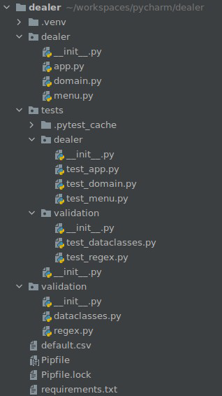

*La descrizione di un dominio applicativo è volutamente minimale in modo da poterci concentrare sui problemi architettonici e su come risolverli.*

Come spinto dal modello di [[Architettura|architettura]] pulita, siamo interessati a separare i diversi livelli del sistema: ricorda che ci sono diversi modi per implementare i concetti di [[Architettura|architettura]] pulita e il codice che puoi inventare dipende fortemente da ciò che la tua lingua preferita ti consente di fare.

## Moduli di terze parti
Un approccio semplice per convalidare tipi e valori può essere l'utilizzo di istruzioni IF e la generazione di eccezioni. Riutilizziamo meglio i moduli di terze parti e le nuove funzionalità di Python. I suggerimenti sul tipo possono essere utilizzati da un analizzatore statico. Le classi di dati sono utili per definire le classi dalle annotazioni.

## *@typechecked* e *@dataclass*
Il comando *@typechecked* applica la convalida del tipo a tutti i metodi con suggerimenti sul tipo.

Il comando *@dataclass* (con i parametri *frozen=True* e *order=True*) genera *__init__*, *__eq__* e altri metodi, inibisce le modifiche, genera *__lt__* e altri metodi.

## Struttura del progetto



Facendo riferimento all'immagine qui sopra, possiamo creare una struttura per il nostro progetto:
- **Moduli di progetto:** (package *dealer*) classi di dominio, classi di menu generiche (potrebbe essere un modulo di terze parti), classi di I/O dell'app;
- **Moduli di test:** (package *tests*) test qui, la cartella riflette la struttura di tutte le altre cartelle e moduli nel progetto Un file *test_* per ogni modulo del progetto;
- **Modulo delle utility:** (package *validation*) utilità per facilitare la convalida (potrebbe essere un modulo di terze parti);
- **Modulo *root*:** i dati vengono caricati e salvati automaticamente da questo file.

## Consigli per costruttore e metodi per il modulo di test
Fornire metodi di analisi per primitive di dominio che non siano stringhe. 

*create_key* è un argomento aggiuntivo di __init__ (e __post_init__). 
*__create_key* è una variabile di classe privata (in realtà, il nome è randomizzato).
Facciamo finta di avere *create_key* è uguale a *__create_key*: ecco come creiamo un costruttore privato in Python.

**Utilizzare una stringa come suggerimento sul tipo se il tipo non è ancora completamente definito.** Fallo per i metodi che restituiscono istanze della classe: se lo fai da qualche altra parte, probabilmente hai dipendenze circolari. Un metodo con intestazione *@property* è un metodo autonomo a cui vogliamo accedere senza parentesi.

## Fixtures
Possiamo definire dispositivi per oggetti che vogliamo utilizzare in molti test. Ad esempio:
```python
@pytest.fixture
def cars():
    return [
        Car(Plate('AB123CD'), Producer('Car Producer'), Model('Model'), Price.create(100)),
        Car(Plate('AB123CE'), Producer('Car Producer'), Model('Model'), Price.create(11000)),
        Car(Plate('AB123CF'), Producer('Car Producer'), Model('Model'), Price.create(21000)),
    ]
```
Bisogna passare il nome della fixtures come argomento per accedere all'oggetto restituito dall'apparecchiatura, come per esempio:
```python
def test_car_type_is_car(cars):
    assert cars[0].type == 'Car'
```

## Test delle funzionalità
La classe principale deve fornire tutte le funzionalità, ma non deve preoccuparsi delle operazioni di I/O. Testa tutte le funzionalità tramite TDD tra cui *test prima, codice dopo*: non è una religione, va bene anche testare e codificare in parallelo.

## Field
Prendiamo in esame questa proprietà:
```python
__vehicles: List[Union[Car, Moto]] = field(default-factor=list, init=False)
```
default_factory è un metodo da chiamare per creare il valore predefinito. Se *init* è falso, si esclude questo campo da *__init__*.

## Mock
Dobbiamo simulare una chiamata e verificare che la chiamata sia stata effettivamente completata. In Python questo è solitamente fatto da un **mock**. Mock è un oggetto su cui possono essere chiamati essenzialmente tutti i metodi. Le chiamate vengono registrate e possono essere verificate in seguito. Un esempio di utilizzo è il seguente:
```python
def test_entry_on_selected():
    mocked_on_selected = Mock()
    entry = Entry(Key('1'), Description('Say hi'), on_selected=lambda: mocked_on_selected())
    entry.on_selected()
    mocked_on_selected.assert_called_once()
```
Usiamo il metodo *__call__ dunder*, potremmo anche usare *mocked_on_select.foo()*: verifica che il metodo simulato sia stato effettivamente chiamato. Possiamo anche controllare gli argomenti delle chiamate.

Possiamo anche prendere in giro oggetti globali, oggetti dichiarati da qualche altra parte. A questo scopo utilizziamo le **patch** come di seguito:
```python
@patch('builtins.print')
def test_entry_on_selected_print_something(mocked_print):
    entry = Entry(Key('1'), Description('Say hi'), on_selected=lambda: print('hi'))
    entry.on_selected()
    assert mocked_print.mock_calls == [call('hi')]
```
Vorremmo stampare qualcosa quando selezionato: verifichiamo che *print* sia stato effettivamente chiamato con l'argomento *'hi'*.

Usa *side_effect* per elencare i valori di ritorno di un oggetto patchato.

I metodi privati sono utili per garantire che una classe non venga utilizzata in modo improprio, ma possono anche rendere più difficili i test: raggiungere tutti i percorsi può essere difficile.

Fare affidamento su oggetti globali, come *input()* e *print()*, semplifica il codice, ma può anche rendere più difficili i test: abbiamo bisogno di **mock** e **patch**.

## Coverage
Ogni metrica può essere ingannata, non ingannare te stesso. Utilizza l'*analisi della coverage* per identificare i test mancanti e il codice irraggiungibile.
