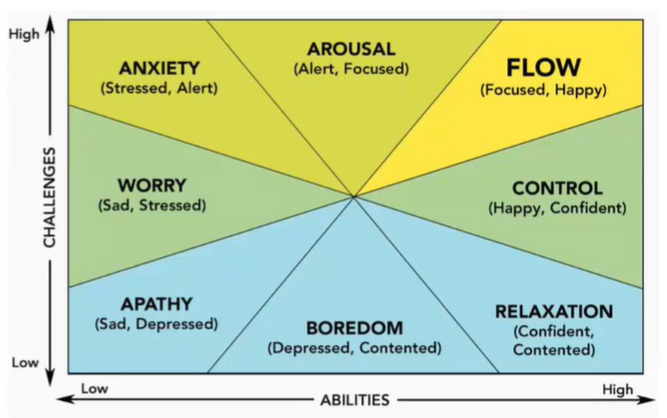

La **progettazione** è un processo complesso nella fase di pre-produzione di qualsiasi sviluppo **applicativo**.

La **progettazione di un gioco (game design)** coinvolge tutti i membri del team, non è solo la storia del gioco e viene utilizzato per definire le interazioni tra i giocatori e il gioco (*gameplay*). Il **GDD (Game Design Document)** descrive *influenze esterne* (tipologia gioco), *meccanismi*, *storia*, *personaggi*, *progettazione dei livelli* (level design), *gameplay*, *interfaccia*, *suoni* e *musica*.
Le discipline toccate durante la progettazione di un gioco sono:
- **progettazione del sistema**, cioè le regole di gioco/meccaniche di gioco;
- **progettazione del contenuto**, cioè la definizione di personaggi/puzzle/missioni;
- **scrittura del gioco**, cioè creazione di dialoghi/storie;
- **progettazione dei livelli**;
- **progettazione dell'interfaccia grafica**;
- **progettazione dell'audio**.

Un *progettista di un gioco* è *capo progettista* (coordinatore e visionario del gioco), *progettista di meccaniche di gioco o progettista di sistemi* (equilibra le regole del gioco) e *progettista dei livelli* (crea i livelli di gioco).

Per facilitare la progettazione di un gioco, usufruiamo il **framework MDA** che è utilizzato per analizzare e progettare un videogioco. Nello specifico, analizziamo:
- *meccanica*, cioè regole del gioco e quali azioni possono intraprendere i giocatori;
- *dinamiche*, cioè descrivono come "funziona" il gioco e rappresentano le meccaniche in movimento (interazione tra meccanici e giocatori);
- *estetica*, cioè risposte emotive alle dinamiche da parte dei giocatori.

Gli elementi chiave fondamentali nelle meccaniche di gioco:
- **elementi casuali**, per ritardare o rallentare la possibilità di "risolvere" un videogioco;
- **gestione delle risorse**, cioè risorse di gioco come denaro, risorse naturali, risorse umane e punti gioco;
- **modalità di gioco**, aumentare la difficoltà e fornire ulteriori sfide;
- **Dynamic Game Balancing (DGB)**, offre un'esperienza su misura per ogni giocatore.

Il **grado della sfida** dipende dal bilanciamento della meccanica e dal livello della sfida e ci possiamo regolare per questo in base ad un grafico: se rimaniamo sulla diagonale di questo asse, staremo fornendo un gioco bilanciato dal punto di vista della sfida.

I **riflessi e reazioni** sono meccaniche per un gioco più impegnativo e le caratteristiche principali sono *velocità*, *tempismo* (gioco ritmico), *precisione* e *tempo limitato*.

I **premi** possono essere dei *punti*, *tempo extra*, *congratulazioni*, *sblocco di nuovi livelli*, *poteri speciali* oppure *fine del gioco* (vittoria). Le condizioni di **vittoria** possono esistere quando un giocatore vince il gioco: nello specifico, completando obiettivi o gare, indovinando la soluzione di un puzzle, controllo un nuovo territorio oppure non perdendo.

La **giocabilità** usa attributi differenti per misurare l'esperienza in un videogioco come la *soddisfazione*, l'*immersione*, la *spiegazione*, l'*efficienza*, la *motivazione*, l'*emozione* e la *socializzazione*.
