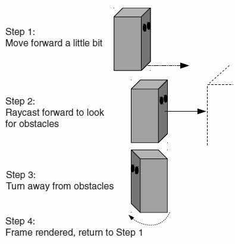
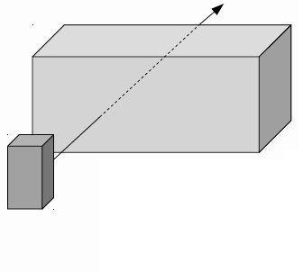
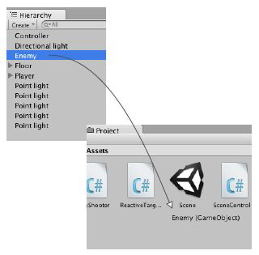
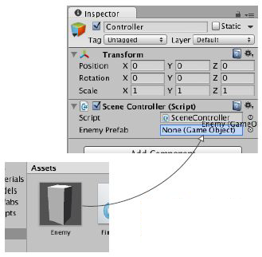

Con questo laboratorio, pensiamo all'implementazione dei personaggi che vagano coinvolgendo l'IA di base e pensiamo ai nuovi oggetti che vengono generati istanziando prefabbricati. In sintesi, creeremo uno spawn point di entità.

## Conoscenze di base della IA in Unity (WanderingAI)
Scriviamo un codice che farà vagare il nemico: il codice per il girovagare è un semplice esempio di IA e inizieremo con questo semplice approccio.

Ogni frame, il codice AI eseguirà la scansione del suo ambiente per determinare se deve reagire.

**Come funziona la IA?** Se appare un ostacolo sulla sua strada, il nemico si gira per affrontare una direzione diversa. Il nemico farà ping-pong per la stanza, muovendosi sempre in avanti e girandosi per evitare i muri. Il codice AI utilizzerà anche il raycasting, ma in un contesto diverso dalle riprese. In sintesi, la IA letteralmente evita gli ostacoli, nient'altro.



Abbiamo visto nella lezione precedente che *"il raycasting è una tecnica utile per una serie di attività all'interno di simulazioni 3D"* e abbiamo usato il raycasting per sparare, ora iniziamo a usare il raycasting per scansionare la scena.
L'ultima volta hai creato un raggio originato dalla telecamera, questa volta creerai un raggio originato dal nemico.



In ogni fotogramma, il personaggio AI proietta un raggio davanti a sé per rilevare gli ostacoli. Quando il personaggio è di fronte a un muro, il raycast rileverà un ostacolo vicino.

Il codice AI di base, che inizieremo a scrivere ora, utilizza le informazioni di *RaycastHit* per determinare se qualcosa è davanti al nemico e quanto lontano. Una differenza tra il raycasting per le riprese e il raycasting per l'IA è il "raggio" del raggio.

Per la IA, il raggio verrà trattato come se avesse una sezione trasversale ampia: usando il metodo *SphereCast()* invece di *Raycast()*, questo perché i proiettili sono minuscoli mentre in questo caso dobbiamo considerare la larghezza del carattere per verificare la presenza di ostacoli.

Crea un nuovo script C# chiamato **WanderingAI** e allega lo script all'*Enemy*. Il codice dovrebbe essere il seguente:
```csharp
using System.Collections;
using System.Collections.Generic;
using UnityEngine;

public class WanderingAI : MonoBehaviour {
    public float speed = 3.0f;
    public float obstacleRange = 5.0f;
    private bool _alive;
    
    void Start() { _alive = true; }

    void Update() {
        if(_alive) {
            transform.Translate(0, 0, speed*Time.deltaTime);

            Ray ray = new Ray(transform.position, transform.forward);
            RaycastHit hit;
            if(Physics.SphereCast(ray, 0.75f, out hit)) {
                if(hit.distance < obstacleRange) {
                    float angle = Random.Range(-110, 110);
                    transform.Rotate(0, angle, 0);
                }
            }
        }
    }

    public void setAlive(bool alive) { _alive = alive; }
}
```
Dobbiamo usare il metodo *Translate()* aggiunto in *Update()* per muovere il nostro nemico continuamente (usando *deltaTime* per un movimento indipendente dal frame rate).

Creeremo un raggio usando la posizione e la direzione del nostro nemico.
Quindi useremo il metodo *Physics.SphereCast()*: **SphereCast** sposta un *volume Sphere* lungo la direzione di un raggio e rileva ciò su cui va a sbattere.

Alla fine controlleremo la proprietà *hit.distance* per essere sicuri di reagire solo quando il nemico si avvicina ad un ostacolo. In particolare:
```csharp
...
// valori per la velocita' di movimento e la distanza per reagire agli ostacoli
public float speed = 3.0f;
public float obstacleRange = 5.0f;

void Update() {
    // avanza continuamente di ogni fotogramma indipendentemente dalla svolta
    transform.Translate(0, 0, speed*Time.deltaTime);
    
    // un raggio nella stessa posizione e rivolto nella stessa direzione del carattere
    Ray ray = new Ray(transform.position, transform.forward);
    RaycastHit hit;
    // esegui il raycasting con una circonferenza attorno al raggio
    if(Physics.SphereCast(ray, 0.75f, out hit)) {
        if(hit.distance < obstacleRange) {
            // gira verso una nuova direzione semicasuale
            float angle = Random.Range(-110, 110);
            transform.Rotate(0, angle, 0);
        }
    }
}
...
```
Il metodo *Translate()* ora esegue ogni fotogramma, qualunque cosa accada. Dobbiamo tracciare lo stato "vivo" del nemico: apportiamo piccoli aggiustamenti al codice per tenere traccia dello stato del nemico. Aggiungi al nostro script *WanderingAI* lo stato "vivo":
```csharp
...
// valore booleano per verificare se il nemico e' vivo
private bool _alive;
    
void Start() {
    // inizializza quel valore
    _alive = true;
}
...
```
Continua a modificare *Update()* nel nostro script *WanderingAI*:
```csharp
...
void Update() {
    if(_alive) {
        // si muove solo se il personaggio e' vivo
        transform.Translate(0, 0, speed*Time.deltaTime);
        ...
    }
}
...
```
Aggiungi in *WanderingAI* il metodo pubblico *setAlive*:
```csharp
// metodo pubblico che consente al codice esterno di influenzare lo stato "vivo".
public void setAlive(bool alive) {
    _alive = alive;
}
```
Lo script *ReactiveTarget* ora può dire al nostro script *WanderingAI* quando il nemico è o non è vivo:
```csharp
...
public void ReactToHit() {
    WanderingAI behavior = GetComponent<WanderingAI>();
    // controlla se questo personaggio ha uno script WanderingAI; potrebbe non esserlo
    if(behavior != null)
        behavior.setAlive(false);
    StartCoroutine(Die());
}
...
```

## Sistema prefabbricato (Prefabs)
Il **sistema Unity Prefab** ti consente di creare, configurare e archiviare un *GameObject* completo di tutti i suoi componenti, valori di proprietà e *GameObject* figlio come una **risorsa riutilizzabile**.

**Prefab** è un *GameObject* completamente con componenti già collegati e configurati che esiste come risorsa e può essere copiato in qualsiasi scena. Nel dettaglio:
- puoi inserire copie dell'oggetto nella scena usando i comandi negli script e non solo facendolo manualmente nell'editor visivo;
- il termine utilizza per una di queste copie di un prefabbricato è un esempio;
- quindi prefabbricato (prefab) si riferisce al *GameObject* esistente al di fuori di qualsiasi scena, mentre istanza si riferisce a una copia dell'oggetto che è posizionato in una scena;
- *Instantiate* è l'azione di creazione di un'istanza.

Abbiamo già il nostro oggetto nemico, ora trascina l'oggetto verso il basso dalla vista *Hierarchy* e rilascialo nella vista *Project*: questo salverà automaticamente l'oggetto come prefabbricato, il nome dell'oggetto originale diventerà blu perché è collegato a un prefabbricato.



Non vogliamo più l'oggetto nella scena, quindi ora possiamo eliminare l'oggetto *Enemy*. Ora puoi inserire l'oggetto prefabbricato nella scena creando istanze del prefabbricato.

## Istanziazione di un controller (SceneController)
Crea un *GameObject* vuoto: rinomina il nuovo oggetto in *Controller* e imposta la posizione su *(0,0,0)*.

Crea un nuovo script C#: chiama questo nuovo script *SceneController* e allega lo script all'oggetto vuoto.

L'uso di *GameObjects* vuoti per collegare componenti di script è un modello comune nello sviluppo di Unity. Questo trucco viene utilizzato per attività che non vengono applicate a nessun oggetto specifico nella scena. Il codice dovrebbe essere il seguente:
```csharp
using System.Collections;
using System.Collections.Generic;
using UnityEngine;

public class SceneController : MonoBehaviour {
    // variabile serializzata per il collegamento all'oggetto prefabbricato
    [SerializeField] private GameObject enemyPrefab;
    // una variabile privata per tenere traccia dell'istanza nemica nella scena
    private GameObject _enemy;

    // genera un nuovo nemico solo se non ce n'e' gia' uno nella scena
    void Update() {
        if(_enemy == null) {
            // il metodo che copia l'oggetto prefabbricato
            _enemy = Instantiate(enemyPrefab) as GameObject;
            _enemy.transform.position = new Vector3(0, 1, 0);
            float angle = Random.Range(0, 360);
            _enemy.transform.Rotate(0, angle, 0);
        }
    }
}
```
Usiamo variabili private con *SerializeField* per fare riferimento a oggetti nell'editor di Unity perché vuoi esporre quella variabile nell'*Inspector* ma non vuoi che il valore venga modificato da altri script.
Collega il prefabbricato *Enemy* allo script *SceneController*.

Collega il prefabbricato *Enemy* allo script *SceneController*: un *Enemy* apparirà al centro della stanza e ora, quando spariamo a un nemico, verrà sostituito da uno nuovo.



Il cuore dello script *SceneController* è il metodo *Instantiate()*, che crea una copia prefabbricata nella scena: *Instantiate()* potrebbe restituire, in alcuni casi, il nuovo oggetto come un tipo *Object* generico e dobbiamo gestirlo come *GameObject*, utilizzando la parola chiave *as* per il typecast di un tipo di oggetto codice.

Nel nostro script *enemyPrefab* memorizza il prefabbricato, mentre *_enemy* memorizza l'istanza.

### Generazione di più Enemy (SceneControllerN)
Possiamo fare il ragionamento precedente con N *Enemy*. Il codice dovrebbe essere il seguente: 
```csharp
using System.Collections;
using System.Collections.Generic;
using UnityEngine;

public class SceneControllerN : MonoBehaviour {
    [SerializeField] private GameObject enemyPrefab;
    public int numeroEntita = 0;
    private GameObject[] _enemies;
    
    void Start() {
        _enemies = new GameObject[numeroEntita];
    }

    void Update() {
        for(int i = 0; i < _enemies.Length; i++) {
            if(_enemies[i] == null) {
                _enemies[i] = Instantiate(enemyPrefab) as GameObject;
                _enemies[i].transform.position = new Vector3(Random.Range(1f, 5f), 1, Random.Range(1f, 5f));
                float angle = Random.Range(0, 360);
                _enemies[i].transform.Rotate(0, angle, 0);
            }
        }
    }
}
```
